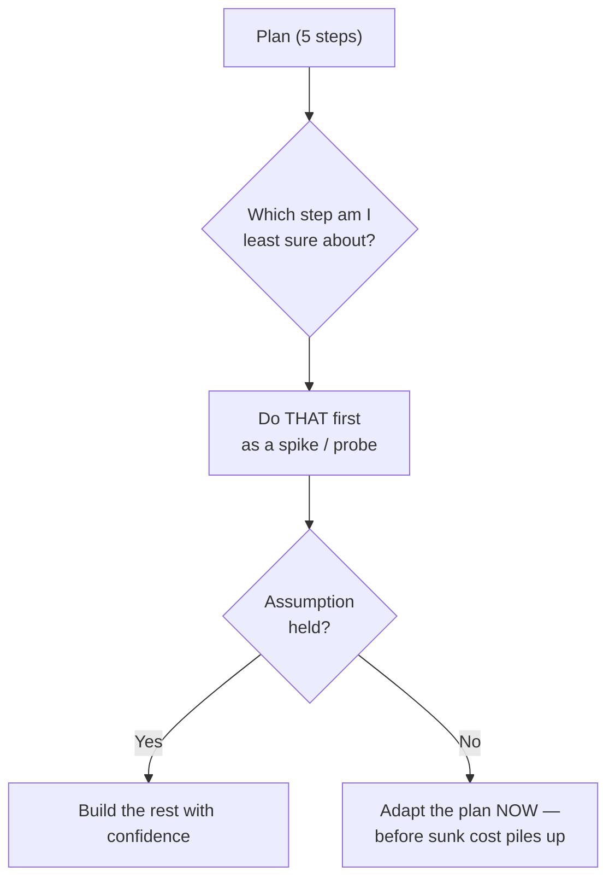
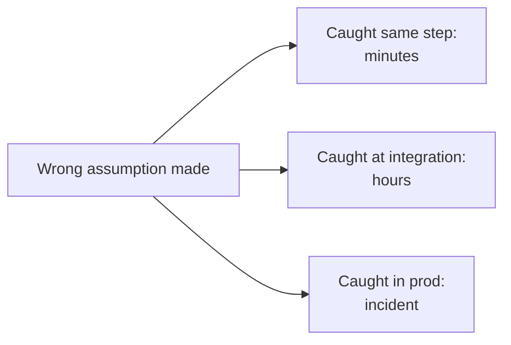

# Carrying Out the Plan — Middle

> **What?** Disciplined execution of a plan that spans hours or days and touches real systems: verifying each step against reality, keeping the system shippable throughout, and adapting the plan tactically when a step contradicts your assumptions — without abandoning it at the first bump or forcing it past the point it's dead.
>
> **How?** Sequence the plan so the riskiest assumptions are tested earliest and cheapest. Build a thin working path end-to-end (a walking skeleton) before fleshing it out. Validate continuously, not at the end. Commit in small, reversible increments that keep main green. When a step fails, decide deliberately: adapt, persist, or kill.

---

## 1. Pólya's demand, scaled up

Pólya's third stage is one line: *carry out your plan, and check each step — can you see clearly that it's correct, can you prove it?* At the junior level, "a step" is a line of code. At the mid level, a step is a unit of work that touches a database, a queue, another service, a deploy. The demand is identical; only the cost of skipping it has gone up. An unverified line costs you a confusing stack trace. An unverified migration costs you a production incident.

The mid-level skill is not *can I check a step* but *how do I sequence and execute a multi-day plan so that checking each step is cheap, the system stays shippable, and I can change course when reality disagrees.* Three sub-skills carry the weight: **sequencing by risk**, **maintaining a working state**, and **adapting deliberately**.

## 2. Sequence by risk, not by tidiness

A plan is a list of steps. The order you execute them in is itself a decision — and the wrong order is expensive. The instinct is to build bottom-up: schema first, then data layer, then service, then API, then UI. Tidy. But it means the riskiest assumption — *does this integration even work the way I think?* — gets tested last, after you've built everything that depends on it.

Invert it. **Pull the riskiest, least-known step forward** and verify it before you invest in the rest.



If your plan depends on "the payment provider's webhook delivers within 2s," prove that on day one with a throwaway probe. If it's false, you re-plan having wasted an hour, not a week. This connects directly to [Devising a Plan](../02-devising-a-plan/) — a good plan front-loads its uncertainty, and good execution honors that ordering.

## 3. The walking skeleton: a working state from step one

Alistair Cockburn's **walking skeleton** is a tiny end-to-end implementation that exercises the whole architecture — every layer connected — but does almost nothing. For an order service: an endpoint that receives a request, writes one row, emits one event, returns 200. No validation, no business rules, no edge cases. Just a *thin thread through every layer*.

Why this is execution discipline, not architecture astronautics: it gives you a **working, deployable system on day one**, and every subsequent step is a small, verifiable addition to something that already runs. Contrast the two execution styles:

| | Build-by-layer | Walking skeleton |
|---|---|---|
| First runnable end-to-end | Last day | First day |
| Integration risk surfaces | Late, expensive | Early, cheap |
| Each step verifiable against | Nothing yet | A running system |
| Shippable state | Only at the end | Throughout |

Beck's ordering — **make it work, make it right, make it fast** — is the same idea at smaller scale. Get a working (ugly) path first. A working ugly thing can be tested, demoed, and shipped; a half-built elegant thing can do none of those. Optimize and beautify only once it works.

## 4. Validate as you go, not at the end

The cost of a wrong assumption grows the longer it goes undetected. A bad assumption caught in the step that introduced it costs minutes. The same assumption caught at end-to-end testing costs hours of bisecting. Caught in production, it costs an incident.



Concrete continuous-validation moves at the mid level:

- **Run the test suite after each increment**, not after the whole feature. Red after a green tells you exactly what the last change broke.
- **Deploy to staging continuously**, behind a flag if needed. "Works on my machine" is not a verified step.
- **Check the data, not just the code.** After a migration step, query the table. After an event step, confirm the consumer received it. The code running without error is not proof the *effect* is correct.
- **Add an assertion at the boundary of your assumption.** If your step assumes a list is non-empty, assert it. The assertion turns a silent wrong-assumption into a loud, located failure.

## 5. Keep main green: small reversible commits

A multi-day plan executed in one giant commit is unverifiable and unrevertable. Break it into **small commits that each leave the system working.** Properties of a good execution commit:

- **Independently sensible** — it does one coherent thing.
- **Leaves main green** — tests pass after it; you could ship from here.
- **Reversible** — if the next step goes wrong, you `git revert` this and you're at a known-good state, not in a half-migrated mess.

For changes that *can't* be made in one safe step — renaming a column other services read, replacing an algorithm live traffic depends on — use **expand/contract (parallel change)**:

```
1. EXPAND:  add the new thing alongside the old (both work)
2. MIGRATE: move readers/writers to the new thing, step by step, verifying each
3. CONTRACT: remove the old thing once nothing uses it
```

Each phase is independently deployable and reversible. At no point is the system broken. This is "keep a working state" applied to changes too big to do atomically.

## 6. The plan is a hypothesis: adapt, persist, or kill

Your plan encodes assumptions. When a step's result contradicts an assumption, you face a decision that mid-level engineers often get wrong by reflex. The three options:

| Reaction | When it's right | When it's a mistake |
|---|---|---|
| **Adapt** | The goal still stands but a tactical assumption was wrong; reroute around the obstacle | — |
| **Persist** | The obstacle is real but surmountable; the plan is still the best path | When you're persisting only because of effort already spent (sunk cost) |
| **Kill** | The plan rests on an assumption that's now proven false at its core | When you kill at the *first* bump out of frustration, abandoning verified work |

The failure mode in both directions is **emotional, not analytical**:

- **Forcing** — refusing to update the plan because you're attached to it. Reality said no; you keep hammering.
- **Sunk-cost persistence** — "I've spent three days on this, I can't stop now." But the three days are gone whether you continue or not; the only question is whether the *next* day is well spent. This is a textbook cognitive bias — see [Cognitive Biases in Code Decisions](../../04-critical-thinking/03-cognitive-biases-in-code-decisions/).
- **Panic-abandon** — throwing out the whole plan at the first failed step, discarding the verified steps that were fine.

A useful test for "is the plan dead": *if I were starting fresh today, knowing what I now know, would I choose this plan?* If yes, persist. If no, the only thing keeping you on it is sunk cost — kill it.

## 7. A worked execution

Plan: "Replace the synchronous email send in checkout with an async queue, no user-visible change."

```
Step 1 (skeleton):  enqueue a no-op job on checkout, log it. Deploy.        ✓ runs end-to-end
Step 2 (riskiest):  prove the worker can reach the SMTP relay from prod.    ✗ firewall blocks it
                    → ADAPT: open the rule / use the existing relay; re-plan worker placement
Step 3:             worker sends the real email, behind a flag (10% of traffic).  ✓ verify delivery
Step 4:             ramp flag to 100%, watch delivery + latency dashboards.       ✓
Step 5:             remove the old synchronous path (contract).                   ✓ main green
```

Note step 2: the riskiest assumption (network reachability) was tested *third* — too late. A better sequence would have probed it first. The plan adapted cleanly because each step was small and the system stayed shippable throughout (the flag kept the old path live until the new one was proven).

## 8. Execution hygiene checklist

- [ ] Did I order steps so the riskiest assumption is tested early and cheaply?
- [ ] Is there a thin working path end-to-end before I flesh out details?
- [ ] Can I verify the *effect* of each step (data, events), not just that code ran?
- [ ] Does each commit leave main green and revertable?
- [ ] When a step failed, did I decide adapt/persist/kill *analytically*, free of sunk cost?
- [ ] Am I leaving a trail (commits, notes) so I can backtrack?

## 9. Practice

1. Take a multi-step task. Before coding, rank the steps by *how sure you are each assumption holds*. Execute least-sure first. Note where you'd have wasted effort with the tidy order.
2. Build a walking skeleton for your next feature — thin thread through every layer, deployed — before adding any real logic.
3. Next time a step fails, write down the three options (adapt/persist/kill) and the assumption that broke, then choose. The act of writing it kills the sunk-cost reflex.

> Next: [Looking Back and Reflecting](../04-looking-back-and-reflecting/) — what to review once it works. Sideways: [Debugging as Problem-Solving](../05-debugging-as-problem-solving/) for when a step fails and you can't see why. Back to the [Problem-Solving section](../) or the [Engineering Thinking roadmap](../../README.md).

---
## Check your understanding

Try to answer these questions from memory:

1. How do you decide between persisting and killing a plan?
2. What does "the plan is a hypothesis" mean for execution?
3. How do you order the steps of a plan when you execute it?
4. What's a walking skeleton and why does it matter for carrying out a plan?
