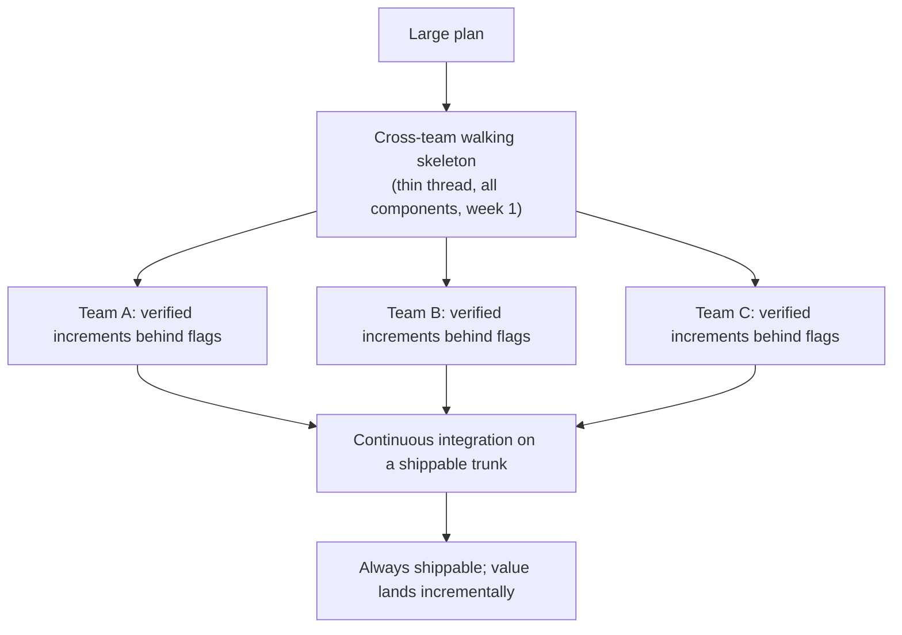
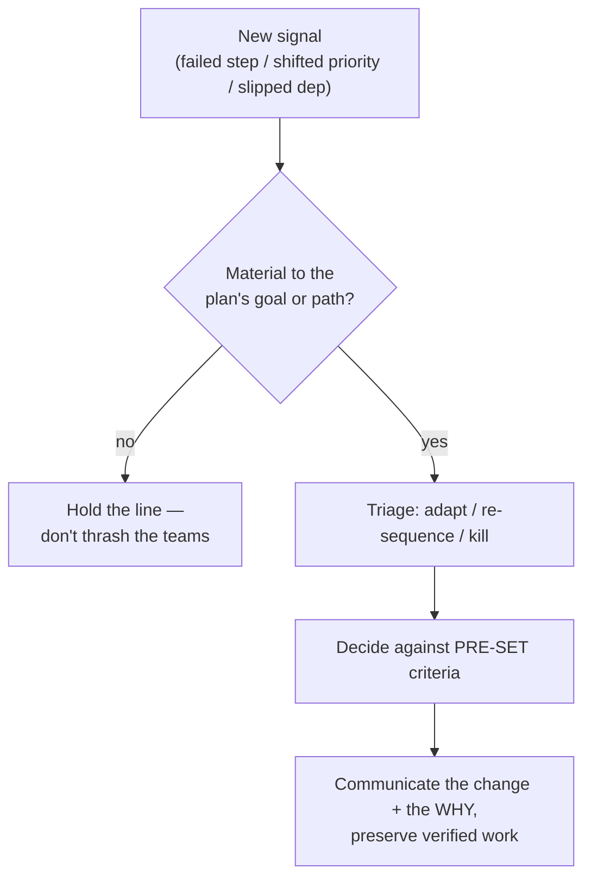
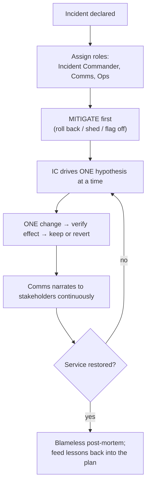

# Carrying Out the Plan — Professional

> **What?** Driving the execution of a large, multi-team plan to completion: maintaining momentum and a shippable state across many people over weeks or quarters, instrumenting the plan so its health is observable, adapting a roadmap as reality and priorities shift, and commanding execution calmly under maximum pressure — incidents, deadlines, organizational churn — without the discipline of *check each step* breaking down at scale.
>
> **How?** Architect the plan so independent teams can verify and ship their steps without blocking each other. Make plan health a dashboard, not a status meeting. Pre-decide the adapt/persist/kill criteria so pivots are fast and unemotional. Build the execution culture — keep-main-green, small reversible changes, blameless trails — so the discipline survives without you in the room. In incidents, command: structure, narrate, one change at a time, always a revert.

---

## 1. The staff/principal problem: discipline that scales without you

Pólya wrote *check each step — can you prove it's correct?* for one person solving one problem. The staff/principal job is to make that discipline hold across **dozens of people executing a plan you can't personally verify step by step.** You cannot check every commit. So the work shifts from *checking steps yourself* to **building a system where every step gets checked, the plan's health is visible, and the org can adapt fast when reality moves.**

Three things are now yours:
1. **Architect the execution** so steps are independent, verifiable, and shippable across teams.
2. **Instrument the plan** so its health is observable, not a story told in standups.
3. **Own the pivots** — adapt the roadmap deliberately as reality and priorities change, and command execution under pressure.

## 2. Architect for parallel, verifiable, shippable execution

A large plan executed by many people fails when teams block each other, when "done" is unverifiable, or when nothing is shippable until the end. The principal's design job is to remove those failure modes before execution starts.

| Risk at scale | Design response |
|---|---|
| Teams block each other | Slice the plan along seams that minimize cross-team dependencies; publish contracts/interfaces early so teams build against a stable boundary |
| "Done" is a claim, not a fact | Every workstream defines its own observable acceptance criteria; integration is continuous, not a big-bang at the end |
| Nothing shippable until done | Sequence so value lands incrementally; protect the ability to stop early with something useful shipped |
| One team's broken step breaks all | Flags and contracts isolate blast radius; expand/contract for shared schemas |

The **walking skeleton** (Cockburn) scales to programs: stand up a thin end-to-end thread across *all* the teams' components first, so integration risk — the thing that sinks large efforts — is faced on week one, not in the final integration crunch. Every team then adds verified increments to a system that already runs end-to-end.

## 3. Make plan health observable

You can't *check each step* across a program by attending meetings — status meetings report what people *believe*, and belief drifts from reality. Replace narrative status with **observable plan health**: a small set of signals that show, without anyone telling you, whether execution is on track.

- **Trunk health** — is main green across teams *right now*? A red trunk is a stopped plan whether or not the standup says so.
- **Flow signals** — DORA-style: deployment frequency, lead time, change-fail rate, MTTR. Slowing flow is the earliest sign a plan is bogging down. (See [Engineering Thinking](../../README.md) and the broader [Systems Thinking](../../03-systems-thinking/) view of feedback loops.)
- **Integration cadence** — how often do the teams' pieces actually run together? Long gaps hide divergence that explodes at the end.
- **Assumption-tripwires** — instrumentation that fires when a load-bearing assumption (latency, volume, error rate) is violated, so the plan learns it's wrong from telemetry, not from an incident.

The principle: **a wrong assumption should announce itself.** If discovering the plan is off-track requires someone to notice and escalate, you'll find out late. Wire the discovery into the system.

## 4. Adapt a roadmap under changing reality

At quarter scale, the plan changes not only because steps fail but because the *world* changes — priorities shift, a competitor moves, a dependency slips, headcount changes. A principal who treats the roadmap as fixed gets overrun; one who re-plans on every tremor creates thrash that demoralizes teams. The skill is **deliberate, low-thrash adaptation.**

Tools that keep adaptation cheap and calm:

- **Pre-committed pivot criteria.** Before execution, write the conditions under which you'd cut scope, re-sequence, or kill ("if the new datastore can't hit p99 < 50ms by milestone 2, we fall back to the read-replica plan"). Deciding the *rule* while calm makes the *call* fast and unemotional when the moment comes — and inoculates the program against sunk-cost ([Cognitive Biases in Code Decisions](../../04-critical-thinking/03-cognitive-biases-in-code-decisions/)).
- **The from-scratch test, at program scale.** "Knowing what we know now, would we start this initiative today?" If no, the only thing holding it is sunk cost; sunset it deliberately and harvest what was learned.
- **Protect verified work on every pivot.** Adaptation means *reroute*, not *restart*. The teams' verified increments are assets; a pivot that discards them needlessly is its own waste.
- **Communicate the why, every time.** Teams tolerate change; they don't tolerate whiplash they can't understand. The reasoning is what preserves trust and momentum.

## 5. Build the execution culture (the trail, at scale)

The disciplines from the lower levels — small reversible commits, keep-main-green, leave a trail — don't scale by mandate; they scale by **culture and defaults.** The principal's leverage is making the right thing the easy default:

- **Keep-main-green is enforced, not requested** — required checks, branch protection, trunk-based defaults so a broken step can't land.
- **Small, reversible changes are the path of least resistance** — fast CI, trivial rollback, flags as standard, so engineers ship small because small is *easier* than big.
- **The trail is institutional** — decision logs / ADRs for plan pivots, blameless post-incident reviews, runbooks kept live. The org's memory of *what we tried and why* outlives any individual.
- **Backtracking is always possible** — no step that a teammate can't revert; no person who is a single point of failure for undoing their own work.

When this culture holds, *check each step* happens thousands of times a day without you watching — which is the only way it can happen at scale.

## 6. Incident command: execution under maximum pressure

An incident is the plan's third stage compressed into minutes with the whole org watching — and it's where execution discipline most spectacularly collapses into flailing: many hands, many simultaneous changes, no verification, the system getting *less* understood as it's poked. The principal's job is to *command the execution* so it stays disciplined exactly when instinct says to panic.

The non-negotiables — Pólya's *check each step* under fire:

- **Structure beats heroics.** A named Incident Commander who *coordinates* and does not type, a comms owner, an ops owner. Diffuse responsibility is how ten people make ten conflicting changes.
- **Mitigate before diagnose.** Restore service first (the deploy that broke it, roll it back; load too high, shed it). Root cause is the post-mortem's job, not the incident's.
- **One change at a time, verified.** This is the discipline that dies first and matters most. Simultaneous changes destroy attribution — you can no longer learn what helped. The IC enforces it precisely because the pressure pushes the other way.
- **Narrate relentlessly.** A live timeline keeps the room coordinated, stops duplicate/conflicting actions, and writes the post-mortem for free.
- **Always a revert.** Already degraded; never make an unrevertable change.
- **Calm is a deliverable.** The IC's visible composure — "we don't know yet; here's what we're checking" — is what keeps the team executing instead of flailing. Panic is contagious; so is method.

The deepest point: the principal who runs an incident *exactly like a normal plan* — small verified steps, one hypothesis, a trail, a revert ready — stays calm because **the method does not change when the stakes do.** That equivalence is the whole skill.

## 7. Anti-patterns at the top

| Anti-pattern | Why it kills execution | Counter |
|---|---|---|
| Status-by-narrative | Belief drifts from reality; off-track found late | Observable plan health |
| Big-bang integration | Integration risk hits at the worst time | Cross-team walking skeleton |
| Roadmap as scripture | Overrun by changing reality; sunk cost | Pre-committed pivot criteria + from-scratch test |
| Roadmap whiplash | Thrash demoralizes teams, destroys momentum | Adapt only on material signals; communicate why |
| Hero culture | Discipline depends on individuals; SPOFs everywhere | Cultural defaults + institutional trail |
| Incident flailing | Many changes, no verification, less understanding | Structured incident command |

## 8. Practice

1. For a current initiative, replace one narrative status signal with an observable one (trunk health, flow metric, or an assumption-tripwire). Watch what it tells you that the standup didn't.
2. Write the pre-committed pivot criteria for your largest in-flight plan — the conditions under which you'd cut scope or kill it. Share them with the teams.
3. Run a game-day or review your last real incident against §6: roles assigned? mitigate-first? one-change-at-a-time? narrated? Fix the one weakest link before the next incident.
4. Audit your program for backtracking: is there any step only one person could revert? Remove that single point of failure.

> Next: [Looking Back and Reflecting](../04-looking-back-and-reflecting/) — turning a delivered program into compounding organizational learning. Related: [Debugging as Problem-Solving](../05-debugging-as-problem-solving/), [Techniques When You're Stuck](../06-techniques-when-you-are-stuck/), and the [Systems Thinking](../../03-systems-thinking/) view of feedback. Back to the [Problem-Solving section](../) or the [Engineering Thinking roadmap](../../README.md).

---
## Check your understanding

Try to answer these questions from memory:

1. How do you maintain execution discipline during an incident?
2. Why is "change one thing at a time" so important under pressure?
3. How do you tell the difference between persistence and stubbornness in execution?
4. At staff/principal scale, how do you make "check each step" hold across many teams?
