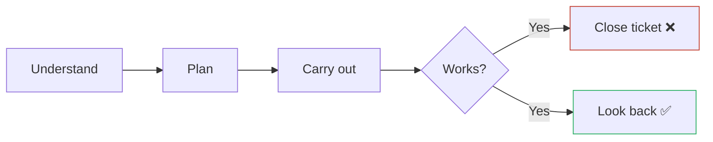

# Looking Back and Reflecting — Junior

> **What?** *Looking back* is Pólya's fourth and final problem-solving stage: after your solution works, you stop and examine it — does it actually solve the original problem, are the edge cases handled, and what did you just learn that you can reuse? It is the step almost everyone skips.
>
> **How?** The moment your code goes green, resist the urge to close the ticket. Run three checks: (1) verify the result against the *original* problem, (2) ask whether the solution could be cleaner or derived another way, and (3) write down the one transferable thing you learned. Five minutes here saves hours later.

---

This topic completes the arc that runs through [understanding the problem](../01-understanding-the-problem/), [devising a plan](../02-devising-a-plan/), and [carrying out the plan](../03-carrying-out-the-plan/). George Pólya, in *How to Solve It* (1945), names this last stage **"Looking Back"** and devotes a full chapter to it — because it is where one solved problem turns into a skill you keep.

## 1. The mistake every junior makes

You get the test passing. The bug is gone. The feature works in the demo. And then — you close the ticket and grab the next one. That instinct feels productive. It is not.



The path on the left is "1 year of experience, ten times." You solve the same *class* of problem again and again, slowly, because you never extracted the lesson from the first one. The path on the right compounds: each problem makes the next one faster.

> **The rule:** *"Green" is the start of looking back, not the end of the work.*

## 2. Pólya's three questions

Pólya gives you a short, memorable checklist. Run it every time.

| Question | What it means | What you do |
| --- | --- | --- |
| **Can you check the result?** | Does the answer actually satisfy the original problem? | Re-read the ticket. Test against *its* requirements, not the version you drifted into. |
| **Can you derive it differently?** | Is there a simpler, clearer, or more obviously-correct path? | Sketch one alternative. Often it reveals a cleaner solution. |
| **Can you use this result or method elsewhere?** | What's the reusable pattern? | Name it. Write one sentence you could reuse next time. |

These three map directly to the three habits below.

## 3. Check the result against the *original* problem

The single most common failure here is **scope drift**: you set out to fix "users can't reset their password," and somewhere in the work it quietly became "the reset *email* sends." Those are not the same thing. The email can send while the reset link still 404s.

### Re-read the ticket

Before you call it done, open the original ticket or issue and read it again, out loud if you can. Then ask:

- Does my solution do *what was asked*, or what I *started building*?
- The acceptance criteria — do I hit every one, or just the first?
- The example in the bug report — does my code produce the expected output for *that exact input*?

```python
# The bug report said: "search('') should return [] , but it crashes"
# You "fixed" search for normal queries. Did you check the empty string?
def test_original_repro():
    assert search("") == []   # the actual reported case — verify THIS
```

If you can't point to the original requirement and say "yes, this is satisfied," you haven't finished looking back.

### Re-run the edge cases

You found the edge cases back in [understanding the problem](../01-understanding-the-problem/). Looking back is when you confirm they're all handled: empty input, the maximum size, the duplicate, the null, the boundary. A solution that works on the happy path and dies on the empty list is not a solution yet.

## 4. Could it be cleaner? (Make it work, then make it right)

Your first working version is rarely your best version. The order is deliberate:

1. **Make it work** — get to green. Correctness first.
2. **Make it right** — now that tests protect you, clean it up.

Looking back is step 2. With passing tests as a safety net, you can rename the confusing variable, delete the duplicated block, and split the 60-line function — and *know* you didn't break anything because the tests still pass.

```python
# Make it work (green, but ugly):
def f(d):
    r = []
    for x in d:
        if x['s'] == 1 and x['a'] > 18:
            r.append(x)
    return r

# Make it right (looking back — same behavior, tests still green):
def active_adults(users):
    return [u for u in users
            if u['status'] == ACTIVE and u['age'] >= ADULT_AGE]
```

If you skip this step, you ship the ugly version. Multiply that across a year and you have a codebase nobody can read — including you, six weeks from now.

## 5. Capture the lesson (so it compounds)

This is the habit that turns effort into skill. When you finish something hard, write **one** sentence:

> *"`KeyError` on a dict means I forgot the key can be missing — use `.get()` with a default or check membership first."*

Keep these in one place — a `lessons.md` file, a notes app, anything you'll actually re-read. After a month you'll have a personal cheat sheet of the exact mistakes *you* make. That is far more valuable than any generic tutorial, because it's calibrated to *your* gaps.

This is the seed of [deliberate practice](../../10-metacognition-and-learning/03-deliberate-practice/): you can't improve at something you never reflect on.

## 6. A worked example

You're asked: "Reverse the words in a sentence." You write:

```python
def reverse_words(s):
    return ' '.join(s.split()[::-1])
```

Tests pass on `"hello world"` → `"world hello"`. Most juniors stop here. **Look back:**

1. **Check the result.** Re-read the ticket: did it say "preserve multiple spaces"? `split()` collapses `"a  b"` into one space. If the spec cares, you have a bug the happy-path test never caught.
2. **Derive differently.** Could you do it without the slice? `reversed(s.split())` reads clearer to some. Minor — but you considered it.
3. **Reuse.** The pattern is *split → transform → join*. You'll use it for CSV rows, paths, and tokenizing. Name it. Now it's yours.

That five-minute review is the difference between "I made a test pass" and "I learned how to reverse words."

## 7. The minimum viable look-back

When you're rushed, do at least this:

```text
[ ] Re-read the original ticket — do I solve THAT?
[ ] Re-run the edge cases I listed at the start.
[ ] One cleanup pass while tests are green.
[ ] One sentence in lessons.md.
```

Four lines. Two minutes. It is the highest-return habit in this entire problem-solving section.

## 8. Where this connects

- When looking back reveals the solution is *wrong*, you're back into [debugging as problem-solving](../05-debugging-as-problem-solving/).
- When you're stuck even reflecting, see [techniques when you are stuck](../06-techniques-when-you-are-stuck/).
- Reflection on your *own thinking* (not just the code) is [debugging your own reasoning](../../10-metacognition-and-learning/02-debugging-your-own-reasoning/).

---

**Key takeaways**

- Looking back starts *after* green, not at it. Closing the ticket the moment tests pass is the junior trap.
- Run Pólya's three questions: check the result against the **original** problem, consider a different derivation, name the reusable pattern.
- Make it work, *then* make it right — clean up while the tests protect you.
- Capture one lesson per hard problem in a `lessons.md`. This is what makes you faster over time instead of stuck at "1 year of experience, ten times."

Back to the [problem-solving section](../) · [engineering thinking roadmap](../../README.md).

---
## Recall and apply

**Practice loop:** After one task, record what you expected, what happened, what changed your mind, and one reusable lesson.

Use these prompts to check your understanding and choose one action to try in your next task.

Try to answer these questions from memory:

1. What is Pólya's fourth stage, and why does it matter?
2. The bug is fixed and tests pass. What do you do *before* closing the ticket?
3. What's the danger of skipping looking back?
