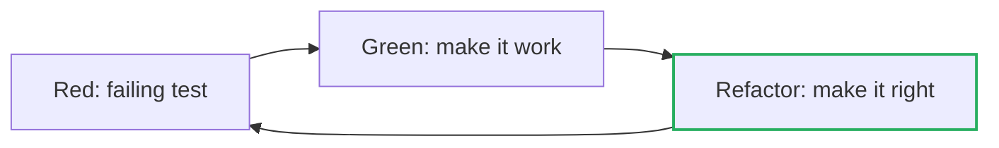

# Looking Back and Reflecting — Middle

> **What?** At this level, *looking back* is a disciplined post-solution review that does three jobs: it **verifies** the solution against the original problem and its edge cases, it **refactors** the now-protected code toward quality, and it **generalizes** — extracting the principle so the next problem in this class is faster. It also feeds your **calibration**: was this as hard as you predicted?
>
> **How?** Build a repeatable looking-back ritual into your definition of done. Diff your solution against the original requirement (not the drifted one). Refactor under green tests. Write down the *general* lesson, not the specific fix. Compare actual effort to your estimate and note the gap. Treat the bug or feature as a sample of a *class*, and ask whether your solution now covers the whole class.

---

You've internalized that "green" isn't "done." Now make looking back systematic enough that it survives deadline pressure — because that's exactly when people drop it, and exactly when it pays most.

## 1. Verification: solve the *original* problem, not the drifted one

Over the life of a task, the problem in your head drifts. You start fixing "checkout fails for orders over $1000" and end up fixing "the currency formatter rounds wrong" — a real bug you found along the way, but possibly *not the one you were asked to fix*. Looking back is the audit that catches drift.

### The verification checklist

```text
[ ] ORIGINAL requirement: re-read the ticket/spec verbatim. Does my code satisfy IT?
[ ] ACCEPTANCE CRITERIA: every bullet, not just the first one.
[ ] REPRO CASE: the exact input from the bug report produces the expected output.
[ ] EDGE CASES: empty / max / boundary / null / duplicate / concurrent — each covered by a test.
[ ] NO REGRESSION: the full suite is green, not just my new test.
[ ] SIDE EFFECTS: did I change behavior I didn't intend to? (diff review)
```

This connects straight back to [understanding the problem](../01-understanding-the-problem/): the edge cases you enumerate *there* are the checklist you verify *here*. If you skipped that stage, you have nothing to verify against — a tell that the upstream work was thin.

### Verify against examples, not vibes

A passing test you wrote yourself can encode the same misunderstanding as the bug. The strongest verification uses an *independent* oracle:

```python
# Weak: your test mirrors your implementation's assumptions.
# Strong: verify against an independent source of truth.
def test_against_reference():
    for case in load_cases("examples_from_spec.json"):  # spec-provided
        assert my_solution(case.input) == case.expected
```

When you can, prove the result a second way — a brute-force checker against your optimized solution, a property that must hold, a hand-computed value. Pólya's "can you check the result?" is really "can you check it *by a different route*?"

## 2. Refactoring: where quality enters

Make-it-work then make-it-right is not a slogan; it's a sequencing decision. You separate *correctness* (does it pass?) from *quality* (is it clear, is it right?) so you only fight one at a time.



The looking-back refactor is safe *because the tests are green*. That's the whole point of the test-first dance — green tests are the seatbelt that lets you restructure aggressively.

What you look for in the refactor pass:

| Smell you find | Looking-back fix |
| --- | --- |
| Duplicated logic (you wrote the same thing in two branches) | Extract a function; name the concept. |
| A function that "and"s — does X *and* Y | Split. One reason to change each. |
| Magic numbers / strings | Name them. The name documents intent. |
| A comment explaining *what* the code does | Rename so the code says it; delete the comment. |
| The "I'll understand this in a week" feeling | You won't. Clarify now, under green. |

If you skip the refactor, the cost doesn't vanish — it moves into the future and accrues interest as technical debt. The bill arrives the next time anyone (including you) touches this code.

## 3. Generalization: from one fix to a whole class

This is the high-leverage move. A specific solution is worth one ticket. A generalized one is worth every ticket in its class.

Ask: **"Does my solution now solve a whole category, or just this instance?"**

```python
# Instance: you fixed retry-on-timeout for the payment call.
def charge(...):
    for attempt in range(3):
        try: return _charge(...)
        except Timeout: continue
    raise

# Generalization: the pattern is "retry transient failures with backoff."
# Now EVERY flaky network call can reuse it.
@retry(on=Timeout, attempts=3, backoff=exponential)
def charge(...): ...
```

Generalization has a cost (premature abstraction is its own smell — see [the rule of three](../../README.md)), so the discipline is: **notice** the pattern always, **extract** it on the second or third occurrence. The notice-step is free and belongs in every look-back; the extract-step is a judgment call.

## 4. Calibration: was it as hard as you thought?

Looking back is the only moment you can close the loop on your own predictions. You estimated this task at half a day; it took two. *Why?*

```text
Estimate:   4h
Actual:     11h
Gap source: didn't account for the legacy auth coupling (didn't know it existed)
Lesson:     spike unknown integration points BEFORE estimating, not during.
```

Doing this turns estimation from guessing into a skill. Most engineers estimate badly *forever* because they never compare prediction to outcome — they just feel bad about being late and move on. The five-minute calibration note is how you actually get better at estimating. Over months, you learn your personal multipliers ("I underestimate anything touching the billing service by 3x").

This is a [feedback loop](../../03-systems-thinking/02-feedback-loops/): prediction → outcome → adjustment → better prediction.

## 5. Capturing learning so it compounds

A lesson you don't record is a lesson you'll re-learn the expensive way. Match the artifact to the scope:

| Scope of lesson | Where it goes |
| --- | --- |
| Personal mistake pattern | `lessons.md` — your private log. |
| "How to operate this thing" | A **runbook** the whole team can follow next time. |
| "Why we chose X over Y" | An **ADR** (Architecture Decision Record) so future-you doesn't re-litigate it. |
| "This broke and here's the fix-forward" | A postmortem with **action items** (see [professional](./professional.md)). |

The general principle: **make the lesson findable by the next person who hits this problem** — and that person is often you, having forgotten. As Santayana put it, *"Those who cannot remember the past are condemned to repeat it."* Engineering's version: those who don't write the postmortem ship the same outage twice.

## 6. The retrospective: looking back as a team

Individual look-back scales up to the team **retrospective** — a recurring, structured "what worked, what didn't, what do we change." The Agile retro and Norm Kerth's *Project Retrospectives* (2001) formalize it. Kerth's **Prime Directive** sets the tone:

> *"Regardless of what we discover, we understand and truly believe that everyone did the best job they could, given what they knew at the time, their skills and abilities, the resources available, and the situation at hand."*

That framing — assume good faith, attack the system not the person — is what makes a retro produce honest signal instead of defensive silence. We'll go deep on this and on blameless postmortems in [senior](./senior.md) and [professional](./professional.md).

## 7. A complete look-back, end to end

You shipped a fix for a flaky integration test.

1. **Verify.** Re-read the ticket: "test fails ~5% of runs." Run it 200× in CI — 0 failures now. The *original* problem, confirmed.
2. **Refactor.** The fix added a `sleep(2)`. Under green, replace it with an explicit wait-for-condition. Same behavior, no flakiness, no wasted 2 seconds.
3. **Generalize.** Grep the suite: 14 other tests use `sleep()` to "fix" flakiness. You found a class. File a follow-up; fix the shared helper.
4. **Calibrate.** Estimated 1h, took 4h — the root cause was a race condition, not timing. Note: "flaky test = race condition until proven otherwise."
5. **Capture.** Add to the team runbook: "Never `sleep()` to fix flakiness — wait for the condition."

One ticket became a suite-wide improvement, a calibration data point, and a documented team practice. That's looking back doing its job.

---

**Key takeaways**

- Verification means solving the **original** problem — audit for scope drift, re-run every edge case, and check the result by an *independent* route when you can.
- Refactor under green: make it work, then make it right. Skipped refactors become technical debt with interest.
- Always *notice* the general pattern; extract it on the second or third occurrence.
- Calibrate every estimate against actual effort — it's the only way estimation improves.
- Capture lessons at the right scope (`lessons.md` / runbook / ADR / postmortem) so they're findable when the problem recurs.

Next: [senior](./senior.md) — running blameless postmortems and making reflection a habit that survives pressure. Back to the [problem-solving section](../) · [engineering thinking roadmap](../../README.md).

---
## Recall and apply

**Practice loop:** After one task, record what you expected, what happened, what changed your mind, and one reusable lesson.

Try to answer these questions from memory:

1. "Make it work, then make it right." Where does looking back fit?
2. Pólya asks "can you check the result a different way?" What does that mean in engineering?
3. What is a blameless postmortem, and what is it *not*?
4. A junior engineer pushed a config that took down checkout. Walk me through the postmortem.
