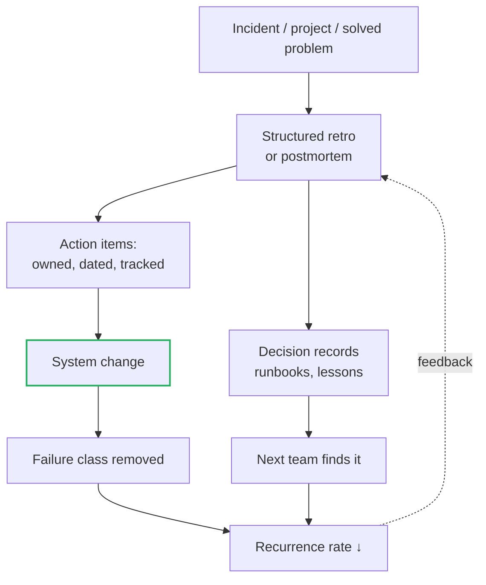

# Looking Back and Reflecting — Professional

> **What?** At staff/principal level, *looking back* stops being a personal habit and becomes **organizational capability**: a culture and a set of systems that reliably convert incidents, projects, and solved problems into durable, system-level improvements — across teams, not just within one. The unit of work is no longer "I learned"; it's "the organization learned, and the system changed so the failure class is gone."
>
> **How?** You build and defend blameless culture as a precondition for honest signal. You design the loops — postmortem process, retro cadence, action-item accountability, decision records — so learning compounds without depending on heroics. You turn individual incidents into systemic fixes, and you measure whether the organization's reflection actually changes behavior over time.

---

Everything in [senior](./senior.md) assumed *you* run a good look-back. The principal problem is different and harder: how do you make an organization of dozens or hundreds of engineers reflect well *by default*, when the natural gradient — deadline pressure, fear of blame, action-item amnesia — pulls hard the other way?

## 1. Blameless culture is infrastructure, not vibes

Every learning system downstream depends on one thing: people telling the truth about what happened. The moment an engineer believes a postmortem can be used against them, they sanitize the timeline, omit the near-misses, and the organization goes blind. Blameless culture is the load-bearing wall.

Sidney Dekker's *Just Culture* (and the SRE community's adoption of it) draws the critical line: **blameless is not consequence-free.** Gross negligence and malice still have consequences. But "made a reasonable decision that the system permitted to cause harm" is treated as a *system signal*, not a *personal failing*. The principal's job is to hold that line publicly and repeatedly, because:

- One blameful executive comment in one postmortem review poisons the well for months.
- Engineers calibrate to what leadership *does* in the hard cases, not what the wiki *says*.
- The strongest signal you can send: when *you* cause an incident, run *your own* blameless postmortem out loud.

```text
Failure mode of "blameless":  it becomes "blame-free of accountability,"
  action items never ship, and the same outages recur.
Failure mode of "accountable": it slides into blame, signal dries up,
  postmortems become defensive fiction.
Just Culture is the narrow path between: blameless on the PERSON,
  rigorously accountable on the SYSTEM and the ACTION ITEMS.
```

## 2. Design the learning loops so they don't depend on heroes

A single great engineer running great retros doesn't scale and leaves when they leave. Staff/principal work is to make the *system* produce learning regardless of who's in the room.



Concretely, you institutionalize:

| Loop | Mechanism | Failure it prevents |
| --- | --- | --- |
| **Incident → fix** | Mandatory postmortem above a severity threshold, templated, reviewed in a recurring forum. | "We moved on" — no learning from outages. |
| **Action items → done** | Tracked as first-class work, surfaced in planning, with a closure SLA. | The filed-and-forgotten postmortem. |
| **Decisions → memory** | ADRs for consequential choices; runbooks for operations. | Re-litigating settled decisions; re-deriving operational knowledge. |
| **Project → improvement** | Retro cadence (sprint + milestone) with the Prime Directive read aloud. | Teams repeating process mistakes every project. |
| **Cross-team → shared** | Postmortems published org-wide; a searchable incident archive. | Team B suffers the outage Team A already solved. |

The shift from senior to principal is captured in the last row: **the retro that changes the system, not just the team.** A team retro that produces "we'll communicate better next sprint" changed nothing structural. A principal-level retro produces "the on-call rotation has no handoff protocol; here's the protocol, owned, shipping" — a change to how the *organization* works.

## 3. From one incident to a systemic fix

The amateur postmortem fixes the instance. The principal asks: **what class does this incident belong to, and what one systemic change removes the whole class?**

```text
Incident:  Service X paged at 3am; a deploy with a bad migration locked a table.
Instance fix:   roll back, fix the migration.            (necessary, insufficient)
Class:          "schema migrations can take locks that block prod traffic."
Systemic fix:   lint migrations in CI for lock-taking DDL; require online-DDL
                tooling for large tables; add a migration safety checklist
                to the deploy gate.  → removes the CLASS, org-wide.
```

The signal that you've done principal-level work: you can name **other incidents that this fix would also have prevented**, and ideally point to a metric (incident recurrence rate, mean time between similar incidents) that should move. If your fix only protects against the exact incident that happened, you stopped one level too shallow.

### The "systemic vs. surface" test

For each action item, ask: *does this remove the reliance on a human doing the right thing under pressure?* "Be more careful," "add to the checklist humans must remember," and "we'll review more thoroughly" are surface fixes — they degrade the instant attention lapses. "CI blocks it," "the system defaults safe," "the dangerous operation is impossible by construction" are systemic.

## 4. Calibration at organizational scale

Individual calibration (senior level) asked "was my estimate right?" Organizational calibration asks: **is our collective judgment getting better?** You instrument the org's predictions against its outcomes:

- **Estimation:** track planned vs. actual at the project level; look for systematic bias (always 2x over on platform work?) and feed it into planning multipliers. This is the org's [feedback loop](../../03-systems-thinking/02-feedback-loops/) on its own forecasting.
- **Risk:** the risks you flagged before a launch — which materialized, which didn't, which surprised you? A launch retro that reviews the *risk register against reality* calibrates the whole org's risk sense.
- **Severity:** were incidents as bad as the initial severity call? Consistent over- or under-calling means your severity rubric is miscalibrated.

Without this, an organization estimates badly *forever* — the institutional version of "one year of experience twenty times." With it, planning slowly stops being fiction.

## 5. Measuring whether reflection works

Reflection that doesn't change behavior is theater, and at scale theater is expensive. Track leading and lagging indicators:

| Indicator | What it tells you |
| --- | --- |
| **Action-item closure rate / time** | Are postmortems producing real change, or just documents? |
| **Repeat-incident rate** | Same root-cause class recurring → your fixes are surface, not systemic. |
| **Postmortem participation breadth** | Is learning shared, or trapped in one team? |
| **Time-to-detect / time-to-recover trend** | Are runbooks and detection improvements compounding? |
| **Psychological-safety signals** | Are timelines candid? Do people volunteer their own mistakes? |

Beware Goodhart's law: the moment "number of postmortems" becomes a target, you'll get hollow postmortems. Measure *outcomes* (recurrence down, MTTR down), not *activity* (docs filed). See [feedback loops](../../03-systems-thinking/02-feedback-loops/) on metric-driven distortion.

## 6. The Prime Directive as an operating principle

Norm Kerth's Prime Directive (*Project Retrospectives*, 2001) — *"everyone did the best job they could, given what they knew at the time…"* — is not soft sentiment. At org scale it's a hard engineering requirement: it's the social precondition under which honest data flows. A principal reads it (literally or in spirit) at the top of every retro because it resets the room from "who's at fault" to "what does the system need." When you institutionalize it, you're not being nice — you're protecting your most important data source.

## 7. The institutional look-back, end to end

A multi-region outage took down auth for 90 minutes across three teams' services.

1. **Convene blameless, broad.** All three teams + on-call + the deploy-platform owner. Prime Directive stated. The platform principal who owns the failed dependency runs *their own* part transparently.
2. **Reconstruct one timeline** across teams from traces and logs — not three competing narratives. A single source of truth is itself a systemic asset.
3. **Find the class.** Root cause: a shared auth library's cache had no fallback; when the config service blipped, every consumer hard-failed simultaneously. The class: *shared dependencies with no graceful degradation create correlated, fleet-wide failure.*
4. **Systemic fix, org-wide.** Action items: (a) the auth library ships a stale-cache fallback; (b) a cross-team standard — "shared client libraries must degrade gracefully on dependency failure," enforced in design review; (c) chaos test injecting config-service failure in staging. Each owned, dated, tracked.
5. **Calibrate.** This dependency wasn't on anyone's risk register as a single point of failure — it was assumed reliable. Update the org's architecture-review checklist to surface correlated-failure single-points.
6. **Measure & close the loop.** Add "correlated multi-service auth failure" to the incident taxonomy; the recurrence metric for this class becomes a tracked SLO. Publish org-wide. Six months later, review: did the class recur? If not, the system learned.

The outcome is not "three teams fixed a bug." It's a changed design-review standard, a new chaos test, an updated architecture checklist, and a metric proving the failure class is gone. That is looking back operating as organizational capability.

---

**Key takeaways**

- Blameless culture is **infrastructure** — the precondition for honest signal. Just Culture: blameless on the *person*, rigorously accountable on the *system* and the *action items*.
- Institutionalize the loops (postmortems, tracked action items, ADRs, retro cadence, cross-team publishing) so learning compounds **without depending on heroes**.
- Drive every incident from instance → **class** → systemic fix; the test is whether you can name other incidents the fix also prevents, and whether it removes reliance on humans remembering.
- Calibrate at scale (estimates, risks, severity) and **measure outcomes, not activity** — watch repeat-incident rate and action-item closure, and beware Goodhart.
- The principal-level retro changes the **system**, not just the team.

Back to the [problem-solving section](../) · [engineering thinking roadmap](../../README.md). See also [check your understanding](#check-your-understanding) and [check your understanding](#check-your-understanding).

---
## Check your understanding

Try to answer these questions from memory:

1. Your team writes postmortems but the same kind of incident keeps recurring. What's wrong?
2. What's the Prime Directive and why would you read it at the start of a retro?
3. As a staff engineer, what does a *good* retro produce versus a mediocre one?
4. How would you measure whether your org's reflection actually works — and what's the trap?
