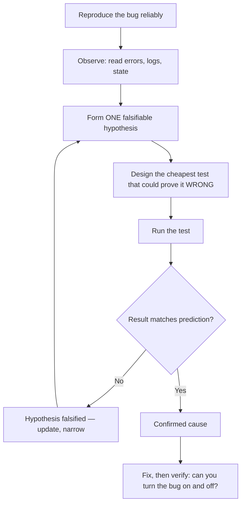

# Debugging as Problem-Solving — Junior

> **What?** Debugging is the disciplined search for *why* a program behaves differently from how you expect — done by forming a guess you can prove wrong and testing it, not by randomly changing lines until the symptom disappears.
> **How?** You reproduce the bug reliably, read the error and the stack trace instead of skipping them, write down one specific hypothesis, design the cheapest test that would prove it false, run that test, and update your guess. You change one thing at a time and you keep notes.

---

## 1. Debugging is the scientific method, not luck

Most beginners debug by *poking*: tweak a line, hit run, look at the screen, tweak another line. This feels like progress because something is always changing, but it is a random walk. You can spend an afternoon this way and end with code that "works now" and no idea why.

The professional alternative is the same loop scientists use: **observe → hypothesize → predict → test → update**. A bug is just a place where reality disagrees with your mental model of the code. Debugging is the process of finding *which* belief is wrong.



This connects directly to [hypothesis and falsifiability](../../09-scientific-and-hypothesis-driven/01-hypothesis-and-falsifiability/) — a debugging hypothesis must be *falsifiable*. "Something is wrong with the database" is not a hypothesis; you cannot test it. "The query returns `NULL` for user 42 because the `email` column is empty" *is* — you can run one query and find out.

> Brian Kernighan: *"Debugging is twice as hard as writing the code in the first place. Therefore, if you write the code as cleverly as possible, you are, by definition, not smart enough to debug it."* Write simple code; you will have to debug it later.

---

## 2. Step zero: reproduce it reliably

You cannot debug what you cannot reproduce. **A bug you can trigger on demand is half-solved; a bug you see once and can't reproduce can eat days.** Reproduction is the single most valuable thing you can do early.

To make a bug reproducible, pin down the exact conditions:

- **What input?** The specific values, file, request, or click sequence.
- **What environment?** Your machine, a specific browser, a specific OS, staging vs. production.
- **What state?** Logged in or out? Empty cart or full? First run or after some action?

Write the smallest recipe that triggers it every time:

```
1. Log in as a brand-new user (no orders)
2. Open /checkout
3. Click "Apply coupon" with field empty
=> 500 error, every time
```

If it only fails *sometimes*, you have not yet found the real trigger — keep narrowing until it fails *every* time, or you have explicitly found the variable that flips it (a race, a clock, a specific data value).

---

## 3. Quit thinking and look — read the error

Beginners' most expensive habit is **guessing instead of looking**. The program is *telling you* what went wrong; you just have to read it. This is David Agans' Rule 3, "Quit Thinking and Look": don't theorize about what *might* be happening — go observe what *is* happening.

### Reading a stack trace

A stack trace is a map from the crash back to where it started. Read it like this:

```
TypeError: Cannot read properties of undefined (reading 'name')
    at formatUser (user.js:12)        <-- where it actually broke
    at renderRow  (table.js:48)        <-- who called formatUser
    at renderTable (table.js:30)       <-- who called renderRow
    at main (app.js:7)                 <-- the origin
```

Two things matter:

1. **The error message** — `Cannot read properties of undefined (reading 'name')` means something was `undefined` and you tried to read `.name` off it. The *type* of error already cuts the search space in half.
2. **The top frame** — `user.js:12` is where it broke. Go there *first*. The lower frames tell you the path that got you there.

Open `user.js:12`, look at the line, and ask: *which thing here could be `undefined`?* That is now your first hypothesis.

> Don't scroll past the error to your code. The error message and the line number are free, precise facts. Use them before you guess anything.

---

## 4. One hypothesis, one test, one change

This is the heart of disciplined debugging — and the rule beginners break most.

### Form one falsifiable hypothesis

| Symptom | A bad (untestable) guess | A good (falsifiable) hypothesis |
|---|---|---|
| `undefined` reading `.name` | "user data is broken" | "`user` is `undefined` because `findUser(id)` returned nothing for this id" |
| Total is wrong | "math is off somewhere" | "`price` arrives as the string `"9.99"`, so `+` concatenates instead of adds" |
| Page is blank | "the render is broken" | "the API returns `[]`, so the list maps over nothing" |

The good column gives you something you can *check in one step*.

### Design the cheapest discriminating test

A *discriminating* test is one whose result is different depending on whether the hypothesis is true or false. The cheapest one is usually a single log line or a debugger breakpoint:

```js
function formatUser(user) {
  console.log("formatUser got:", user);   // costs 5 seconds, settles the question
  return user.name.toUpperCase();
}
```

If it prints `formatUser got: undefined`, your hypothesis is confirmed and you've moved the search one frame *up* (why is the caller passing `undefined`?). If it prints a real user, your hypothesis was wrong — good, you just saved yourself from "fixing" the wrong thing.

### Change exactly one thing

When you finally make a change, **change one thing at a time** (Agans' Rule 5). If you change three things and the bug goes away, you don't know which one fixed it — and you may have introduced two new bugs you'll meet next week. One change, re-test, observe.

---

## 5. The cardinal sins

Watch yourself for these. Every one of them feels productive and costs you hours.

- **Shotgun debugging** — changing many things at once. You lose the cause-and-effect link.
- **Fixing the symptom, not the cause** — wrapping a crash in `try/catch` and swallowing it. The crash stops; the real bug (the `undefined` user) lives on and resurfaces somewhere worse.
- **"It works now and I don't know why."** This is not fixed. It is hidden. If you don't understand *why* it broke and *why* your change helped, it will come back at the worst time. Keep going until you understand the mechanism.
- **Blaming the platform.** From *The Pragmatic Programmer*: *"select isn't broken."* The bug is almost always in your code, not in the OS, the compiler, or the library. Suspect yourself first.

---

## 6. Rubber-ducking

When stuck, explain the problem out loud, line by line, to a rubber duck (or any patient object). Forcing yourself to *narrate* what each line is *supposed* to do surfaces the gap between intention and reality — you often catch the bug mid-sentence. The duck never answers; you don't need it to. This is the cheapest debugging tool you own.

If no duck is handy, write the explanation as a message to a teammate. Half the time you find the answer before you hit send.

---

## 7. A short worked example

**Symptom:** A user reports that their shopping cart total shows `$0` even with items in it.

1. **Reproduce.** Add one item, view cart → total is `$0`. Reproduces every time. Good.
2. **Look.** No error in the console, so add a log: `console.log("items:", items)`. It prints `[{price: "12.50"}]` — note `price` is a *string*.
3. **Hypothesize (falsifiable):** "The total is `0` because `price` is a string, and `0 + "12.50"` plus parsing somewhere yields `NaN` or wrong math."
4. **Cheapest test:** `console.log(typeof items[0].price)` → prints `string`. Confirmed.
5. **One fix:** parse the price to a number where it enters the cart: `Number(item.price)`.
6. **Verify it's fixed:** total now shows `$12.50`. Then *turn the bug back on* mentally — remove the parse, confirm it breaks again, restore the fix. Now you *know* the mechanism, not just that the symptom is gone.

---

## 8. Where this sits in problem-solving

Debugging *is* problem-solving applied to your own code, so it borrows the whole section's toolkit:

- [Understanding the problem](../01-understanding-the-problem/) — reproduction is "understand the problem" for bugs.
- [Devising a plan](../02-devising-a-plan/) — your hypothesis-and-test sequence is the plan.
- [Looking back and reflecting](../04-looking-back-and-reflecting/) — after the fix, ask how the bug got in and how to prevent the class of it.
- When you're truly stuck, see [techniques when you are stuck](../06-techniques-when-you-are-stuck/).

← Back to [Problem-Solving](../) · [Engineering Thinking root](../../README.md)

---

## Key takeaways

- Debugging is hypothesis-driven inquiry. Guess what's wrong in a way you can *prove wrong*, then test it.
- **Reproduce first.** A reliably reproducible bug is half-solved.
- **Read the error and the stack trace.** They are free, precise facts — use them before guessing.
- **One hypothesis, one cheap test, one change** at a time.
- Avoid the cardinal sins: shotgun changes, symptom-fixing, and "it works now, dunno why."
- You only *know* it's fixed when you understand the mechanism — when you can turn the bug on and off.

---
## Recall and apply

**Practice loop:** Write the symptom, a falsifiable cause, the smallest probe, and the result before changing production code.

Use these prompts to check your understanding and choose one action to try in your next task.

Try to answer these questions from memory:

1. Walk me through your process for debugging an unfamiliar bug.
2. Production is down. Walk me through it.
3. Why is "I changed it and now it works" not good enough?
