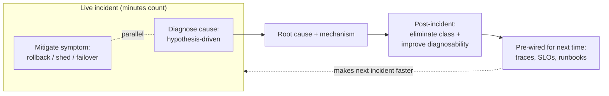

# Debugging as Problem-Solving — Professional

> **What?** At staff/principal scale, debugging is leading a systematic, hypothesis-driven investigation through a distributed system under incident pressure — where the cause spans services and teams, reproduction may be impossible, every probe has a cost, and your job is to converge the *group* on the mechanism, not just to find it yourself.
> **How?** You run observability-driven inquiry (the bug must be diagnosable from telemetry you can't reproduce), bisect across deploy/traffic/topology dimensions, command the investigation so parallel hypotheses don't collide, separate stabilizing the symptom from finding the cause, and turn each hard bug into eliminated classes and better diagnosability.

---

## 1. Why production debugging is a different discipline

The single-process tools — attach a debugger, add a log, re-run — mostly evaporate in production:

- **You often cannot reproduce it.** It happened once, under a traffic mix and timing you can't recreate. Your only evidence is whatever telemetry you *already had*.
- **You cannot pause it.** Breakpoints don't exist in a live fleet serving traffic; observation must be non-blocking and low-overhead.
- **The cause is distributed.** The symptom surfaces in service A, but the cause is a slow dependency in D, a poisoned cache in B, a clock skew in C, or an interaction among all of them that no single service exhibits alone.
- **There is a clock and a blast radius.** Every minute of investigation is customer impact. You debug *and* mitigate in parallel, under scrutiny.

The method does not change — reproduce, observe, falsifiable hypothesis, cheapest discriminating test, update — but every step is harder, and the highest-leverage work shifts *left*: to building systems that are diagnosable before the incident.

---

## 2. Observability-driven debugging: you can only debug what you can see

In a distributed system, your hypotheses are only as good as your telemetry. The three pillars partition the search space at different granularities:

| Signal | Question it answers | Role in the loop |
|---|---|---|
| **Metrics** | *What* changed and *when*? (rate/errors/duration, saturation) | Detect + bisect over time and over service — points you at the suspect |
| **Traces** | *Where* in the request path is the time/error? Which hop? | Bisect the call graph in one request — collapses "which of 30 services" |
| **Logs / events** | *Why* did this specific instance behave this way? | The fine-grained fact at the suspect hop |

The principal-level demand: **high-cardinality, wide events.** Pre-aggregated dashboards answer questions you anticipated; novel bugs are by definition the ones you didn't. The ability to slice live by `user_id`, `region`, `build_id`, `device`, `tenant` is what lets you ask "is it *this* cohort?" and get a yes/no — which is a binary search over the population. A trace that spans the whole request *is* a stack trace across the distributed system; without it you are guessing which of thirty services is at fault.

The corollary, and the most important sentence here: **the time to make a bug debuggable is before it happens.** Tracing, structured events, and meaningful SLOs are not ops hygiene — they are the instruments that make the scientific method *possible* in production. A bug you cannot observe is a bug you cannot debug; you can only mitigate and pray. Investing in diagnosability is investing in your future debugging speed.

---

## 3. Bisecting at scale

The O(log n) instinct still wins; you just bisect over different axes, and a *fleet-level toggle* is the cut:

- **Bisect the deploy.** The overwhelmingly most common production regression is "we changed something." Correlate the symptom's onset with the deploy timeline — a graph annotation lining up with a `build_id` is your `git bisect` for prod. Then **mitigate by reverting** (rollback / flag-off) *before* you fully understand it: stop the bleeding, then diagnose at leisure from the rolled-back state. Rollback is both mitigation and the cheapest discriminating test.
- **Bisect traffic / cohort.** Is it all users or one region, one tenant, one client version, one shard? Slice the wide events. "Only iOS 17.2 in eu-west on the new build" collapses the space enormously — and often names the cause outright.
- **Bisect the topology.** Disable a dependency (feature flag, circuit breaker), fail over a replica, drain a node. If the symptom moves with the component, you've localized it. This is "comment out half the pipeline" at the level of services.
- **Bisect with canaries.** A canary *is* a controlled experiment: identical traffic, one variable (the new build). If the canary shows the symptom and the baseline doesn't, you've isolated the change with a clean control group.

---

## 4. Leading the investigation — incident command

When a sev-1 has eight engineers in a call, the failure mode is no longer "I can't find the bug." It is **everyone debugging at once, uncoordinated**: three people changing config simultaneously (you've just broken "change one thing at a time" across humans), parallel hypotheses contaminating each other, and nobody writing anything down. Your staff/principal job is to impose the method on the *group*:

- **Separate roles.** An incident commander coordinates and decides; investigators chase hypotheses; a scribe keeps the audit trail (Agans Rule 6 at team scale). The commander does not also debug.
- **Serialize the changes.** Only one mitigating change at a time, announced, with a predicted effect and a rollback. Otherwise you can't attribute what helped — and you risk stacking two regressions.
- **Maintain a shared hypothesis board.** What we believe, what we've ruled out, what test is in flight and who owns it. This stops two people re-running the same falsified test and surfaces when the team is theorizing instead of looking (Rule 3 — *quit thinking and look*).
- **Decouple mitigation from diagnosis explicitly.** State out loud: "We are mitigating with a rollback now; root cause is a separate, non-urgent track." Pressure pushes teams to conflate them and to grab the first plausible cause. Naming the split protects the rigor.
- **Get a fresh view (Rule 8).** When the room has tunnel vision, pull in someone who hasn't been staring at it. Fresh eyes routinely spot the assumption everyone else stopped questioning.

---

## 5. The hardest bugs at scale

These are the ones that consume principal engineers for days:

- **Emergent / interaction bugs.** No component is individually buggy; the *interaction* is — a retry storm amplified by a load balancer's behavior under partial failure, a thundering herd on cache expiry, metastable failure where the system can't recover even after the trigger is gone. You can't find these by reading one service. You need traces and metrics that show the *system* behavior, and you reason about feedback loops, not lines of code.
- **Corruption that surfaces far from its source.** A bad write in service A corrupts data that explodes a read in service E hours later. Assertion/validation tripwires *at every boundary* (validate on write, not just on read) collapse the temporal and spatial distance between cause and symptom — the principal-level investment is putting those tripwires in before the incident.
- **Heisenbugs at fleet scale.** A bug that vanishes under any added observation. The answer is *always-on, low-overhead* telemetry (sampling, ring buffers, continuous profiling) so you capture the bad event in flight without perturbing it — you can't add a probe after the fact for a once-a-week, non-reproducible event.
- **Gray failures / partial brownouts.** The system is "up" (health checks green) but degraded for a subset. These hide from binary up/down monitoring; you catch them only with SLOs measured from the *client's* perspective and high-cardinality slicing.

In every case the leverage is the same: **the bug must be diagnosable from data you already collected.** That is a design property you build in, not a heroic act you perform during the incident.

---

## 6. Debugging across team boundaries

At scale the cause routinely lives in another team's service. The senior-level move — a minimal reproduction as proof — becomes an *organizational* skill:

- **Bring evidence, not blame.** A trace showing the latency is in their hop, a request id they can look up, a minimal `curl` that reproduces. "select isn't broken" still applies: rule out your own side first, then hand them something irrefutable, not a hunch.
- **Make the contract the bisection.** When two teams each believe the bug is the other's, the boundary contract (schema, idempotency guarantee, timeout/retry semantics) is the dividing line. Test *at the contract*: capture exactly what crossed the wire. The bug is on the side that violated the agreement — the captured payload settles it without a turf war.
- **Own the synthesis.** Often *no one* team can see the whole picture because each sees only their slice. The principal's distinctive contribution is assembling the cross-service narrative — the end-to-end trace and timeline that no individual team had — that finally explains the emergent behavior.

---

## 7. The post-incident multiplier

A staff/principal debugging effort isn't done at the fix; it's done when the *organization* is better at the class. Tie this to [looking back and reflecting](../04-looking-back-and-reflecting/):

1. **Toggle proof + regression guard**, same as ever — but now the "regression test" may be a synthetic monitor, a chaos experiment, or a canary check.
2. **Eliminate the class, not the instance.** A blameless post-mortem with the five whys lands on a systemic cause (no schema constraint, no boundary validation, an unsafe shared pattern copied widely). The action items remove the *class*: a lint rule, a type, a platform guardrail, a default.
3. **Improve diagnosability.** Every hard incident exposes a blind spot — a missing span, an un-sliceable metric, an absent SLO. The most valuable output is often "we now have the telemetry to catch this in 5 minutes next time," because that compounds across every future bug, not just this one.

---

## 8. A worked distributed incident

**Symptom:** p99 checkout latency spikes to 8s for ~3% of users every few hours, then recovers; no error rate change; not reproducible on demand.

1. **Mitigate-track + diagnose-track, declared separately.** No deploy correlates, so rollback isn't the lever; mitigation is "be ready to shed load," diagnosis proceeds.
2. **Observe (metrics).** The spikes correlate with a cache TTL boundary — saturation on the pricing service jumps right at expiry. Hypothesis forming.
3. **Bisect cohort (wide events).** Slice by tenant: spikes hit only the top-10 largest tenants. Their cache entries are the most expensive to recompute.
4. **Trace one slow request.** The trace shows 7.8s parked in `pricing.recompute`, with hundreds of concurrent identical recomputes — a **thundering herd**: TTL expiry stampedes every in-flight request into recomputing the same hot key at once.
5. **Falsifiable hypothesis + cheap test.** "On expiry, N concurrent requests all miss and recompute the same key." Predicted signature: a burst of cache-miss + recompute-concurrency spike at each TTL tick. The metrics confirm exactly that.
6. **Fix the cause, not the symptom.** Not "raise the TTL" (symptom; herd still happens, just less often) — add request coalescing / single-flight so one recompute fills the cache and the rest wait on it; add jittered TTLs to de-synchronize expiries.
7. **Verify.** Canary the single-flight build; its spikes vanish while baseline still spikes — clean control. Toggle proven at fleet scale.
8. **Class + diagnosability.** Five whys: the same naive cache-fill pattern exists in four services. Roll single-flight into the shared cache library (kill the class). Add a "recompute concurrency per key" metric so the next herd is visible in one dashboard panel (improve diagnosability).

← Back to [Problem-Solving](../) · [Devising a plan](../02-devising-a-plan/) · [Carrying out the plan](../03-carrying-out-the-plan/) · [Looking back](../04-looking-back-and-reflecting/) · [Engineering Thinking root](../../README.md)

---

## Key takeaways

- Production debugging keeps the scientific loop but loses reproduce/pause/single-process; the highest leverage shifts *left* to diagnosability.
- **You can only debug what you can observe.** Metrics bisect time, traces bisect the call graph, high-cardinality events bisect the population. Build wide telemetry *before* the incident.
- Bisect over deploy, cohort, and topology; rollback and canary are simultaneously mitigations and discriminating experiments.
- **Lead the investigation:** separate command from diagnosis, serialize changes (one thing at a time, across humans), keep a shared audit trail, and decouple mitigation from root cause explicitly.
- The hardest bugs are emergent/interaction, distant corruption, fleet heisenbugs, and gray failures — all solved by pre-built observability, not in-the-moment heroics.
- Done = toggle-proven fix + regression guard + **class eliminated** + a measurable improvement in how fast the *next* one is diagnosed.

---
## Recall and apply

**Practice loop:** Write the symptom, a falsifiable cause, the smallest probe, and the result before changing production code.

Try to answer these questions from memory:

1. The bug seems to be in a third-party library. How do you proceed?
2. How do you debug something you can't reproduce locally, only in production?
3. What's rubber-ducking and why does it work?
4. Recite Agans' 9 rules and name the one engineers break most.
