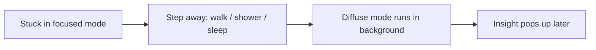

# Techniques When You Are Stuck — Junior

> **What?** Being stuck is the state where you keep working on a problem but stop making progress — you change things without understanding why, retry the same failed approach, and feel frustration rising. The skill here is the meta-skill: noticing you are stuck and choosing a *different* move instead of pushing harder.
>
> **How?** At the junior level you build a small, reliable checklist of moves — take a break, explain it out loud, write a tiny example, re-read your own assumptions, and ask for help *well* after a fixed time. You stop measuring effort by how long you stared at the screen and start measuring it by whether you actually learned something.

---

## 1. Recognize that you are stuck

The first problem with being stuck is that you usually don't *notice* it. You feel busy. You're typing, running, reading. But busy is not the same as progressing.

Here are the honest signals that you've crossed from *working* into *thrashing*:

| Signal | What it looks like |
| --- | --- |
| **Repeating the same approach** | You re-run the same code, maybe tweaking one character, expecting a different result. |
| **Changing things you don't understand** | Adding `await`, removing it, flipping a boolean, swapping `<` for `<=` — guessing, not reasoning. |
| **No new information** | The last 30 minutes produced no fact you didn't have before. |
| **Rising frustration** | You feel tense, you're cursing at the screen, your tabs are multiplying. |
| **Tunnel vision** | You haven't questioned the *one* thing you're sure is fine. |

If two or more of these are true, stop. Pushing harder from here almost never works, and it makes you worse: tired and frustrated brains make sloppier guesses.

```text
Productive struggle:   effort  →  understanding  →  progress
Unproductive thrash:   effort  →  effort  →  more effort  →  (nothing)
```

The goal of everything below is to convert thrashing back into struggle that teaches you something.

---

## 2. The first move is almost always: stop pushing

This feels wrong. You're a junior, you want to prove you can grind it out. But "grind harder" is the *least* effective tool in the box for a true stuck-point.

There's real cognitive science here, not just folklore. Your brain has two modes (Barbara Oakley, *A Mind for Numbers*):

- **Focused mode** — deliberate, narrow, the mode you use while staring at the bug.
- **Diffuse mode** — relaxed, broad, the background mode that connects ideas. It runs while you shower, walk, or sleep.

When you're stuck, focused mode has exhausted the obvious paths. Diffuse mode is what finds the *non*-obvious one. You literally cannot force it on — you have to step away.



The famous version is the mathematician Henri Poincaré, who reported solving a hard problem the instant he stepped onto a bus, after days of fruitless focused work. You'll have your own bus moments — in the shower, on a walk, the next morning. "Sleep on it" is real engineering advice.

**Practical rule:** if you've been stuck for ~20 minutes with no new information, get up. Walk to get water. Don't bring your phone (that's not diffuse mode, that's just a different focus). Two minutes away often beats twenty more minutes of staring.

---

## 3. Explain it out loud (rubber-duck debugging)

The single highest-value-per-minute technique a junior can learn.

You keep a rubber duck (or a coffee mug, or a teammate) on your desk and explain the problem to it, **line by line, out loud**, as if it knows nothing. The name comes from Hunt & Thomas, *The Pragmatic Programmer*.

Why it works: speaking forces you to *articulate*, and articulation exposes the gap. The moment you say "and then this function returns the user, which is definitely set, because—" you stop, because you realize it *isn't* definitely set. The bug was hiding in a sentence you'd never actually finished.

```text
You:  "So I fetch the user, then I read user.email—"
You:  "—wait. fetchUser is async. I never awaited it."
```

The duck never said a word. You solved it because you were forced to make your reasoning explicit instead of letting it stay a vague feeling.

**How to do it for real:** narrate every step, including the parts you're *sure* about. The bug lives in the part you're sure about. If no duck is handy, write the explanation in a comment or a Slack draft you never send — same effect.

---

## 4. Change the representation

If the problem is fuzzy in your head, get it out of your head and into a different form. The form you're using might be the thing hiding the answer.

| Move | Use it when |
| --- | --- |
| **Draw it** | Pointers, request flows, state machines, who-calls-what. A 30-second sketch beats holding 5 objects in your head. |
| **Write it out in plain words** | "First X happens, then Y, but Y needs Z which isn't ready yet." |
| **Work a tiny concrete example** | Stop reasoning abstractly. Take `[3, 1, 2]` and walk it through your code by hand on paper. |
| **Print the actual values** | Stop *imagining* what `data` contains. `print(data)`. Reality is often not what you assumed. |

The tiny concrete example is gold for juniors. Abstract reasoning ("the loop should sort it") hides bugs; tracing `[3, 1, 2]` row by row reveals exactly where index `i` goes wrong. Tracking three values by hand is slow, which is the point — it forces you to actually look.

This connects to the whole idea of [understanding the problem](../01-understanding-the-problem/) before attacking it: a clearer representation *is* better understanding.

---

## 5. Question the assumption you didn't know you were making

Most stuck-points are an assumption that turned out false. The trap is that you don't experience an assumption as an assumption — you experience it as obvious truth.

> *"select isn't broken."* — *The Pragmatic Programmer*

The lesson behind that line: it is incredibly rare that the OS, the standard library, the compiler, or the database is broken. When you catch yourself thinking "this must be a bug in the framework," that's a giant flashing sign that the bug is in **your** code, in the thing you're *sure* is fine.

Make the implicit explicit. Write down: *"I am assuming the config is loaded, the input is valid, this value is non-null, the function returns what its name says."* Then check each one with an actual print or a debugger. The bug is usually in the line you didn't bother to check because it was "obviously" fine.

This is the everyday version of [questioning your assumptions](../../05-first-principles-thinking/02-questioning-assumptions/).

---

## 6. Simplify — make the problem smaller

A big tangled failure is hard to think about. Shrink it until it's trivial, then grow it back.

- **Solve a smaller case.** Can't sort the whole file? Sort an array of 3 numbers first.
- **Build a minimal reproduction.** Delete everything not needed to trigger the bug. A 200-line failure that shrinks to 8 lines often *shows* you the cause on the way down. Often the bug disappears at some point — and the last thing you deleted is the culprit.
- **Remove a constraint, then add it back.** Ignore the validation, get the happy path working, then re-add validation one rule at a time.

Each removal is a controlled experiment. The minimal repro is also exactly what a senior will ask you for when you request help — so building it does double duty.

---

## 7. Ask for help — and ask *well*

Asking for help is a skill, not a failure. But *how* you ask determines whether you grow or just get rescued.

**The 15–30 minute rule (a common team norm):** struggle on your own for 15–30 minutes first — that's where the learning happens. After that, the marginal cost of staying stuck (your time, the deadline, the morale hit) outweighs the learning, so you escalate. Don't burn a whole afternoon silently; that's not grit, it's waste.

**How to ask a good question.** Give three things:

1. **What I'm trying to do** — the goal, not just the symptom.
2. **What I tried** — so they don't repeat your dead ends.
3. **What I expected vs. what actually happened** — with the *exact* error message, not a paraphrase.

```text
Bad:   "My code doesn't work, can you help?"

Good:  "I'm trying to save a user (goal). On save I get
        `IntegrityError: null value in column email` (actual).
        I expected email to be set because the form has it (expectation).
        I tried logging the request body — email IS there — and checked
        the model field name matches (tried). What am I missing?"
```

Here's the paradox every engineer eventually notices: **writing the good question often answers it.** The act of laying out goal / tried / expected / actual forces the same articulation as rubber-ducking, and halfway through typing you go *"oh—"* and delete the message. That's a win, not wasted effort. (This is the well-known *XY problem*: you ask about your attempted fix Y instead of your real goal X — describing X usually dissolves it.)

---

## 8. A junior's stuck checklist

When you notice the signals from §1, walk this list in order. Stop the moment one works.

```text
[ ] Have I been stuck >20 min with no new info?   → step away for 2 min
[ ] Can I explain it out loud, line by line?        → rubber-duck it
[ ] Have I drawn it / traced a tiny example by hand? → change representation
[ ] What am I SURE is true that I haven't checked?  → print it, verify it
[ ] Can I make a smaller / minimal version?         → simplify
[ ] Have I hit ~30 min?                              → write the good question, ask
```

Notice that "try the same thing again, harder" is *not* on the list. That's the whole point.

---

## 9. Pitfalls juniors hit

- **Mistaking effort for progress.** Three hours of frustrated grinding looks like dedication and feels like work, but if you learned nothing it was thrashing. Measure information gained, not minutes spent.
- **Refusing to ask out of pride.** Staying silently stuck for a day to "prove yourself" proves the opposite. Asking a sharp question after a focused attempt is the senior move.
- **Asking with no preparation.** "It's broken, help" forces the helper to do all the work you should have done. Always bring goal / tried / expected / actual.
- **Pushing harder past frustration.** A frustrated brain guesses; it doesn't reason. When you feel the heat rising, that *is* the signal to step away.
- **Skipping the obvious because it's "obviously fine."** Print it anyway. The bug lives there.

---

## Where this leads

These moves are the same ones you'll use forever — they just get sharper. As you grow, link this skill to [debugging as problem-solving](../05-debugging-as-problem-solving/), [devising a plan](../02-devising-a-plan/), and [looking back](../04-looking-back-and-reflecting/) so each stuck-point also teaches you *how you get stuck*. Build the checklist into a habit now and you'll spend your whole career getting unstuck faster than the people who only know how to grind.

---
## Recall and apply

**Practice loop:** Name the blocker, choose one technique, time-box it, and state what evidence would tell you to switch approaches.

Use these prompts to check your understanding and choose one action to try in your next task.

Try to answer these questions from memory:

1. You've been stuck on a bug for two hours. Walk me through what you do.
2. What's the difference between productive struggle and unproductive thrashing?
3. When should you ask for help?
