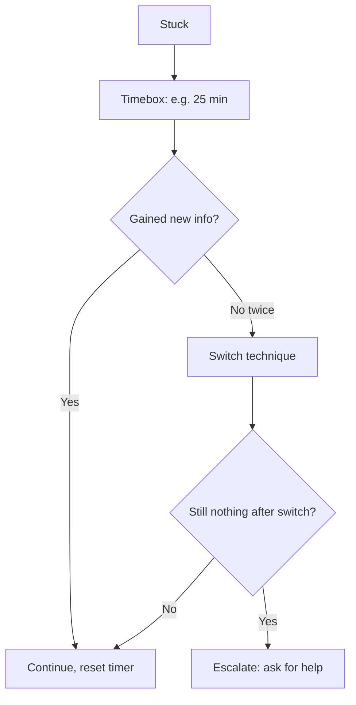

# Techniques When You Are Stuck — Middle

> **What?** At the mid level, getting unstuck is a *deliberate, ordered toolkit* you reach for on purpose — not a panic response. You can name which technique fits which kind of stuck, you timebox the struggle, and you can tell productive struggle (gaining information) apart from thrashing (burning time) in near real time.
>
> **How?** You diagnose *why* you're stuck before picking a move: missing information, a false assumption, the wrong representation, or pure fatigue each call for a different tool. You change levels of abstraction, work backward from the goal, attack from inversion, and you ask for help with a question so well-formed it frequently answers itself.

---

## 1. Diagnose the *type* of stuck first

Juniors reach for a random technique. Mid-level engineers ask: *what kind of stuck is this?* The right move depends entirely on the answer.

| Type of stuck | Tell-tale sign | First move |
| --- | --- | --- |
| **Missing information** | "I genuinely don't know what X does / returns / contains." | Go get the fact: read source, print the value, check the docs. |
| **False assumption** | Everything "should" work but doesn't. | List your assumptions, verify each one. The lie is in there. |
| **Wrong representation** | You can hold it in your head but it's a blur. | Draw it, trace a concrete example, change the data structure. |
| **Fatigue / tunnel vision** | You're frustrated, repeating yourself, guessing. | Step away. Diffuse mode. Sleep on it. |
| **Wrong altitude** | You're lost in detail (or hand-waving the detail). | Step up or down a level of abstraction. |
| **Wrong problem** | You're fighting a symptom, not the cause. | Go back to [understanding the problem](../01-understanding-the-problem/). |

The diagnosis takes thirty seconds and saves an hour. If you can't name the type, that itself is information: you probably don't understand the problem yet, so restart there.

---

## 2. Timebox the struggle, then escalate

Struggle is valuable — *up to a point*. The mid-level skill is putting a clock on it.

> **Productive struggle** generates information: each attempt rules something out, narrows the space, or teaches you a fact. **Unproductive thrashing** generates nothing: you cycle through the same guesses with rising frustration.

The test, asked every ~15 minutes: *"Do I know something now that I didn't know when I started this attempt?"* If yes, keep going — that's struggle, and it's where learning lives. If no for two cycles running, you're thrashing. Change technique or escalate.



The **15-minute rule** (popularized as a team norm at many shops, often credited to a GitHub-era practice) formalizes the front of this: try alone for 15 minutes, *then* you're allowed — encouraged — to ask. It protects the learning window without letting a stuck engineer rot for a day.

Set an actual timer. Without one, "I'll just try one more thing" silently consumes the afternoon.

---

## 3. Change the representation — deliberately

When the problem is a blur, the representation is wrong for *this* question. Switch it on purpose.

| Switch | Reveals |
| --- | --- |
| Code → **diagram** | Control flow, ownership, which component talks to which. |
| Abstract → **concrete trace** | Off-by-one, wrong branch, the exact step that diverges. |
| Prose → **table** | Missing cases, the combination you never handled. |
| Time-series logs → **timeline** | Ordering bugs, races, "this happened before that?" |
| One data structure → **another** | A graph problem disguised as nested loops; a set that should be a map. |

The last row matters more than juniors realize. A surprising fraction of "I'm stuck on the algorithm" is actually "I picked a data structure that makes this hard." If you're doing `O(n)` membership scans inside a loop and it's painful, the stuck-ness *is* the wrong structure asking to become a hash set. Changing the structure dissolves the problem instead of solving it.

```text
Stuck:   for each order: scan all 10k users to find owner   # painful, slow, buggy
Reframe: build {user_id: user} once, then O(1) lookups      # problem evaporates
```

A 60-second box-and-arrow sketch routinely beats 20 minutes of trying to simulate five objects in working memory. Your head holds about three things at once; paper holds twenty.

---

## 4. Step up or down a level of abstraction

Many stuck-points are an *altitude* error: you're at the wrong zoom level for the question.

- **Stuck in the weeds** (debugging one line for an hour): step **up**. Forget the line. What's the system *supposed* to do here? Often the whole approach is wrong and the line is irrelevant.
- **Hand-waving** ("it should just work somehow"): step **down**. Pick one concrete case and trace the actual bytes/values. The vagueness is hiding the bug.

```text
Too low:   "Why does line 47 return nil?"           → up:  "Should this layer even be fetching here?"
Too high:  "The cache should make this fast."       → down: "Trace ONE request. Where's the time actually going?"
```

A reliable trick: if you've been at one altitude for a while with no progress, the answer is probably at a *different* altitude. Deliberately jump zoom levels.

---

## 5. Work backward from the goal

When forward progress stalls, reverse the direction of reasoning. Start at the *outcome you want* and ask what must be true immediately before it.

```text
Goal:        the API returns the user's orders, sorted by date.
One before:  I have a sorted list of orders in hand.
One before:  I have the user's orders (unsorted).
One before:  I have the user's id.
One before:  I have an authenticated request.
```

Now you have a chain of preconditions to verify backward from the goal. The break is wherever a "before" step isn't actually satisfied. Working backward is especially strong when there are many possible forward paths but only one valid ending — you prune aggressively. (This is Pólya's *working backwards* heuristic from *How to Solve It*, and it pairs naturally with [devising a plan](../02-devising-a-plan/).)

---

## 6. Take a different angle: inversion

If "how do I make this work?" is stuck, ask the opposite: **"how would I *cause* this exact failure?"**

```text
Stuck:    "Why is this request sometimes 401?"
Invert:   "How would I deliberately cause an intermittent 401?"
          → expired token? clock skew? load-balanced node with stale secret?
          → a race between refresh and use?
Now you have a list of suspects to test, instead of a blank wall.
```

Inversion turns an open-ended "why" into a concrete list of mechanisms you can check off. It's also great for design dead-ends: "how would I make this system *un*maintainable / slow / insecure?" surfaces the very risks you're failing to articulate. See [inversion thinking](../../07-creative-and-lateral-thinking/02-inversion-thinking/).

---

## 7. Simplify: special case, minimal repro, constraint removal

Shrinking the problem is the mid-level workhorse. Three concrete forms:

**Solve a special case.** Generalize *after* you've cracked the easy version. Can't write the general dynamic-programming recurrence? Solve `n=1`, then `n=2` by hand, and the pattern usually appears.

**Build a minimal reproduction.** Strip the failure to the fewest lines that still fail. This is a *binary-search over your own code*: cut half, does it still break? The shrinking process frequently reveals the cause before you even finish, and the result is exactly what you'd hand a teammate or a bug report.

**Remove constraints, then re-add.** Get the happy path working with validation, auth, caching, and error handling all switched off. Then re-add them one at a time. The one that breaks it is your culprit — and you've isolated it cleanly.

```text
Full failing system  --remove constraints-->  minimal happy path (works)
                     <--add back one at a time-- find which addition breaks it
```

---

## 8. Incubation is a tool, not a cop-out

Stepping away is engineering, backed by the focused/diffuse-mode model (Barbara Oakley, *A Mind for Numbers*; the Poincaré incubation anecdote). Use it deliberately:

- **The 2-minute reset** — micro-stuck: stand up, water, look out a window. Breaks tunnel vision.
- **The walk/shower** — medium stuck: a real context switch lets diffuse mode connect ideas. Don't bring the problem *or* your phone; let it run in the background.
- **Sleep on it** — hard stuck: end the day stuck, and you'll often wake with the answer half-formed. This is real memory consolidation, not a motivational poster.

The trick is to *load the problem first*. Spend focused effort, hit the wall, *then* step away. Diffuse mode works on what focused mode loaded; stepping away before you've engaged just wastes time.

---

## 9. Ask for help so well it answers itself

A mid-level help request is a small artifact. It contains:

1. **Context / goal** — what you're building and why (the real X, not just your attempted fix Y — avoid the *XY problem*).
2. **What you tried** — the dead ends, so nobody repeats them.
3. **Expected vs. actual** — exact error, exact output, copy-pasted not paraphrased.
4. **Your current hypothesis** — "I think it's the connection pool, because…"

The discipline of writing all four is itself a debugging technique. The articulation forces you to confront the gap, and you'll frequently delete the message half-written because the act of explaining surfaced the answer. Eric Raymond's *How To Ask Questions The Smart Way* is the canonical reference; the short version is: **do your homework, then ask precisely.** A good question respects the helper's time and signals that you're worth helping.

```text
Weak ask:    "@channel anyone know why my deploy is failing?"
Strong ask:  "Deploy to staging fails at the migration step (goal: ship feature X).
              Error: `relation "orders" already exists` (actual; expected a clean apply).
              I tried `migrate down` then `up` — same error. Schema shows the table
              IS there, so I think a prior migration half-applied. How do I check
              migration state safely?"
```

The strong ask gets answered in minutes because it's *answerable*. The weak ask gets ignored or generates ten clarifying questions.

---

## 10. Anti-patterns at this level

- **Skipping the diagnosis.** Reaching for "step away" when the real issue is a missing fact you could print in five seconds. Match the tool to the type of stuck.
- **Infinite struggle, no timer.** "Productive struggle" becomes thrashing without a clock to catch the transition.
- **Stack-Overflow roulette.** Pasting random snippets that "might fix it" — that's thrashing with extra steps and no understanding.
- **Asking too early or too late.** Too early skips the learning; too late wastes a day. The 15-minute rule plus the "gained new info?" test calibrate this.
- **Loading diffuse mode without focusing first.** A walk only helps if you engaged the problem hard beforehand.

---

## Where this leads

The senior leap is doing this *under pressure and across systems* — recognizing your own thrashing in the moment, and getting *others* unstuck. Pair this with [debugging as problem-solving](../05-debugging-as-problem-solving/) for the systematic side and [debugging your own reasoning](../../10-metacognition-and-learning/02-debugging-your-own-reasoning/) for the metacognitive side. Master the diagnose-then-choose loop here and you stop fearing stuck-points — they become routine.

---
## Recall and apply

**Practice loop:** Name the blocker, choose one technique, time-box it, and state what evidence would tell you to switch approaches.

Try to answer these questions from memory:

1. How do you ask a good question?
2. What is rubber-duck debugging and why does it work?
3. Why is taking a break a legitimate technique and not just procrastination?
4. Give an example of "the assumption you didn't know you were making."
