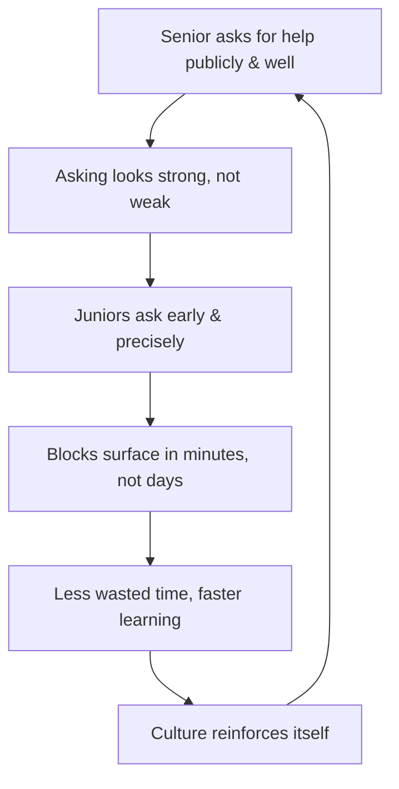

# Techniques When You Are Stuck — Professional

> **What?** At the staff/principal level, "getting unstuck" stops being about *you* and becomes a system you operate on *teams and organizations*: unblocking a stuck team, breaking analysis paralysis at scale, deciding when to bring in outside expertise, and — most durably — building a culture where asking for help early is the safe, normal, fast thing to do.
>
> **How?** You become a force multiplier for unsticking: you diagnose *why a team is stuck* (not just a person), you design the systems and norms that surface blocks early, you model help-seeking from a position of seniority so it's safe for everyone below you, and you know when *you* are the bottleneck and step aside.

---

## 1. The unit of stuck-ness is now the team

A staff engineer's leverage isn't unsticking themselves faster — it's unsticking *everyone*. The failure modes change shape at this altitude.

| Individual stuck | Team stuck (your problem now) |
| --- | --- |
| One engineer thrashing on a bug | A team thrashing on a decision for three weeks |
| "I'm sure this is fine" assumption | A *shared* false assumption nobody questions ("we've always done it this way") |
| Frustration, tunnel vision | Demoralization, churn, finger-pointing across teams |
| Asking a teammate | Knowing *which* expert in the org (or outside) to pull in |
| Sunk cost on an approach | Sunk cost on an architecture or a quarter of roadmap |

The individual techniques still apply — but you're now applying them to a *group's* shared cognition, where the assumptions are collective, the representation lives in docs and diagrams, and the incubation is a deliberately-scheduled offsite rather than a shower.

---

## 2. Diagnose *why the team is stuck*

Before unsticking a team, diagnose the type. Pushing a team that's stuck for the wrong reason makes it worse — louder, more political, more demoralized.

| Team stuck-type | Tell-tale | Intervention |
| --- | --- | --- |
| **Analysis paralysis** | Endless "what if" threads; no decision; every option half-explored. | Force a reversible decision with a deadline (§3). |
| **Shared false assumption** | Everyone agrees on a "fact" nobody has verified. | Make someone *prove* it — spike, prototype, data. |
| **Hidden disagreement** | Stalled politely; real conflict is unspoken. | Surface it: "what are we actually disagreeing about?" |
| **Missing expertise** | The team genuinely lacks the knowledge to proceed. | Bring in the expert; stop the team guessing (§4). |
| **Wrong problem** | Hard because it's the wrong problem framed wrong. | Step up; re-scope. ([Understanding the problem](../01-understanding-the-problem/).) |
| **No owner** | "Someone should…" with no one accountable. | Assign a single directly-responsible individual. |

The wrong intervention is expensive at this scale. Telling an analysis-paralyzed team to "do more analysis" deepens the hole; telling an under-informed team to "just decide" produces a confident wrong decision. Diagnose first.

---

## 3. Break analysis paralysis with reversibility and timeboxes

Teams over-analyze when the *cost of being wrong feels infinite*. Your job is to right-size that fear and force motion.

**The one-way-vs-two-way-door frame** (Bezos): most decisions are reversible (two-way doors). For those, the cost of deciding slowly exceeds the cost of deciding wrong. Make them fast, delegate them, and move — you can walk back through the door.

```text
One-way door (irreversible, expensive to undo):
   → slow down, gather data, get the right people, decide carefully.
Two-way door (reversible):
   → DECIDE NOW with a timebox. Wrong-and-fast beats right-and-late.
   → "We'll try approach A for two weeks; if metric X isn't moving, we switch."
```

Concrete tactics to break the freeze:

- **Timebox the exploration**: "We spend three days spiking the top two options, then we decide Friday — full stop." A spike with a deadline converts infinite analysis into bounded experiment.
- **Set a default + a deadline**: "If we don't decide by Thursday, we go with X." A default makes inaction *have a consequence*, which breaks the stall.
- **Disagree and commit**: name the disagreement, decide, and commit the dissenters. A decided wrong path you can detect and correct beats an undecided one you can't.
- **Convert opinions into experiments**: turn "I think A is faster" / "no, B" into a measured spike. Data ends arguments that talk cannot.

The meta-point: a stuck team usually doesn't need more information, it needs a *decision-forcing structure*. You supply the structure.

---

## 4. Know when to bring in expertise — and do it without blame

A team can thrash for a week on something a specialist resolves in an hour. Recognizing this *early* and sourcing the expertise is a core staff skill, and it's an *escalation decision*, not an admission of failure.

```text
Bring in expertise when:
  - The team has been stuck > a sensible timebox with no new information.
  - The problem sits squarely in a domain the team lacks (crypto, kernel, query planner, legal).
  - The blast radius is large (security, data loss, irreversible migration).
  - You can name a person/team who'd find it routine.
```

How to do it so it strengthens rather than shames the team:

- **Frame it as leverage, not rescue:** "Let's get 30 minutes with the DB team — they live in this; we'll learn faster." Normalizes pulling in help.
- **Bring the attempt log,** so the expert starts where the team left off, not from zero. (The senior habit, scaled to a team artifact.)
- **Have the team present the well-formed question** — same goal/tried/expected/actual discipline, now collective. Writing it together often unsticks them before the expert speaks.
- **Capture what the expert taught** so the team owns the knowledge next time. One unblock should reduce future dependence, not increase it.

Heroically protecting the team from "outside help" to preserve pride is an anti-pattern that costs weeks.

---

## 5. Build a culture where asking early is safe

This is the highest-leverage thing you do. The 15-minute rule, the good-question discipline, the attempt log — none of it survives in a culture where asking for help signals incompetence. People hide their stuck-ness, and stuck-ness compounds in silence.

You shape the culture mostly by **modeling it from seniority** — the safety has to flow *down* from the most senior people:

- **Ask for help publicly, yourself.** When the staff engineer says in the channel "I've been stuck on this for 40 minutes, here's what I've ruled out — anyone seen it?", it relicenses the whole team. Asking is now what *strong* engineers do.
- **Reward the early, well-formed ask** over the silent multi-day grind. Praise "you raised this fast and clearly" out loud. What you celebrate, you get more of.
- **Normalize "I don't know."** Say it yourself, often. ([Knowing what you don't know](../../10-metacognition-and-learning/02-debugging-your-own-reasoning/).) A senior who admits ignorance makes it safe for everyone.
- **Never punish a good question, ever** — not with a sigh, not with "you should know this," not with visible impatience. One public put-down teaches everyone watching to stay silent next time. The damage outlasts the moment.
- **Separate the productive struggle window from the stuck window in team norms.** "Try for 15–30 minutes, *then* ask" — make it an explicit, stated value so people don't agonize over whether they've earned the right to ask.



The economics are stark: in a fear culture, a junior burns two days silently stuck on something a five-minute question would have solved — and they do it *repeatedly*, because asking feels worse than wasting the time. A psychologically safe team converts those two-day silent grinds into five-minute unblocks. That delta, multiplied across everyone, dwarfs any individual's debugging speed.

---

## 6. Unblock others as a force multiplier

Your time is most valuable spent removing blocks from others, not maximizing your own throughput.

- **Run "what's blocking you?" as a real question,** not standup theater. Then *act* on the answers — clear the block or connect them to who can.
- **Be a router, not a bottleneck.** You don't need to solve every block; often you just know *who* can. Pointing a stuck engineer to the right person in 30 seconds is enormous leverage.
- **Pair on the stuck-point, then leave.** Sit with the stuck engineer, apply the techniques *with* them (so they learn the toolkit), and step away once they're moving. Teaching them to get unstuck beats getting them unstuck.
- **Watch for the silently stuck.** The dangerous block is the one nobody mentions. The engineer who's been "almost done" for three days is stuck and hiding it. Notice, and ask gently.
- **Protect incubation at team scale.** Don't fill every hour with meetings; teams need diffuse-mode time too. Some "we'll figure it out after the long weekend" is wisdom, not procrastination.

```text
Low-leverage staff engineer:  solves the hardest bugs personally, is a bottleneck.
High-leverage staff engineer: makes ten engineers each get unstuck 30% faster, and stay unstuck.
```

---

## 7. Know when *you* are the thing that's stuck

The trap of seniority: you become the bottleneck and don't notice, because everyone routes through you.

- **Are decisions waiting on *you*?** If five threads are blocked on your review, *you* are the stuck point. Delegate, set defaults, or decide faster.
- **Is your strong opinion freezing the team?** If people won't move because they're waiting to see what you think, your hesitation *is* the analysis paralysis. State a direction or explicitly hand the decision off.
- **Are you sunk-cost-attached to an architecture you championed?** The hardest path to abandon is the one with your name on it. Apply the abandon-the-path discipline to your *own* past decisions, in public, to make it safe for others.

The staff engineer who can say "I was wrong about this approach, let's change course" unsticks the team *and* models the most important unsticking skill there is: letting go.

---

## 8. Staff/principal anti-patterns

- **Hero-unblocking everything personally** — feels productive, makes you the bottleneck, and the team never learns to get unstuck.
- **Forcing decisions on an under-informed team** — "just decide" produces confident wrong calls when the real block is missing expertise.
- **Tolerating a fear culture** — every silent multi-day grind on your team is a direct, repeated cost of a norm you could have changed.
- **Confusing your indecision for the team's** — when threads pile up on you, *you're* stuck, not them.
- **Defending your own past architecture** past the point of evidence — sunk cost wearing a senior badge.
- **Treating asking-for-help as a maturity test** — it's a tool; gatekeeping it just hides blocks until they're expensive.

---

## Where this leads

The arc of this topic runs from a junior's personal checklist to a principal shaping how an entire org handles being stuck. The through-line never changes: *stuck is information, pushing harder is usually wrong, and the fastest unblock is almost always a change of approach, representation, or person — sought early and asked for well.* Connect this to [looking back](../04-looking-back-and-reflecting/) to turn each team-level stuck-point into a durable improvement, and to the section root ([problem-solving](../)) and the broader [engineering-thinking roadmap](../../README.md) for the surrounding skills.

---
## Check your understanding

Try to answer these questions from memory:

1. How do you know when to abandon an approach instead of pushing through?
2. How do you make it safe for your team to ask for help early?
3. What's your personal "I'm thrashing" signal?
4. Someone asks you a question they could have answered themselves with five minutes of effort. How do you respond?
