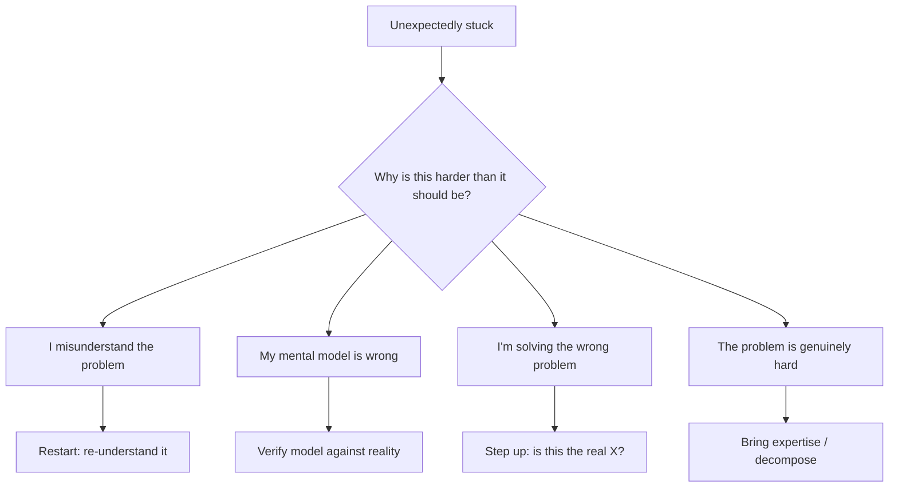

# Techniques When You Are Stuck — Senior

> **What?** At senior level, getting unstuck is a controlled process you run on hard, ambiguous, high-stakes problems where the answer isn't in any doc — and where *being stuck quietly* costs the team real money. You manage your own cognitive state, instrument the struggle, and treat "ask for help" as an engineering decision with a cost/benefit, not an ego event.
>
> **How?** You catch your own thrashing early because you know your personal failure signatures. You pick techniques by the *structure* of the stuck-ness, not by habit. You change altitude and representation fluidly, escalate on a clock, and you make your stuck-points legible to others so the unblock is fast and the lesson sticks.

---

## 1. Know your own thrashing signature

Seniors don't just recognize *thrashing in general* — they recognize *their own*. Everyone has a tell. Learn yours so you catch it in minutes, not hours.

| Personal tell | What it really means |
| --- | --- |
| Tab count climbing past ~15 | You're collecting, not deciding. Tunnel-vision search. |
| Editing without a hypothesis | "Let me try this" with no theory of *why* it'd work → pure guessing. |
| Re-reading the same paragraph 3× | Brain is saturated; you're not absorbing. Step away. |
| Reflexively blaming the framework | Classic *"select isn't broken"* — the bug is in your code. |
| Physical tension, snapping at Slack | Frustration has taken the wheel from reasoning. |

The discipline: **name the transition out loud (or in a notes file) the moment you spot it.** "I'm thrashing — three edits, no hypothesis, frustrated. Stopping." Naming it breaks the spell; an unnamed thrash continues by inertia. This is applied [metacognition](../../10-metacognition-and-learning/02-debugging-your-own-reasoning/) — watching your own process while it runs.

---

## 2. Stuck is information — read it

A senior treats stuck-ness as a *diagnostic signal about the problem itself*, not just an obstacle.

> If a problem is unexpectedly hard, the difficulty is data. Either you misunderstand the problem, your model of the system is wrong, or you're solving the wrong problem.



When something *should* be a 20-minute change and isn't, the surprise itself is the most valuable clue in the room. The senior asks "why is this fighting me?" *before* asking "how do I force it through?" Frequently the answer is that the requirement is contradictory, the abstraction is wrong, or the real problem is upstream of where you're working — and no amount of clever unsticking inside the wrong frame will help. Step up first. (See [understanding the problem](../01-understanding-the-problem/).)

---

## 3. A senior's technique-selection matrix

You stop running techniques in a fixed order and start matching them to the *shape* of the stuck-ness.

| Symptom of the stuck-ness | Sharpest technique | Why |
| --- | --- | --- |
| "It should work but doesn't." | Enumerate & verify assumptions | The lie is in something you're certain about. *select isn't broken.* |
| "I can't even describe it cleanly." | Rubber-duck / write the spec | The fog *is* an incomplete understanding; articulation burns it off. |
| "Too many possible causes." | Minimal repro + binary search | Halve the suspect space per step. |
| "I keep losing the thread in my head." | Change representation (diagram/table) | Externalize state your working memory can't hold. |
| "All my forward paths dead-end." | Work backward from the goal | Many starts, one valid end → prune from the end. |
| "Why won't it succeed?" is stuck. | Invert: "how would I cause this?" | Turns an open 'why' into a checkable suspect list. |
| Frustrated, looping, late in the day. | Incubate (walk / sleep on it) | Focused mode is spent; diffuse mode finds the non-obvious link. |
| Lost in detail / hand-waving. | Change altitude (step up/down) | Wrong zoom level hides the answer. |

The skill isn't knowing these — juniors can list them. It's *correctly reading the symptom* and reaching for the right one in the moment, under deadline pressure, without panic.

---

## 4. Instrument the struggle

Hard problems generate a swamp of failed attempts that blur together — and you start re-trying things you already ruled out (a subtle, common form of thrashing). Seniors keep a running log.

```text
ATTEMPT LOG — flaky 502 under load
14:05  Hypothesis: connection pool exhausted.  Test: raise max to 200.  Result: still 502s. RULED OUT.
14:20  Hypothesis: upstream timeout < ours.    Test: check nginx proxy_read_timeout = 30s, ours 60s.  CONFIRMED mismatch.
14:35  Fix: align timeouts.  Result: 502s → 504s (progress! different error).  New hypothesis: a real slow query.
```

This cheap habit pays for itself three ways:

1. **It stops you re-running ruled-out attempts** — the #1 hidden time-sink in long debugging.
2. **It forces a hypothesis per attempt** — no entry without a "because," which kills blind guessing.
3. **It becomes the body of your help request** and the post-incident writeup. The log *is* the good question, already written.

A change with no hypothesis behind it isn't an experiment, it's a prayer. The log makes prayers impossible to write down without noticing.

---

## 5. Manage your cognitive state on purpose

Senior unsticking is as much about state management as technique.

- **Protect diffuse mode.** Structure hard problems so a wall at 4pm becomes an overnight incubation, not two more frustrated hours. End the day *loaded* (problem fully in your head) and stuck; let sleep consolidate it (Oakley; the Poincaré-on-the-bus pattern). The morning insight is real and bankable.
- **Don't debug angry or exhausted.** A tired, frustrated brain guesses and introduces *new* bugs while chasing the old one. Recognize the state and stop — pushing past it has negative expected value.
- **Vary the focused/diffuse rhythm.** Hard focus, deliberate break, hard focus. The break isn't slacking; it's the half of the cycle where the non-obvious connections form.
- **Separate "stuck on the problem" from "stuck because I'm depleted."** The fix for the second is rest, not technique. Misdiagnosing depletion as a problem-difficulty wastes the evening.

The senior who walks away at 4pm with the problem half-loaded and ships the fix at 9am beats the one who grinds until 7pm, ships a buggy guess, and re-opens it the next day.

---

## 6. Ask for help as a deliberate engineering decision

Seniors don't agonize over whether asking makes them look weak. They run a cost/benefit:

> **Escalate when** the expected cost of staying stuck (your time × rate, the deadline risk, the blast radius) exceeds the value of the learning plus the helper's interruption cost.

For a learning-zone problem on a slack week: struggle longer. For a production incident burning revenue: pull in the expert *now* — heroically grinding solo during an outage is malpractice, not grit.

When you do ask, ask like a senior:

1. **Lead with the goal and your model**, not just the symptom — surface the XY problem before someone else has to.
2. **Bring your attempt log** — every ruled-out path, so the helper starts where you left off.
3. **State a specific question**, not "any ideas?" — "Is there a reason the pool wouldn't release connections on a cancelled context?" invites a precise answer.
4. **Name the suspected area** so they can confirm or redirect fast.

Even now, *writing the good question still solves it half the time* — the senior twist is you've learned to write the question *early*, precisely to trigger that effect on purpose. The artifact is the same one Eric Raymond's *How To Ask Questions The Smart Way* describes: homework done, question sharp, helper's time respected. (More in [carrying out the plan](../03-carrying-out-the-plan/).)

---

## 7. The hardest skill: knowing when to abandon the path

Sometimes you're not stuck *in* the solution — the solution is wrong, and unsticking it is rearranging deck chairs. Seniors are willing to throw away hours of work.

```text
Signal you should abandon, not unstick:
  - Each fix spawns two new problems (you're fighting the design, not a bug).
  - The "clever" part keeps needing more cleverness to hold together.
  - You can't explain the approach simply anymore.
  - A teammate's "why not just…?" makes you defensive — listen to that.
```

Sunk cost is the trap. The two hours are gone whether you continue or restart; the only question is which path is cheaper *from here*. A senior who deletes a morning's work and restarts clean — often with a representation or approach learned *from* the failed attempt — is far more effective than one who can't let go. The failed path usually taught you the constraint that makes the right path obvious; that's the [looking back](../04-looking-back-and-reflecting/) payoff.

---

## 8. Make your stuck-ness legible

A senior's stuck-points shouldn't be invisible. Two reasons:

1. **Faster unblocks.** A visible, well-described block (in the standup, the ticket, the channel) gets help before it festers into a day lost.
2. **Modeling the behavior.** When a senior says "I've been stuck on X for 30 minutes, here's what I've ruled out, anyone seen this?" in public, it gives every junior permission to do the same. Silent suffering is contagious; so is asking well.

This is the bridge to the staff level: you stop optimizing only *your* unsticking and start shaping a team where being stuck is surfaced early and unblocked fast — covered in [professional](./professional.md).

---

## 9. Senior anti-patterns

- **Hero grinding.** Solo-grinding a production incident to prove toughness, while the fix is one Slack message away. Optimize for resolution, not optics.
- **Hypothesis-free editing.** Long sessions of "try this, try that" with no theory. Every change must answer a "because."
- **Re-running ruled-out attempts.** Without a log, you'll re-test the dead end you abandoned an hour ago. Instrument the struggle.
- **Sunk-cost loyalty.** Refusing to abandon a doomed approach because you've "already put in so much."
- **Ignoring your own state.** Debugging while exhausted or furious, introducing new bugs. Rest is a technique.
- **Invisible blocking.** Staying quietly stuck so the standup says "still working on it" three days running. Make it legible.

---

## Where this leads

Everything here scales: at the staff/principal level the question becomes *how do I unblock a stuck **team**, break **analysis paralysis** at org scale, and build a **culture** where asking for help early is safe* — see [professional](./professional.md). The deeper you go, the more "getting unstuck" stops being a personal trick and becomes a leverage point you apply to whole systems and groups.

---
## Check your understanding

Try to answer these questions from memory:

1. "Change the representation" — what does that mean concretely?
2. What is "working backward," and when is it the right move?
3. How does inversion help when you're stuck?
4. You're leading a team that's been stuck on a technical decision for three weeks. What do you do?
