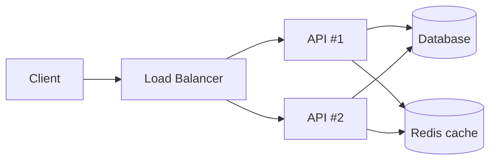

# Parts, Whole, and Emergence — Junior

> **What?** A *system* is a set of elements (components) connected by interconnections (interactions) toward some purpose. The behavior you care about — throughput, latency, reliability — belongs to the *whole*, not to any single part. That whole-only behavior is called **emergence**.
> **How?** When something goes wrong, stop staring at the one box that looks broken. Ask which *interaction* between boxes produced the behavior. Look at the wiring, not just the components.

---

## 1. What a system actually is

Donella Meadows, in *Thinking in Systems*, gives the cleanest definition:

> A system is an interconnected set of **elements** that is coherently organized in a way that achieves something — its **purpose** (or **function**).

Three ingredients:

| Ingredient | Example in a web backend |
|---|---|
| **Elements** | API service, database, cache, load balancer, message queue |
| **Interconnections** | HTTP calls, SQL queries, cache lookups, retries, timeouts |
| **Purpose / function** | "Serve user requests in under 200ms, 99.9% of the time" |

The trap for new engineers is to see only the first column. You learn one service, one database, one library — boxes. But the *system* is mostly the second and third columns. Change the interconnections (add a retry, shorten a timeout, add a cache) and the behavior changes completely, even though every box is the same.

### A worked mental picture



Every arrow is an interconnection. Most of what you will debug in your career lives *on the arrows*: a slow query, a retry that hammers the DB, a cache miss storm. Almost nothing interesting lives purely inside a single box.

---

## 2. The whole is more than the sum of its parts

This is the headline idea of systems thinking. The whole has properties that **no part has on its own**. Some examples you will meet quickly:

- **Throughput** — how many requests/second the system handles. No single line of code "has" throughput. It emerges from how requests, threads, connections, and the database interact.
- **Latency under load** — your endpoint is fast when you test it alone. Under 10,000 concurrent users it crawls. The slowness was never *in* the handler; it emerged when the parts competed for shared resources (CPU, connection pool, locks).
- **Deadlock** — two transactions each hold a lock the other needs. Neither transaction is "buggy" on its own. The deadlock is a property of their *interaction*.

> **Emergence** = behavior of the whole that you cannot find by inspecting any single part.

### Why this matters on day one

You will be tempted to fix bugs by finding "the broken component." Sometimes that works. But the nastiest production incidents have **no broken component** — every service is doing exactly what it was told, and the system as a whole still falls over. If you only know how to look for a broken box, those incidents will be invisible to you.

---

## 3. You can't understand a system by studying parts alone

The classic engineering instinct is **reductionism**: break the system into parts, understand each part, and you understand the whole. This works for a *car engine*. It fails for a *traffic jam*.

A traffic jam is emergent. No single car is "the jam." It appears from the interaction of many cars, each braking slightly in response to the one ahead. You can inspect any individual car forever — perfect brakes, sober driver — and never explain the jam.

Distributed systems are full of traffic jams:

```text
You: "The orders service is slow, let me profile it."
Profiler: "99% of time spent waiting on a downstream call. Code is fine."
Reality: every instance is retrying a flaky payment service, the retries
         are multiplying the load, and the whole thing is in a retry storm.
```

A profiler on **one** service shows you that service is *waiting* — but never shows you the feedback loop across services that created the wait. The cause is an interaction, not a component.

---

## 4. Where the bugs actually live: interfaces, not components

Junior engineers over-index on component code: "Is my function correct?" Senior engineers know that most production behavior — and most production *bugs* — live at the **interfaces** between components:

- Mismatched timeouts (caller waits 30s, callee gives up at 5s, caller retries → load doubles).
- A queue with no backpressure (producer faster than consumer → unbounded memory growth → OOM).
- Two services with different ideas of what "retry-safe" means → duplicate charges.

None of these is a bug *inside* a function. They are bugs *between* functions. When you review code or debug an incident, train yourself to ask:

> "What happens at the boundary? What does each side assume the other does?"

---

## 5. The system boundary is a choice you make

When you analyze a system, you draw a line: *this* is inside, *that* is outside. That line is not given by nature — **you choose it**, and the choice changes your conclusions.

Example: "Our checkout is slow." Where's the boundary?

- Boundary = your service only → "My code is fast, not my problem."
- Boundary = your service + the database → "The query is slow, index it."
- Boundary = your service + DB + the third-party tax API → "The tax API times out under load, and our retry makes it worse."

Same incident, three different "answers," purely because you drew the boundary in three different places. Drawing it too small is the single most common rookie mistake: you declare victory inside your box while the system keeps failing.

---

## 6. The map is not the territory

Your architecture diagram is a **map**. It shows boxes and arrows. It does *not* show:

- The retry storm that appears at 3am under load.
- The feedback loop where a slow DB causes timeouts that cause retries that cause a slower DB.
- The actual latencies, queue depths, and lock contention.

The diagram is true and useful — and it omits exactly the emergent behavior that will page you. "The map is not the territory" means: never confuse the clean diagram with the messy running system. When the system misbehaves in a way your diagram can't explain, that's not a paradox — that's emergence, and the diagram simply didn't have room for it.

---

## 7. Practical habits to start now

1. **When debugging, name the interaction, not just the component.** "The DB is slow" is half an answer. "The DB is slow *because* every API retry triples the query load" is a systems answer.
2. **Read the arrows in any diagram first.** Timeouts, retries, queue sizes, and connection limits explain more incidents than any single service's internals.
3. **Test under load, not just in isolation.** Latency-under-load is emergent; a unit test will never show it to you.
4. **Widen the boundary before declaring "not my problem."** The problem is often one box outside the line you first drew.

---

## 8. Where this goes next

This is the foundation of the whole [systems-thinking](../) section. The specific *mechanisms* of emergence get their own topics:

- The interactions that create emergence are usually **loops** → [Feedback Loops](../02-feedback-loops/).
- Fixes that work locally but break the whole later → [Second-Order Effects](../03-second-order-effects/).
- How to picture a system well enough to reason about it → [Mental Models of Systems](../04-mental-models-of-systems/).

Back to the [engineering-thinking roadmap](../../README.md).

---

### Takeaways

- A system = **elements + interconnections + purpose** (Meadows).
- **Emergence**: the whole has properties (throughput, latency-under-load, deadlock) that no part has.
- Reductionism — studying parts alone — misses emergent behavior; a profiler on one service won't reveal a cross-service retry storm.
- Most behavior and most bugs live at the **interfaces**, not inside components.
- The **boundary** you draw is a choice that changes your answer.
- The **diagram is not the system**; it omits the emergent behavior that pages you.

---
## Recall and apply

**Practice loop:** Map one system's parts, interactions, and whole-system behavior; identify one property no component owns alone.

Use these prompts to check your understanding and choose one action to try in your next task.

Try to answer these questions from memory:

1. Define a system in the systems-thinking sense.
2. What is emergence? Give a concrete distributed-systems example.
3. Why can't a profiler on a single service reveal a retry storm?
