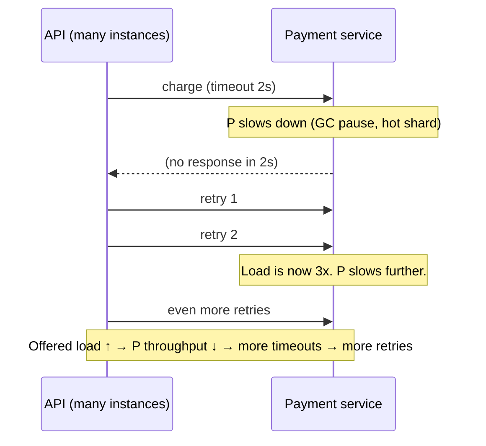
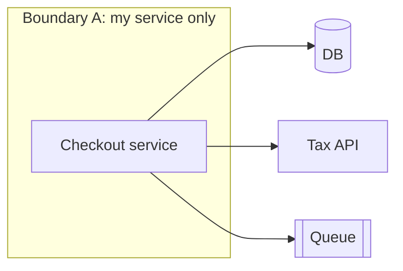

# Parts, Whole, and Emergence — Middle

> **What?** Emergence is the rule that a system's most important behaviors — throughput, tail latency, reliability, and its failure modes — are produced by the *interactions* of components, not by the components themselves. They cannot be derived from, or located in, any single part.
> **How?** You design and debug at the level of interactions: you reason about how timeouts, retries, queues, and shared resources compose, and you distinguish a *component fault* (one box broke) from an *emergent fault* (every box is healthy and the system still falls over).

---

## 1. Restating the system, precisely

A system is **elements + interconnections + a purpose**. As an engineer you spend most of your time on the second term. To make this concrete, classify everything in a running service:

| Layer | Examples | Where behavior comes from |
|---|---|---|
| Elements | services, DBs, caches, brokers, threads, goroutines | local correctness |
| Interconnections | RPC, retries, timeouts, queues, locks, connection pools | **emergent behavior** |
| Purpose | the SLO / the contract the system must honor | what "correct whole" even means |

The purpose matters more than juniors expect, because of Stafford Beer's principle, **POSIWID — "the purpose of a system is what it does."** Not what the design doc claims; what the running system actually produces. If your "high-availability" cluster reliably amplifies small faults into full outages, then *amplifying faults* is part of what the system does, regardless of intent. Systems thinking forces you to judge the system by its emergent behavior, not its README.

---

## 2. A taxonomy of emergent properties

It helps to know which of the things you measure are emergent (whole-only) versus local (per-component).

| Property | Local or emergent? | Why |
|---|---|---|
| Function correctness | Local | Lives in one component's code |
| Memory usage of a process | Local | Belongs to that process |
| **Throughput** (req/s) | Emergent | Depends on how requests, threads, pools, and the DB interact |
| **Tail latency (p99) under load** | Emergent | Appears only when parts contend for shared resources |
| **Reliability / availability** | Emergent | A function of redundancy *and* failure correlation across parts |
| **Deadlock** | Emergent | A property of an interaction between lock holders |
| **Thundering herd** | Emergent | Many clients reacting to one event simultaneously |
| **Congestion collapse** | Emergent | Throughput → 0 as offered load rises, due to retransmissions |

A useful heuristic: *if you can fix it by editing one file, it was probably local. If fixing it requires changing how two or more components interact, it was emergent.*

---

## 3. The limit of reductionism (and the profiler trap)

Reductionism — understand each part, sum up — is the default engineering method, and it's *right* for a huge class of problems. It breaks for emergent behavior. The canonical demonstration is the **retry storm**.

Now profile the API service in isolation. The profiler says: *"99% of time is spent awaiting the payment call."* True, and useless. The flame graph cannot show you that the API's *own retries* are the thing keeping payment slow. The cause is a **feedback loop spanning two services** — pure interaction, invisible to any single-component tool.

The lesson is not "profilers are bad." It's: a tool scoped to one component can only ever measure local properties. To see an emergent property you need a tool scoped to the *interaction* — distributed tracing, correlated dashboards, request-flow analysis across the boundary.

---

## 4. Local optima ≠ global optimum

Each team optimizes its own component. The frightening result of systems thinking: **a system where every part is locally optimal is often globally bad.**

A concrete chain:

1. The client team adds **aggressive retries** — locally smart, hides transient blips, improves *their* success rate.
2. The API team adds a **short timeout** — locally smart, frees threads faster, improves *their* latency.
3. The DB team adds **connection limits** — locally smart, protects the DB from overload.

Each decision is defensible in isolation. Composed, they produce a textbook outage: a brief DB slowdown trips the short timeouts, which trigger the aggressive retries, which exhaust the connection limit, which makes *everything* time out — a self-sustaining storm that no single team "caused." Every local optimum was real; the global outcome was catastrophic.

This is the bridge to [Thinking in Tradeoffs](../05-thinking-in-tradeoffs/): optimizing a part is only meaningful relative to the whole, and the whole's optimum almost never decomposes into independent per-part optima.

---

## 5. The system boundary is a modeling choice

Where you draw the boundary determines what you can even *see*.

- Boundary A (just the service): you'll conclude the code is fine.
- Boundary B (+ DB + queue): you'll see the queue backing up and the DB locks.
- Boundary C (+ the third-party tax API + the *clients*): you'll finally see that a tax-API slowdown plus client retries is the real failure mode.

Drawing the boundary too narrow is how teams ship "it's not us" while the system is on fire. Drawing it too wide makes analysis intractable. The skill is choosing a boundary big enough to *contain the loop you care about* and no bigger. A good rule: **the boundary must include every element in the feedback path of the behavior you're investigating.**

---

## 6. Emergent failure modes you must recognize

These have names because they recur. None has a single "cause" component.

### Cascading failure
One overloaded node sheds load onto its neighbors, overloading them in turn. The failure propagates along the dependency graph. The first node didn't "cause" the outage any more than the first domino causes the pattern.

### Thundering herd
A cache key expires (or a service restarts) and thousands of clients simultaneously rush the origin. The synchronization is the problem. Fix is at the interaction level — request coalescing, jittered expiry — not in any one client.

### Congestion collapse
Classic from TCP networking: as offered load rises past capacity, retransmissions pile up, and *useful* throughput collapses toward zero. More load → less work done. The system's throughput curve bends backward — an emergent property of the retransmit loop, which is exactly why TCP needs congestion control as a system-level mechanism.

### Metastable failure
The system has a stable healthy state *and* a stable failed state. A trigger (a brief spike) pushes it into the failed state, and a **sustaining feedback loop** (e.g. retries) keeps it there even after the trigger is gone. Removing the original trigger does *not* recover the system — you must break the sustaining loop (shed load, disable retries) to escape. Bronson et al., *Metastable Failures in Distributed Systems* (HotOS '21), formalized this and it explains a frustrating class of incidents where "we fixed the thing that broke and it stayed down."

---

## 7. Designing *for* good emergence

You don't only suffer emergence; you can engineer for it. The properties you want (resilience, graceful degradation) are themselves emergent, so you provoke them with interaction-level mechanisms:

| Goal | Interaction-level mechanism | Emergent property it produces |
|---|---|---|
| Stop retry storms | Retry budgets, exponential backoff **with jitter**, circuit breakers | Bounded amplification |
| Stop cascades | Bulkheads, load shedding, per-dependency timeouts | Failure isolation |
| Stop thundering herds | Request coalescing, jittered TTLs | Smoothed origin load |
| Escape metastable states | Shed load, drop retries during overload | Recoverability |

Notice every mechanism lives on an *arrow*, not in a box. That is the through-line of this whole topic.

---

## 8. Practice: read the system, not the parts

- In every incident review, write one sentence of the form *"X interacting with Y under condition Z produced behavior B."* If you can't, you haven't found the systemic cause yet.
- When you read an architecture diagram, annotate the arrows with timeout, retry policy, and queue depth. The annotations predict failures the boxes never will.
- Before optimizing a component, ask what the *whole* does when that component gets faster. Sometimes a faster component just pushes the bottleneck downstream and makes a cascade easier to trigger.

---

## 9. Where this goes next

- The loops behind every emergent behavior here → [Feedback Loops](../02-feedback-loops/).
- The delayed consequences of local fixes → [Second-Order Effects](../03-second-order-effects/).
- Picturing systems to reason about them → [Mental Models of Systems](../04-mental-models-of-systems/).
- Where a small change moves the whole system → [Leverage Points and Bottlenecks](../06-leverage-points-and-bottlenecks/).
- Treating emergent failure as risk → [Risk and Failure Probabilities](../../06-probabilistic-thinking/03-risk-and-failure-probabilities/).

Back to the [engineering-thinking roadmap](../../README.md).

---

### Takeaways

- Emergent properties (throughput, tail latency, reliability, deadlock, thundering herd, congestion collapse) live in interactions, not components.
- A single-component tool measures local properties only; a retry storm is invisible to a single-service profiler.
- **Local optima compose into a global pessimum** — every team optimal, the system still falls over.
- The **boundary** must contain the whole feedback path of the behavior you're studying.
- Learn the named emergent failure modes — cascade, thundering herd, congestion collapse, **metastable** — because none has a single causal component.
- Engineer for good emergence with interaction-level mechanisms (backoff+jitter, bulkheads, load shedding).

---
## Check your understanding

Try to answer these questions from memory:

1. What's the limit of reductionism for distributed systems?
2. Explain local optima vs global optima with a failure example.
3. "The system boundary is a choice." What does that mean and why does it matter?
4. Where do most production bugs actually live, and why?
