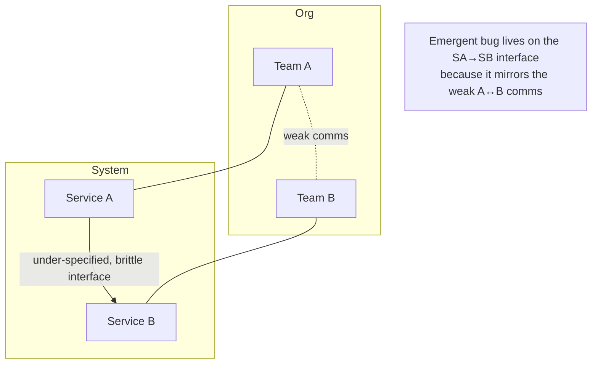

# Parts, Whole, and Emergence — Professional

> **What?** At staff/principal scale the unit of analysis is a **system-of-systems**: many independently-evolving platforms, teams, and operational processes whose coupling produces organization-level emergent properties — platform reliability, incident dynamics, even delivery velocity. These are irreducible to any service or team, and they are *socio-technical*: software and the humans operating it form one coupled system.
> **How?** You design, govern, and evolve the *interaction structure* of the whole platform so that the properties you want (resilience, recoverability, safe change) emerge by default; you reason about emergence across technical, operational, and organizational boundaries simultaneously; and you steer the system by changing couplings, ownership, and constraints rather than by tuning components.

---

## 1. The system-of-systems frame

A single service has elements, interconnections, and a purpose. A *platform* is a system whose elements are themselves systems — payments, identity, the data lake, the CI/CD pipeline, the on-call rotation, the incident-management process. The interconnections are APIs, shared infrastructure, shared dependencies, deploy pipelines, *and* human communication paths. The emergent properties at this scale are the ones executives ask about:

- **Platform availability** — emergent from the *correlation structure* of failures across services, not from any single service's uptime.
- **Blast radius** — emergent from coupling topology; a property of how failure propagates, owned by no component.
- **Change safety** — emergent from the deploy pipeline, test coverage, rollback mechanics, and review culture acting together.
- **Mean time to recovery** — emergent from observability, runbooks, on-call structure, and the architecture's recoverability, jointly.
- **Delivery velocity** — emergent from team topology and dependency structure (Conway again), not from how fast individuals type.

The staff/principal job is to make these *whole-system* properties good. You cannot do it component by component, because none of them lives in a component. This is the deepest practical consequence of "the whole is more than the sum of its parts": at scale, almost everything that matters is emergent.

---

## 2. POSIWID as a governance instrument

Stafford Beer's **"the purpose of a system is what it does"** is, at this level, a management tool, not a koan. Every large platform has a stated purpose (the strategy deck) and a *revealed* purpose (its emergent behavior). When they diverge, the revealed purpose is the truth and the cause of your incidents.

Examples of revealed-vs-stated purpose:

| Stated purpose | Revealed (emergent) behavior | What POSIWID tells you |
|---|---|---|
| "Highly available, multi-AZ" | a single regional control-plane dependency takes everything down quarterly | The system's purpose includes "convert control-plane blips into total outages." Fix the coupling, not the messaging. |
| "Independent microservices" | one shared library/version bump requires lock-step deploys | The system's purpose is "coordinate 40 teams synchronously." Conway/ownership problem. |
| "Fast, safe deploys" | every Friday freeze because rollbacks are scary | The system's purpose is "discourage change." The emergent property is fragility, not speed. |

The principal move is to read the platform's *actual* emergent behavior dispassionately and design against it, instead of defending the architecture's intent. This is uncomfortable because it often indicts decisions you or your peers made — which is exactly why it's a senior-leadership skill.

---

## 3. Socio-technical emergence and the inverse Conway maneuver

Conway's law is not a metaphor at this scale; it's a load-bearing design constraint. The communication structure of the org *is* the coupling structure of the system, so:

- **You cannot ship an architecture your org structure can't sustain.** Two teams that must coordinate on every release will produce a system that requires coordinated releases, no matter how cleanly you draw the service boundaries.
- **The most expensive emergent failures sit on org boundaries.** An incident "owned by no one" is an incident whose feedback loop crosses a team boundary, so no single team can perceive the whole loop. Whole-system observability is partly an *org* problem.

The **inverse Conway maneuver** — deliberately shaping team boundaries to produce the architecture you want — is therefore a leverage point (see [Leverage Points and Bottlenecks](../06-leverage-points-and-bottlenecks/)). Reorganizing ownership can fix a recurring class of technical incidents that no amount of component work would touch, because the *coupling* was organizational. Team Topologies' "stream-aligned teams + platform team + well-defined interaction modes" is, in systems terms, a prescription for *good emergent delivery dynamics* by constraining the communication graph.

---

## 4. Designing for emergent properties

You don't get resilience by writing resilient code; you get it by structuring interactions so resilience *emerges*. The principal designs the **interaction substrate** so good properties are the default and bad ones require effort to create.

| Desired emergent property | Structural mechanism (on the couplings) | What it prevents |
|---|---|---|
| Bounded blast radius | cells / shards / partitions; failure-domain isolation | platform-wide cascades |
| Resilience to dependency faults | mandatory bulkheads, circuit breakers, sane defaults in the *platform's RPC layer* | per-team reinvented (and broken) retries |
| Recoverability (escape metastability) | platform-wide load shedding / admission control; standardized kill-switches | fleet-wide metastable lock-ups |
| Anti-amplification | org-wide retry budgets, hedging caps, backoff+jitter **as library defaults** | retry storms |
| Change safety | progressive delivery, automatic rollback, canary analysis in the shared pipeline | correlated bad-deploy outages |
| Failure independence | spread across failure domains; audit *shared* dependencies (config, DNS, auth, control plane) | "redundant" replicas failing together |

The recurring principle: **encode the good interaction in the platform so individual teams inherit it without thinking.** A retry budget that lives in the shared client library protects the whole system; a retry policy left to each team guarantees an eventual storm. You are engineering the *defaults of the coupling*, because the coupling is where emergence comes from.

---

## 5. Failure-independence: the most-overlooked emergent property

Availability math like "three 99.9% replicas → 99.9999%" assumes **independence**. At platform scale, independence is the exception, and its absence is invisible on every architecture diagram. The principal's job is to hunt correlated failure couplings:

- **Shared control plane** — service discovery, config distribution, secrets, DNS, the cloud provider's regional API. When it hiccups, *all* "independent" services degrade together.
- **Correlated deploys** — a bad shared base image or library rolled to the whole fleet is a single fault with platform-wide blast radius masquerading as N independent components.
- **Correlated saturation** — many "independent" services hitting one downstream (a database, an auth service) couple through that shared bottleneck under load.
- **Correlated triggers** — the same midnight cron, the same cache-expiry boundary, the same traffic pattern hits everything at once (thundering herd at platform scale).

Each of these turns *paper redundancy* into *real single points of failure*. Availability is emergent from the **joint distribution** of failures, not the marginal uptimes. Treat correlation hunting as a first-class reliability discipline; connect it to [Risk and Failure Probabilities](../../06-probabilistic-thinking/03-risk-and-failure-probabilities/) for the quantitative side.

---

## 6. Metastability at fleet scale

The metastable model (trigger + sustaining loop, two basins; removing the trigger doesn't recover you) becomes an *organizational* hazard at platform scale, because the sustaining loops cross service and team boundaries:

- A regional blip (trigger) cold-flushes caches across dozens of services; the cold caches (sustaining loop) keep the database overloaded long after the blip ends — and no single team can break the loop because it spans them all.
- A deploy (trigger) bumps latency; retries across the dependency graph (sustaining loop) amplify load until the whole platform is in the failed basin; rolling back the deploy doesn't recover it.

Principal-level defenses are *platform-wide*, because the failure is platform-wide:

1. **A global load-shedding / admission-control tier** that engages automatically — the only reliable way to break sustaining loops mid-incident across many services.
2. **Pre-authorized "break-glass" controls** to disable retries, drop queues, serve stale, and shed traffic *without* a debate during the outage. (The debate itself is a sustaining loop in the human system.)
3. **Game days that deliberately induce metastability** so the org practices breaking sustaining loops, not just restarting boxes. You cannot learn loop-breaking for the first time during a real fleet-wide incident.

The socio-technical twist: the human incident-response process is *itself* a system that can go metastable — confusion sustains confusion, paging fatigue sustains slow response. Design the *operational* couplings (clear incident command, predefined break-glass authority) so the human system has a healthy attractor too.

---

## 7. The map is not the territory — at organizational scale

Every model the org runs on is a map: the architecture diagram, the service catalog, the SLO dashboard, the org chart, the strategy deck. Each omits the dynamics that produce the outcomes leaders are accountable for. Principal-level discipline is to *institutionalize humility about the maps*:

- **Architecture diagrams** omit feedback, correlation, and metastability → require dynamics review (annotated arrows, failure-mode analysis) in design governance.
- **The org chart** omits the real communication graph → the *informal* graph is the true Conway input; measure it (who actually talks) rather than trusting the boxes.
- **SLO dashboards** report marginal uptimes → they hide correlated failure; a green dashboard can sit atop a system one shared-dependency-blip from total outage.
- **The roadmap** treats features as independent → second- and third-order interactions between them are emergent and unbudgeted (see [Second-Order Effects](../03-second-order-effects/)).

The corrective is not "better maps" — every map omits the territory by definition. It's building organizational *practices* that keep contact with the territory: game days, chaos engineering, real load tests of the *coupling*, blameless postmortems that name the coupling rather than a component, and a standing skepticism toward any availability number derived from assumed independence.

---

## 8. Steering the whole: leverage, not tuning

The throughline of staff/principal systems thinking: you change the system's emergent behavior by changing **structure, couplings, constraints, and information flows** — not by tuning components. Meadows' leverage-point hierarchy (paradigms > goals > rules > information flows > feedback structure > parameters, in roughly that order of power) maps directly onto platform work:

- Tuning a component's parameter = low leverage (a timeout value).
- Changing a feedback structure = high leverage (introducing global load shedding; mandating retry budgets in the shared client).
- Changing the goal/rule = higher (making "no naked retries" an enforced platform policy; tying SLOs to error budgets that gate deploys).
- Changing the paradigm = highest (shifting the org from "components must not fail" to "the system must degrade gracefully when components fail").

This is developed fully in [Leverage Points and Bottlenecks](../06-leverage-points-and-bottlenecks/); the point here is that *because the properties you care about are emergent, the only durable interventions are at the level of the coupling, never the component.*

---

## 9. Operating playbook (staff/principal)

1. **Govern couplings, not just components.** Review the *interaction substrate* (RPC defaults, deploy pipeline, shared dependencies) as the highest-leverage code in the company.
2. **Hunt failure correlation continuously.** Maintain a living inventory of shared dependencies and correlated triggers; treat "assumed independence" as a defect.
3. **Make good emergence the default.** Backoff+jitter, retry budgets, bulkheads, load shedding live in the platform, inherited for free.
4. **Pre-authorize loop-breaking.** Break-glass controls and incident command defined *before* incidents, because the failed basin is no place to invent them.
5. **Read POSIWID honestly.** Judge the platform by what it emergently does; design against the revealed purpose, not the stated one.
6. **Use Conway deliberately.** Shape team boundaries to produce the architecture and the delivery dynamics you want; treat un-owned incidents as org-boundary signals.
7. **Keep contact with the territory.** Game days, chaos, real coupling load-tests, coupling-naming postmortems — institutional defenses against map-worship.

---

## 10. Where this goes next

- The feedback dynamics underlying every platform-scale emergent property → [Feedback Loops](../02-feedback-loops/).
- Roadmaps, fixes, and policies whose consequences emerge later → [Second-Order Effects](../03-second-order-effects/).
- Formal lenses for reasoning about whole-system dynamics → [Mental Models of Systems](../04-mental-models-of-systems/).
- Optimizing the platform, not its parts → [Thinking in Tradeoffs](../05-thinking-in-tradeoffs/).
- Where to intervene to move the whole org-and-system → [Leverage Points and Bottlenecks](../06-leverage-points-and-bottlenecks/).
- Quantifying correlated, emergent failure → [Risk and Failure Probabilities](../../06-probabilistic-thinking/03-risk-and-failure-probabilities/).

Back to the [engineering-thinking roadmap](../../README.md).

---

### Takeaways

- At scale the unit is a **system-of-systems**; the properties leaders care about (availability, blast radius, change safety, MTTR, velocity) are all emergent and owned by no component.
- **POSIWID** is a governance tool: design against the platform's *revealed* emergent behavior, not its stated intent.
- Emergence is **socio-technical** (Conway); shape team/ownership boundaries to produce the architecture and delivery dynamics you want — un-owned incidents flag org-boundary loops.
- Engineer good properties into the **interaction substrate** so teams inherit resilience, anti-amplification, and recoverability by default.
- **Failure independence is the exception**; hunt correlated dependencies and triggers — paper redundancy is a claim, not a fact.
- Fleet-scale **metastability** needs platform-wide load shedding and pre-authorized loop-breaking; the human incident process can go metastable too — design its couplings.
- You steer emergent behavior by changing **couplings, constraints, and information flows** (high leverage), never by tuning components (low leverage).

---
## Recall and apply

**Practice loop:** Map one system's parts, interactions, and whole-system behavior; identify one property no component owns alone.

Try to answer these questions from memory:

1. Connect Conway's law to emergence.
2. Walk through how you'd debug "the database is slow" using systems thinking.
3. Name three emergent failure modes and the interaction-level fix for each.
4. How do you design *for* a good emergent property like resilience?
