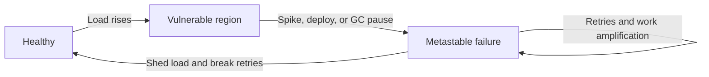

# Parts, Whole, and Emergence — Senior

> **What?** Emergence is the formal claim that a distributed system occupies a *state space* whose dynamics are determined by the coupling between components, not by the components in isolation. The properties an organization cares about — availability, tail latency, recoverability — are attractors and instabilities of that coupled system, irreducible to any subsystem.
> **How?** You design, review, and run incidents at the level of the *interaction graph and its dynamics*: you map feedback paths, identify amplifying couplings before they ship, reason about whether a failure mode is component-local or system-metastable, and you choose the system boundary deliberately to contain the loop you're accountable for.

---

## 1. From "more than the sum" to a usable model

"The whole is more than the sum of its parts" is a slogan until you make it operational. As a senior engineer, the operational version is:

> The system has a **state space**. Components contribute *dimensions*; interconnections contribute the *coupling* (the equations of motion). Emergent properties are features of the trajectory — equilibria, oscillations, instabilities — that exist only because of the coupling.

This reframing pays off immediately:

- An **emergent property** is a feature of the trajectory (e.g. "throughput collapses past 80% load"), not a property of a coordinate.
- A **failure mode** is a region of state space the system can enter and the dynamics that govern entry/exit.
- **Resilience** is the size of the basin of attraction around the healthy equilibrium — how big a shock the system absorbs before it slides toward a failed attractor.

You don't need differential equations to use this. You need to consistently ask: *what are the couplings, and what does the coupled system do that no component does?*

---

## 2. Why reductionism provably can't reach emergence here

Reductionism assumes **separability**: the behavior of the whole is a (linear) composition of the behaviors of the parts. Distributed systems violate separability in three structural ways:

1. **Shared resources** create coupling that doesn't appear in any component's spec. Two independent services sharing one connection pool are not independent; their *latencies become correlated* under load. The correlation is real, load-bearing, and absent from both components' documentation.
2. **Feedback** makes the system non-linear. Retries, autoscaling, circuit breakers, and load balancers all read the system's state and act on it. Output feeds back to input. A composition of feedback elements has behaviors (oscillation, hysteresis, multiple equilibria) that none of the elements have.
3. **Delays** turn benign feedback into instability. A control loop that would be stable instantly becomes oscillatory or divergent once you add the propagation, queueing, and detection delays that every real distributed system has.

This is why a per-component profiler is epistemically incapable of revealing a retry storm: the storm is a property of the *closed loop* (API ⇄ payment ⇄ retries), and the profiler has, by construction, opened the loop to look at one element. You cannot reconstruct a closed-loop instability from open-loop measurements of its parts. The right instruments are loop-scoped: distributed tracing, cross-service correlation, and time-series of *coupling* quantities (queue depth, retry rate, pool saturation), not of component internals.

---

## 3. Local optima vs global optima, with the org dimension

The middle-level version of this (each team locally optimal → globally pessimal) deepens at the senior level because **the coupling is socio-technical**, not just technical.

### Technical local optima

Each subsystem hill-climbs its own metric. The composition lands on no one's hill. The retry/timeout/connection-limit storm from the middle file is the canonical example: three locally-correct gradient steps, one global cliff.

### Conway coupling

> "Organizations design systems that mirror their own communication structure." — Melvin Conway, 1968.

The *interaction graph of the software* tends to match the *interaction graph of the org*. This means emergent technical failures often have an emergent *organizational* twin:

- Two teams that don't talk produce two services with a brittle, under-specified interface — and the bug lives exactly on that interface, because no one owns it.
- An incident with no clear owner ("every service is healthy") is frequently an incident whose *coupling* spans an org boundary, so no single team can see the whole loop. The technical boundary and the org boundary are the same line, and that line is where emergence hides.

So a senior systems analysis is incomplete if it stops at the service graph. The failure to *coordinate the optimization* is itself an emergent property of the org's communication structure. Reorganizing the boundary (inverse Conway maneuver) is sometimes the highest-leverage fix for a class of technical incidents — which connects directly to [Leverage Points and Bottlenecks](../06-leverage-points-and-bottlenecks/).

---

## 4. The boundary is a choice — and the choice has accountability

Where you draw the boundary determines what counts as "the system," what you measure, and crucially *who is responsible*. Senior engineers draw it deliberately and defend the choice.

| Boundary choice | What becomes visible | What stays invisible | Risk of this choice |
|---|---|---|---|
| Single service | local correctness, CPU, GC | cross-service loops | "not my problem" false-clean |
| Service + immediate deps | timeouts, pool saturation | client behavior, 3rd parties | misattributes cause downstream |
| Full request path incl. clients & 3rd parties | retry storms, herds, cascades | (tractable to reason; hard to instrument) | analysis cost, ownership disputes |
| Path + the org that operates it | Conway effects, runbook gaps, on-call coupling | (very wide) | hard to act on without authority |

The discipline: **the boundary must enclose every element in the feedback path of the behavior you are accountable for, and the org units that can act on that path.** Too narrow and you ship a locally-true, globally-false conclusion. Too wide and you can't act. Choosing the boundary *is* the analysis, not a preamble to it.

POSIWID applies here as a forcing function: judge each candidate boundary by whether it lets you see *what the system actually does*, not what its design claims. A boundary that hides the amplifying loop is the wrong boundary, however clean it looks on the wiki.

---

## 5. Metastability: the senior failure model

Most engineers reason about failure as *fault → outage → fix fault → recovery*. That model is wrong for the hardest incidents, which are **metastable** (Bronson et al., *Metastable Failures in Distributed Systems*, HotOS 2021).

A metastable system has (at least) two stable states:

Two ingredients define it:

1. A **trigger** pushes the system out of the healthy basin (a brief latency spike, a deploy, a dependency blip).
2. A **sustaining feedback loop** holds it in the failed basin even after the trigger is gone. Common engines: retries (load amplifies the very slowness that causes retries), cold caches (the failure flushes the cache, the cold cache sustains the failure), and queue buildup (backlog adds latency that adds backlog).

The senior insight: **removing the trigger does not recover the system.** Teams roll back the deploy, the spike passes — and the system stays down, because the sustaining loop is now self-feeding. Recovery requires *breaking the loop*: shed load, disable retries, drop the queue, serve stale, or — counterintuitively — turn off a chunk of traffic so caches can refill. This is why "have you tried turning it off and on again" sometimes works on a whole fleet: it forcibly resets the loop.

Designing against metastability means building **load-amplification guards** in *before* you need them: bounded retry budgets, request hedging caps, admission control / load shedding that engages automatically, and an explicit "panic mode" that breaks sustaining loops. You cannot add these mid-incident; the system is already in the failed basin.

---

## 6. Recognizing the named emergent failure modes in the wild

| Mode | The coupling that creates it | The tell in telemetry | The interaction-level fix |
|---|---|---|---|
| **Cascading failure** | shared dependency / load redistribution | failures propagating along the dep graph, fanning out | bulkheads, circuit breakers, isolation pools |
| **Retry storm** | client retries on a slow dependency | retry-rate ↑ while success-rate ↓; load = N× baseline | retry budgets, backoff+jitter, hedging caps |
| **Thundering herd** | synchronized client reaction to one event | origin QPS spike at a TTL boundary or restart | request coalescing, jittered TTLs, soft TTL + async refresh |
| **Congestion collapse** | retransmission under overload | throughput *decreases* as offered load increases | congestion control, load shedding, AIMD-style backoff |
| **Metastable failure** | trigger + sustaining loop, two basins | stays down after trigger removed; recovers only on load drop | admission control, kill-switch for the loop, drain+refill |

The unifying diagnostic question for all of them: *"Is the system's output making its own input worse?"* If yes, you have a positive feedback loop and an emergent failure, and the fix is on the arrow, not the box.

---

## 7. The map is not the territory — at senior scale

Your C4 diagram, your service catalog, your dependency graph: all maps. They are necessary and they systematically omit the territory's most important features — the dynamics. Two failure modes of map-worship a senior must guard against:

- **Believing the redundancy on the diagram is the redundancy in reality.** Two replicas drawn as independent may share a rack, a pool, a config server, or a correlated failure trigger (the same deploy hits both). Availability is emergent from *failure correlation*, which the diagram doesn't show. "3 nines because we have 3 replicas" is a map statement; the territory has correlated faults.
- **Believing a clean diagram implies clean dynamics.** A perfectly modular, beautifully decoupled architecture can still go metastable. Decoupling on the *structure* diagram says nothing about coupling in the *dynamics* (shared pools, retries, herds). Architecture review must include a dynamics review.

The corrective practice: pair every architecture diagram with a **failure-mode and feedback annotation** — for each arrow, the timeout, retry policy, and what happens to the *caller* when the *callee* is slow. That annotated map is the closest you'll get to the territory on paper, and it's where you catch amplifying loops at design time.

---

## 8. Operating playbook

1. **Design reviews:** for every new client→dependency edge, ask "what does the client do when this is slow, and does that action increase load on the slow thing?" Reject naked retries.
2. **Capacity & load:** test for the *throughput-vs-offered-load* curve, not just a single throughput number. If it bends backward, you have congestion collapse latent in the system.
3. **Incident response:** classify early — *component fault* (isolate/replace the box) vs *emergent/metastable* (break the loop, shed load). The wrong classification wastes the outage rolling back triggers that won't recover you.
4. **Postmortems:** require a one-line coupling statement and a "why no single component is at fault" paragraph. If the postmortem blames one box for an emergent failure, it will recur.
5. **Org design:** when a class of incidents has no clear owner, suspect a Conway boundary cutting through the feedback loop; fixing ownership may fix the incidents.

---

## 9. Where this goes next

- The dynamics behind every emergent property → [Feedback Loops](../02-feedback-loops/).
- Why local fixes detonate later → [Second-Order Effects](../03-second-order-effects/).
- Formal lenses for picturing system dynamics → [Mental Models of Systems](../04-mental-models-of-systems/).
- Optimizing the whole, not the parts → [Thinking in Tradeoffs](../05-thinking-in-tradeoffs/).
- Where to push to move the whole system → [Leverage Points and Bottlenecks](../06-leverage-points-and-bottlenecks/).
- Emergent failure as quantified risk → [Risk and Failure Probabilities](../../06-probabilistic-thinking/03-risk-and-failure-probabilities/).

Back to the [engineering-thinking roadmap](../../README.md).

---

### Takeaways

- Model the system as a coupled **state space**; emergent properties are features of its trajectory, not coordinates of a component.
- Distributed systems break reductionist separability via **shared resources, feedback, and delays** — that's why open-loop (per-component) tools can't see closed-loop instabilities.
- Local optima compose into global pessima; at senior scale the coupling is **socio-technical** (Conway), and the un-owned interface is where emergence hides.
- The **boundary** must enclose the whole feedback path *and* the org that can act on it; choosing it is the analysis.
- **Metastability** is the senior failure model: trigger + sustaining loop, two basins; removing the trigger doesn't recover you — break the loop.
- The diagram omits the dynamics; pair every architecture map with feedback/failure annotations and treat redundancy-on-paper as a claim, not a fact.

---
## Check your understanding

Try to answer these questions from memory:

1. What is a metastable failure, and why is it especially dangerous?
2. Distinguish a component fault from an emergent failure in an incident. Why does the distinction matter operationally?
3. "The purpose of a system is what it does." Explain and apply it.
4. "The map is not the territory" — give two ways an architecture diagram misleads you.
