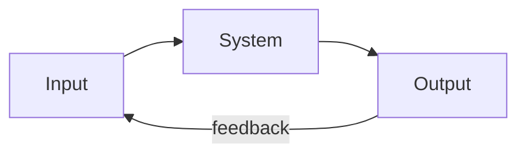
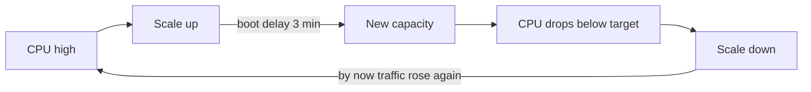

# Feedback Loops — Junior

> **What?** A feedback loop is when a system's output is fed back as an input, so the system acts on itself. The current state influences the next state. Two flavors: **balancing** loops fight change and seek a target (a thermostat keeping a room at 21°C); **reinforcing** loops amplify change and compound (a retweet that gets seen, retweeted, seen more).
>
> **How?** As a junior engineer you learn to *spot* the loop: trace where an output comes back around to affect its own input. You name it (balancing or reinforcing), you find the **delay** between signal and correction, and you recognize the everyday loops you already touch — autoscaling, retries, CI feedback.

---

## 1. The one idea: output becomes input

Most things you build are linear in your head: request comes in → handler runs → response goes out. A feedback loop is when the *response changes the next request* — directly or through the world.

That little curved arrow back to the input is the whole topic. Everything else — oscillation, runaway, stability — comes from what that arrow does.

A concrete pair:

- **Autoscaler.** CPU goes up → autoscaler adds servers → load per server drops → CPU goes down. The output (high CPU) triggers an action that *reduces* the thing that triggered it. This loop **opposes** change.
- **Retry storm.** A service gets slow → clients retry → more requests hit the slow service → it gets slower → even more retries. The output (slowness) triggers an action that *increases* the thing that triggered it. This loop **amplifies** change.

Same shape, opposite sign. Learning to tell them apart is the first skill.

## 2. Balancing loops: the system corrects itself

A **balancing loop** (also called *negative feedback*) has a goal and pushes the system toward it. When the output drifts from the target, the loop generates a correction in the *opposite* direction.

The canonical example is a thermostat:

1. **Target:** 21°C.
2. **Measure:** room is 18°C.
3. **Compare:** 3°C too cold (the *error*).
4. **Act:** turn on heat.
5. Room warms → error shrinks → heat turns off.

Engineering is full of these:

| Loop | Target it seeks | Correction action |
|------|-----------------|-------------------|
| Thermostat | Set temperature | Heat / cool |
| Autoscaler | Target CPU % | Add / remove instances |
| TCP congestion control | "Don't overflow the link" | Slow down sending when packets drop |
| Connection pool limit | Max N connections | Make callers wait when full |
| Load shedding | Stay under capacity | Drop low-priority requests |

The signature of a balancing loop: **it has a goal, and it resists being pushed away from it.** Push a stable system and it pushes back. That's why your servers don't melt the instant traffic spikes — a balancing loop kicks in.

## 3. Reinforcing loops: the system runs away

A **reinforcing loop** (also called *positive feedback*) feeds change back as *more* change. The output makes the next output bigger, which makes the next one bigger still. Small things compound into large things, fast.

Good versions:

- **Viral growth:** more users → more content/invites → more users.
- **Caching warmth:** popular item gets cached → faster → more popular → stays cached.

Dangerous versions (the ones that page you at 3am):

- **Retry storm:** slow service → retries → more load → slower → more retries.
- **Cache stampede:** a hot cache key expires → every request misses at once → all of them hit the database → database slows → requests pile up.
- **Thundering herd:** a service comes back online → every waiting client connects at the same instant → it falls over again.

> "Reinforcing" doesn't mean "good." It means "self-amplifying." A death spiral is a reinforcing loop you didn't want.

The signature: **no goal, just amplification.** A reinforcing loop has no target it's heading toward — it just makes the trend stronger until something outside the loop stops it (it hits a limit, or it crashes).

## 4. Balancing vs reinforcing at a glance

| | Balancing (negative) | Reinforcing (positive) |
|--|----------------------|------------------------|
| Effect on change | Opposes it | Amplifies it |
| Has a goal/target? | Yes | No |
| Long-run behavior | Settles toward equilibrium | Grows or collapses |
| Feels like | Stability, control | Momentum, runaway |
| Engineering examples | Autoscaler, TCP, load shedding | Retry storm, viral growth, stampede |
| When you want it | Keeping things steady | Growth — but watch the downside |

A trick that always works: ask **"if the output goes up, does the loop push it back down (balancing) or push it up more (reinforcing)?"**

## 5. Delay: why loops wobble instead of settling

Real loops don't act instantly. There's a **delay** between the signal and the correction. Delay is where instability comes from.

Picture a shower with a slow water heater. You turn the knob hot, nothing happens, you turn it hotter, suddenly it's scalding, you yank it cold, nothing, then it's freezing. You and the shower are *oscillating* — not because anyone is doing it wrong, but because the **delay** between your action and the result makes you over-correct.

Autoscalers do exactly this:

If new instances take 3 minutes to boot, the autoscaler is always reacting to *old* information. It adds too many, then removes too many — this is **autoscaler thrash**. The fix isn't a smarter target; it's shrinking the delay (faster boots, pre-warmed capacity) or slowing down reactions (cooldown periods) so the loop doesn't chase its own tail.

**Remember:** the longer the delay in a balancing loop, the more it tends to oscillate.

## 6. Short loops beat long loops (and that's why CI exists)

The *speed* of a feedback loop decides how fast a system can learn and correct. Short loops are better than long ones.

This is the whole reason continuous integration exists. Compare two ways of finding a bug:

- **Long loop:** write code → merge → release monthly → user reports a crash → you debug in production weeks later. The feedback took weeks; by then you've forgotten the change and built more on top of it.
- **Short loop:** write code → tests run in 90 seconds → red build → you fix it while it's still in your head.

Same bug, wildly different cost, purely because of loop length. As a junior, the practical version is: **make your own feedback loops short.** Run tests locally before pushing. Use a linter that flags problems as you type. Watch the CI result on your PR. Each of these shortens the gap between "I made a mistake" and "I found out."

This connects to [second-order effects](../03-second-order-effects/) — a slow feedback loop hides consequences, so problems compound before you ever see them.

## 7. Observability *is* feedback

You can't run a balancing loop without a signal. A thermostat with no thermometer can't keep the room warm. A system with no metrics can't correct itself — and neither can you.

That's the deep reason logs, metrics, and traces matter: **observability is the measurement step of every feedback loop in your system.** Latency dashboards, error-rate alerts, request traces — these are the "thermometer" that lets both the autoscaler *and the on-call engineer* close the loop.

A junior takeaway: when you add a feature, ask "how will I *see* whether it's working?" That signal is what makes the feedback loop possible at all.

## 8. Common loops you already touch

You don't need to build a control system to meet feedback loops. You already use these:

- **Tests → red/green:** a balancing loop on correctness. Error appears, you correct.
- **Code review → comments → revisions:** a balancing loop on quality. The *latency* of review matters — a review that takes 3 days is a slow loop, and your work drifts while you wait.
- **Alert → page → fix:** the operations loop. Slow alerts = slow correction.
- **Retries:** be careful — a retry is a tiny reinforcing loop hiding in your client. One retry is fine; everyone retrying a struggling service at once is a storm.

## 9. The junior toolkit

When you look at any system, run this checklist:

1. **Find the loop.** Where does an output come back to affect its input?
2. **Sign it.** Does it fight change (balancing) or amplify it (reinforcing)?
3. **Find the delay.** How long between the signal and the correction?
4. **Find the signal.** What measures the output — and is it fast and accurate?

Get good at this and you'll start predicting behavior before it happens: "this retry config plus a slow dependency is a storm waiting to happen," or "this autoscaler will thrash because boot time is too long."

## 10. Where to go next

- [Parts, whole, and emergence](../01-parts-whole-and-emergence/) — feedback loops are *how* the parts produce whole-system behavior.
- [Second-order effects](../03-second-order-effects/) — what loops do over time, beyond the first reaction.
- [Mental models of systems](../04-mental-models-of-systems/) — stocks, flows, and loops as a thinking toolkit.
- Section root: [Systems Thinking](../).

**One sentence to keep:** find the loop, sign it, time it, and shorten it — that's most of the value before you ever touch control theory.

---
## Recall and apply

**Practice loop:** Draw one feedback loop. Label the reinforcing or balancing effect, delay, and metric that would show it.

Use these prompts to check your understanding and choose one action to try in your next task.

Try to answer these questions from memory:

1. What's the difference between a balancing and a reinforcing feedback loop?
2. Walk me through a retry storm as a feedback loop.
3. Why isn't exponential backoff enough? Why add jitter?
