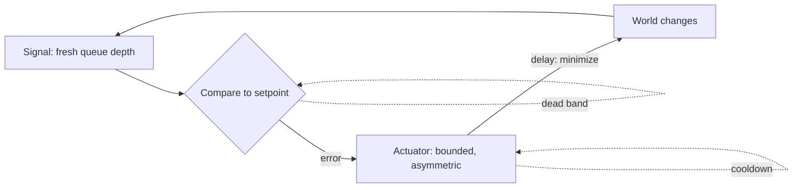

# Feedback Loops — Senior

> **What?** At senior level, feedback loops are a *design material*. You treat gain, delay, and dominance as parameters you deliberately set, you compose multiple loops so the safe ones win near the limit, and you read a system's behavior-over-time (oscillation, metastability, runaway) back to the loop structure that produces it. The deepest move: change a loop's gain or delay, because that's where the leverage is.
>
> **How?** You design balancing loops that stay stable under contention, you instrument the *signals* those loops depend on (observability as the measurement step), you pre-place dampers so reinforcing loops can't run away, and in design reviews you predict dynamics — "this will oscillate / this will death-spiral / this won't recover on its own" — and quantify the fix.

---

## 1. Behavior is in the structure, not the events

A senior engineer resists the event-by-event reading of an incident ("the database got slow, then requests piled up, then it fell over"). Events are the *symptom*. The cause is a loop structure that, given any trigger, produces that trajectory. Donella Meadows' framing in *Thinking in Systems* is the discipline: behavior over time → the feedback structure that generates it → the leverage point to change it.

So your job in a postmortem isn't "what triggered it" but **"what loop turned a small trigger into an outage, and what was its gain and delay?"** Two outages with totally different triggers (a deploy, a traffic spike, a dependency blip) often share *one* loop structure — a retry amplifier, a queue with no backpressure, a cache with synchronized expiry. Fix the structure once and you've immunized against a whole class of triggers.

## 2. Designing a balancing loop that's stable under load

Anyone can write a controller that works at the desk. The senior skill is making it stable when many instances run it concurrently under contention, with real delays. The properties to engineer:

- **Fresh, accurate signal.** A balancing loop is only as good as its measurement. Stale metrics = effective delay = oscillation. Prefer signals close to the thing you control (queue depth at the worker, not aggregate CPU 60s old).
- **Asymmetric response, like AIMD.** Grow capacity gently, shed/back off aggressively. Symmetric loops fight each other and oscillate; the slow-up/fast-down asymmetry is what keeps TCP flows from synchronizing and overrunning the bottleneck. Borrow it.
- **Hysteresis / dead bands.** Don't react to every wiggle. Scale up at 70%, down at 40% — the gap prevents flapping around a single threshold.
- **Bounded gain.** Cap how much one cycle can change (max scale-step, max in-flight). Unbounded gain plus delay is the oscillation recipe.
- **Cooldowns to manage delay.** If the actuator has a 3-minute delay, don't issue another correction inside that window — you'd be stacking corrections on stale data.

This is exactly why mature autoscalers expose *all* of these knobs: target tracking with dead bands, step bounds, cooldown periods, and predictive (pre-warming) modes that attack the delay term directly.

## 3. Reinforcing loops: design so the balancing loop wins first

You cannot remove reinforcing loops — viral growth, retries, queues, caches are all valuable. The senior move is to **guarantee a balancing loop dominates before the reinforcing one runs away.** You're engineering the *dominance threshold*.

Concretely, around any reinforcing loop, place a balancing guard with a *lower trigger point*:

| Reinforcing loop | Balancing guard placed in front | Why it wins first |
|------------------|----------------------------------|-------------------|
| Retry storm | Circuit breaker + token-bucket retry budget | Breaker opens before retries multiply load 3× |
| Cache stampede | Request coalescing / single-flight + early recompute | One miss recomputes; the other N wait, not pile on |
| Thundering herd | Jittered reconnect + connection rate limit | Reconnects spread over a window, never synchronized |
| Queue runaway | Backpressure + bounded queue + load shedding | Queue refuses work before it grows unbounded |
| GC death spiral | Admission control on memory headroom | Shed load before allocation outpaces collection |

The principle underneath: **a reinforcing loop's gain compounds, so it must be capped by something that triggers *earlier* than the runaway.** A retry budget is a great example — instead of "each request retries 3×," you cap *total* retries to e.g. 10% of successful traffic. Now the retry loop's gain is bounded no matter how bad things get, and a healthy service can't be DDoSed by its own clients (Google SRE's retry-budget pattern).

## 4. Metastable failures: when the trigger is gone but the system stays down

The most dangerous loops produce **metastable failures** (formalized in Bronson et al., "Metastable Failures in Distributed Systems," HotOS 2021). The system has two stable states: healthy, and a degraded state held in place by a *sustaining* reinforcing loop. A trigger pushes it into the degraded state; the trigger then disappears — but the sustaining loop keeps it there. Removing the original cause does *not* recover it.

The retry storm is the textbook case: the original slowdown is long over, but retries generate enough load to keep the service slow, which keeps generating retries. You can't fix it by restoring the dependency, because the dependency isn't the problem anymore — the loop is.

Recovery requires **breaking the sustaining loop**, not addressing the trigger:

- Shed load hard (drop the retry traffic) to push the system back across the basin into the healthy state.
- Open circuit breakers to starve the loop.
- Sometimes a coordinated restart with admission control is the only way out.

Designing against metastability means asking, for every reinforcing loop: **"if this gets triggered, can it sustain itself after the trigger is gone? What breaks the sustaining loop automatically?"** If the answer is "an engineer at 3am," you have a latent outage.

## 5. Worked dynamics: sizing a circuit breaker as a loop parameter

Treat a damper quantitatively, not as a checkbox. Suppose service B depends on C. Under stress, C's p99 latency rises and B's calls time out at 1s, then retry up to 3×.

- **Effective load on C** without a guard: up to `3 × normal`. If C's capacity is 1.2× normal at p99, the loop gain (3×) overwhelms it — guaranteed death spiral.
- **With a retry budget** capping retries to 10%: effective load ≤ `1.1 × normal` < capacity. Loop gain bounded below the runaway threshold. Stable.
- **Circuit breaker threshold:** open after error rate > X% over window W. Choose W shorter than the time for the reinforcing loop to multiply load — otherwise the breaker reacts *after* the spiral has started (delay too long → it doesn't help). This is the gain/delay analysis applied to a real config value.

The senior habit: **every resilience config is a loop parameter, and you should be able to justify its number in terms of gain or delay**, not "it's the default."

## 6. Observability is the closed-loop sensor — design it as such

Observability is not a dashboard nice-to-have; it is the **measurement leg of every control loop in the system**, including the human one. If the signal is slow, noisy, or aggregated away, every loop downstream of it inherits that delay and noise.

Senior consequences:

- **Signal latency is loop delay.** A 1-minute metric pipeline adds 1 minute of delay to the autoscaler *and* to the on-call engineer. Alert on fast, leading signals (saturation, queue depth) over lagging ones (error count after the fact).
- **Alert → action is a loop; measure its delay.** If MTTA (time to acknowledge) plus diagnosis time exceeds the time for a reinforcing loop to runaway, your humans cannot close the loop fast enough — so you *must* automate the damper (auto-shed, auto-breaker) and let humans handle the slow loop.
- **Cardinality and sampling change accuracy, not just cost.** Over-sampling hides the spike that triggers your loop. The signal's fidelity *is* the loop's accuracy.

## 7. Reading a system: the senior diagnostic pass

Given an architecture diagram, walk it as a loop graph:

1. **Mark every loop**, sign it, label gain and delay.
2. **Find synchronization risks** — anywhere many clients can act in lockstep (shared expiry, shared backoff, shared reconnect). That's a small loop that becomes a big spike. Jitter it.
3. **Find unbounded reinforcing loops** — retries without budget, queues without bounds, caches without coalescing. Cap each.
4. **Find long-delay balancing loops** — anything correcting on stale or aggregated signal. Shorten the signal or add hysteresis.
5. **Find dominance thresholds** — at what load does a balancing loop hand off to a reinforcing one? Make the balancing guard trigger *before* that point.

This pass catches the majority of "it worked in staging, fell over in prod" failures, because those are almost always dominance flips that only appear past a load threshold.

## 8. Leverage: change the gain or the delay

Meadows ranks *leverage points* — places to intervene in a system — and loop parameters sit high on her list. The senior takeaway:

- **Changing a delay** is often the highest-leverage move available. Cutting deploy lead time, metric latency, or instance boot time stabilizes *every* loop that depends on that signal. It's why CI/CD and fast rollback are disproportionately powerful — they shrink the delay in the delivery loop.
- **Changing a gain** is next: a retry budget, a scale-step bound, a backoff curve. One number, large effect on stability.
- **Adding or removing a loop** (a circuit breaker, a backpressure channel) changes the regime entirely.

See [Leverage points and bottlenecks](../06-leverage-points-and-bottlenecks/) for the full ranking, and [Second-order effects](../03-second-order-effects/) for the downstream consequences a loop intervention triggers.

## 9. The senior mindset

- Don't debug events; debug structure. Find the loop that turns triggers into outages.
- Make balancing loops fast, asymmetric, bounded, and hysteretic. Make reinforcing loops capped and de-synchronized.
- Guarantee the safe loop wins before the threshold. Place dampers ahead of the runaway, with numbers justified by gain/delay.
- Treat observability as the loop's sensor; if humans can't close the loop in time, automate the damper.
- When you want maximum leverage, change a delay or a gain — not the symptom.

**Keep this:** a system's behavior over time is dictated by its loops. Design the loops — their sign, gain, delay, and which one dominates near the limit — and the behavior follows.

---
## Recall and apply

**Practice loop:** Draw one feedback loop. Label the reinforcing or balancing effect, delay, and metric that would show it.

Try to answer these questions from memory:

1. Why is delay the source of instability in a feedback loop?
2. A cache stampede — what loop is it, and how do you fix it?
3. How is observability related to feedback loops?
4. Why do high-performing teams deploy frequently *and* have fewer failures? Isn't that a tradeoff?
