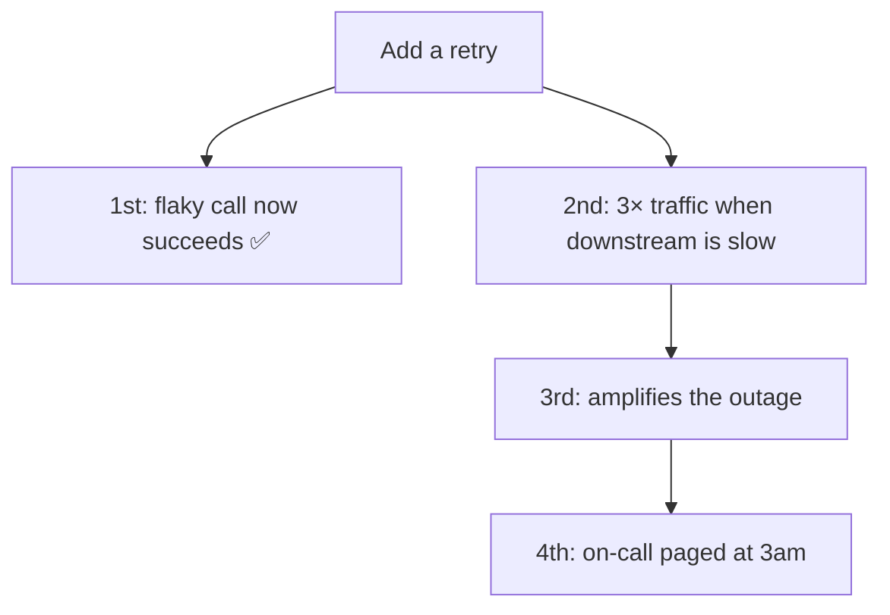

# Second-Order Effects — Junior

> **What?** First-order effects are what your change does *immediately and on purpose* — the thing you wanted. Second-order (and higher-order) effects are the *ripples*: what happens next, downstream, later, and often unintended. "Second-order thinking" is the habit of asking **"and then what?"** instead of stopping at the first answer.
>
> **How?** When you make a change, write down the intended effect, then force yourself to add at least one more hop: "this makes X faster — *and then what?*" The new failure mode, the new thing someone has to maintain, the cost that lands on someone else. At junior level the win is simply *not stopping at the first consequence*.

---

## 1. The one habit: "And then what?"

Most bugs in your reasoning come from stopping too early. You see a change, you see the effect you wanted, you ship. The first-order effect is real — but it's rarely the *only* effect.

A short, almost annoying question fixes most of this:

> **"And then what?"**

You ask it once. Then you ask it again about the answer. Two or three hops out, you usually find the surprise.

```
Add a cache to the user-profile endpoint.
  → and then what?  → reads get faster (the intended win) ✅
  → and then what?  → now there are TWO copies of the data: DB and cache
  → and then what?  → when the DB changes, the cache is stale until it expires
  → and then what?  → a user updates their name, still sees the old one → bug report
```

The first hop was the reason you did the work. The third hop is the bug you'll be paged about. Second-order thinking is just refusing to stop at hop one.

## 2. First-order vs second-order, side by side

| Property | First-order | Second-order (and higher) |
|---|---|---|
| Timing | Immediate | Delayed — minutes, days, or a quarter later |
| Intent | Intended, you asked for it | Often *unintended*, you didn't ask for it |
| Visibility | Obvious, you can see it now | Hidden — shows up under load, over time, elsewhere |
| Who feels it | You / your feature | Another team, the on-call, future-you |

The dangerous quadrant is *delayed + unintended + felt by someone else*. That's where outages and "why did we ever do this?" live.

## 3. A law worth remembering

The biologist Garrett Hardin wrote the **first law of ecology**:

> **"You can never do merely one thing."**

Every action in a connected system has more than one effect, because the parts are linked. You wanted to do *one* thing — speed up reads. But the system doesn't let you. You also created a second copy of the data, a new expiry rule, and a new way to be wrong. You did several things; you only *noticed* one.

This isn't pessimism. It's a reminder to go looking for the other effects *before* they find you.

## 4. The five changes every junior eventually makes

These five come up constantly. Learn their ripples now and you'll look senior fast.

### 4.1 Add a cache

| | |
|---|---|
| 1st-order (wanted) | Reads are faster, DB load drops |
| 2nd-order | Stale reads; you now own *cache invalidation* |
| 3rd-order | A new failure mode: cache down → DB gets full traffic at once |

> Caching is famously one of the "two hard things" in computer science (naming, cache invalidation, and off-by-one errors). The hard part *is* the second-order effect.

### 4.2 Add a retry

| | |
|---|---|
| 1st-order (wanted) | A flaky call succeeds on the 2nd attempt; fewer errors |
| 2nd-order | When the downstream is *actually* down, you now send 3× the traffic |
| 3rd-order | Your retries help *keep* it down — you amplified the outage |

Retries feel free when things work. They're a multiplier on traffic exactly when the system can least afford it. (More on this in [check your understanding](#check-your-understanding).)

### 4.3 Add a database index

| | |
|---|---|
| 1st-order (wanted) | A slow query gets fast |
| 2nd-order | Every write now also updates the index → writes get slower |
| 3rd-order | More storage; more indexes to keep in memory; more to back up |

An index isn't free speed. You traded write cost and storage for read speed. Often worth it — but it's a trade, not a gift.

### 4.4 Raise a timeout

| | |
|---|---|
| 1st-order (wanted) | Fewer "request timed out" errors right now |
| 2nd-order | Slow requests now *hold a thread/connection longer* |
| 3rd-order | Under load, threads pile up waiting → you run out → you fall over *harder* |

This one is counterintuitive: the change that removed errors made the eventual failure *worse*. A short timeout fails fast and sheds load; a long timeout fails slow and all at once.

### 4.5 Add a queue

| | |
|---|---|
| 1st-order (wanted) | Producer and consumer decoupled; spikes absorbed |
| 2nd-order | If consumers can't keep up, the queue grows — lag, then unbounded backlog |
| 3rd-order | Now you need backpressure, max-length limits, and a plan for a full queue |

## 5. Drawing the ripple

It helps to literally draw the chain. Effects fan out:



Notice the intended effect (B) is a dead end — nothing bad branches off it. The trouble grows from the branch you *weren't* thinking about (C → D → E). Second-order thinking is the discipline of drawing the C branch too.

## 6. The cost that lands on someone else

When you raised that timeout, where did the cost go? Not to you — to the **on-call engineer** who gets paged when threads pile up, and to **future-you** who has to debug it. A consequence that lands on someone other than the person who made the change is called an **externality**. It's a classic second-order effect because it's invisible from where you're standing.

Before you ship, ask: *who pays for this later, and have they agreed to?*

## 7. The flip side: don't remove things you don't understand

Second-order thinking has a twin warning, **Chesterton's fence**: if you find a fence across a road and don't know why it's there, don't remove it until you do — someone put it there for a reason.

```go
// Delete this weird 50ms sleep? It's ugly. (1st-order: cleaner code ✅)
time.Sleep(50 * time.Millisecond) // ← but WHY is it here?
// 2nd-order: it might be the only thing preventing a thundering herd
```

That ugly line might be load-bearing. The same "and then what?" applies to *deletion*: "I remove this — and then what stops the thing it was preventing?"

## 8. A tiny pre-mortem before you ship

You don't need a process. Before merging, spend 60 seconds:

1. **Intended:** what's the first-order effect I want?
2. **And then what?** name one downstream effect, two hops out.
3. **Who pays?** does any cost land on the on-call, another team, or future-me?
4. **Reversible?** if a ripple surprises me, can I undo this quickly?

That last one is your safety net: when you *can't* predict the ripples (and at junior level you often can't), making the change **reversible** — a feature flag, an easy rollback — protects you. Ship the reversible version, watch, and learn what the second-order effects actually were.

## 9. What this is *not*

- **Not** "never change anything" — paralysis is its own bad outcome.
- **Not** "predict everything" — you can't, and trying wastes time.
- **It is**: don't stop at hop one, look for the ripple that lands on someone else or shows up under load, and keep the change reversible when you're unsure.

---

## Where to go next

- The cache that goes stale, the queue that backs up — these are **feedback loops**: [../02-feedback-loops/](../02-feedback-loops/).
- Why a small change ripples so far in some systems: [../01-parts-whole-and-emergence/](../01-parts-whole-and-emergence/).
- Every ripple is a hidden trade-off: [../05-thinking-in-tradeoffs/](../05-thinking-in-tradeoffs/).
- Practice tracing ripples: [check your understanding](#check-your-understanding). Interview-style drills: [check your understanding](#check-your-understanding).

---
## Recall and apply

**Practice loop:** For one proposed change, list the direct effect, one delayed effect, one affected group, and a guardrail.

Use these prompts to check your understanding and choose one action to try in your next task.

Try to answer these questions from memory:

1. What is a second-order effect, and how does it differ from a first-order effect?
2. You add a cache to a hot read path. What are the second-order effects?
3. You add retries to a flaky downstream call. Walk the ripples.
