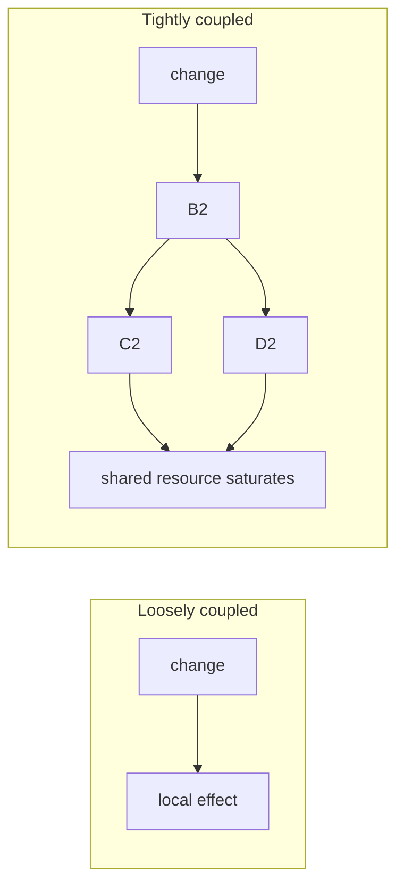

# Second-Order Effects — Middle

> **What?** A change's effects don't stop at the intended result. They propagate: the first-order effect is what you designed for; the second- and higher-order effects are the downstream, delayed, and usually *unintended* consequences that propagate through the system's couplings. In a tightly-coupled system, those higher-order effects often *dominate* the outcome.
>
> **How?** Treat every design decision as a fan-out, not a point. For each change, trace at least two hops of ripples, name the new failure mode and the new thing-to-maintain it creates, ask *who* the cost externalizes onto, and check whether you've accidentally created a perverse incentive. When you can't predict the ripples, buy yourself reversibility instead.

---

## 1. Why second-order effects dominate in coupled systems

A change's blast radius is a function of *coupling*. In a system where parts are independent, a change stays local — its ripples die out. In a tightly-coupled system, a change in one part propagates through every part it touches, and each of those propagates further. The effects *compound*.



This is why the same change — "add a retry" — is harmless in one system and an outage amplifier in another. The change didn't get more dangerous; the *coupling* made its second-order effects larger than its first-order one. When you're working in a system with shared resources (a single database, a connection pool, a thread pool, one downstream dependency everyone calls), assume your ripples reach further than you think.

> Coupling and shared resources are emergent structure — see [../01-parts-whole-and-emergence/](../01-parts-whole-and-emergence/). The ripples that come *back* are feedback loops — [../02-feedback-loops/](../02-feedback-loops/).

## 2. The discipline: trace the chain explicitly

"And then what?" scales into a written technique. For any non-trivial change, build the chain to 3 hops:

| Change | 1st-order (intended) | 2nd-order | 3rd-order |
|---|---|---|---|
| Add read cache | reads fast, DB load ↓ | stale reads; invalidation to own | cache outage → DB thundering herd at full traffic |
| Add retries | flaky calls succeed | traffic multiplied when downstream is slow | retry storm sustains the outage |
| Add index | slow query fast | writes slower, more storage | write-heavy path regresses; bigger backups |
| Raise timeout | fewer timeout errors | threads/conns held longer | pool exhaustion → fail harder, all at once |
| Add queue | decoupling, absorb spikes | unbounded lag if consumers lag | backpressure & max-len now mandatory |
| Shard the DB | per-node load ↓, scales writes | cross-shard queries & joins hard | resharding is a project; hotspots if key is skewed |
| Add a 3rd-party API call | feature ships fast | their latency is now your p99 | their outage is your outage; new SLO dependency |

The pattern repeats: **every capability you add adds a new failure mode and a new thing to maintain.** That's not a reason to add nothing — it's the bill you must read before you sign.

### A reusable template

```
CHANGE: <what I'm doing>
INTENDED (1st): <the win>
AND THEN WHAT (2nd): <new failure mode + new thing to maintain>
AND THEN WHAT (3rd): <under load / over time / elsewhere>
EXTERNALIZES TO: <on-call? another team? future-me?>
REVERSIBLE? <flag / rollback / one-way door>
```

Five lines. Put it in the PR description. It's the cheapest insurance you'll ever buy.

## 3. Retry amplification, concretely

The retry is the canonical second-order trap, so make it concrete. A downstream starts returning errors. Each of your N callers retries 3×.

```
Normal:           N requests → downstream
Downstream slow:  N requests, each retried 3× → 3N requests
                  ...exactly when downstream has the LEAST capacity
```

Your retry logic, designed to *improve* reliability (first-order), *reduces* it under partial failure (second-order). The fixes are themselves second-order-aware:

- **Backoff + jitter** — spread retries out so you don't synchronize a stampede.
- **Retry budgets / token buckets** — cap retries to a small % of traffic; stop retrying when the budget's empty.
- **Circuit breakers** — when failures spike, stop calling entirely; give the downstream room to recover.

```go
// First-order thinking:
for i := 0; i < 3; i++ {
    if resp, err := call(); err == nil { return resp }
}
// Second-order thinking: only retry if the system can afford it.
if breaker.Allow() && retryBudget.TryTake() {
    resp, err := callWithBackoffJitter()
    breaker.Record(err)
    return resp, err
}
```

The discipline isn't "don't retry." It's "retry in a way that doesn't amplify the second-order effect you can now name."

## 4. Efficiency increases usage — the Jevons paradox

In 1865 William Stanley Jevons noticed that more *efficient* coal engines didn't reduce coal use — they increased it, because cheaper coal made coal worth using for more things. The efficiency lowered the cost per unit, so demand rose to fill the gap.

This shows up everywhere in engineering:

| Efficiency win (1st-order) | Jevons second-order effect |
|---|---|
| Make an endpoint 10× cheaper | teams call it 20× more; total load goes *up* |
| Free, fast internal data warehouse | dashboards multiply; query bill explodes |
| Cheap auto-scaling | nobody optimizes; spend rises to the new ceiling |
| Faster CI | people push smaller, more frequent builds; queue stays full |

The lesson: **making something cheaper doesn't reduce total consumption — it often raises it.** When you optimize a resource, don't assume the savings stay saved. Plan for the new demand the cheapness creates, and put a limit (quota, budget) where the optimization opened a faucet.

## 5. Perverse incentives: when the metric fights you

Some second-order effects come from *people* responding to your change, not from machines. This is where Goodhart's law bites:

> **"When a measure becomes a target, it ceases to be a good measure."** (Goodhart's law)

The textbook story is the **cobra effect**: colonial Delhi offered a bounty for dead cobras to reduce the cobra population (first-order: fewer cobras). People started *breeding* cobras to collect the bounty (second-order). When the program ended, the breeders released their now-worthless snakes — *more* cobras than at the start (third-order, worse than baseline).

Engineering versions:

| Target you set (1st-order intent) | Perverse second-order behavior |
|---|---|
| Reward closing tickets | tickets closed fast & wrong; reopened later |
| Mandate 90% code coverage | tests written to touch lines, asserting nothing |
| Measure velocity in story points | point inflation; estimates lose meaning |
| Reward "no Sev-1 incidents" | incidents reclassified Sev-2; real problems hidden |
| Reward lines of code / commits | bloated PRs, commit-padding |

Whenever you introduce a metric, gate, or reward, ask the **and-then-what for humans**: *how will a rational person game this?* Then design so the cheapest way to win the metric is also the way you actually wanted. (More in [../02-feedback-loops/](../02-feedback-loops/) — perverse incentives are reinforcing loops with a human in them, and in [../../04-critical-thinking/04-evaluating-tradeoffs-objectively/](../../04-critical-thinking/04-evaluating-tradeoffs-objectively/).)

## 6. Technical debt: interest as a second-order effect

The shortcut you took to ship on Friday is a first-order win: feature out the door. The *interest* — every future change in that area now costs more, every new hire is slower there, every bug takes longer to find — is the second-order effect, and it's **delayed and compounding**.

```
Shortcut (1st-order):   ship today, save 2 days ✅
Interest (2nd-order):   every change here +30% slower, forever
Compounding (3rd-order): more shortcuts pile on the first → area becomes untouchable
```

Debt is fine *as a deliberate, reversible loan* — you took it knowingly and you'll pay it down. It's dangerous as an *unpriced* second-order effect: you "saved 2 days" and never noticed the interest accruing. Name the debt in the PR so the second-order cost is at least *visible* to whoever pays it.

## 7. Reversibility: your hedge when you can't predict

You will not foresee every ripple. Coupled systems are too complex; some second-order effects only reveal themselves in production. The robust response isn't "predict harder" — it's **prefer reversible changes** when the ripples are unknowable.

| Door type | Example | Strategy |
|---|---|---|
| Two-way (reversible) | feature flag, config change, new index | ship it, watch, undo if a ripple surprises you |
| One-way (irreversible) | data migration that drops columns, public API contract, a queue other teams now depend on | trace ripples *exhaustively first*; you don't get a do-over |

Jeff Bezos's framing: spend your prediction effort on the one-way doors; move fast and learn through the two-way doors. Reversibility converts an unknown second-order effect from a disaster into a data point.

## 8. A worked pre-mortem

You're about to add a 5-minute cache to a `permissions` lookup to cut DB load. Run the ripples:

1. **Intended:** DB load on the hot permissions table drops. ✅
2. **And then what?** A revoked permission stays live for up to 5 minutes. → *security* second-order effect: someone you fired can still act for 5 minutes.
3. **And then what?** If the cache layer dies, all permission checks hit the DB at once → the table you were protecting now gets a thundering herd. → *availability* second-order effect.
4. **Externalizes to?** Security team (stale grants) and on-call (herd).
5. **Reversible?** Yes — it's a flag. But the *security* ripple isn't acceptable even briefly for revocations.

Outcome: cache *grants* (safe to be stale) but check *revocations* live, or push an explicit invalidation on revoke. You found that fix because you traced three hops and asked who pays — not because the first-order win was wrong.

---

## Where to go next

- The loops that turn ripples into runaway behavior: [../02-feedback-loops/](../02-feedback-loops/).
- Mental models for predicting ripples faster: [../04-mental-models-of-systems/](../04-mental-models-of-systems/).
- Every ripple is a trade-off you may not have priced: [../05-thinking-in-tradeoffs/](../05-thinking-in-tradeoffs/) and [../../04-critical-thinking/04-evaluating-tradeoffs-objectively/](../../04-critical-thinking/04-evaluating-tradeoffs-objectively/).
- Reasoning about the *likelihood* of a ripple: [../../06-probabilistic-thinking/03-risk-and-failure-probabilities/](../../06-probabilistic-thinking/03-risk-and-failure-probabilities/).
- Drills: [check your understanding](#check-your-understanding) · [check your understanding](#check-your-understanding).

---
## Check your understanding

Try to answer these questions from memory:

1. Why can raising a timeout make a system fail *harder*?
2. What second-order effects does adding a database index introduce?
3. You introduce a message queue to decouple two services. And then what?
4. What's the Jevons paradox and where does it bite in engineering?
