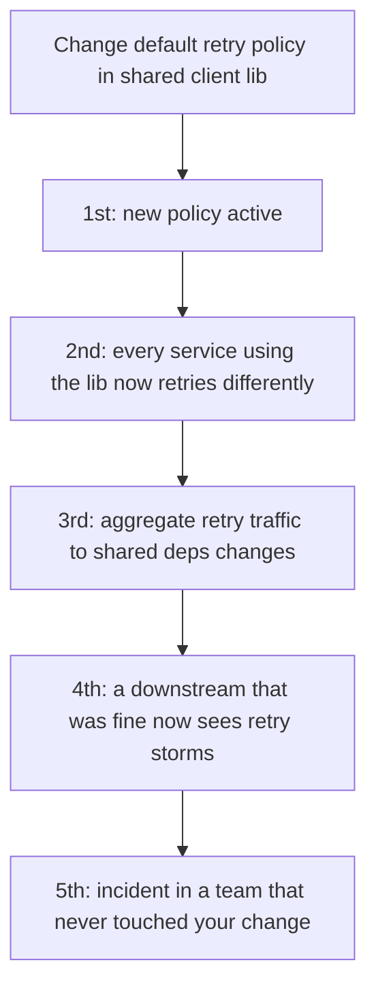

# Second-Order Effects — Professional (Staff / Principal)

> **What?** At staff/principal scope, second-order effects are the *primary deliverable of a decision*, not a side note. The changes you make — platform defaults, migrations, org-wide standards, incentive structures, architectural commitments — have first-order effects on a few systems and second-order effects on *dozens of teams, the org's incentive landscape, and years of future change cost*. The ripples are mediated by people and politics as much as by code, and they are frequently irreversible. Your job is to govern the ripples deliberately.
>
> **How?** You make ripple-analysis a structural part of how decisions get made (ADRs, pre-mortems, design review gates), you reason about second-order effects on *incentives and behavior* not just systems, you weight reversibility heavily for org-scale one-way doors, and you design platforms and policies so the *cheapest path for every team is also the safe one* — because at scale you cannot inspect every change, you can only shape the gradient.

---

## 1. The scope shift: from a system's ripples to an org's

A junior traces ripples through one service. A staff engineer traces them through the *organization*. The mechanism is the same — "you can never do merely one thing" (Hardin) — but the couplings are now teams, platforms, contracts, and incentives, and the time horizon is years.

| Lever you pull | First-order effect | Second/third-order (the real deliverable) |
|---|---|---|
| Change a platform default (e.g., default timeout, default retry policy) | one config value changes | every service inherits it; behavior shifts across the fleet; some teams break silently |
| Mandate a migration (framework, language, DB) | strategic goal advanced | N teams' roadmaps consumed; morale; the teams who *can't* migrate become an island |
| Set an org metric (DORA, velocity, incident count) | visibility, alignment | teams optimize the proxy; behavior bends toward the number, away from the goal (Goodhart) |
| Introduce a shared service | dedup'd work, consistency | every consumer now coupled to it; it becomes a SPOF and a bottleneck for change |
| Standardize on one technology | consistency, hiring, leverage | the cost of being wrong is now org-wide; you've created a monoculture |

The error that ends staff careers isn't getting the first-order analysis wrong — it's *only doing the first-order analysis*: "we standardized on X, mission accomplished," while the second-order effects (the team that couldn't adopt it, the now-undeletable shared service, the metric everyone games) accrue unowned for two years.

## 2. Platform changes: your ripples hit dozens of teams at once

When you own a platform, the second-order effects are your *defaults*, because most teams never override them. A default is a decision you make *on behalf of everyone who doesn't think about it* — which is almost everyone.

Principles for changing platform behavior without detonating the fleet:

- **Defaults are policy.** Choose the default that's *safe when ignored*, not the one that's optimal when tuned. A safe-by-default retry budget protects teams who never read the docs; an aggressive default arms them.
- **Roll out platform changes like production changes** — staged, flagged, observable, reversible — because they *are* production changes for every consumer.
- **The blast radius is your dependency graph.** Before changing a shared lib's behavior, you must know who consumes it and how. "I changed one line" is first-order; "I changed the behavior of 80 services" is the truth.
- **Migration is your second-order problem, not the consumer's.** If you ship a breaking platform change and externalize the migration onto 80 teams, you've created 80 units of toil and a coordination nightmare. Expand/contract and backwards-compat let *you* absorb the ripple.

## 3. Incentive design: the highest-leverage, most dangerous ripples

The second-order effects with the longest reach and the worst failure modes are the ones that flow through *incentives*, because humans optimize relentlessly and creatively for whatever you reward. This is Goodhart's law operating at org scale, and the cobra effect is the warning label.

| Incentive / target you set | Intended first-order effect | Perverse second-order behavior you'll get |
|---|---|---|
| Reward teams for "zero Sev-1s" | fewer serious incidents | severity downgrading; under-reporting; hidden risk accumulates |
| Tie bonuses to story-point velocity | predictable, fast delivery | point inflation; padding; gaming estimates; quality dropped |
| Reward individual on-call heroics | incidents get resolved | nobody fixes root causes (heroism is rewarded, prevention isn't) |
| Mandate uniform code coverage % | better testing | assertion-free tests; coverage as theater; tests deleted to "fix" coverage |
| Reward migration completion by date | migration progresses | teams check the box with shims; real migration deferred; debt rebranded |
| Centralize all approvals for "quality" | fewer bad changes | bottleneck; teams route around it; shadow systems; velocity collapses |

The staff discipline: **before you introduce any metric, gate, or reward, run the perverse-incentive pre-mortem — "how does a rational, busy person make this number go up *without* doing the thing I actually want?"** Then redesign so the cheapest way to win the metric is the behavior you wanted, or pair it with a counter-metric that the gaming would visibly degrade (velocity *with* change-failure-rate; coverage *with* mutation score; incident count *with* mean-time-to-detect). A metric without a counter-metric is a cobra farm waiting to open. (See [../../04-critical-thinking/04-evaluating-tradeoffs-objectively/](../../04-critical-thinking/04-evaluating-tradeoffs-objectively/) and feedback loops with humans in them, [../02-feedback-loops/](../02-feedback-loops/).)

## 4. Architecture and migration: second-order thinking as the deciding factor

For irreversible, org-scale architectural decisions, the second-order analysis *is* the decision. The first-order benefit (this DB scales better, this pattern is cleaner) is usually the easy part and rarely the deciding factor; the higher-order effects are where the decision actually lives.

A staff-grade architecture decision states its ripples explicitly:

- **Coupling created.** Every shared component, contract, or platform you introduce is a coupling that constrains everyone's future change. Microservices' first-order win is independent deploys; their second-order cost is a distributed system's failure modes, data consistency problems, and operational surface — for *every* team, forever. The question is never "is this cleaner?" but "what does this make hard to change *later*, and for *whom*?"
- **Reversibility class.** Is this a two-way door (a pattern teams can adopt or not) or a one-way door (a data model the whole company builds on, a public contract, a queue 40 teams now depend on)? One-way doors get exhaustive ripple analysis; two-way doors get a pilot and a fast feedback loop.
- **The migration's second-order cost.** A migration isn't done when the new thing exists — it's done when the old thing is *gone* and the org has absorbed the change. The long tail of "10% of traffic we can't move" is a second-order effect that turns "we migrated" into "we now run both forever." Budget for the tail or don't start.
- **The freeze you're imposing.** A multi-year migration second-orders into a *de facto freeze* on the affected area — teams stop investing in code they're told is being replaced. If the migration slips (they do), you've frozen value-delivery for years. That ripple belongs in the decision.

## 5. Governing ripples at scale: shape the gradient, you can't inspect every change

At staff/principal scope you cannot personally trace the second-order effects of every change — there are thousands. The leverage move is to change the *system that produces changes* so that good ripple-hygiene is the default and the cheapest path. ([../06-leverage-points-and-bottlenecks/](../06-leverage-points-and-bottlenecks/) — this is the highest leverage point: changing the rules of the system.)

- **Make ADRs carry a ripple section.** Decisions get documented with their second-order effects and reversibility class. The org accumulates a memory of *why* the fences exist (Chesterton's fence, institutionalized).
- **Bake pre-mortems into design review** for changes above a blast-radius threshold. Make "and then what / who pays / how do we undo" a gate, not a vibe.
- **Build paved roads where the safe path is the easy path.** If the sanctioned client library has retry budgets and circuit breakers built in, every team gets second-order-safe behavior *for free, by default*. You've encoded the discipline into the platform so it scales past your attention.
- **Counter-metric everything.** Institutionalize the rule that no metric ships without a paired counter-metric. Make gaming visible by construction.
- **Default to reversible.** Org standards that favor flags, staged rollout, and backwards-compatibility convert most unforeseen ripples from incidents into observations across the whole fleet.

## 6. The Jevons trap at platform scale

When you make an internal capability dramatically cheaper or easier, expect total consumption to *rise*, often past the old absolute cost (Jevons paradox). A self-serve data platform, a free internal LLM gateway, cheap auto-scaling, a frictionless feature-flag system — each lowers cost-per-use and thereby *induces demand you must now capacity-plan for*. The first-order win ("we made X 10× cheaper") routinely second-orders into "X is now our biggest line item because everyone uses it for everything." Put quotas, budgets, and chargeback at the faucet *as you ship the efficiency*, not after the bill arrives — retrofitting limits onto a beloved free thing is a political fight you'll lose.

## 7. Pricing technical debt as a balance-sheet item

At staff scope, technical debt's *interest* is a second-order effect you're accountable for making visible and governing. A shortcut taken under deadline (first-order: shipped) compounds into org-wide drag (second-order: every future change in that area is slower, every incident harder, every hire less productive). Your job isn't to forbid debt — deliberate, priced, reversible debt is a legitimate financing tool — but to ensure it's *on the books*: tracked, owned, and serviced, so it doesn't silently compound into an area nobody can safely touch. Unpriced debt is the purest second-order effect: the savings were visible and immediate, the interest is invisible and deferred, and the gap between them is where systems calcify.

## 8. Principal-level anti-patterns

- **First-order leadership** — declaring victory at the intended effect ("we standardized / we migrated / we set the metric") while the org-scale ripples accrue unowned.
- **Default negligence** — choosing platform defaults that are optimal-when-tuned rather than safe-when-ignored, arming every team that never read the docs.
- **Cobra farming** — shipping metrics and incentives without modeling the gaming, then acting surprised by the gaming.
- **Externalizing the migration** — pushing the second-order cost of your platform change onto dozens of consumer teams as undifferentiated toil.
- **One-way doors at speed** — applying two-way-door velocity to irreversible org-scale commitments because the first-order benefit looked clean.
- **Inspection over gradient** — trying to personally review every change for ripples instead of changing the system so safe ripples are the default.

---

## Where to go next

- The highest leverage point is changing the system's rules so good ripple-hygiene is automatic: [../06-leverage-points-and-bottlenecks/](../06-leverage-points-and-bottlenecks/).
- Incentives and perverse metrics are feedback loops with humans inside: [../02-feedback-loops/](../02-feedback-loops/).
- Org-scale decisions are trade-off decisions made explicit: [../05-thinking-in-tradeoffs/](../05-thinking-in-tradeoffs/) · [../../04-critical-thinking/04-evaluating-tradeoffs-objectively/](../../04-critical-thinking/04-evaluating-tradeoffs-objectively/).
- Coupling and emergence determine how far org-scale ripples travel: [../01-parts-whole-and-emergence/](../01-parts-whole-and-emergence/) · [../04-mental-models-of-systems/](../04-mental-models-of-systems/).
- Weighting irreversible, org-scale risk: [../../06-probabilistic-thinking/03-risk-and-failure-probabilities/](../../06-probabilistic-thinking/03-risk-and-failure-probabilities/).
- Section root: [../](../) · Roadmap: [../../README.md](../../README.md).

---
## Recall and apply

**Practice loop:** For one proposed change, list the direct effect, one delayed effect, one affected group, and a guardrail.

Try to answer these questions from memory:

1. What is Chesterton's fence, and how does it relate to second-order thinking?
2. Why do second-order effects dominate in tightly-coupled systems?
3. As a staff engineer, you're about to change a default in a shared client library. What's your second-order analysis?
4. Give an example where the second-order effect *inverted* the first-order intent, and the lesson.
