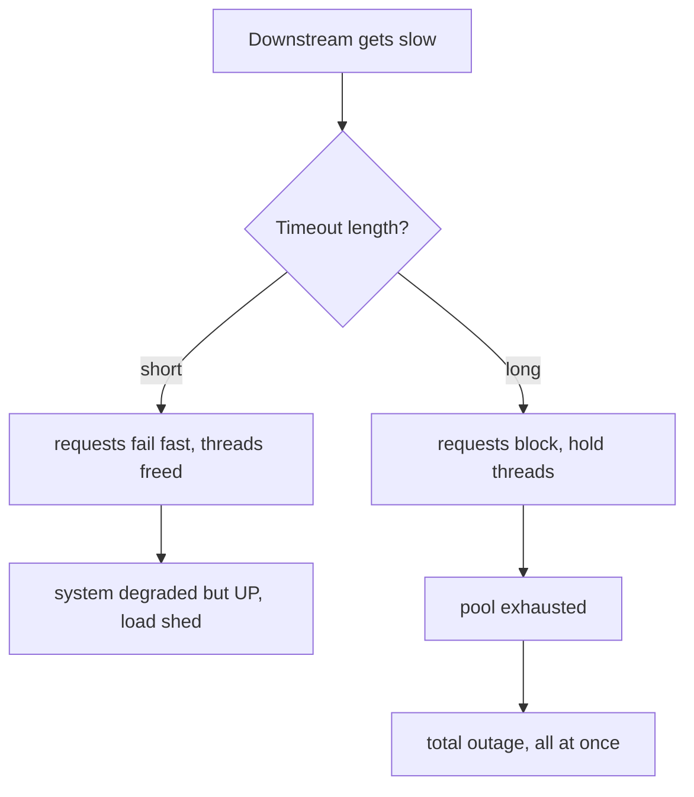

# Second-Order Effects — Senior

> **What?** The recognition that in a coupled system the *intended* (first-order) effect of a change is frequently the *least* important consequence of it. Higher-order effects — delayed, indirect, emergent, mediated by other people and other systems — routinely dominate the total outcome, sometimes inverting it (the change that reduced errors makes the outage worse; the optimization that cut cost raised total spend). Second-order thinking is treating those ripples as the *primary* object of design, not an afterthought.
>
> **How?** You make ripple-tracing a default step in design and review, you can name the standard amplification patterns cold (retry storms, herds, perverse incentives, Jevons demand), you design *against* them rather than discovering them in an incident, you reason about *whose* problem a cost becomes, and you architect for reversibility precisely where prediction fails.

---

## 1. The inversion: when second-order effects flip the sign

A senior engineer's edge is recognizing the cases where the higher-order effect doesn't just *add* to the first-order one — it *reverses* it. These are the changes that look like wins on the PR and read like root causes in the postmortem.

| Change | First-order (the win on the PR) | Dominant higher-order (the postmortem) | Net sign |
|---|---|---|---|
| Raise timeout 1s → 30s | fewer timeout errors | threads held 30× longer → pool exhausted → total outage | **inverted** |
| Add aggressive retries | flaky calls recover | retry storm sustains the downstream failure | **inverted** |
| Optimize endpoint 10× | endpoint cheaper | callers fan out 50× → total load and cost up (Jevons) | **inverted** |
| 90% coverage mandate | "well-tested" | assertion-free tests; false confidence; real coverage drops | **inverted** |
| Add a cache to cut DB load | DB load drops | cache-miss storm + invalidation bugs > original problem | **can invert** |

The skill isn't pessimism toward all change — it's a trained reflex to ask, on changes that touch *shared resources* or *human behavior*: **"could the second-order effect be larger than, and opposite to, the first?"** When the answer is plausibly yes, the design must address the ripple, not the win.

## 2. Failing fast vs failing slow — the timeout case in depth

The timeout example deserves a senior-level treatment because it captures a general principle: **how a system fails is a design choice, and it's almost entirely a second-order property.**

A short timeout *sheds load*: a request that would be slow fails quickly, returns the thread, and the system stays responsive (degraded, but up). A long timeout *absorbs* slowness: requests pile up holding resources, the pool saturates, and the system fails *all at once and later* — a worse failure mode dressed up as fewer errors.



The general principle: **prefer failure modes that are early, partial, and load-shedding over ones that are late, total, and load-amplifying.** Short timeouts, bounded queues, load shedding, circuit breakers, and bulkheads are all *second-order-aware* design — they shape what happens *after* the thing you were optimizing goes wrong. The first-order metric (error rate at p50) gets worse with a short timeout; the second-order property (survivability under stress) gets dramatically better. Optimizing the visible first-order number is exactly how teams design fragile systems.

## 3. The amplification catalogue (know these cold)

These are the recurring shapes of dangerous second-order effects. A senior recognizes them in a design review before they're built.

- **Retry amplification / retry storms** — N callers × R retries = NR load at the worst moment. Counter: budgets, breakers, backoff+jitter, idempotency.
- **Thundering herd** — a cache/lease expires or a service restarts and everyone hits the cold path simultaneously. Counter: jittered TTLs, request coalescing / single-flight, staggered restarts.
- **Cascading failure** — one saturated dependency makes its callers slow, which saturates *their* callers. Counter: bulkheads, timeouts, circuit breakers, fail-fast.
- **Metastable failure** — a system that, once pushed past a tipping point, stays failed even after the trigger is removed, because the recovery work (retries, reconnections, queued backlog) sustains the overload. Counter: shed load to break the loop; cap queues; admission control.
- **Jevons demand growth** — efficiency lowers cost-per-use, total use rises to fill it. Counter: quotas at the faucet, capacity planning for the *induced* demand, not the old.
- **Perverse incentives (Goodhart / cobra)** — a metric or reward gets gamed, optimizing the proxy and harming the goal. Counter: measure outcomes not proxies, pair counter-metrics, keep humans in the loop.

Most of these are **reinforcing feedback loops** ([../02-feedback-loops/](../02-feedback-loops/)) — the second-order effect feeds back and grows. The metastable case is the purest: the *second-order* effect (recovery work) becomes the thing keeping the system down.

## 4. Externalities: tracing where the cost actually lands

A senior reasons explicitly about *whose ledger* a consequence hits, because the most common design error is optimizing your own first-order metric while externalizing the second-order cost onto someone who wasn't in the room.

| Your change | Your first-order win | Externalized cost | Who pays |
|---|---|---|---|
| Skip pagination, return all rows | shipped faster | clients OOM, network saturated | every consumer, mobile users |
| Retry hard against shared service | your error rate ↓ | their service load ↑↑ | the downstream team, *their* on-call |
| Tight coupling to internal API | quick integration | they can't change it now | the owning team's roadmap |
| Defer the migration | hit your deadline | the migration got harder, riskier | future-you, the next engineer |
| Log everything at DEBUG | easy debugging now | log bill, retention, noise | the platform/observability team |

The discipline: for every change, name the ledger the cost lands on. If it lands on a team that didn't consent, that's not a clever optimization — it's a cost transfer, and it will come back as cross-team friction, a noisy-neighbor incident, or an architecture that can't evolve. ([../05-thinking-in-tradeoffs/](../05-thinking-in-tradeoffs/) frames this as making the hidden trade explicit.)

## 5. The pre-mortem as standard practice

The pre-mortem (Gary Klein) is the operational form of second-order thinking. Before a launch, assume it has failed catastrophically six months out, and work backwards: *what ripple did we not trace?* It defeats the optimism that makes us stop at the first-order effect.

A senior pre-mortem for a meaningful change:

1. **State the first-order intent** in one line — the win you're optimizing for.
2. **Enumerate the new failure modes** the change creates (every capability adds one).
3. **Run each through the amplification catalogue** — does this enable a herd / storm / cascade / metastable lock / perverse incentive?
4. **Trace externalities** — whose ledger absorbs the cost?
5. **Identify the irreversible parts** — the one-way doors that need the most scrutiny.
6. **Decide the hedge** — flags, kill-switches, staged rollout, monitoring for the *specific* ripple you predicted.

The output isn't "don't ship." It's a list of ripples you've now *designed against* instead of discovering in production.

## 6. Reversibility as the senior default under uncertainty

You cannot predict every ripple in a coupled system — and the senior move is to *stop trying to* past a point of diminishing returns, and instead invest in **cheap reversibility**. Reversibility converts an unpredicted second-order effect from an incident into an observation.

This reshapes how you architect rollouts:

- **Feature flags / kill switches** make most behavior changes two-way doors — ship dark, ramp, watch the ripple you predicted *and the ones you didn't*, roll back instantly.
- **Expand/contract (parallel-change) migrations** make schema and contract changes reversible at each step, instead of one irreversible cutover. (See [database-migration-patterns] in your stack's playbook.)
- **Staged rollout (1% → 10% → 100%)** bounds the blast radius of an unforeseen ripple to a fraction of traffic.
- **Backwards-compatible by default** keeps the one-way door from slamming: you can always add, rarely safely remove.

The asymmetry is the whole point: spend prediction effort lavishly on irreversible changes (a data migration that drops columns, a public API contract, a queue other teams now build on), and spend it sparingly on reversible ones — there, *running the experiment* is cheaper and more accurate than reasoning about it.

## 7. Chesterton's fence — second-order thinking applied to *removal*

The same logic governs deletion and simplification. Chesterton's fence: don't remove what you don't understand, because it may be the load-bearing prevention of a second-order effect.

```go
// "This retry-with-cap looks redundant, the call is reliable now."
// Chesterton's fence: WHY was the cap added? Maybe a past retry storm.
// Removing the cap (1st-order: simpler) re-enables the storm (2nd-order).
```

When you simplify, the question isn't "is this used on the happy path?" — it's "*what ripple was this suppressing, and is that ripple still possible?*" A surprising amount of "weird" code is a scar from a past second-order effect someone already paid for. Understand the scar before you reopen the wound. (Donella Meadows: in a system, the rules and structures you inherit usually encode constraints you can't see from outside.)

## 8. Senior anti-patterns

- **First-order optimization theater** — tuning the visible metric (p50 latency, error count) while the second-order property (survivability, total cost) silently degrades.
- **Proxy worship** — shipping a metric or gate without modeling how humans will game it; manufacturing your own cobra effect.
- **Externality blindness** — declaring a win because *your* dashboard is green, having pushed the cost onto on-call or another team.
- **Predicting instead of de-risking** — pouring analysis into forecasting ripples that a feature flag and a 1% rollout would have *revealed* in an afternoon.
- **Removing scars** — simplifying away the load-bearing weirdness, then re-experiencing the incident it prevented.

---

## Where to go next

- Reinforcing loops are the engine behind most dangerous ripples: [../02-feedback-loops/](../02-feedback-loops/).
- Where in the system a change ripples *furthest* — and most usefully: [../06-leverage-points-and-bottlenecks/](../06-leverage-points-and-bottlenecks/).
- Mental models that make ripple-tracing fast: [../04-mental-models-of-systems/](../04-mental-models-of-systems/).
- Pricing the hidden trade in every ripple: [../05-thinking-in-tradeoffs/](../05-thinking-in-tradeoffs/) · [../../04-critical-thinking/04-evaluating-tradeoffs-objectively/](../../04-critical-thinking/04-evaluating-tradeoffs-objectively/).
- Likelihood-weighting the ripples you can't rule out: [../../06-probabilistic-thinking/03-risk-and-failure-probabilities/](../../06-probabilistic-thinking/03-risk-and-failure-probabilities/).
- Section root: [../](../) · Roadmap: [../../README.md](../../README.md).

---
## Check your understanding

Try to answer these questions from memory:

1. Explain the cobra effect and give an engineering example.
2. What's an externality in software, and why is it a second-order trap?
3. How is technical-debt interest a second-order effect?
4. How does reversibility protect you when you can't predict the ripples?
