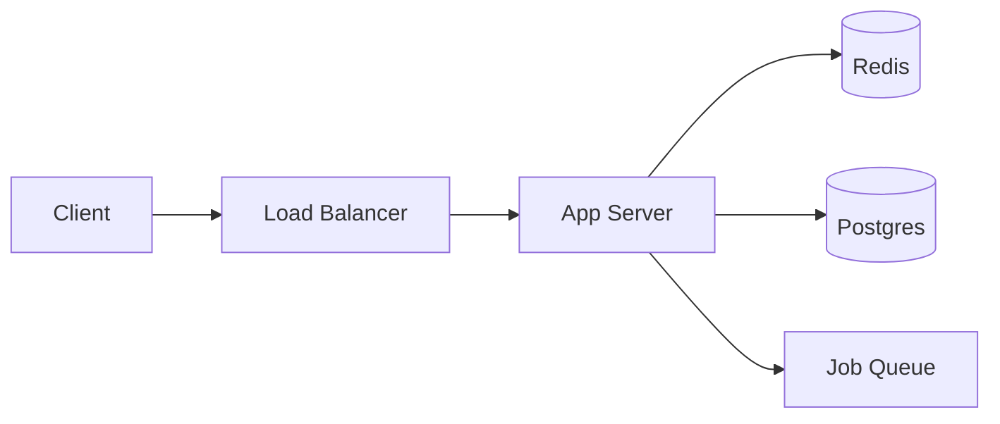

# Mental Models of Systems — Junior

> **What?** A mental model is the simplified picture of a system you carry in your head — the story you tell yourself about how the code, the request, and the data flow. It lets you predict what will happen *without running it*. When you reason "if I change this, that will break," you're querying your mental model, not the machine.
>
> **How?** As a junior, you make your models explicit and check them against reality. You read the code, trace a request from entry to response, draw the boxes and arrows, and run small experiments. Every time the system surprises you, you treat it as a bug *in your model* and fix the model.

---

## 1. What a mental model actually is

A computer is far too complex to hold in your head exactly. So your brain builds a *compressed* version — a cartoon — that keeps the parts you care about and throws away the rest. That cartoon is your mental model.

When you say "this endpoint hits the database, then returns JSON," you have not described the real system. The real system involves a load balancer, a connection pool, a query planner, OS page cache, TCP retransmits, and a JSON serializer. Your model is a *deliberate simplification*. That's not a flaw — it's the point. A useful map leaves out detail. A 1:1 map of a city is the city itself and helps no one.

> A mental model is a **simplified internal representation that lets you predict behavior without executing the system.**

The test of a model is **prediction**, not detail. A good model answers: "If I send a request with no auth header, what happens?" If your answer matches what the system actually does, your model is accurate *for that question*. If it doesn't, you found a model bug.

## 2. You debug your model, not the system

Here is the single most important idea in this file:

> When you debug, you are not poking at the running system directly. You are checking whether **reality matches the model in your head.** A bug is the gap between them.

Picture a junior who says: "I set `user.name = 'Sam'`, but the saved record still says `'Alex'`. The database is broken!" The database is almost never broken. What's broken is the *model*. Maybe `save()` was never called. Maybe there's a caching layer returning the old value. Maybe two requests raced. The surprise is real; the conclusion ("DB is broken") came from a wrong model.

When your model and the system agree, debugging feels easy — you reason a few steps ahead and you're right. When they diverge, you feel **lost**: nothing makes sense, every fix makes it worse, you start changing things at random. That feeling of lostness is the symptom of a wrong model. The cure is not more random changes. The cure is to *rebuild the model* until it predicts what you're seeing.

```text
Your prediction:   request → handler → DB → 200 OK
What happened:     request → handler → DB → 500

The gap is the bug. Find where prediction and reality split.
```

## 3. How wrong models cause real bugs

| Wrong model | Real behavior | The bug it causes |
|---|---|---|
| "Lists are copied when assigned" | Lists are shared references | You mutate one list and another changes |
| "This function returns a number" | It returns a `Promise<number>` | You compare a Promise to `5`, always false |
| "The cache always has fresh data" | Cache is 60s stale | Users see old prices |
| "Only one request runs at a time" | Many run concurrently | Two requests double-charge a card |
| "`==` checks identity" | It checks value (or coerces) | Surprising equality results |

Notice the pattern: in every row the *system is behaving correctly*. The bug lives in the human's head. This is why senior engineers spend so much energy keeping their models accurate — most bugs are model bugs wearing a costume.

## 4. Building an accurate model: four concrete moves

You don't get an accurate model by staring at a wall. You build it the same way a scientist builds a theory — by gathering evidence. This is hypothesis-driven thinking applied to your own understanding (see [scientific & hypothesis-driven](../../09-scientific-and-hypothesis-driven/01-hypothesis-and-falsifiability/)).

### 4.1 Read the code

Open the actual file. Don't guess what `processOrder()` does from its name — read it. Names lie; code doesn't.

### 4.2 Trace a request end to end

Pick one real request and follow it from the moment it arrives to the moment a response leaves. Write the path down. This is the highest-value exercise a junior can do:

```text
GET /orders/42
  → router matches /orders/:id
  → authMiddleware checks the JWT
  → orderController.show(42)
  → orderRepository.findById(42)   ← SQL: SELECT * FROM orders WHERE id=42
  → serialize to JSON
  → 200 OK
```

Now you can predict: "What if id=42 doesn't exist?" Follow the trace — `findById` returns `null`, the controller... does what? If you don't know, you've found the edge of your model. Go read that branch.

### 4.3 Draw the diagram

Boxes and arrows force your fuzzy mental picture into something concrete you can check. Drawing reveals the gaps — the arrow you can't label is the part you don't understand yet.



### 4.4 Run an experiment

When you're unsure, *test the model*. Add a log line. Send a curl request. Set a breakpoint. "I think this runs twice — let me add a counter and see." A five-minute experiment beats an hour of arguing with your own assumptions.

## 5. The model must include failure, not just the happy path

A junior's model usually covers only the happy path: "request comes in, data comes back." But systems spend a surprising amount of their life *failing*, and your model is useless exactly when you need it most — during an incident — if it has no failure branches.

For every box in your diagram, ask: **what happens when this is slow, down, or returns garbage?**

```text
Happy path:  App → DB → rows → response
But what if: DB is down?        → connection error → 500? retry? cached fallback?
             DB is slow (5s)?   → request hangs → timeout? thread blocked?
             DB returns 0 rows? → empty list? 404? null crash?
```

If you can't answer these, your model has holes precisely where outages live. A model that only knows the happy path is like knowing how a car drives but not what the brakes do. See [feedback loops](../02-feedback-loops/) for how a slow dependency can spiral into a full outage — second-order effects your happy-path model can't predict (more in [second-order effects](../03-second-order-effects/)).

## 6. Reusable models you should carry everywhere

Some mental models are so general they apply to almost every system. Learn these once; reuse them forever.

### 6.1 The memory hierarchy

Memory isn't one thing — it's a ladder, and each rung is ~10–100× slower than the one above:

```text
CPU register   ~1 ns
L1 cache       ~1 ns
L2 cache       ~4 ns
RAM            ~100 ns
SSD            ~100 µs   (1000× slower than RAM)
Network (LAN)  ~500 µs
Disk seek      ~10 ms
Network (cross-continent)  ~150 ms
```

These "latency numbers every programmer should know" (popularized by Jeff Dean) explain *why* caching helps, why disk I/O is the enemy, and why a network call in a loop is a disaster. You don't memorize exact figures — you internalize the *orders of magnitude*. See [first-principles latency floors](../../05-first-principles-thinking/01-reasoning-from-fundamentals/).

### 6.2 The request lifecycle

DNS → TCP handshake → TLS → load balancer → app → DB → response → render. Carry this and you can place any web bug somewhere on the line instead of flailing.

## 7. Map is not the territory

Your diagram is a *map*. The running system is the *territory*. They are never the same thing, and the map is always a little out of date. The senior habit is **humility**: hold your model confidently enough to act, but loosely enough to drop it the moment reality contradicts it.

> A surprise is not an annoyance. A surprise is **your model telling you it has a bug.** Welcome it, then fix the model.

When the system does something you didn't expect, the worst response is "that's weird" followed by moving on. The best response is "my model said X, reality said Y — let me find out why," because that's exactly the moment your understanding gets sharper.

## 8. Where this sits

Mental models are the foundation of [systems thinking](../). They feed directly into [thinking in tradeoffs](../05-thinking-in-tradeoffs/) (you can't weigh a tradeoff in a system you can't picture) and [leverage points](../06-leverage-points-and-bottlenecks/) (you can't find the bottleneck without a model of the flow). Start by browsing the [roadmap root](../../README.md), but the practical first step is simple: pick one endpoint in your codebase today and trace it end to end.

## Key takeaways

- A mental model is a simplified internal picture that lets you **predict** behavior without running the system.
- You debug your **model**, not the system — a bug is the gap between prediction and reality.
- Build models by reading code, tracing a request end to end, drawing the diagram, and running experiments.
- A useful model includes **failure behavior**, not just the happy path.
- Carry reusable models: the memory hierarchy, latency numbers, the request lifecycle.
- The map is not the territory — treat every surprise as a model bug and update.

---
## Check your understanding

Try to answer these questions from memory:

1. What is a mental model, and what's the test of whether yours is good?
2. There's a common claim: "you debug your model, not the system." Explain it.
3. How do you build a mental model of an unfamiliar system?
