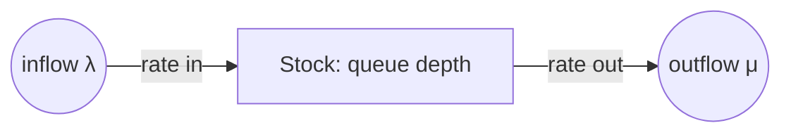

# Mental Models of Systems — Middle

> **What?** At this level, a mental model is a *working theory of system dynamics* — not just "what calls what," but how things accumulate, flow, queue, and saturate over time. You move from static box-and-arrow pictures to models with **stocks, flows, and rates**, and you carry portable laws (like Little's Law) that let you reason about behavior you've never directly observed.
>
> **How?** You give your models a vocabulary: queues, pools, buffers, rate-in vs rate-out. You quantify them — backlog size, throughput, latency — and you use small laws to turn three knowns into a fourth. You actively hunt for **model drift**, where the system evolved but your picture didn't, and you treat shared team diagrams as the real onboarding artifact.

---

## 1. From boxes to dynamics: stocks and flows

A junior's model is mostly *structure* — which component talks to which. A mid-level model adds *dynamics* — how quantities change over time. The cleanest vocabulary for this comes from systems thinker **Donella Meadows** (*Thinking in Systems*): **stocks** and **flows**.

- A **stock** is something that *accumulates*: items in a queue, connections in a pool, bytes in a buffer, rows in a table, unprocessed jobs in a backlog. A stock is a noun you could photograph at an instant.
- A **flow** is the *rate* that changes a stock: requests arriving per second, jobs completed per second, bytes drained per second. A flow is a verb measured per unit time.

The fundamental equation of every stock is dead simple and absurdly powerful:

```text
change in stock  =  inflow rate  −  outflow rate
```



### 1.1 Why this is the model that predicts outages

Almost every saturation incident is a stock filling because **inflow exceeded outflow** for long enough.

| System | Stock | Inflow | Outflow | What "full" means |
|---|---|---|---|---|
| Web server | request queue | req/s arriving | req/s served | latency spikes, then 503s |
| Connection pool | in-use connections | acquisitions/s | releases/s | `pool exhausted`, requests block |
| Kafka topic | consumer lag | produce rate | consume rate | unbounded lag, stale data |
| Disk | bytes used | write rate | delete/rotate rate | `ENOSPC`, process dies |
| Goroutine/thread pool | live workers | spawns/s | completions/s | OOM or scheduler thrash |

Once you see queues as stocks, the diagnosis writes itself: a growing stock means **outflow can't keep up with inflow** — always. Either speed up the drain or slow the fill. There is no third option. This single frame replaces a dozen ad-hoc explanations.

## 2. Little's Law: the most portable mental model you'll own

**Little's Law** relates the three numbers you actually care about in any stable queueing system:

```text
L = λ × W

L = average number of items in the system (the stock)
λ = average arrival rate (throughput in steady state)
W = average time an item spends in the system (latency)
```

It is breathtakingly general — it assumes only that the system is *stable* (long-run inflow = outflow). No assumptions about distributions, scheduling, or how many servers. That generality is why it's a *mental model*, not just a formula: you can apply it to a thread pool, an HTTP server, a checkout line, or a hospital ER.

### 2.1 Using it to find the unknown third

You usually measure two of the three and *derive* the one you can't see:

- **"My service handles 2000 req/s, average latency 50 ms. How many requests are in flight?"**
  `L = λW = 2000 × 0.05 = 100`. You need ~100 concurrent slots (threads/connections). Size your pool accordingly.
- **"My pool has 50 connections, each request holds one for 100 ms. Max throughput?"**
  `λ = L / W = 50 / 0.1 = 500 req/s`. Above 500 req/s, requests *must* queue — this is a hard ceiling, no tuning required to predict it.
- **"Queue depth sits at 30, we complete 60 jobs/s. How long is a job waiting?"**
  `W = L / λ = 30 / 60 = 0.5 s` average wait. If your SLA is 200 ms, you have a problem you can now quantify.

> Little's Law turns vague worry ("are we overloaded?") into arithmetic. That's the mark of a real mental model: it replaces hand-waving with a prediction you can check.

### 2.2 The trap

Little's Law holds **in steady state**. During a spike, while the stock is still growing, `λ_in > λ_out` and `W` is climbing — you can't plug in instantaneous numbers and expect truth. Use it for capacity planning and steady-state reasoning, not mid-incident point estimates.

## 3. A starter kit of reusable engineering models

Mid-level engineers should carry a small library of named models the way a carpenter carries tools. Each one is a lens that makes a class of problems obvious.

| Model | What it lets you predict / decide | Source |
|---|---|---|
| **Memory hierarchy + latency numbers** | Why cache hits matter; why N+1 queries kill you | Jeff Dean's "latency numbers" |
| **Little's Law (L = λW)** | Concurrency, pool sizing, throughput ceilings | Little, 1961 |
| **Stocks & flows** | Why any queue/backlog grows or drains | Meadows |
| **The CAP triangle** | What you give up under a network partition | Brewer |
| **USE method** (Utilization, Saturation, Errors) | A checklist to diagnose any resource | Brendan Gregg |
| **RED method** (Rate, Errors, Duration) | What to put on a service dashboard | Tom Wilkie |
| **The end-to-end argument** | Why reliability belongs at the endpoints, not the network | Saltzer, Reed, Clark (1984) |

### 3.1 USE and RED as diagnostic models

These two aren't theory — they're *checklists encoded as mental models*, so you never stare blankly at a slow system again.

- **USE** (for resources: CPU, disk, pool, network): for every resource check **U**tilization (how busy), **S**aturation (queue length / wait), **E**rrors. A pool at 100% utilization with growing saturation *is* your bottleneck.
- **RED** (for services): track **R**ate (req/s), **E**rrors (failed/s), **D**uration (latency distribution). These three give you a complete service health picture.

Carrying USE means that when someone says "the system is slow," you have a deterministic next move instead of guessing.

## 4. Failure behavior belongs in the model — quantified

A mid-level model doesn't just *mention* failure; it puts numbers and dynamics on it. "The DB can be slow" becomes:

```text
DB p99 normally 20 ms.
Under load it climbs to 2 s.
Each app thread holds a DB connection for the request duration.
→ At 2 s/request and a 50-connection pool: max 25 req/s before the pool saturates.
→ Stock (waiting requests) grows; W climbs; cascade to upstream timeouts.
```

That's a *failure model*: it predicts not just *that* it fails but *when* and *how the failure propagates* — a second-order effect (see [second-order effects](../03-second-order-effects/)). Pair this with [feedback loops](../02-feedback-loops/): a retry storm is a positive feedback loop that drives inflow *up* exactly when outflow has collapsed.

## 5. Model drift: when the system moved and you didn't

Your model is a snapshot. The system keeps changing. **Model drift** is the gap that opens between them over time, and it's a leading cause of confident-but-wrong engineers.

Symptoms you'll recognize:

- **Stale runbooks**: "restart service X" — but X was split into three services last quarter.
- **"It used to work that way"**: someone reasons from a model that was accurate two years ago.
- **Surprising the on-call**: the architecture diagram on the wiki shows a monolith; production is microservices.
- **Cargo-culted config**: a thread-pool size copied from an era with different hardware.

```text
2023 model:  app → single Postgres
2025 reality: app → PgBouncer → primary + 3 read replicas
Engineer reasoning from the 2023 model will misdiagnose every replica-lag bug.
```

The defense is the same as the cure for any model bug: **treat surprises as drift detectors**. When reality contradicts your model, don't patch around it — ask "did the system change, or was my model always wrong?" Then update the *artifact* (diagram, runbook, doc), not just your head, so the next person inherits the corrected model. This is hypothesis-driven debugging applied to your own knowledge ([hypothesis & falsifiability](../../09-scientific-and-hypothesis-driven/01-hypothesis-and-falsifiability/)).

## 6. Shared models: the diagram is the onboarding

Your private model is invisible. The team's *shared* model is what's actually written down — the architecture diagram, the data-flow doc, the agreed vocabulary ("the ingestion pipeline," "the hot path").

> Onboarding is, almost entirely, **transferring the senior engineers' mental models into the new hire's head.** A good diagram does in an hour what reading code does in a week.

When a team shares an accurate model, design discussions converge fast — everyone is pointing at the same boxes. When models diverge silently, two engineers can "agree" in a meeting while picturing different systems, and the disagreement surfaces only in a production incident. Keeping a *living* shared diagram (updated when the system changes) is one of the highest-leverage things a mid-level engineer can do for the team — see [parts, whole & emergence](../01-parts-whole-and-emergence/) for why the wired-together picture matters more than any single component.

## 7. Practical loop

1. **Pick a subsystem** and identify its stocks (queues, pools, buffers) and flows (rates in/out).
2. **Measure two of L, λ, W**; derive the third; predict a ceiling; verify against metrics.
3. **Add the failure branches** with numbers — when does the stock fill?
4. **Diff your diagram against production**; find one drift; update the artifact.
5. **Apply USE/RED** the next time something is slow instead of guessing.

## Key takeaways

- Upgrade from structure to **dynamics**: model stocks (queues, pools, buffers) and flows (rates in/out); a stock grows iff inflow > outflow.
- **Little's Law (L = λW)** turns two measured numbers into the third — concurrency, throughput ceilings, queue waits — in steady state.
- Carry a kit: memory hierarchy, stocks/flows, CAP, **USE** and **RED** as diagnostic checklists, the end-to-end argument.
- Put **numbers and propagation** on failure behavior, not just "it can break."
- Hunt **model drift** — stale runbooks, "it used to work that way" — and update the shared artifact, not just your head.
- The team's **shared diagram is the onboarding**; divergent models surface as incidents.

---
## Recall and apply

**Practice loop:** State the model you are using, its assumptions, a competing model, and the observation that would change your mind.

Try to answer these questions from memory:

1. State Little's Law and give an engineering application.
2. A connection pool has 30 connections; each query holds one for 200 ms. What's the max sustainable throughput, and what happens above it?
3. Explain stocks and flows, and why they predict outages.
4. Why must a mental model include failure behavior, not just the happy path?
