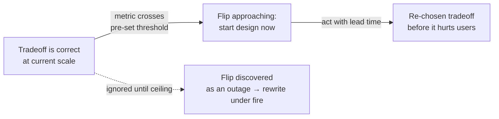

# Thinking in Tradeoffs — Professional

> **What?** At the staff/principal level, thinking in tradeoffs is an *organizational* skill, not just a technical one. Your leverage is no longer in making the best individual tradeoff — it's in shaping which tradeoffs the whole team is *allowed to make implicitly*, making the system's load-bearing tradeoffs legible across the org, recognizing the rare scale thresholds where a foundational tradeoff is about to flip for the *entire* product, and defending an unpopular-but-correct tradeoff to people who only see one axis.
> **How?** You build the scaffolding — decision records, fitness functions, "tradeoff budgets" — that makes good tradeoffs the default and bad ones visible. You teach engineers to *name the price* before shipping. And you own the small number of one-way-door tradeoffs that, if wrong, the company pays for over years.

---

## 1. Your job is the tradeoffs nobody is consciously making

A team's worst tradeoffs are never the ones argued about in a design review — those got attention. They're the **implicit, defaulted, accreted** ones:

- Every service defaulted to synchronous calls because that's what the template did → the org accidentally chose a tight-coupling tradeoff *system-wide*, and now one slow service browns out ten others.
- Every team added retries → the org chose, without a meeting, a retry-storm failure mode.
- Each feature added a config flag → the org traded simplicity for flexibility 4,000 times, and now the config space is untestable.

The staff move is to **make the defaulted tradeoff visible and deliberate.** You can't review every PR, so you change what the *default* trades away:

- Make the service template **async-first** (or ship a circuit breaker by default) so the coupling tradeoff is opt-out, not opt-in.
- Add a lint/CI **fitness function** that fails the build when a service exceeds N synchronous dependencies, or when a retry lacks a budget/jitter.
- Provide a paved road where the *good* tradeoff is the path of least resistance.

> Principle: at scale you don't win by making each tradeoff well — there are too many. You win by **changing the default tradeoff** so that ten thousand unexamined decisions land on the right side automatically.

---

## 2. Make the load-bearing tradeoffs legible

Every system rests on a few **load-bearing tradeoffs** — the three or four choices that, if reversed, would force a rewrite. Most of the org doesn't know what they are. Your job is to surface and document them so they're decided once, consciously, and not silently eroded.

A **tradeoff register** for a system might read:

| # | Load-bearing tradeoff | Side we chose | Assumed context (the thing that, if it changes, flips this) |
|---|---|---|---|
| 1 | Consistency vs availability | **AP** (eventual) for the catalog | Stale prices for <5 s are acceptable to the business |
| 2 | Build speed vs op cost | **Fast-to-build** (managed services) | Eng time is scarcer than cloud spend at our stage |
| 3 | Coupling vs duplication | **Duplicate** read models per service | Teams must deploy independently |
| 4 | Generality vs performance | **General** API, specialized hot path only | Only checkout latency is business-critical |

The right-hand column is the most valuable thing in the document. It tells the *future* org **what evidence would justify reopening the decision.** When the business later says "stale prices are now costing us money," everyone can see that this *invalidates* tradeoff #1 — it's not a surprise, it's a documented trigger. This is the antidote to "why on earth did they build it this way?": the reasoning is inherited, not just the artifact. (ADRs are the concrete vehicle; the systemic point is that the *assumption* must be recorded, not only the choice.)

---

## 3. Recognize when scale is about to flip a foundational tradeoff

Middle engineers learn that tradeoffs flip with scale. The staff engineer's edge is **seeing the flip coming before it hits**, because reacting after is a rewrite under fire.

Signals a foundational tradeoff is about to invert:

| Foundational tradeoff | Currently right because... | Watch for this signal that it's flipping |
|---|---|---|
| Monolith over services | Team is small, one deploy is fine | Deploys serialize; teams block each other; build > 30 min |
| Single DB over sharding | Joins are free, one node fits | Vertical scaling tops out; write IOPS near ceiling; p99 creeping |
| Strong consistency | Cheap at current node count | Cross-region added; coordination latency now visible to users |
| Sync over async | Simplicity dominates | Fan-out depth grows; one slow dep causes correlated timeouts |
| In-house over buy | Differentiation, cost control | The component became commodity; team spends more maintaining than building |

The discipline: for each load-bearing tradeoff, **define the metric and threshold that means "flip approaching"** and put it on a dashboard. "When sustained write IOPS exceeds 70% of the instance ceiling, start the sharding design — not the migration, the *design*." You buy lead time. A flip you see 6 months out is a roadmap item; the same flip discovered at 100% utilization is an incident.

---

## 4. Defending the correct-but-unpopular tradeoff

Much of the role is holding a tradeoff line against pressure from people who can only see one axis. Patterns:

- **The single-axis stakeholder.** Sales sees only "ship faster" (the fast-to-build axis); they don't feel the op-cost axis. Your job isn't to say no — it's to **make the hidden axis visible**: "Yes, we can ship in two weeks instead of six. The price is ~$40k/yr more in infra and a known re-platform in Q3. If that price is acceptable to you with eyes open, let's do it." Now it's *their* informed decision, not your obstruction.
- **The cargo-cult best practice.** "Netflix uses microservices, so we should." Re-surface the assumed context: "Microservices trade simplicity for independent deployability — that pays off above ~50 engineers. We have 12. The tradeoff is currently against us." (See [senior §5](./senior.md).)
- **The free-lunch claim.** Someone proposes a change that "improves everything." Either they found genuine slack (great — verify it) or they haven't found the cost. Make them name the price: "What does this trade away? If the answer is 'nothing,' we were off the Pareto frontier — let's confirm that's true, because it usually isn't."

The senior communication tool is to **always quote both columns.** Never argue "we shouldn't do X." Argue "X trades A for B; here's why B matters more *in our context*." You're not the person who says no — you're the person who shows the bill.

---

## 5. Push the frontier strategically, not reflexively

Teams either accept every tradeoff (and stay slow/fragile) or try to push every frontier (and drown in complexity and spend). The staff skill is choosing the *few* frontiers worth pushing:

- **Push** the frontier where the constraint is **business-critical and durable** — e.g., spend real money/complexity on checkout latency, because conversion is the company's lifeblood and that won't change.
- **Accept** the tradeoff everywhere it's **not** dominant — let the admin dashboard be slow; nobody's revenue depends on it.

Pushing the frontier always costs **money or complexity** (a CDN, multi-region, a custom engine, a bigger team). Each push you authorize is a permanent tax on the org's cognitive budget. So treat "push the frontier" as a scarce resource you spend only on the dominant constraint — exactly the [leverage-points](../06-leverage-points-and-bottlenecks/) discipline applied to architecture. A team that pushes ten frontiers has ten times the operational surface and usually a worse product than one that pushed the right two.

---

## 6. Teach the team to surface hidden tradeoffs

Your durable legacy is a team that does this without you. Concrete teaching mechanisms:

- **Require a "Tradeoffs" section in every design doc.** Not "Pros/Cons" — explicitly: *what does this trade away, and why is that acceptable here?* Reject docs that list only benefits; a benefit with no named cost means the author hasn't found the cost yet.
- **Run "name the dominant axis" in design reviews.** Before debating solutions, force the question: *which single property decides this?* Half the debate evaporates once the team agrees writes (not query flexibility) dominate.
- **Teach the slack test.** When someone claims a pure win, ask: "Were we on the frontier? If this is free, we were dominated — let's verify the slack is real." It trains the reflex that free lunches are usually un-found costs.
- **Normalize "it depends → here's what it depends on."** Praise the engineer who finishes the sentence; gently push the one who stops at "it depends."
- **Keep the tradeoff register alive** (§2) and review it when context shifts. A dead document teaches nothing; a living one teaches the whole team what the system's real load-bearing decisions are.

The objective-evaluation toolkit (decision matrices, one-way vs two-way doors, reversibility) is the companion skill — point people to [evaluating tradeoffs objectively](../../04-critical-thinking/04-evaluating-tradeoffs-objectively/). This topic gives the team the *eyes* to see that a tradeoff exists and *which axis matters*; that one the *scales* to weigh it. A team needs both.

---

### Takeaways

- At scale you can't review every tradeoff — change the **default** so unexamined decisions land right (paved roads, fitness functions).
- Maintain a **tradeoff register**: not just what was chosen, but the **assumed context** whose change would flip it.
- **See scale-flips coming** — put the flip-threshold metric on a dashboard and buy lead time; a flip found at the ceiling is an outage.
- Defend tradeoffs by **showing both columns** — make the hidden axis visible so single-axis stakeholders decide with eyes open.
- Spend "**push the frontier**" only on the dominant, durable constraint; every push is a permanent complexity tax.
- Your legacy is a team that **names the price before shipping** and finishes every "it depends."

**Next:** [check your understanding](#check-your-understanding) and [check your understanding](#check-your-understanding) — or revisit the [systems-thinking section](../) and the [roadmap section root](../../README.md).

---
## Recall and apply

**Practice loop:** Compare two options against the stated goal, name who pays each cost, and choose a metric to revisit the decision.

Try to answer these questions from memory:

1. What does it mean to "push the frontier" instead of accepting a tradeoff?
2. Generality vs performance — explain with an example.
3. What is Tesler's Law (conservation of complexity)?
4. Security vs usability — how do you avoid a bad spot on this frontier?
