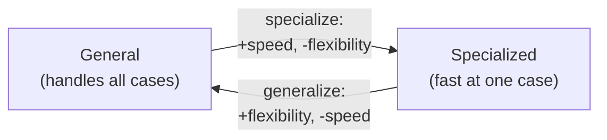

# Thinking in Tradeoffs — Senior

> **What?** At the senior level, a tradeoff is a *property of the system as a whole*, not of one component — and some tradeoffs are forced by mathematics, not by laziness or budget. You reason about how local tradeoffs compose into global behavior, recognize the handful of *fundamental* tradeoffs that cannot be engineered away (only relocated), and design so that the costs land where the system can best absorb them.
> **How?** For any significant decision: name the fundamental tradeoff it touches (consistency/availability, generality/performance, etc.), identify the dominant constraint *for this system at this scale*, decide whether to accept or push the frontier, and place the unavoidable cost where it does the least harm. Then write the tradeoff into a decision record so the next person inherits the reasoning, not just the result.

---

## 1. Some tradeoffs are theorems, not choices

Most tradeoffs are economic — you *could* have both if you spent enough. A few are **mathematically forced**: no amount of money or cleverness removes them. You can only choose which side to give up and where to hide the pain.

### 1.1 CAP — the canonical forced tradeoff

The **CAP theorem** (conjectured by Eric Brewer, 2000; proved by Gilbert & Lynch, 2002) states: a distributed data store cannot simultaneously guarantee all three of

- **C**onsistency — every read sees the latest write,
- **A**vailability — every request gets a (non-error) response,
- **P**artition tolerance — the system keeps working when the network drops messages.

The trap in the common phrasing ("pick 2 of 3") is that **partitions are not optional** — networks *will* drop packets, so P is a given in any distributed system. The real choice is binary and only happens *during a partition*:

| During a network partition... | You are a... | Examples |
|---|---|---|
| Refuse writes/reads to stay consistent → lose availability | **CP** system | etcd, ZooKeeper, HBase, Spanner |
| Serve possibly-stale data to stay up → lose consistency | **AP** system | Cassandra, DynamoDB, Riak |

No system "beats" CAP. Spanner *looks* like it beats it only because it uses atomic clocks (TrueTime) to make partitions rare and short — it's still CP, it just narrows the window. That's pushing the frontier, not escaping the theorem.

### 1.2 PACELC — the half of the tradeoff people forget

CAP only describes behavior *during* a partition, which is rare. **PACELC** (Daniel Abadi, 2012) completes it:

> **If** there is a **P**artition, trade **A**vailability vs **C**onsistency; **E**lse (normal operation), trade **L**atency vs **C**onsistency.

This is the more useful framing for daily work, because the **else** branch is where you live 99.9% of the time. Even with no partition, **stronger consistency costs latency** — every node you must coordinate with before answering adds a round trip.

| System | PACELC classification | Reading |
|---|---|---|
| DynamoDB (default) | **PA/EL** | Available under partition; low latency normally — both favor availability/speed over consistency |
| Spanner | **PC/EC** | Consistent under partition; consistent normally — pays latency for it |
| Cassandra (tunable) | **PA/EL** by default | You dial consistency per-query (QUORUM, ONE…) — moving yourself along the frontier per request |

The senior insight: consistency is not a yes/no system property — it's a **per-operation latency budget** you spend. A single system can be EC for a financial ledger write and EL for a "last seen" timestamp.

---

## 2. Generality vs performance

A general solution handles many cases; a specialized one is faster at one. They trade directly, and the trade is usually large.

- A **generic JSON parser** handles any schema. A **code-generated parser** for one known schema can be 5–50× faster because it skips all the branching for cases that can't occur.
- A **general-purpose database** serves any query. A **purpose-built index** (e.g., a bloom filter, an inverted index) crushes one query pattern and is useless for others.
- A **virtual-dispatch interface** (`io.Reader`) is flexible; a **monomorphized / inlined** concrete call is faster but rigid.

The senior move is to **specialize only the dominant path**. Profile, find the 5% of operations that consume 80% of resources, specialize *those*, and keep the rest general. This is the **end-to-end argument** (Saltzer, Reed & Clark, 1984) in spirit: don't push a feature (or an optimization) into a low, general layer if only one high-level case needs it — handle it where the specific knowledge lives.

---

## 3. Tradeoffs compose — local optima ≠ global optimum

The senior failure mode isn't picking a bad tradeoff in isolation; it's letting good *local* tradeoffs sum to a bad *global* result.

- Each team caches its own service's data (locally optimal: each is fast). Globally: five caches with five inconsistent copies and an invalidation nightmare.
- Each service retries on failure (locally sensible). Globally: a **retry storm** — a slow dependency gets `3^N` the traffic and the whole system collapses (a [second-order effect](../03-second-order-effects/)).
- Each service strengthens its own consistency (locally safe). Globally: end-to-end latency is the *sum* of every coordination cost, and the product is unusably slow.

The principle: **a tradeoff chosen for one component must be evaluated against the behavior of the whole.** This is exactly the [parts/whole and emergence](../01-parts-whole-and-emergence/) lens applied to decisions. Ask not "is this the right tradeoff for my service?" but "what does this tradeoff do when *everyone* makes it?"

---

## 4. Place the cost where the system absorbs it best

You can't delete the unavoidable cost of a forced tradeoff — but you usually get to choose *where it lands*. Senior design is largely about **routing difficulty to the cheapest place to pay it.**

| Forced tradeoff | Where to put the unavoidable cost |
|---|---|
| Consistency vs latency | Pay latency on *writes* (rare) not *reads* (hot) — e.g., write-through with denormalized read models |
| Space vs time | Spend memory on the hot 20% of keys (cache), recompute the cold tail |
| Security vs usability | Add friction at *high-risk* actions (new device, password change), keep low-risk flows smooth — step-up auth |
| Simplicity vs flexibility | Keep the *core* simple and rigid; push flexibility to the *edges* (plugins, config, adapters) |
| Coupling vs duplication | Couple on *stable* contracts; duplicate around *volatile* ones |

Tesler's **Law of Conservation of Complexity**: every application has an irreducible amount of complexity; the only question is *who* deals with it — the user, the application developer, or the platform. You don't remove complexity by hiding it; you decide who pays. A clean API doesn't make complexity vanish — it moves it from a thousand callers into one implementation. That's usually a great trade, but it *is* a trade.

---

## 5. Re-derive "best practices" from the assumed context

A senior doesn't follow best practices; a senior **knows the context each best practice assumes and notices when it no longer holds**, because that's when the tradeoff flips.

| "Best practice" | Hidden assumed context | When it flips |
|---|---|---|
| Normalize your schema (3NF) | Writes/consistency dominate; storage scarce | Read-heavy analytics → **denormalize**, accept update anomalies |
| Don't repeat yourself (DRY) | The duplicated code is *one* concept | The two copies are different concepts that drift → coupling was the mistake |
| Stateless services | Horizontal scale dominates | Ultra-low-latency stateful (trading, gaming) → keep state local |
| Synchronous request/response | Simplicity & strong consistency matter | High fan-out / slow downstreams → **async / event-driven** |
| Strong consistency | One node, or correctness is non-negotiable | Global scale, availability dominates → **eventual** |

The disciplined habit: when you cite a best practice, state its assumption in the same breath. "We'll normalize — assuming this stays write-heavy. If it becomes a read-heavy reporting table, we revisit." That sentence is the difference between an engineer applying a rule and an engineer who understands *why* the rule exists. (For *how* to evaluate the flipped case rigorously, defer to [evaluating tradeoffs objectively](../../04-critical-thinking/04-evaluating-tradeoffs-objectively/); deriving the assumption from scratch is a [first-principles](../../05-first-principles-thinking/) move.)

---

## 6. Worked example: the read path of a social feed

Pull it together on one decision. A feed needs to render in <200 ms at p99; users post ~10×/day, read ~500×/day (read:write ≈ 50:1).

1. **Dominant constraint?** Read latency (read-heavy, strict p99). Write latency barely matters.
2. **Fundamental tradeoff touched?** Read-optimized vs write-optimized, and consistency vs latency (PACELC's **EL**).
3. **Decision:** **fan-out on write** — when you post, pre-compute followers' feeds (slow, rare writes) so reads are a single fast lookup. We *deliberately* pay write cost to buy read latency, matching the dominant axis.
4. **Where does it break (scale flip)?** A celebrity with 50M followers makes one write fan out to 50M — write cost explodes. So **hybrid**: fan-out on write for normal users, fan-out on *read* (merge at query time) for celebrities. The tradeoff *flipped* for high-follower accounts, so the design splits.
5. **Consistency:** a post appearing 2 s late in a feed is fine → choose **EL** (eventual, low latency). A like-count being approximate is fine too.
6. **Record it:** write the ADR — "fan-out-on-write, hybrid above 100k followers, eventual consistency on feed entries" — with the read:write ratio and latency budget that justified it, so the next engineer knows what would *invalidate* the choice.

---

### Takeaways

- A few tradeoffs are **theorems** (CAP) — you choose a side and a *place* for the pain, never escape it. **PACELC** is the more practical framing: latency vs consistency even with no partition.
- **Generality vs performance** is real and large; specialize only the dominant path (end-to-end argument).
- Local-optimal tradeoffs can sum to a global disaster — evaluate each against the **whole system's** behavior.
- You rarely delete the cost; you **route it** to where the system pays it cheapest (Tesler's Law: complexity is conserved, not removed).
- Best practices are tradeoffs with assumed contexts — state the assumption, and watch for the **scale where it flips**.

**Next:** [professional.md](./professional.md) — defending system-wide tradeoffs, teaching a team to surface hidden ones, and tradeoff-aware architecture.

---
## Check your understanding

Try to answer these questions from memory:

1. Name the tradeoff in adding a database index.
2. Name the tradeoff in caching.
3. Coupling vs duplication — when do you prefer duplication?
4. Give an example of a tradeoff that flips with scale.
