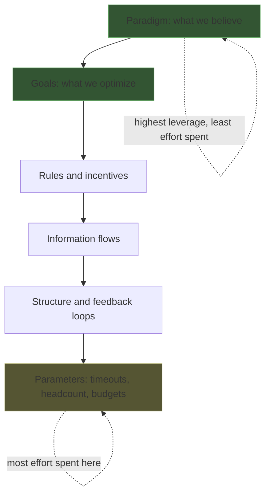

# Leverage Points and Bottlenecks — Professional

> **What?** Leverage and constraints at the scale of organizations, portfolios, and architecture. The highest leverage points are not parameters or even code — they are *goals* and *paradigms* (Meadows' top tiers). At staff/principal level, the job is to find the one constraint on a *system of teams*, invest engineering capital where leverage is highest, and recognize that the most consequential interventions reshape what the organization optimizes for, not how fast a function runs.
>
> **How?** Map the value stream across teams to find the org-level constraint. Apply Theory of Constraints to the portfolio, not the request path. Spend influence on goals and rules (high leverage), not on dictating parameters (low leverage). Audit where the org's effort goes versus where its constraint is — and close that gap.

---

## 1. The principal's actual job: finding the constraint on a system of teams

At staff/principal scale, a single service's bottleneck is rarely the thing that matters. The constraint is on the throughput of the whole engineering organization toward its goals — and it's usually structural, organizational, or paradigmatic, not a hot function.

Goldratt's chain still holds: the org has *one* governing constraint at any time, and improving anything else is local-optimization theater. The skill is widening the lens until you can see it.

| Apparent problem (local) | Likely org-level constraint |
|---|---|
| "Team X ships slowly" | A shared platform team everyone queues behind |
| "Quality is poor" | The goal/incentive rewards feature count, not reliability |
| "Migrations take years" | No deprecation paradigm — nothing is ever removed |
| "Hiring isn't helping" | The constraint is onboarding/review capacity, not headcount |
| "Incidents keep recurring" | No closed feedback loop from postmortem to backlog |

The trap at this level is the same as everywhere, scaled up: leaders **add resources to non-constraints** because it's visible and fundable. Hiring 20 engineers into a team that's blocked on a shared 3-person platform team makes the org *slower* (more demand on the constraint, more coordination), not faster. This is Goldratt's central warning — *throughput is governed by the constraint; everything else is inventory and operating expense.*

## 2. Theory of Constraints on the portfolio

Run the five focusing steps on the org's value stream — idea → spec → design review → build → code review → integration → deploy → feedback — and find the longest *wait*, not the longest *work*.

A worked org example. A 60-engineer org ships ~4 features/quarter and wants 8. Map the value stream by *wait time*:

```
Idea → spec:            2 days
Spec → design approval: 11 days   ← work waits in an architecture review queue
Design → build:         8 days
Build → code review:    6 days    ← second-longest wait
Review → deploy:        1 day
```

The constraint is the **architecture review board** (11-day wait), not the engineers building. Doubling build capacity (hiring) does nothing — work just piles up *before* the review queue. The five steps:

- **Identify:** the review board is the constraint.
- **Exploit:** it meets 1×/week and reviews everything serially. Pre-triage trivial changes out; batch context. Free throughput, no new hires.
- **Subordinate:** stop teams from racing ahead generating designs that pile up unreviewed — pull, don't push.
- **Elevate:** delegate review authority for low-risk changes to senior engineers in-team (this is also a *Meadows self-organization* move — high leverage).
- **Repeat:** now code review (6 days) is the constraint. Apply again.

Note the elevate step changed a **rule** (who may approve), which is a far higher leverage point than any parameter. That's not an accident — at org scale, elevating a constraint almost always means changing a rule or a goal.

## 3. The highest leverage points: goals and paradigms

Meadows ranks **goals** and **paradigms** as the strongest leverage points — above rules, information flows, and everything numeric. At principal level this stops being abstract.

**Goals.** The system *will* optimize for whatever you actually measure and reward, regardless of what you say. If the org's goal (as encoded in promo criteria, OKRs, dashboards) is "ship features," then reliability, security, and tech-debt work are non-goals and will be starved — no amount of process fixes that. Changing the goal — e.g. adding an error budget that *gates* feature work on reliability — is a higher-leverage act than any architecture decision, because it redirects the entire system's optimization pressure.

> Watch for Goodhart at this tier: the moment a metric becomes the goal, the system games it. "Optimize deploy frequency" → tiny no-op deploys to pad the number. The leverage is in choosing a goal that's robust to gaming, not in pushing harder on a gameable one.

**Paradigms.** The deepest leverage — and the slowest, most resisted. The shared, usually unspoken belief from which goals arise. Examples and the shift each enables:

| Old paradigm | New paradigm | What it unlocks |
|---|---|---|
| "We can't afford downtime" | "We design for graceful degradation" | Faster deploys, chaos testing, smaller blast radius |
| "Senior engineers approve everything" | "We build guardrails so teams self-serve safely" | Removes the human-review constraint org-wide |
| "Migrations are special projects" | "Deprecation is continuous, owned by platform" | Kills the years-long-migration constraint at its root |
| "More headcount = more output" | "Throughput is constraint-bound" | Stops mis-investment in non-constraints |

Meadows' deepest point — the power to *transcend paradigms*, to hold that no single model is "true" — is what lets a principal switch frames: see the same org as a throughput system, a feedback system, and an incentive system, and choose the lens that exposes the real constraint. The highest-leverage engineers aren't attached to one model; they pick the model that reveals the constraint others can't see.



The diagram's inversion *is* the principal's edge: the org spends nearly all its energy at the bottom (budgets, headcount, timeouts) and almost none at the top (goals, paradigms) — where the leverage actually is.

## 4. Investing engineering effort where leverage is highest

A principal allocates a scarce resource — senior engineering attention — and Amdahl plus ToC give the allocation rule.

**The Amdahl filter for roadmaps.** Before funding any large effort, estimate its `p` — what fraction of the outcome it can touch. A 6-month platform rewrite that addresses a part responsible for 15% of delivery friction is capped at ~1.18× improvement (`1/(1-0.15)`). That's often a *no*, and the math says so before the quarter is spent. Conversely, a 2-week change to the constraint (the review queue at 11 of 28 days, `p≈0.39`) is capped near 1.6× — fund it first. **Leverage per engineer-week is the allocation currency.**

**Local optima are the enemy.** Every team rationally optimizes its own metrics; the sum is often a *worse* whole, because they over-invest in non-constraints (Goldratt's "local efficiency ≠ global throughput"). A platform team proud of 99.99% uptime on a service that isn't the constraint has produced beautiful local numbers and zero org throughput. The principal's job is to make global throughput legible enough that local optimization stops winning the argument.

**Make the constraint visible.** The single highest-leverage *information* move is publishing where the constraint is — a value-stream map, a "where work waits" dashboard. Most mis-investment is honest: people optimize what they can see. Show the constraint and effort reallocates itself, often without a single mandate. That's leverage via information flow — a Meadows mid-high tier — achieved with a dashboard, not a reorg.

## 5. The discipline at scale

The recurring question, at portfolio scale:

> **What is the ONE constraint on the org's throughput toward its real goal — and is our scarcest talent on it, or on local optima that feel productive?**

Operating principles that fall out of it:

1. **Widen the lens until you find the real constraint** — it's usually a wait between teams, a rule, or a goal, not a slow service.
2. **Exploit and subordinate before you elevate** — recover free org capacity (kill queues, batching, junk work) before hiring or rebuilding.
3. **Spend influence at the top of Meadows** — change goals and rules; resist the pull to dictate parameters, which is both low-leverage and demoralizing.
4. **Filter the roadmap through Amdahl** — fund by leverage-per-engineer-week; kill big efforts aimed at small `p`.
5. **Re-find the constraint continually** — at org scale the constraint moves quarterly; today's right investment is next quarter's local optimum.
6. **Hold models loosely** — switch frames (throughput / feedback / incentive) to see the constraint others miss; that frame-switching is the deepest leverage of all.

## Where this connects

- [Thinking in trade-offs](../05-thinking-in-tradeoffs/) — elevating an org constraint always trades against something (autonomy, speed, cost); choose deliberately.
- [Feedback loops](../02-feedback-loops/) — goals and incentives are loops; the highest leverage often reshapes the loop, not the value flowing through it.
- [Parts, whole, and emergence](../01-parts-whole-and-emergence/) — local optima summing to a worse whole is emergence; the constraint is a property of the whole org.
- [Reasoning from fundamentals](../../05-first-principles-thinking/01-reasoning-from-fundamentals/) — re-deriving "what is the goal, really?" is how you find a paradigm-level leverage point.
- [Measure before you optimize](../../09-scientific-and-hypothesis-driven/03-measure-before-optimize/) — value-stream mapping is "measure first" applied to the org.

---
## Check your understanding

Try to answer these questions from memory:

1. Distinguish Theory of Constraints from Amdahl's law. When do you use each?
2. A team wants to hire 10 engineers to ship faster. They're blocked on a 3-person shared platform team. What do you predict?
3. What's the single question that captures this whole topic?
4. What's the highest-leverage point of all, per Meadows, and why is it the hardest to use?
