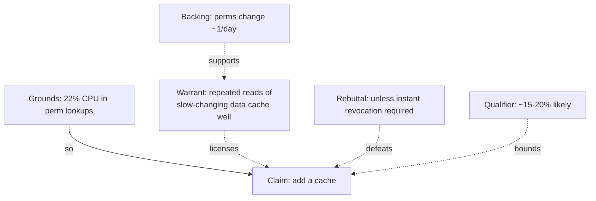

# Claims, Evidence, and Reasoning — Middle

> **What?** The discipline of structuring an engineering argument as **claim → evidence → warrant** (Toulmin's model), grading the evidence by quality, and matching the *strength* of your conclusion to the *strength* of your data. It also covers the two failure modes that wreck mid-level engineers' arguments: mistaking correlation for causation, and overstating a conclusion the evidence can't carry.
>
> **How?** When you propose a change, write the claim, attach the evidence, and *say the warrant out loud* — the rule that licenses the jump from one to the other. Then stress-test it: is the warrant actually true here? Is there a rebuttal? Could a confounder explain the data? Calibrate your verb ("this *proves*" vs. "this *suggests*") to what survives.

---

## Action card
1. Write the claim, grounds, and warrant.
2. Name a rebuttal and confidence level.
3. Test the warrant against a confounder or controlled comparison.

**Decision rule:** never make a system-level claim from an isolated measurement.

## 1. Toulmin's model: the warrant is the part you keep hiding

Stephen Toulmin's *The Uses of Argument* (1958) gives the most useful decomposition for engineering. A complete argument has six parts; the three that matter most day-to-day are the first three, and the one engineers omit is the **warrant**.

| Toulmin part | Meaning | Engineering example |
|--------------|---------|---------------------|
| **Claim** | The conclusion you assert | "We should cache the user-permissions lookup." |
| **Grounds (data/evidence)** | The facts you observed | "It's called 1,400×/request and the profile shows 22% of CPU there." |
| **Warrant** | The general rule connecting grounds → claim | "Repeated identical reads of slow-changing data are a textbook cache win." |
| **Backing** | Why the warrant itself holds | "Permissions change ~once/day; staleness window of 60 s is acceptable per product." |
| **Qualifier** | How strong the claim is | "*Probably* a 15–20% CPU reduction." |
| **Rebuttal** | Conditions under which the claim fails | "Unless permissions must be instantly revocable for security." |

The warrant is where most disagreements actually live, even though people argue about the claim. Two engineers can agree on the grounds ("22% of CPU is in permission lookups") and still disagree because they hold different warrants ("cache it" vs. "that's a sign the permission model is wrong, fix the root"). **Surfacing the warrant turns a stalemate into a discussable proposition.**



### The drill

For every non-trivial proposal, fill this template before you present:

```
Claim:    ________________________________________
Grounds:  ________________________  (and where to find them)
Warrant:  because <general rule> ______________________
Qualifier: this would __ (eliminate / reduce ~X% / maybe help) __
Rebuttal: this fails if ________________________________
```

If the warrant slot is empty, you have a coincidence dressed as a conclusion.

## 2. Grade the evidence, then grade the claim to match

A claim cannot be stronger than its evidence. Use an explicit hierarchy and let it cap your verbs.

| Tier | Evidence | Conclusions it can license |
|------|----------|----------------------------|
| **A** | Production profiler trace / flame graph on real traffic | "X *is* the bottleneck." |
| **B** | Representative load test (real data shapes, concurrency, warm caches) | "Under this load, X causes Y." |
| **C** | Microbenchmark (isolated function, synthetic input) | "X is faster *in isolation*; effect on the system is unknown." |
| **D** | Single anecdote / one-off observation | "X *might* happen; worth investigating." |
| **E** | Impression / "feels slow" / appeal to authority | "Hypothesis only — needs evidence." |

The trap at mid-level is the **microbenchmark-to-system leap**: you measure that `parseDate` is 40% faster and conclude the *service* will be 40% faster. It almost never is. If `parseDate` is 0.5% of request time, a 40% local win is a 0.2% global win — invisible. Amdahl's law is the warrant you keep forgetting: a speedup of factor *s* on a fraction *p* of the work gives overall speedup `1 / ((1-p) + p/s)`. Plug in `p=0.005, s=1.4` → 1.0014×. Two-tenths of a percent.

```text
microbench:  parseDate 40% faster   (tier C)
naive claim: "service 40% faster"   (tier A claim on tier C evidence — invalid)
honest claim: "parseDate is 0.5% of
              request time, so ~0.2%
              overall; not worth it"
```

## 3. Correlation is not causation — and incidents are full of it

The most expensive mid-level reasoning error is concluding that A caused B because A happened just before B. Incident timelines are *built* out of correlations.

### A realistic trap

p99 latency spiked at 14:02. The deploy went out at 14:01. Conclusion: "the deploy caused it, roll back." But also: a marketing email went out at 14:00 (traffic surge), and a daily batch job starts at 14:00. Three candidate causes, one effect. Rolling back the deploy and seeing latency recover **does not** prove the deploy was the cause if the batch job also finished around then.

### Bradford Hill criteria, adapted for engineering

Austin Bradford Hill's epidemiology criteria (1965) translate cleanly to incident and performance work. Before you accept "A caused B," check:

| Criterion | Question | Engineering application |
|-----------|----------|-------------------------|
| **Temporality** | Did the cause precede the effect? | Deploy timestamp strictly before the spike? Check clocks/timezones. |
| **Strength** | Is the effect large relative to noise? | 3× latency vs. 5% — the latter could be jitter. |
| **Consistency** | Does it reproduce? | Roll back → recover → re-deploy → spike again. |
| **Dose-response** | More cause → more effect? | 2× traffic → 2× the slowdown? |
| **Plausibility** | Is there a mechanism? | "How, specifically, would this change add 500 ms?" If you can't name the path, suspect a confounder. |
| **Experiment** | Can you intervene? | The gold standard: change *one* variable and watch. |

The strongest move available to engineers (and unavailable to epidemiologists) is the **controlled intervention**: revert exactly one thing, keep everything else fixed, observe. Reproducibility is what upgrades a correlation to a cause.

## 4. Reproducibility: the line between "found it" and "saw it once"

A bug or regression you can reproduce on demand is *evidence*. One you saw once in production and can't recreate is a *lead*. The difference governs how confidently you can act.

- **Reproducible** → you can bisect, you can verify the fix actually fixes it, you can write a regression test. Confidence: high.
- **Non-reproducible** → you can hypothesize, add instrumentation, and wait. Acting on a non-reproducible report by "fixing" something and declaring victory is **cargo-cult debugging** — you changed something, the symptom went away, and you've learned nothing about whether they're related.

> Richard Feynman's "Cargo Cult Science" (1974) names exactly this: going through the motions of investigation without the integrity that makes it real. The form (you shipped a fix) without the substance (you proved the fix addresses the cause).

When a fix lands for a flaky problem, state the qualifier honestly: "This *should* fix it; we couldn't reproduce, so we've added logging to confirm in production over the next week." That sentence is more senior than a confident "Fixed."

## 5. Calibration: say exactly how sure you are

Calibration is the match between your stated confidence and your actual hit rate. A well-calibrated engineer who says "90% sure" is right about 9 times in 10. Most people are *overconfident*: their "definitely" is right 70% of the time.

Build a confidence vocabulary and use it deliberately:

| Phrase | Implied probability | Appropriate evidence |
|--------|--------------------|--------------------|
| "This proves / is" | ~99% | Tier-A evidence + reproduced |
| "This strongly suggests" | ~80% | Tier-A/B, one run |
| "I think / probably" | ~60% | Tier-C, or solid reasoning, no measurement |
| "It's possible that" | ~30% | Anecdote, hypothesis |
| "I'd guess" | <20% | Impression only |

Two practical rules:

1. **Pre-commit your prediction.** Before you run the experiment, write down what you expect and how sure you are. Comparing after-the-fact kills hindsight bias.
2. **Down-weight your own claims.** When you *want* something to be true (your design, your PR), assume you're more confident than you should be and demand the evidence you'd demand of someone else.

## 6. Putting it together: a review comment that does it right

A PR description says: *"Replaced the regex validator with a hand-written parser — 3× faster (benchmark attached)."*

A mid-level reviewer applies the model:

> "Nice — the microbenchmark is tier C, so I want to check the warrant before we call this a win. Two questions: (1) What fraction of request time does validation take in production? If it's <1%, a 3× local win won't move p99. (2) The benchmark uses 20-char inputs; our real inputs are mostly 200+ chars — does the advantage hold there, or does the regex's DFA win on long strings? If you've got a flame graph showing validation as a hotspot, I'll approve immediately."

Notice what happened: the reviewer accepted the *measurement* (the benchmark is real), challenged the *warrant* (local → global), named the *confounder* (input size), and stated the *evidence that would change their mind* (a flame graph). No one got called wrong; the argument got stronger.

---

### Where this connects

- [Logical Fallacies in Engineering](../02-logical-fallacies-in-engineering/) — appeal-to-authority, false-cause, hasty generalization in their own right.
- [Cognitive Biases in Code Decisions](../03-cognitive-biases-in-code-decisions/) — confirmation bias and why you over-trust your own warrants.
- [Evaluating Tradeoffs Objectively](../04-evaluating-tradeoffs-objectively/) — once a claim survives, weighing it against cost.
- [First-Principles Thinking](../../05-first-principles-thinking/) — deriving the warrant from mechanism instead of borrowing it.
- [Scientific and Hypothesis-Driven Thinking](../../09-scientific-and-hypothesis-driven/) — the controlled-intervention loop in full.
- Back to [Critical Thinking](../) · [Engineering Thinking](../../README.md).

---
## Recall and apply

Try to answer these questions from memory:

1. A microbenchmark shows `parseDate` is 40% faster. Is "the service will be 40% faster" a valid conclusion?
2. p99 latency spiked one minute after a deploy. Is the deploy the cause?
3. Name the Bradford Hill–style criteria you'd use to move from "A correlates with B" to "A caused B" in an incident.
4. A teammate says "Google does it this way, so we should too." How do you respond?
