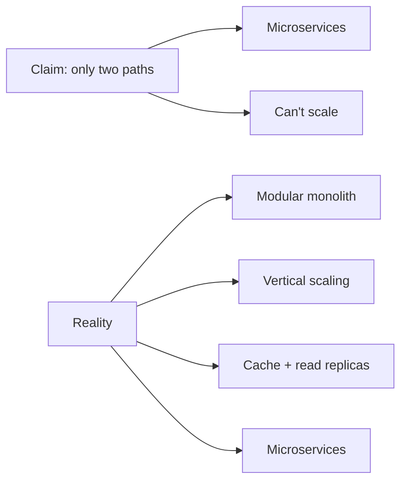

# Logical Fallacies in Engineering — Junior

> **What?** A logical fallacy is a flaw in the *structure* of an argument — the conclusion does not actually follow from the reasons given, even when the words sound persuasive. In engineering, fallacies most often hide inside confident one-liners during code reviews, design debates, and Slack threads.
>
> **How?** As a junior, your job is recognition, not combat. Learn to *name* the most common shapes, spot them in real technical sentences, and ask one clarifying question that reveals the gap — without making it personal.

---

## 1. Why this matters before you can spot it

A bad argument can reach a true conclusion by accident, and a good argument can reach a false one. So "the result was right" never tells you the *reasoning* was right. Engineering decisions compound: a design choice defended by a fallacy today becomes the load-bearing assumption nobody dares to question in two years.

You don't need to win debates. You need to stop *yourself* from being convinced by a sentence that only sounds like a reason. The defense is simple: when a claim feels obviously right and you can't say *why*, slow down and look at the shape of the argument.

This topic is the catalog of shapes. Its siblings cover the rest of the toolkit: how to separate a [claim from its evidence](../01-claims-evidence-and-reasoning/), the [cognitive biases](../03-cognitive-biases-in-code-decisions/) that *produce* these fallacies in your own head, and how to [evaluate tradeoffs](../04-evaluating-tradeoffs-objectively/) once the noise is gone.

---

## 2. The starter set: six fallacies you will hear this week

These are the ones that show up in almost every team. Learn the *shape* first, then the name sticks.

| Fallacy | The shape | Engineering example | First response |
|---|---|---|---|
| **Appeal to authority** | "X does it, so it's correct" | "Google uses microservices, so we should too." | "What problem of theirs does it solve — and do we have that problem?" |
| **Appeal to novelty** | "It's newer, so it's better" | "We should rewrite this in the new framework — it's 2026." | "Newer in what measurable way? What does it cost us?" |
| **Appeal to tradition** | "We've always done it this way" | "We've always deployed on Fridays, it's fine." | "Is it fine, or have we just survived it so far?" |
| **False dichotomy** | "Only A or B" (when C exists) | "Either we adopt Kubernetes or we can't scale." | "Are those the only two options? What's between them?" |
| **Bandwagon** | "Everyone's doing it" | "Everyone's moving to serverless." | "Does our workload match theirs? What's our actual constraint?" |
| **Hasty generalization** | One case → universal rule | "We had one Redis outage, Redis is unreliable." | "One incident, or a pattern? What's the failure rate?" |

Notice the response column. Not one of them says "you're wrong." Each one asks a question that moves the conversation from *assertion* to *evidence*. That is the entire junior-level skill.

---

## 3. Appeal to authority — "Google does it this way"

This is the single most common fallacy in engineering, because we genuinely *should* learn from experts. The fallacy isn't citing an authority — it's treating the citation as the *whole* argument.

```text
Reviewer:  We should shard the database now.
You:       Why now? We're at 40 GB.
Reviewer:  Because that's how the big companies do it.
```

The gap: "big companies do X" is evidence about *their* context, not a reason for *ours*. Google shards because they have petabytes and thousands of engineers to operate the complexity. You have 40 GB and three engineers. The same action is wise for them and reckless for you.

**Valid use of authority:** "Postgres docs recommend `jsonb` over `json` for indexed lookups, here's the benchmark." That cites an authority *and* gives the reason the authority is right. The authority is a shortcut to evidence, not a replacement for it.

> Rule of thumb: an appeal to authority is only as strong as the *reasoning* the authority would give. If you can't reconstruct that reasoning, you're cargo-culting (covered later).

---

## 4. Appeal to novelty and appeal to tradition — the time-based pair

These two are mirror images. One says "new = good," the other says "old = good." Both substitute *age* for *merit*.

```text
Appeal to novelty:   "Rewrite it in Rust, it's the modern choice."
Appeal to tradition: "Keep it in our old framework, it's battle-tested."
```

Neither sentence contains a single fact about *your* code. The honest version of each:

- Novelty done right: "Rust gives us memory safety without GC pauses; our p99 latency is dominated by GC, here's the trace."
- Tradition done right: "The old framework has handled our exact traffic for five years with zero security CVEs; the new one is unproven at our scale."

The fix is identical for both: ask *what specific, measurable thing* the age is standing in for. If nothing concrete comes back, the age was the whole argument — and age is not a reason.

---

## 5. False dichotomy — "either microservices or we can't scale"

A false dichotomy presents two options as if they're the only two, hiding the middle. It's powerful because choosing *between* two things feels like rigorous thinking, even when the real answer is "neither" or "a third thing."



The presenter narrows the world to two doors so you'll walk through the one they prefer. Your move is to widen it back: **"Are those really the only options?"** Almost always, a modular monolith, a cache layer, or simply a bigger machine sits in the gap they erased.

This connects directly to evaluating tradeoffs: a real tradeoff compares *all* the live options on shared criteria. A false dichotomy is a tradeoff with the inconvenient options deleted. See [evaluating tradeoffs objectively](../04-evaluating-tradeoffs-objectively/).

---

## 6. Bandwagon — "everyone's moving to serverless"

Bandwagon (also "appeal to popularity") says a choice is correct because it's popular. Popularity is real information — it can signal that something *works for many people* — but it says nothing about whether it fits *your* constraints.

```text
"Everyone's using GraphQL now, REST is dead."
```

Two problems. First, "everyone" is rarely true and never measured. Second, even if true, GraphQL solves over-fetching for clients with many shapes of query; if you have one mobile client hitting five stable endpoints, it adds complexity for a problem you don't have.

The counter is gentle and concrete: **"What's the specific problem it solves, and do we have that problem?"** This redirects from social proof to your actual requirements. The deeper, more dangerous version of bandwagon — copying *rituals* without understanding them — is **cargo-culting**, covered at the next level.

---

## 7. Hasty generalization — one incident becomes a law

A hasty generalization draws a universal rule from a sample too small to support it. One data point is an anecdote, not a trend.

```text
"The deploy script failed once last month — automated deploys aren't safe,
 let's go back to manual."
```

One failure out of how many deploys? If it's 1 in 200 and manual deploys fail 1 in 20, the "unsafe" automation is ten times *safer*. The single memorable failure feels heavier than the dozens of silent successes — that's the bias underneath the fallacy.

The counter is to ask for the **base rate**: "How often does this actually happen, across how many runs?" One incident *justifies an investigation*, not a conclusion. The right response to a single outage is a hypothesis and a metric, not a permanent rule.

---

## 8. The junior's three-step defense

You don't need to memorize twenty Latin names. You need a reflex:

1. **Separate the claim from the reason.** "We should do X" is the claim. What's offered as the *because*? If there's no "because," there's no argument yet — just an assertion.
2. **Test the reason on its own.** Does "Google does it" actually support "we should do it"? Read the reason as if it were about a *different* decision. If it would justify almost anything, it's too weak.
3. **Ask one opening question.** Not "you're committing the appeal-to-authority fallacy." That escalates and makes people defensive. Instead: *"What specifically does that buy us here?"* The question does the work; the name is for your own notes.

```text
Bad:  "That's a false dichotomy."          # correct, but lands as an attack
Good: "Is there an option between those two?"  # same point, invites thinking
```

---

## 9. A worked review thread

Watch the reflex in action on a realistic pull-request comment.

```text
Author:   This PR moves session storage to Redis.
Reviewer: Why move it? In-memory worked fine for two years.   ← appeal to tradition?
Author:   "Worked fine" — we lose all sessions on every deploy,
          users get logged out. That's the bug this fixes.
Reviewer: Fair. But everyone uses Redis for sessions anyway.   ← bandwagon
Author:   The reason it fits *here* is we already run Redis for
          the rate limiter, so it's zero new infrastructure.
```

The author never names a fallacy. They keep replacing *social* and *temporal* reasons with *concrete, local* ones: "loses sessions on deploy," "zero new infrastructure." That is exactly the muscle this whole topic is training — and it's the foundation for the [first-principles thinking](../../05-first-principles-thinking/) you'll lean on more as you grow.

---

## 10. What to take away

- A fallacy is a broken *connection* between reason and conclusion — the conclusion can still happen to be true.
- The six you'll meet first: appeal to authority, novelty, tradition, false dichotomy, bandwagon, hasty generalization.
- Every one is defused the same way: **turn the assertion into a question about your specific, measurable situation.**
- Name fallacies silently to yourself; out loud, ask questions. You're trying to improve the decision, not score a point.

Next, at the middle level: the trickier fallacies — sunk cost, survivorship bias, post hoc, no true Scotsman — and how they sabotage migrations, rewrites, and incident reviews.

---
## Check your understanding

Try to answer these questions from memory:

1. "Google uses microservices, so we should adopt them too." Name the fallacy and rebut it.
2. A teammate says: "Either we move to Kubernetes or we can't scale." What's wrong, and how do you respond?
3. "We've spent eight months on this migration, we can't abandon it now." Name the fallacy and give the correct decision rule.
4. WWII bombers came back with bullet holes on the wings, so they reinforced the wings. What's the fallacy, and what's the right answer?
