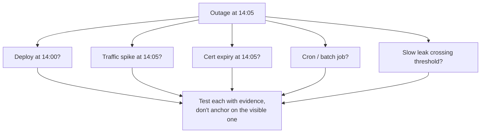

# Logical Fallacies in Engineering — Middle

> **What?** At this level a logical fallacy is a *predictable failure mode of group reasoning* — the patterns that derail migrations, rewrites, incident reviews, and architecture debates. You move from naming them to anticipating *which* fallacy a given situation tends to produce.
>
> **How?** You learn the harder set (sunk cost, survivorship bias, post hoc, no true Scotsman, slippery slope, anecdotal evidence) plus their causal mechanism, and you respond by reframing the argument's structure — supplying the missing comparison, base rate, or control — rather than just asking a question.

---

## 1. From spotting to anticipating

A junior spots a fallacy after it's said. A mid-level engineer knows *where they grow*. Certain situations reliably breed certain fallacies:

| Situation | Fallacy it breeds | Why |
|---|---|---|
| A long, painful migration | Sunk cost | The pain already spent feels like a reason to continue |
| "It scaled fine for us" advice | Survivorship bias | We only hear from the survivors |
| A deploy followed by an outage | Post hoc ergo propter hoc | Temporal order looks like causation |
| Defending a coding standard | No true Scotsman | Counterexamples get redefined away |
| Opposing any new tool | Slippery slope | One change is framed as an inevitable cascade |
| "On my last team, X worked" | Anecdotal evidence | One vivid story outweighs aggregate data |

If you know the situation, you can have the counter ready *before* the fallacy lands. That's the upgrade.

---

## 2. Sunk cost fallacy — the migration that won't die

The sunk cost fallacy: continuing an effort because of resources *already* spent, rather than expected *future* value. The money, time, and pain are gone either way — they belong in no rational forward-looking decision.

```text
"We've spent eight months on this Kafka migration. We can't abandon it now."
```

The eight months are sunk. The only valid question is: *from today*, is finishing cheaper than the alternative, given everything we now know? Often the honest answer is "we've learned this was the wrong tool, and the remaining work costs more than reverting." The eight months *feel* like an argument to continue; they are actually an argument for nothing.

**The reframe:** strip the history and ask the forward question.

```text
"Forget what we've spent. If we were deciding fresh today, with what we
 now know about the operational cost, would we start this migration?
 If no, then finishing it is throwing good money after bad."
```

This is hard because abandoning *feels* like admitting the eight months were wasted. They were wasted the moment the path was wrong — refusing to stop only wastes more. The bias engine behind this (loss aversion, commitment escalation) lives in [cognitive biases in code decisions](../03-cognitive-biases-in-code-decisions/).

---

## 3. Survivorship bias — "X scaled fine for us"

Survivorship bias: drawing conclusions from the cases that *survived* a selection process while the failures are invisible.

The canonical example is from WWII: statistician Abraham Wald was asked where to add armor on bombers, based on the bullet-hole patterns of planes that *returned*. The naive answer was "reinforce where the holes are." Wald's insight: reinforce where the holes *aren't* — the engines and cockpit. Planes hit there never came back to be measured. The data was filtered by survival.

```text
"We ran a single Postgres instance to ten million users, no problem.
 You're over-engineering with all this replication."
```

You're hearing from a survivor. For every company that scaled a single instance fine, several hit a wall and you never got their advice — they were too busy in an outage, or they're out of business. The sample is selected *on success*. Their experience is real but not representative.

**The reframe:** ask what the failures would have looked like.

```text
"For every team that did this and was fine, how many tried it and had a
 6-hour outage we'd never hear about? What made it work for you specifically —
 read-heavy load? generous hardware? — and do those conditions hold for us?"
```

This also undermines a lot of conference-talk advice: you hear the architecture of the companies that *made it*, almost never the identical architecture of the ones that died.

---

## 4. Post hoc ergo propter hoc — "the deploy caused the outage"

*Post hoc ergo propter hoc* — "after this, therefore because of this." Treating sequence as proof of causation. Engineering is saturated with this because deploys and incidents are timestamped, and "it broke right after X" is irresistible.

```text
"We deployed at 14:00 and the outage started at 14:05.
 The deploy caused it. Roll it back."
```

Maybe. But correlation in time is the *weakest* form of causal evidence. Other candidates: a traffic spike at 14:05, a dependency's cert expiring, a cron job, a slow memory leak that crossed a threshold. The deploy is *a* suspect, not *the* culprit.



**The reframe:** demand a *mechanism* and a *test*, not just a timeline.

```text
"What in the diff would cause this symptom? Did the error rate climb at 14:00
 or 14:05 — and was there a deploy that DIDN'T cause an outage with the same
 change? Let's check the canary metrics before we conclude."
```

Rolling back is often the right *operational* move (restore service first). But "the deploy caused it" is a *causal claim* that still needs proof in the post-incident review — otherwise you fix the wrong thing and it recurs. This is where hypothesis-driven thinking pays off; see [scientific and hypothesis-driven thinking](../../09-scientific-and-hypothesis-driven/).

---

## 5. No true Scotsman — moving the goalposts on "real"

The "no true Scotsman" move defends a generalization by redefining terms to exclude any counterexample, instead of admitting the generalization was wrong.

```text
A: "Real engineers always write tests first."
B: "I know great engineers who don't TDD."
A: "Then they're not *real* engineers."
```

The claim has been made unfalsifiable. Whatever counterexample you produce, the person redefines "real engineer" to exclude it. Nothing could ever prove them wrong — which means their statement has no content.

You'll meet this whenever an identity word — *real*, *senior*, *proper*, *serious*, *clean* — guards a rule:

- "Senior engineers don't need a debugger."
- "A proper service is fully stateless."
- "Clean code never has comments."

**The reframe:** make the definition explicit and fixed *before* the argument, then hold it there.

```text
"Let's define 'real engineer' before we use it as a test. If your definition
 is 'writes tests first,' then your claim is just 'people who write tests first
 write tests first' — it's circular. What's the actual evidence that the
 practice produces better outcomes?"
```

The honest move when a counterexample appears is to *weaken the generalization* ("most engineers benefit from tests, though not always test-first"), not to redefine the category.

---

## 6. Slippery slope — "if we allow this, then chaos"

A slippery slope argues that one step inevitably leads to an extreme outcome, without justifying the inevitability of each link.

```text
"If we let people skip code review for one-line fixes, soon nobody will
 review anything and the codebase will rot."
```

Each link in that chain might have low probability, but the argument multiplies them as if they were certain. Some slopes are real (small security exceptions *do* compound). The fallacy is asserting the cascade is *inevitable* rather than *showing* the mechanism that makes each step force the next.

**The reframe:** separate the proposed step from the feared endpoint, and ask for the mechanism connecting them.

```text
"The proposal is 'skip review for typo-only one-line changes,' not 'skip all
 review.' What forces the first to become the second? If we're worried, we can
 scope it: auto-approve only when the diff is whitespace/comments, enforced by
 a lint rule. Then the slope has a guardrail, not a free fall."
```

Note the technique: convert a vague fear into a *bounded, enforceable* version. That defuses the slope while taking the concern seriously.

---

## 7. Anecdotal evidence — "on my last team, X worked"

Anecdotal evidence offers a single vivid story in place of representative data. It's persuasive because stories are memorable and data is dry — but n=1 from your last job tells you almost nothing about *this* system.

```text
"On my last team we dropped the ORM and wrote raw SQL — performance
 doubled. We should do that here."
```

Their gain might have come from a specific N+1 query pattern, a different database, a different team's SQL skill, or a measurement artifact. The story isn't *wrong*; it's just one uncontrolled sample, and "it worked there" silently assumes "there" resembles "here."

**The reframe:** treat the anecdote as a *hypothesis to test*, not a conclusion to adopt.

```text
"That's a useful hint. Let's check whether our bottleneck is even the ORM —
 profile first. If 90% of our latency is the ORM building one hot query, your
 fix transfers. If it's network, it won't. The story tells us where to look,
 not what to do."
```

Anecdotes are excellent *idea generators* and terrible *decision criteria*. Promoting one to the other is the fallacy.

---

## 8. A combined incident-review walkthrough

Real reviews stack fallacies. Here's a compressed but realistic post-incident thread, annotated.

```text
Lead:  We deployed the new cache layer at 09:00, outage at 09:10.
       The cache layer caused it.                          ← post hoc
Eng:   The error spike actually starts at 09:08 — before the cache
       hit production at 09:09. Let's keep looking.
Lead:  We've already spent two sprints on this cache. Let's just
       roll it back and move on.                           ← sunk cost
Eng:   Rolling back to restore service, yes. But "move on" means we
       never learn the real cause. The two sprints are spent either way.
Mgr:   My last company never needed a cache at this scale.   ← anecdotal +
                                                                survivorship
Eng:   Maybe — but were they read-heavy like us? And we only hear from
       the teams that didn't fall over. Let's read our own p99, not theirs.
```

The skilled engineer isn't louder — they keep replacing *story, timing, and history* with *this system's measured evidence*. That move generalizes across every fallacy in this file.

---

## 9. Mid-level practice: the reframe table

Internalize the *transformation*, not the label. Each fallacy has a canonical reframe:

| Fallacy | Reframe that defuses it |
|---|---|
| Sunk cost | "Forget what's spent — decide fresh from today's facts." |
| Survivorship bias | "What would the failures look like? Are we seeing the full sample?" |
| Post hoc | "What's the mechanism? Show the metric, find a control." |
| No true Scotsman | "Define the term first and hold it; a counterexample weakens the rule." |
| Slippery slope | "What forces step 1 to become step N? Let's bound step 1." |
| Anecdotal evidence | "Good hypothesis — let's test it on *our* numbers before adopting it." |

---

## 10. What to take away

- Mid-level skill is *anticipation*: knowing migrations breed sunk cost, talks breed survivorship bias, incidents breed post hoc.
- The counter graduates from "ask a question" to "supply the missing piece" — the forward-looking frame, the base rate, the control, the bounded version.
- Operational urgency and causal claims are different. You can roll back *and* still refuse the unproven "X caused it."
- Stories and authorities are inputs to hypotheses, never substitutes for measuring *your* system.

Next, at the senior level: the subtle, weaponizable fallacies — motte-and-bailey, nirvana fallacy, Goodhart's law — and how to defuse them in live architecture debates without making enemies.

---
## Check your understanding

Try to answer these questions from memory:

1. "We deployed at 14:00 and the outage started at 14:05, so the deploy caused it." What's the fallacy?
2. "Real engineers don't need a debugger — they reason through the code." How do you handle this in a review?
3. Explain motte-and-bailey with an engineering example. Why is it hard to counter?
4. "This caching fix isn't perfect under burst load, so it's not worth shipping." Name and rebut.
