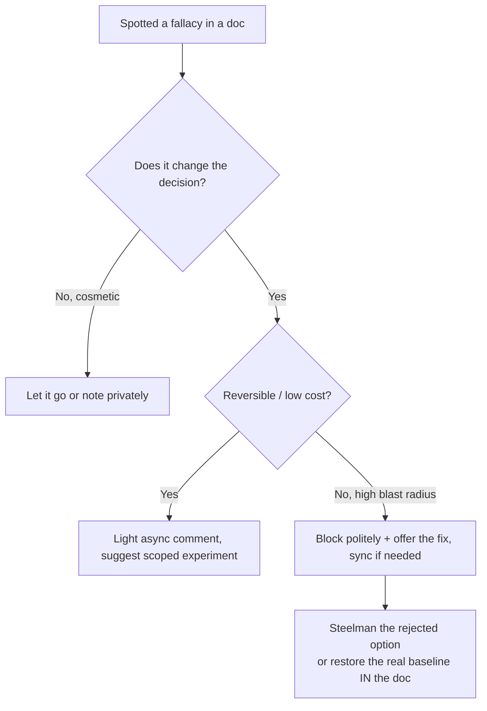
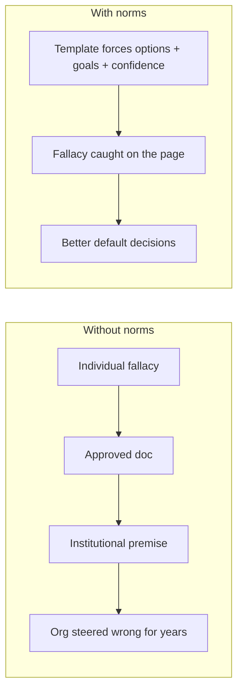

# Logical Fallacies in Engineering — Professional

> **What?** At staff/principal scale, fallacies are *organizational pathologies*: they propagate through RFCs, strategy decks, OKRs, and post-mortems, get ratified by consensus, and then steer dozens of teams for years. The unit of harm is no longer a bad PR — it's a bad decision document that becomes institutional truth.
>
> **How?** You read decision artifacts adversarially for embedded fallacies, you intervene without becoming the obstructionist, and — your core leverage — you build the *norms, templates, and metric designs* that make these fallacies structurally rare across the whole org.

---

## Action card
1. Read motivation, alternatives, risks, and metrics adversarially.
2. Steelman the rejected option in the document.
3. Block only high-blast-radius errors and include the repair.

**Decision rule:** fix the durable decision artifact, not just the meeting thread.

## 1. The scale change: fallacies as institutional infrastructure

A junior's fallacy convinces one reviewer for one PR. A principal's job is the failure mode where a fallacy gets *written down, reviewed, approved, and cited* — at which point it stops being an argument and becomes a premise. Nobody re-litigates an approved RFC; they build on it. A false dichotomy in the "Options Considered" section of a platform RFC can constrain a 40-engineer org for three years, and the people executing it will have no idea the foundational comparison was rigged.

So the professional skill set is:

1. **Adversarial reading** of decision artifacts — RFCs, ADRs, strategy docs, post-mortems, OKRs — for embedded fallacies.
2. **Intervention at the document layer**, where one good comment can redirect an org, without acquiring a reputation as the person who blocks everything.
3. **Norm and template design** so the common fallacies are *structurally* hard to commit, because you cannot personally review every doc in a large org.

---

## 2. Reading an RFC adversarially

When a staff engineer reviews an RFC, the fallacies cluster in three predictable sections. Read those sections with these questions loaded.

| RFC section | Fallacy that hides there | The adversarial question |
|---|---|---|
| Motivation / "Why now" | Appeal to novelty, bandwagon, post hoc | Is "the industry is moving to X" doing the work that data should? |
| Options Considered | False dichotomy, nirvana, straw-manned alternatives | Are rejected options described fairly, or set up to lose? Is a real option missing? |
| Prior Art / "How others do it" | Appeal to authority, survivorship bias | Do the cited companies share our constraints? Are we hearing only the survivors? |
| Cost / Risk | Sunk cost, slippery slope, motte-and-bailey | Is past investment framed as a reason? Is the scoped claim defended but the broad one acted on? |
| Success Metrics | Goodhart's law | Will optimizing this metric still serve the goal, or invite gaming? |

The single most common — and most damaging — pattern is the **straw-manned Options Considered table**: the author's preferred option is described in its best light; the alternatives are described in their worst, or a strong alternative is omitted entirely. This dresses a foregone conclusion as a rigorous comparison. The fix is to *strengthen the rejected options yourself* before agreeing they lose:

```text
"The doc rejects 'modular monolith' in two lines as 'won't scale.' Let's
 steelman it: at our projected 5x load with read replicas and a cache, where
 specifically does it break? If we can't name the breaking point, we haven't
 actually compared — we've assumed the conclusion. I want the monolith's best
 case on the table next to the microservices best case."
```

Steelmanning the loser is the professional move. It both finds real false dichotomies *and* models the norm that decisions must beat the *strongest* alternative, not a convenient weak one. This is the practical face of [evaluating tradeoffs objectively](../04-evaluating-tradeoffs-objectively/) at document scale.

---

## 3. Goodhart's law as an org-design problem

At your level Goodhart's law is no longer a code-review observation; it's a *strategy risk*. The metrics in a VP's deck become the OKRs become the team incentives become the behavior of hundreds of people. A poorly chosen target doesn't just fail to measure — it actively *trains the org to fool itself and you*.

Patterns to catch in any goals document:

- **A proxy promoted to a hard target with no counter-metric.** "Increase deploy frequency" with no guard on change-failure-rate trains teams to ship smaller riskier changes and split deploys to inflate the count. The DORA metrics are deliberately *paired* (throughput *and* stability) precisely to resist Goodhart — copying one without its pair re-opens the trap.
- **Metrics that are easy to measure standing in for goals that are hard to measure.** "Number of A/B tests run" is countable; "made better product decisions" is not — so the org optimizes the countable proxy and runs underpowered tests nobody acts on.
- **Quality gates that reward the gameable shape.** A hard 80% coverage gate org-wide produces assertion-free tests at exactly the percentile that clears the bar.

The professional intervention is structural and goes in the *design* of the goal:

1. **Pair every throughput metric with a quality/stability counter-metric** that degrades when the first is gamed.
2. **Name the underlying goal above the proxy** in the doc, so the proxy is explicitly demotable: "Goal: confidence the system works. Proxy this quarter: mutation score (not raw coverage)."
3. **Prefer signals over gates** for anything gameable — investigate movements rather than auto-failing builds — reserving hard gates for genuinely binary safety properties (e.g., "no secrets in the diff").
4. **Schedule a metric review.** Any metric that's been a target ≥1 year is presumed partially gamed; audit what behavior it now actually produces versus what it was meant to encourage.

---

## 4. Fallacies in the post-mortem — where causation goes to die

Incident reviews are a fallacy minefield because they're written under emotional pressure, against a deadline, with a strong pull toward a clean narrative. The institutional damage: a post-mortem's "root cause" becomes the official record and drives the remediation budget. Get the causation wrong and the org spends a quarter fixing a non-cause while the real one recurs.

Patterns to police in any post-mortem:

- **Post hoc dressed as root cause.** "The deploy preceded the outage, therefore the deploy is the root cause." Demand the *mechanism* and a *control* (did a similar deploy not cause it?). Order is a clue, not a verdict.
- **Single root cause / hasty generalization.** Complex outages are usually a *chain* of contributing conditions; naming one "root cause" satisfies the narrative and hides the others. Modern practice (Allspaw, the "Field Guide to Understanding Human Error," blameless review culture) treats "root cause" itself with suspicion — favor *contributing factors*.
- **Counterfactual / hindsight no-true-Scotsman.** "A *competent* on-call would have caught it" redefines competence after the fact and blocks systemic learning.
- **Sunk cost in remediation.** "We've already invested in this monitoring stack, so the fix is to configure it harder" — even when the stack is the wrong tool.

A post-mortem *template* that pre-empts these is one of the highest-leverage artifacts you can own — see the norm-design section. The mindset is borrowed wholesale from [scientific and hypothesis-driven thinking](../../09-scientific-and-hypothesis-driven/): a claimed cause is a hypothesis with a confidence level, not a verdict.

---

## 5. Intervening without becoming the obstructionist

The hazard at your level is real: the person who finds a fallacy in every document becomes background noise, gets routed around, and loses the influence that made the skill useful. Influence is a budget — spend it on the decisions that matter.

A practical framework for *whether and how* to intervene:



Operating principles:

- **Reserve hard blocks for irreversible, high-blast-radius decisions.** A fallacy in a doc about a two-week reversible experiment isn't worth your influence budget — let the experiment produce the data.
- **Fix in the artifact, not just the thread.** A comment that adds the missing option to the Options table durably improves the decision; a clever takedown in chat evaporates.
- **Always arrive with the repair.** "This is a false dichotomy" without a third option is obstruction. "Here's the third option and its rough cost" is leadership.
- **Make it about the org's future readers.** "Whoever builds on this RFC in a year will inherit this assumption — let's make it explicit and tested" depersonalizes the critique entirely.
- **Praise the steelman in public.** When someone fairly represents the option they're rejecting, name it as the standard. Norms spread by example more than by mandate.

---

## 6. Designing norms that defuse fallacies at org scale

You cannot review every document. The leverage at principal level is making the *organization* resistant to fallacies by default. Concrete, durable artifacts:

**RFC / ADR template requirements**
- A mandatory **Options Considered** table with ≥3 options, each given its strongest case before rejection. (Kills false dichotomy and nirvana fallacy at the source.)
- A **"Decided fresh today?"** prompt in any migration/rewrite RFC. (Institutionalizes the sunk-cost reframe.)
- A **"What would have to be true for us to be wrong?"** field. (Forces falsifiability; defuses no-true-Scotsman and motte-and-bailey by fixing claims in writing.)
- An explicit **goal-above-metric** statement in any proposal with success metrics. (Pre-empts Goodhart.)

**Post-mortem template requirements**
- Separate sections for **"actions taken to restore service"** (operational, urgent) and **"contributing factors with evidence and confidence level"** (analytical, no rush). (Defuses post hoc and the single-root-cause reflex.)
- A **blameless framing** that forbids counterfactual competence claims.
- A required **"how we confirmed the cause"** field — a cause without confirmation is a hypothesis.

**Metric and OKR norms**
- Every throughput target ships with a **paired counter-metric** (the DORA discipline).
- **Signals default; gates are the exception** and must justify why the property is binary.
- An annual **metric audit**: for each long-standing target, document what behavior it *actually* produces now.

**Cultural norms**
- **Steelmanning is the house style.** You evaluate the strongest version of the opposing view; misrepresenting it is called out as a defect like any other.
- **"Name the goal, not the ritual."** Practices must be justified by the outcome they produce, not by who else does them — the standing antidote to cargo-culting and bandwagon.



---

## 7. The cargo-cult trap at organizational scale

Richard Feynman's 1974 Caltech commencement address described "cargo cult science": Pacific islanders who, after WWII, built wooden control towers and runways and waited for the cargo planes to return — they reproduced the *form* of the airfield without the *causal substance* that made planes land.

This is the master fallacy of large engineering organizations. "Spotify does squads, so we'll do squads." "FAANG does design reviews, so we'll mandate the doc template" — adopting the *artifacts and rituals* of successful companies without the conditions that made them work. (Famously, even Spotify abandoned the "Spotify model" the rest of the industry was copying.) It fuses authority, bandwagon, and survivorship bias into one organizational reflex, and at scale it's expensive: whole reorgs justified by imitation.

The principal-level antidote is the norm above — **"name the goal, not the ritual."** Every adopted practice must answer: *what outcome does this produce, and do the conditions that make it work hold for us?* If the only answer is "successful companies do it," that is cargo-culting wearing a suit, and your job is to say so before it's written into the org chart.

---

## 8. What to take away

- At scale, the unit of harm is the *approved decision artifact*: a fallacy in an RFC, OKR, or post-mortem becomes institutional truth and steers teams for years.
- Read artifacts adversarially: the straw-manned Options table, the unpaired Goodhart metric, the post hoc "root cause," the cargo-cult "industry does it."
- **Steelman the rejected option** — it's how you find real false dichotomies and how you model the standard.
- Intervene by *influence budget*: block hard only on irreversible, high-blast-radius calls; always fix the artifact and bring the repair.
- Your real leverage is *norm design*: templates and metric disciplines that make fallacies structurally rare, because you can't review every doc.
- The master organizational fallacy is cargo-culting; the standing antidote is **name the goal, not the ritual.**

---
## Recall and apply

Try to answer these questions from memory:

1. In a post-mortem someone writes "root cause: the deploy." As a reviewer, what concerns do you raise?
2. A new engineer says "on my last team we dropped the ORM for raw SQL and performance doubled — let's do it here." Is this wrong?
3. The conclusion of a fallacious argument can still be true. Why does that matter for how you push back?
4. How do you point out a fallacy in a senior colleague's argument without damaging the relationship?
