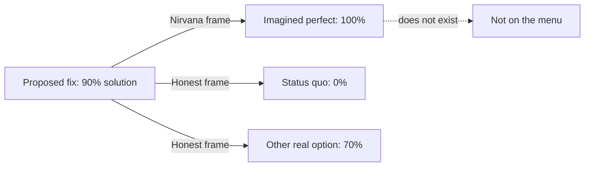

# Logical Fallacies in Engineering — Senior

> **What?** At senior level, fallacies stop being honest mistakes and become *rhetorical structures* — sometimes deployed deliberately, sometimes emergent from incentives — that shape architecture debates, vendor pitches, and standards wars. The hard ones (motte-and-bailey, nirvana fallacy, Goodhart's law) are weaponizable and require structural, not just factual, counters.
>
> **How?** You diagnose the *move* being made, expose its structure out loud in a way that lowers the temperature, and you design decisions, metrics, and review norms so the fallacy can't take root in the first place.

---

## Action card
1. Separate the defensible claim from the action being proposed.
2. Compare real options with the real baseline.
3. Change incentives when a metric is being gamed.

**Decision rule:** counter the argument structure, not the speaker.

## 1. The senior shift: from facts to structure

By now you can name fallacies and supply missing evidence. The senior problem is different: the most damaging fallacies in technical debates aren't *factual* errors you can correct with a benchmark. They're *structural* — the argument is built so that no fact can touch it. You defeat those by exposing the structure, not by arguing the surface claim.

Three structural fallacies dominate senior-level rooms:

- **Motte-and-bailey** — a person defends an easy claim but acts on a hard one.
- **Nirvana fallacy** — a good fix is rejected because a perfect one is imaginable.
- **Goodhart's law** — a measure adopted as a target stops measuring anything real.

You also become the person who *prevents* fallacies by designing the decision process. That's the real leverage.

---

## 2. Motte-and-bailey — the bait-and-switch of claims

Philosopher Nicholas Shackel coined "motte-and-bailey" (2005) from medieval castles: a *bailey* is the desirable but indefensible courtyard; the *motte* is the ugly, easily defended stone tower. The rhetorical move: advance a controversial claim (the bailey), and when challenged, retreat to a trivially true claim (the motte) — then, once unchallenged, walk back out to the bailey.

```text
Bailey (what they want): "We must rewrite the whole platform in Rust."
You challenge it.
Motte (what they defend): "I'm just saying memory safety matters."
You agree — of course it does.
Later: "...so as I said, we need the Rust rewrite."
```

The two claims are different sizes. "Memory safety matters" is unarguable and commits to nothing. "Rewrite the platform in Rust" is a multi-quarter bet. The trick fuses them so agreement with the small one is harvested as support for the big one.

**The structural counter:** name the two claims and pin which one is on the table.

```text
"There are two claims here. One is 'memory safety matters' — agreed, no
 argument. The other is 'rewrite the platform in Rust' — that's the actual
 proposal and it needs its own justification. Which one are we deciding?
 Agreeing with the first isn't agreeing with the second."
```

This is firm but not hostile. You're not calling them dishonest; you're refusing to let two claims share one vote. Watch for the pattern in security ("we just need to be secure" → "so buy this specific $400k tool"), in process ("we should value quality" → "so 100% coverage gates on every PR"), and in any debate where agreement seems suspiciously easy.

---

## 3. Nirvana fallacy — rejecting good because it isn't perfect

The nirvana fallacy (named by economist Harold Demsetz, 1969) compares a real, available option against an *imagined perfect* alternative rather than against the real alternatives — and rejects the real option for falling short of the fantasy.

```text
"This rate limiter isn't perfectly fair under burst traffic, so it's
 not worth shipping. Let's design the ideal one."
```

The relevant comparison is never "this fix vs. perfection." It's "this fix vs. *what we have now*" (often nothing) and "this fix vs. *the other real options*." A 90%-correct rate limiter shipping Tuesday beats a perfect one that ships never. The perfect version is not on the menu; comparing against it is comparing against a hallucination.



**The structural counter:** restore the real baseline.

```text
"Perfect fairness isn't an option we can ship this quarter. The real choice
 is: this 90% limiter now, or nothing now. Compared to nothing — which is
 today's behavior — is 90% an improvement? If yes, we ship it and iterate.
 The ideal version is a backlog item, not a blocker."
```

The nirvana fallacy is the favorite weapon of the engineer who'd rather block than build, and it's *seductive* because demanding perfection sounds rigorous. It's the inverse of pragmatism. Tie it to [evaluating tradeoffs objectively](../04-evaluating-tradeoffs-objectively/): a real tradeoff only ranks options that *exist*.

---

## 4. Goodhart's law — when the metric becomes the lie

Goodhart's law (economist Charles Goodhart, 1975), in Marilyn Strathern's crisp phrasing: *"When a measure becomes a target, it ceases to be a good measure."* This isn't a debating trick — it's an *incentive trap*, a fallacy baked into a system. The structure: a proxy correlates with a goal, you optimize the proxy, and the correlation breaks because people (rationally) game the proxy.

| Goal you care about | Proxy you measure | How it gets gamed |
|---|---|---|
| Code is well-tested | Line coverage % | Tests with no assertions; coverage of trivial getters |
| Fast delivery | Story points completed | Point inflation; padding estimates |
| Reliable service | Number of incidents | Incidents reclassified as "events"; under-reporting |
| Code quality | PR count / lines changed | Splitting trivial PRs; verbose diffs |
| Fast reviews | Time-to-first-comment | A "looks good" comment in 2 minutes, real review never |

Every one of these *started* as a reasonable signal and became a lie the moment it became the target. The engineers gaming it usually aren't malicious — the incentive simply rewards the proxy, not the goal.

**The senior counter is design, not argument.** You can't out-debate an incentive; you redesign it:

1. **Pair the proxy with a guarding counter-metric.** Coverage *and* mutation score; velocity *and* defect-escape rate. Gaming one degrades the other.
2. **Keep targets as signals, not gates, where possible.** "Coverage dropped 8% — why?" beats "build fails below 80%." The first invites inquiry; the second invites gaming.
3. **Rotate and review metrics.** A metric that's been a target for two years is probably already gamed; audit it.
4. **Name the goal, not just the proxy, in the doc.** "We want confidence the code works (proxy: coverage)" makes the proxy demotable when it stops serving the goal.

> Goodhart is *the* fallacy that scales with seniority: junior engineers chase metrics, senior engineers design them. Get this wrong in an OKR and you incentivize a whole org to fool itself.

---

## 5. Defusing live — the de-escalation discipline

Senior engineers are watched. *How* you counter a fallacy teaches the room more than the counter itself. The goal is to fix the *argument* while preserving the *relationship* and the other person's standing.

Principles that keep the temperature down:

- **Attack the structure, not the speaker.** "That argument has two different claims in it" is about the argument. "You're using a motte-and-bailey" is about the person and invites defensiveness.
- **Grant the true part loudly.** "You're right that memory safety matters — fully agree." Conceding the motte first makes the pin on the bailey feel fair, not combative.
- **Convert to a shared question.** "So the open question is whether the rewrite's cost is justified — let's look at that together" turns a duel into a joint investigation.
- **Offer the bounded version.** For slippery slopes and nirvana fallacies, hand back a scoped, real proposal. You take the concern seriously *and* keep momentum.
- **Let the room do the work.** Often the cleanest move is one neutral question to the *group*: "Are those the only two options?" The fallacy dissolves without anyone losing face.

```text
Hostile:  "That's a textbook motte-and-bailey, you keep switching claims."
Senior:   "Let me make sure I've got both claims straight, because I agree
           with one and want to dig into the other..."
```

Same diagnosis, opposite outcome. The second keeps the person on your side while still refusing the move.

---

## 6. A live architecture-debate transcript

A condensed but realistic design-review thread, with the senior engineer working three fallacies at once.

```text
Advocate: We should adopt the service mesh. Modern infra needs it,
          and Netflix runs one.                          ← novelty + authority
Senior:   Netflix runs thousands of services across multiple regions —
          that's the problem a mesh solves. We have eleven services in
          one region. What specific problem are we solving here?
Advocate: Well, we need observability and security.       ← motte
Senior:   Agreed, both matter. But "we need observability" doesn't equal
          "we need a mesh" — those are different claims. We get tracing
          today from the SDK. What does the mesh add that we lack?
Advocate: It's not a *perfect* solution otherwise, mTLS is patchy.  ← nirvana
Senior:   The real comparison is mesh vs. our current setup, not mesh vs.
          perfect. Current setup covers 9 of our 11 services for mTLS. Is
          closing that gap worth a mesh's operational cost, or can two
          sidecars do it? Let's price both.
```

No one is humiliated. Every move converts a rhetorical claim into a comparison of *real options against the real baseline* — which is the entire job.

---

## 7. Building review norms that pre-empt fallacies

The highest-leverage senior move is making fallacies *structurally harder to commit*. You change the format of decisions:

- **Require the alternatives section.** A design doc that must list ≥3 options and why each was rejected kills false dichotomy and nirvana fallacy on the page, before debate starts.
- **Require the "decide fresh" question in migration reviews.** "If we started today, would we choose this path?" institutionalizes the sunk-cost reframe.
- **Separate causal claims from operational actions in incident reviews.** A template with distinct "what we did to restore service" and "what we have *evidence* caused it (and how we'll confirm)" sections defangs post hoc.
- **Name goals above metrics in every dashboard and OKR.** Pre-empts Goodhart by keeping the proxy demotable.
- **Default to scoped experiments over global rulings.** "Let's try X on one service for two weeks and measure" turns slippery-slope and bandwagon arguments into data.

This is where critical thinking becomes *culture*: you're not winning individual arguments, you're shaping how the team argues. The connection to [first-principles thinking](../../05-first-principles-thinking/) is direct — both push the team to reason from the actual problem, not from inherited or borrowed conclusions.

---

## 8. What to take away

- The senior-hard fallacies are *structural*: motte-and-bailey (claim-swapping), nirvana (perfect vs. real), Goodhart (gamed proxy). Facts alone don't beat them.
- Counter the *structure*: pin which claim is on the table, restore the real baseline, redesign the incentive.
- Goodhart is special — you can't argue with an incentive, you redesign it with counter-metrics, signals-over-gates, and named goals.
- *How* you defuse matters as much as *that* you do: grant the true part, attack structure not people, convert to a shared question, hand back a bounded version.
- The real leverage is prevention: review templates and metric design that make fallacies structurally harder to commit.

Next, at the professional level: spotting these patterns across org-wide RFCs, post-mortems, and strategy documents — and the institutional norms that defuse them at the scale of dozens of teams.

---
## Recall and apply

Try to answer these questions from memory:

1. State Goodhart's law and give an engineering example. Why can't you fix it by arguing?
2. What's the fallacy in "we should rewrite this in the new framework — it's 2026," and how is it different from its opposite?
3. Where does Feynman's "cargo cult" come from, and what's the engineering version?
4. "If we let people skip review for one-line fixes, soon nobody will review anything." Name it and respond constructively.
