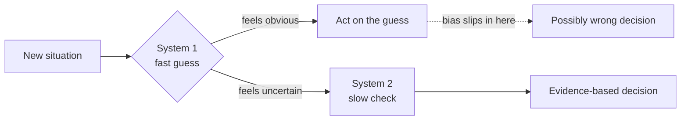

# Cognitive Biases in Code Decisions — Junior

> **What?** Cognitive biases are systematic, predictable errors in how the human mind reasons under uncertainty. In code work they quietly distort debugging, estimates, code reviews, and "obvious" technical calls — not because you are careless, but because the shortcuts your brain uses to move fast were tuned for survival, not for distributed systems.
>
> **How?** As a junior, you mostly need to *recognize* the most common biases when they hit your own day-to-day work, and apply one cheap counter-move for each: write the failing case before you guess, ask for the data, and separate "what I want to be true" from "what I have evidence for."

---

## 1. Why a working brain still ships wrong decisions

A bias is not stupidity. It is a *fast* answer that is right often enough that evolution kept it — and wrong in exactly the structured, low-feedback situations software is full of. Daniel Kahneman, in *Thinking, Fast and Slow* (2011), splits thinking into **System 1** (fast, automatic, intuitive) and **System 2** (slow, effortful, deliberate). Most bias errors are System 1 firing when the situation actually needed System 2.



The good news: the same biases hit *everyone*, in *predictable* ways. Predictable means you can pre-plan a counter-move. That is the whole game — not "be smarter," but "install a checklist for the moment your intuition is most likely to mislead you."

This sits alongside two siblings: [logical fallacies](../02-logical-fallacies-in-engineering/) are errors in the *structure* of an argument; biases are errors in the *underlying judgment*. And [claims, evidence and reasoning](../01-claims-evidence-and-reasoning/) is the discipline that disarms most of them.

---

## 2. The biases that hit juniors hardest

### 2.1 Confirmation bias — debugging the hypothesis you already hold

You decide "it's the cache" in the first ten seconds, then you only read the logs that fit "it's the cache." You skim past the line that says the request never reached the cache at all.

This is the single most expensive bias in debugging. You are not searching for the cause; you are collecting evidence for a verdict you already reached.

**Symptom:** You spend an hour "confirming" a theory and the bug is somewhere you never looked.

**Debias tactic:** Before you fix anything, write down the *cheapest test that could prove you wrong*. "If it's the cache, the cache hit-rate metric drops at 14:02 — let me look." If the test doesn't fire, your theory is dead; move on. Actively go looking for the disconfirming evidence first.

### 2.2 Anchoring — the first number sticks

Your teammate says "this is like a 2-day task." Now every estimate you produce orbits around 2 days, even after you discover three hidden dependencies. The first number became an **anchor** and pulled your judgment toward it (Tversky & Kahneman, 1974).

**Symptom:** Your "independent" estimate is suspiciously close to the first number anyone said out loud.

**Debias tactic:** Estimate *before* you hear anyone else's number. Break the task into pieces and add them up from scratch. If an anchor already escaped, ask: "If I'd never heard 2 days, what would I say?"

### 2.3 The availability heuristic — the last thing you saw feels common

You just spent a day on a nasty `null`-pointer bug. Now every code review you do is hunting for null pointers, while a real concurrency bug sails through. Things that are *easy to recall* feel *more frequent and more likely* than they are.

**Symptom:** Your sense of "what usually breaks" is really "what broke most recently / most memorably."

**Debias tactic:** Ask "how often does this *actually* happen?" and look it up — error counts, incident history — instead of trusting the vivid memory.

### 2.4 The IKEA effect & "not invented here" — your own code looks better than it is

The IKEA effect (Norton, Mochon & Ariely, 2012) is the documented tendency to over-value things you built yourself. In code: your own helper function feels cleaner than the battle-tested library that does the same job, purely *because you wrote it*.

**Symptom:** You argue to keep your hand-rolled date parser over a standard library, and the reasons are all aesthetic.

**Debias tactic:** Ask "would I add this dependency / write this code if a stranger had submitted it?" Judge the artifact, not its author.

---

## 3. A junior's pocket bias table

| Bias | How it shows up for you | One cheap debias move |
|---|---|---|
| Confirmation bias | You only read logs that fit your first guess | Write the test that would *disprove* your theory, run it first |
| Anchoring | Your estimate hugs the first number said | Estimate alone, from sub-tasks, before hearing others |
| Availability | "What usually breaks" = "what broke yesterday" | Check real counts before trusting the memory |
| IKEA / NIH | Your own code feels cleaner than the library | "Would I keep this if a stranger wrote it?" |
| Optimism bias | "This'll take an hour" → it takes a day | Add the steps you always forget: review, tests, deploy |
| Recency bias | This sprint's pain dominates your judgment | Look back over several sprints, not just the last |

---

## 4. Optimism bias and your estimates

Ask a junior how long a task will take and the answer is almost always too short. This is **optimism bias**, and its estimation-specific form is the **planning fallacy** (Kahneman & Tversky, 1979): we imagine the smooth, happy path and forget that the *typical* path has interruptions, a failing test, a flaky deploy, a review round.

A useful pattern: estimate the task, then list everything that has to happen *besides writing the code*.

```text
"Add a field to the form"  → felt like 1 hour

Actually:
  - read the existing form code          20 min
  - add field + validation               40 min
  - update the backend + migration       45 min
  - write/adjust tests                   30 min
  - fix the test that broke elsewhere    25 min
  - code review round-trip               (1 day wall-clock)
  - QA + deploy                          30 min
```

The code was an hour. The *task* was a day. You weren't wrong about typing speed; you were wrong about everything around it. Junior move: when you give an estimate, multiply your gut "coding time" by a factor your team has measured, or just say a *range* ("between half a day and a day and a half") instead of a falsely precise point. We go deeper in [evaluating tradeoffs objectively](../04-evaluating-tradeoffs-objectively/).

---

## 5. A worked debugging example

A junior gets an alert: "checkout is slow."

**The biased path (System 1 in charge):**

```text
14:00  "Slow? Must be the database, it's always the database."  ← availability bias
14:05  opens the query logs, scrolls for slow queries
14:30  finds a query that *looks* slowish, starts optimizing it  ← confirmation bias
15:30  query is now faster; checkout still slow
```

**The debiased path:**

```text
14:00  "Possible causes: DB, external payment API, app CPU, network."
       (list 4 hypotheses, not 1)
14:05  "Cheapest discriminating signal? The latency breakdown trace."
14:08  trace shows 90% of the time is in the payment-gateway call
14:10  the payment gateway is degraded — confirmed on their status page
14:15  flip to the backup gateway
```

The difference wasn't talent. It was **listing more than one hypothesis** and **picking the signal that splits them apart** before touching code. That single habit kills more bias than any other.

---

## 6. The habits to build now

You don't need to memorize twenty bias names. Build four reflexes:

1. **"What would prove me wrong?"** — say it out loud before every fix. (Kills confirmation bias.)
2. **List at least two hypotheses.** — one hypothesis is a guess wearing a confidence costume.
3. **Estimate the whole task, not the typing.** — add review, tests, deploy, the inevitable surprise.
4. **Judge the code, not the author** — including when the author is you.

These four cover the biases that actually cost juniors time. The deeper catalogue — bikeshedding, hindsight bias in postmortems, the curse of knowledge — matters more as you start influencing other people's decisions. That is the [middle level](./middle.md).

---

## 7. Where this connects

- [Claims, evidence and reasoning](../01-claims-evidence-and-reasoning/) — the discipline of demanding evidence is the master antidote to most biases.
- [Logical fallacies in engineering](../02-logical-fallacies-in-engineering/) — biases distort judgment; fallacies distort arguments. They travel together.
- [Probabilistic thinking](../../06-probabilistic-thinking/) — availability and optimism bias are, at root, broken probability estimates.
- [Metacognition and learning](../../10-metacognition-and-learning/) — noticing your own thinking is the skill underneath all debiasing.
- Back to [critical thinking](../) · the [engineering thinking overview](../../README.md).

> **The one line to remember:** A bias is a fast answer that's usually right and occasionally, predictably, expensively wrong. You can't delete it — but you can install a cheap counter-move at the exact moment it fires.

---
## Check your understanding

Try to answer these questions from memory:

1. What is confirmation bias and how does it show up in debugging?
2. Explain anchoring with an estimation example.
3. Distinguish the availability heuristic from recency bias, with an incident example.
