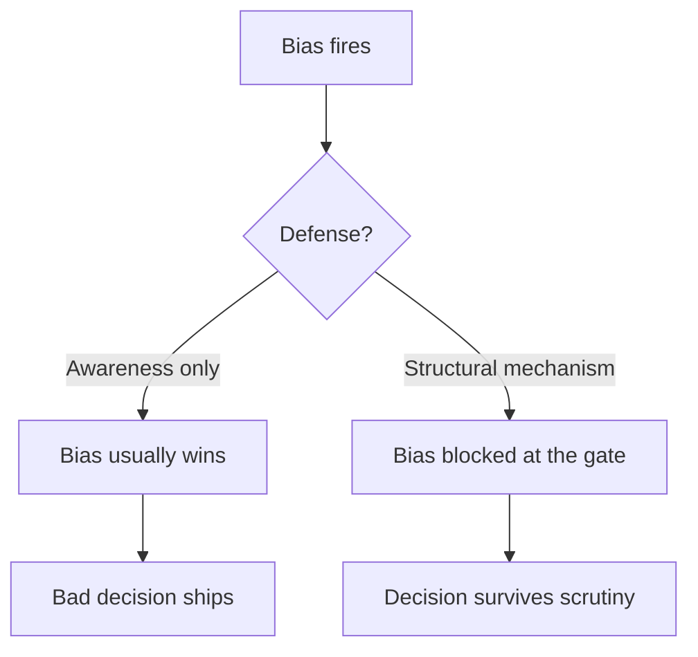
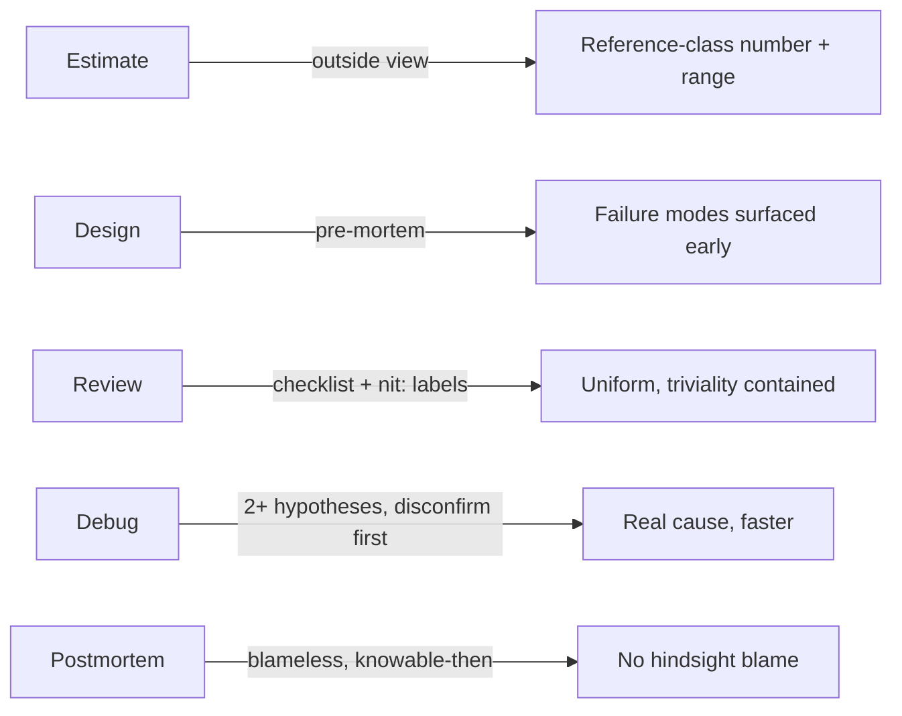

# Cognitive Biases in Code Decisions — Middle

> **What?** At this level, cognitive biases stop being a personal-productivity issue and become a *team* issue: they distort code reviews, design discussions, sprint estimates, and incident retrospectives — and they compound when several biased people interact. You now own decisions that affect others, so your biases (and theirs) leak into the codebase.
>
> **How?** You learn the full working catalogue of engineering-relevant biases, you spot them in *group* settings (not just your own head), and you start applying *structural* debiasing — pre-mortems, reference-class forecasting, blind review, devil's-advocate rotation — rather than relying on "just be aware."

---

## 1. Awareness is not a debiasing strategy

The most important thing to internalize as a mid-level engineer: **knowing a bias exists does almost nothing to stop it.** Anchoring works on people who can define anchoring. Confirmation bias fools people who can spell it. This is one of the most robust findings in the literature — debiasing has to be built into *process and structure*, not left to individual willpower.

So the mid-level shift is from *"I'll try to be objective"* to *"what mechanism makes the bias hard to act on?"* A pre-mortem is a mechanism. "Be careful" is a wish.



---

## 2. The full working catalogue

| Bias | Engineering symptom | Structural debias tactic |
|---|---|---|
| **Confirmation** | Debug only the cause you already suspect; review only confirms your read | Pre-register the disconfirming test; assign a reviewer to argue the *opposite* read |
| **Anchoring** | First estimate/design dominates the whole discussion | Silent independent estimates first; reveal simultaneously |
| **Availability** | Last outage drives the next quarter's over-engineering | Decide from incident *base rates*, not the vivid one |
| **Recency** | This sprint's pain reshapes the roadmap | Trend over many sprints; weight by frequency not freshness |
| **Optimism / planning fallacy** | Estimates assume the happy path | Reference-class forecasting (see §4) |
| **Dunning–Kruger** | Confident wrong calls in unfamiliar areas | Require a second opinion outside the author's expertise |
| **IKEA effect / NIH** | Over-value home-grown code; reject libraries | "Would we adopt this if a stranger submitted it?" |
| **Bikeshedding** | Endless debate on trivial, easy-to-grasp details | Timebox; route triviality to an owner, not the group |
| **Status-quo** | "We've always used X" beats a better option | Force an explicit cost of *not* changing |
| **Hindsight** | Postmortems: "it was obvious this would fail" | Blameless format; reconstruct what was *knowable then* |
| **Automation** | Trust the green check / the linter / the AI suggestion blindly | Spot-check automation; keep a human verification step |
| **Curse of knowledge** | Senior writes docs nobody else can follow | Test docs on someone who lacks the context |

You don't need to recite this. You need to recognize *which one is operating in the room right now* and reach for the matching tactic.

---

## 3. Biases in code review

Code review is a bias minefield because it is a *social judgment under time pressure*.

### 3.1 Confirmation bias in review

If the author you trust submitted it, you skim for confirmation that it's fine. If it's an author you've clashed with, you hunt for problems. Either way you're reviewing the *author*, not the *code*.

**Tactic — blind review where feasible:** strip author identity from the diff. Academic peer review and orchestra auditions both saw measurable bias drops when identity was hidden (the famous orchestra-screen result: blind auditions substantially raised the share of women advancing). You can't always anonymize a PR, but you can ask: *"If I didn't know who wrote this, would I flag this line?"*

### 3.2 The halo effect and seniority

A senior's PR gets a rubber-stamp; a junior's gets nitpicked. The *quality of the code* should drive the depth of review, not the badge of the author.

**Tactic:** a review *checklist* applied uniformly. Checklists are debiasing devices — they force the same questions regardless of who wrote the code (Gawande, *The Checklist Manifesto*, 2009).

### 3.3 Bikeshedding in review threads

Watch a PR accumulate 40 comments about variable naming while a subtle off-by-one in the pagination logic gets zero. This is **Parkinson's law of triviality** (C. Northcote Parkinson, 1957): groups spend time on an item in inverse proportion to its importance, because everyone *can* have an opinion on the easy thing. His own example: a committee approves a nuclear reactor in minutes but spends an hour on the bike shed's roof.

**Tactic:** label trivial comments explicitly (`nit:`) so they can't masquerade as blockers, and reserve blocking review for correctness, security, and design.

---

## 4. Beating the planning fallacy with reference-class forecasting

This is the highest-leverage debiasing skill at the mid level, because your estimates now go into other people's plans.

The planning fallacy comes from taking the **inside view**: you imagine *this specific* task, step by step, on its best behavior. The fix is the **outside view** — **reference-class forecasting** (Flyvbjerg, building on Kahneman & Tversky): ignore the details of *this* task and instead ask *"how long did similar tasks actually take?"*

**Worked example.** You're estimating a "small integration with a third-party API." Your inside-view gut says 2 days.

Reference class — pull the last 6 third-party integrations from your tracker:

```text
Integration      Estimated   Actual
  Stripe            2d          5d
  Twilio            3d          4d
  SendGrid          2d          6d
  internal SSO      1d          3d
  Shipping API      2d          9d   (their docs were wrong)
  Analytics SDK     1d          2d
-------------------------------------
mean actual = (5+4+6+3+9+2)/6 = 29/6 ≈ 4.8 days
```

Your reference class says **~5 days**, with a fat right tail. Your inside-view 2 is almost certainly optimistic. The honest estimate is closer to 5 — and you should quote a *range* (3–9) because the historical spread is real, not noise.

The discipline: **don't decompose-and-imagine your way to a number; look up what actually happened to tasks of this kind.** When you have no data, even a rough reference class beats a confident inside-view guess. We connect this to uncertainty in [probabilistic thinking](../../06-probabilistic-thinking/).

---

## 5. Pre-mortems: confirmation bias's antidote for designs

A **pre-mortem** (Gary Klein) is the inverse of a postmortem. Before you commit to a design, you assume it's six months later and the project *failed spectacularly*, and you ask everyone: *"What went wrong?"*

Why it works: ordinary planning is confirmation-biased toward "this'll work." Asking *"why did it fail?"* gives people social permission to voice the doubts they were swallowing, and it engages the imagination on the failure modes you'd otherwise skip.

```text
PRE-MORTEM — "New event-driven order pipeline" — assume it's Q4 and it failed.

What killed it?
  - the message broker dropped events under load, silently → data loss
  - no idempotency → duplicate orders on retry
  - the team that owns billing was never looped in
  - "eventual consistency" confused support; tickets exploded
  - we couldn't debug it: no distributed tracing

→ Now: add idempotency keys, dead-letter queue + alerting, loop in billing
   THIS WEEK, add tracing before launch — not after the incident.
```

A 30-minute pre-mortem routinely surfaces the exact failure mode that would otherwise become your next incident.

---

## 6. Automation bias is growing fast

You merge because CI is green. You accept the AI code suggestion because it looks plausible. You trust the autoscaler's decision. **Automation bias** is the tendency to over-trust automated outputs and under-weight contradicting evidence — and it's accelerating as more of the toolchain becomes "smart."

Two failure shapes:

- **Errors of commission:** the automation says do X, you do X, X was wrong (the AI hallucinated an API that doesn't exist; you shipped it).
- **Errors of omission:** the automation *didn't* flag a problem, so you assumed there wasn't one (the linter passed, so the code "must be" fine).

**Tactic:** treat automation output as *a strong hypothesis, not a verdict*. Keep a human verification step on the things that matter — read the AI's diff as if a junior wrote it; ask "what would a green CI miss here?"; sanity-check the autoscaler against the actual metric.

---

## 7. Putting it together — a debiased mid-level workflow



The mid-level engineer's edge isn't being unbiased — nobody is. It's **reaching for the mechanism** that makes the bias hard to act on, *every time*, on *team* decisions where the cost is multiplied.

Next, the [senior level](./senior.md) covers hindsight bias in postmortems in depth, the curse of knowledge in documentation and mentoring, and how to debias decisions you're *facilitating* for others.

---

## 8. Where this connects

- [Logical fallacies in engineering](../02-logical-fallacies-in-engineering/) — bikeshedding and confirmation bias often arrive dressed as fallacious arguments.
- [Evaluating tradeoffs objectively](../04-evaluating-tradeoffs-objectively/) — status-quo and IKEA bias are the main enemies of an honest trade-off.
- [Probabilistic thinking](../../06-probabilistic-thinking/) — reference-class forecasting is applied base-rate reasoning.
- [Scientific & hypothesis-driven thinking](../../09-scientific-and-hypothesis-driven/) — "disconfirm first" is the falsification habit applied to debugging.
- Back to [critical thinking](../) · [engineering thinking overview](../../README.md).

---
## Check your understanding

Try to answer these questions from memory:

1. What is the planning fallacy, and what's the single best tactic against it?
2. Walk through reference-class forecasting on a concrete estimate.
3. What is the IKEA effect / not-invented-here, and how does it distort architecture?
4. What is bikeshedding and what causes it?
