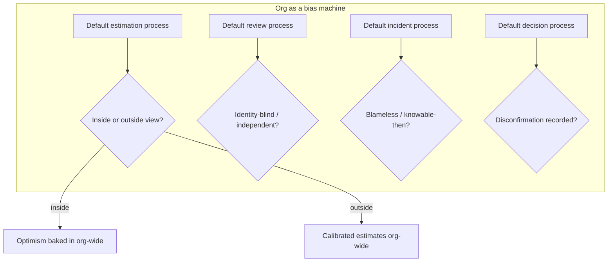
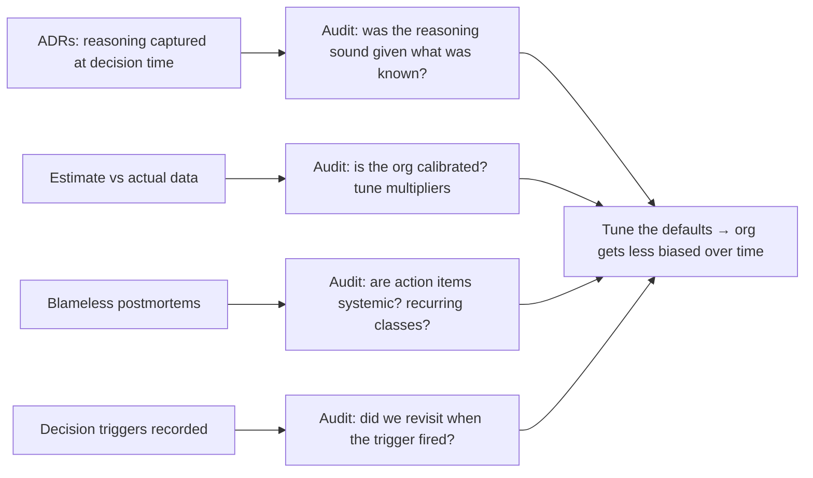

# Cognitive Biases in Code Decisions — Professional

> **What?** At staff/principal level, cognitive biases are an *organizational* failure mode. The question is no longer "am I biased?" or even "is this room biased?" but "do our processes — how we estimate, review, decide, and learn from incidents — systematically debias the whole engineering org, or do they bake bias into how the company builds software?"
>
> **How?** You design the decision *machinery*: estimation governance that resists the planning fallacy at portfolio scale, review and approval structures that institutionalize blind/independent judgment, blameless-postmortem policy that engineers hindsight bias out of the culture, and decision records that make bias auditable after the fact. You are building the org's System 2.

---

## Action card
1. Make outside-view estimation, independent review, and blameless learning defaults.
2. Capture decision reasoning and estimate-versus-actual data.
3. Audit the defaults and tune them from outcomes.

**Decision rule:** do not ask people to be unbiased; make bias visible and costly to act on.

## 1. Bias is a property of the system, not the people

A staff engineer who debiases individual meetings doesn't scale; there are too many meetings. The leverage is in *mechanisms that debias by default*, so that the average decision made by the average team on an average Tuesday — with no bias-aware facilitator present — still comes out reasonable.

This reframes everything. Optimism bias isn't "engineers are too optimistic"; it's "our planning process takes the inside view by default." Hindsight bias isn't "people blame each other"; it's "our incident process has no structural defense against I-knew-it-all-along." You fix the *defaults*.



Your job is to move every one of those defaults to the debiased setting and make it the path of least resistance.

---

## 2. Estimation governance against the planning fallacy at scale

Individual reference-class forecasting is a [middle-level skill](./middle.md). At the org level, optimism bias compounds catastrophically: every team is optimistic, the optimism stacks across dependencies, and the program plan is the *product* of a dozen happy-path guesses — which is why large software programs overrun so reliably that the overrun is itself a reference class (Flyvbjerg's work on megaprojects: the inside view is the *cause* of systematic overrun, not bad luck).

### 2.1 Build the reference-class data asset

You cannot do outside-view forecasting without history. So the first governance move is *instrumentation*: capture, for every meaningful piece of work, **estimate vs. actual** in a queryable form. This dataset is the org's single most valuable debiasing asset.

```text
Project tracker, enriched:
  work_item | class (feature/integration/migration/infra) | est | actual | ratio

Then per class, the empirical correction:
  class            n     median(actual/est)   p90 ratio
  feature         210         1.6               3.1
  3rd-party integ  44         2.4               5.0
  data migration   31         3.0               7.5
  infra/platform   58         2.1               4.4
```

Now an estimate isn't a hope; it's `inside_view × class_multiplier`, with a p90 to set buffers. This is **reference-class forecasting institutionalized** — Flyvbjerg's recommended antidote applied as policy, not heroics.

### 2.2 Governance rules that hold

- **Quote ranges and confidence, never single dates.** A point date is optimism wearing a suit; it also invites anchoring downstream. Distributions communicate honestly.
- **Separate estimate from commitment.** The estimate is empirical (what the data says). The commitment is a *business decision* about how much risk to accept. Conflating them is how optimism becomes a deadline.
- **Buffer at the portfolio, not the task.** Per-task padding gets consumed by Parkinson's law ("work expands to fill the time"); a shared program buffer (cf. critical-chain thinking) is statistically sounder because not every task hits its p90 at once.
- **Audit calibration quarterly.** Track whether your 90%-confidence ranges actually contain the outcome ~90% of the time. If they don't, your process is miscalibrated and you fix the multipliers. This makes optimism *visible and correctable* instead of perennial.

The cultural win: when estimates are ranges backed by data, the planning fallacy stops being a moral failing ("the team sandbagged / under-delivered") and becomes a tuning problem.

---

## 3. Review and approval structures as debiasing institutions

At org scale you're designing who-reviews-what and how approvals flow. Each structural choice either fights or feeds bias.

| Structural choice | Bias it fights | How |
|---|---|---|
| Uniform review checklists / required checks | Halo effect, confirmation | Same questions regardless of author seniority |
| Identity-blind triage where feasible | In-group / out-group bias | Judge the artifact, not the person |
| Cross-domain review on cross-domain changes | Dunning–Kruger spillover | Forces a voice from the relevant expertise |
| `nit:` / blocking convention | Bikeshedding | Triviality can't masquerade as a blocker |
| Rotated devil's advocate on big RFCs | Groupthink, confirmation | Dissent is a role, not a risk |
| Decision records (ADRs) with "what would change our mind" | Hindsight, status-quo | Makes the original reasoning auditable |

Two org-design notes:

**Don't let approval gates become automation-bias generators.** If a green dashboard or a required-check badge becomes the *only* thing humans look at, you've engineered automation bias into the SDLC. Keep at least one mandated human-judgment checkpoint on changes above a risk threshold, and make sure reviewers know the check's blind spots (a passing SAST scan does not mean "secure").

**Architecture Decision Records are anti-hindsight devices.** An ADR captures *what was known, what options existed, and why you chose* — at the moment of choosing. When the decision looks "obviously wrong" two years later, the ADR is the evidence of what was actually knowable then, which protects the decider from hindsight blame and teaches the org how decisions were *reasoned*, not just what was *picked*.

---

## 4. Blameless postmortems as policy, not vibe

A senior runs a blameless retro. A principal makes "blameless" an *enforced property of the system* so that it survives a bad outage, an angry executive, and a customer escalation — the exact moments the org's instinct screams for a scapegoat.

### 4.1 What "policy" means concretely

- **A standard template that *structurally* prevents hindsight blame**: a knowable-at-the-time timeline, a "contributing factors" (plural, systemic) section instead of a "root cause" (singular, often a person) section, and an action-items rule that *every item changes a system, tool, or process — none changes a person's attitude.* If an action item is "be more careful," the template rejects it.
- **Separation of postmortem from performance review.** The instant the retro can affect someone's rating, every engineer optimizes their testimony for self-protection and you lose the truth. This separation must be explicit, written, and defended by leadership — it is the load-bearing wall of a learning culture (Westrum's "generative" org; the DevOps/DORA research links blameless culture to performance).
- **Just Culture, not zero accountability.** Blameless ≠ consequence-free. Sidney Dekker's *Just Culture* distinction: you hold people accountable for *reckless* choices, but you treat *honest errors and reasonable judgments under the information available* as system signals to learn from. The line is "given what they knew and the incentives we built, was this a reasonable action?" — which is precisely the anti-hindsight question.

### 4.2 Guarding against availability-driven over-correction

The org-level twin of hindsight bias is **availability-driven over-engineering**: after a dramatic incident, every roadmap tilts toward preventing *that specific failure* while statistically larger risks go unaddressed. The breach gets a year of security theater; the slow data-quality rot that costs more goes unfunded.

**Governance counter:** prioritize remediation by *expected cost across the incident base rate* (frequency × impact over the whole history), not by the salience of the last one. Maintain an incident-class dashboard so leadership decides from the distribution, not the freshest scar. This is base-rate reasoning ([probabilistic thinking](../../06-probabilistic-thinking/)) applied to portfolio risk.

---

## 5. The curse of knowledge as an org documentation strategy

At principal scale the curse of knowledge is an *onboarding-velocity* problem: your most knowledgeable people write the docs, and the curse guarantees those docs assume the most context — so new hires ramp slowly and the org's knowledge stays trapped in a few heads (a bus-factor and scaling risk).

Structural fixes:

- **Treat "time-to-first-meaningful-contribution" as a measured metric.** It directly indexes how badly the curse of knowledge has corrupted your docs and tooling. Optimize it deliberately.
- **Make every onboarding question a tracked doc defect.** New hires are your only un-cursed observers — their confusion is a *free audit* of where institutional knowledge is illegible. Capture it; fix the doc, not just the asker.
- **Rotate doc authorship toward recent joiners.** The person who learned the system three months ago still remembers what was confusing; the person who built it five years ago cannot. Pair them: expert for accuracy, newcomer for legibility.
- **Novice-test runbooks before an incident, not during.** A runbook only an expert can follow fails exactly when the expert is asleep and a stressed on-call needs it.

---

## 6. Making bias auditable

The signature principal move: you can't eliminate bias, so make it **inspectable after the fact** and tune the system from the evidence.



This closes the loop: a biased decision is acceptable if the *process* makes it visible, correctable, and a lesson for the defaults. An org that audits its own estimation calibration and its own postmortem action-item quality is an org that gets measurably *less* biased over time — which no amount of "be objective" exhortation can achieve.

---

## 7. The principal's checklist for a debiased engineering org

| Org default | Debiased setting | Mechanism |
|---|---|---|
| Estimation | Outside view by default | Estimate-vs-actual data → class multipliers; ranges not dates; calibration audits |
| Commitment | Separate from estimate | Risk decision made explicitly, by the business |
| Review | Uniform + independent | Checklists, required checks, cross-domain reviewers, rotated devil's advocate |
| Decisions | Auditable reasoning | ADRs with options + "what would change our mind" |
| Incidents | Structurally blameless | Knowable-then timelines, systemic action items, separated from perf review, Just Culture |
| Remediation priority | Base-rate driven | Incident-class dashboard; expected-cost ranking, not salience |
| Documentation | Novice-legible | Time-to-contribution metric, questions-as-defects, newcomer authorship |
| Automation in SDLC | Hypothesis, not verdict | Mandated human checkpoint above a risk threshold |

The throughline: **stop asking people to be unbiased; build a system whose defaults are debiased and whose biases are auditable.** That is the staff/principal contribution to critical thinking — turning a personal skill into organizational machinery.

---

## 8. Where this connects

- [Evaluating tradeoffs objectively](../04-evaluating-tradeoffs-objectively/) — estimation governance and ADRs are trade-off discipline at org scale.
- [Claims, evidence and reasoning](../01-claims-evidence-and-reasoning/) — auditable decisions are evidence-based reasoning made institutional.
- [Logical fallacies in engineering](../02-logical-fallacies-in-engineering/) — org politics smuggles fallacies into decisions; structure is the defense.
- [Probabilistic thinking](../../06-probabilistic-thinking/) — calibration, base rates, and ranges are its applied core.
- [Metacognition and learning](../../10-metacognition-and-learning/) — an org that audits its own thinking is metacognition at scale.
- Back to [critical thinking](../) · [engineering thinking overview](../../README.md).

---
## Recall and apply

Try to answer these questions from memory:

1. What's the difference between a cognitive bias and a logical fallacy?
2. Why doesn't "just being aware of biases" work, and what does?
3. A senior insists on keeping a custom-built tool over an off-the-shelf one. Which biases might be operating and how do you handle it?
4. How would you design an org-level process so estimates resist the planning fallacy by default?
