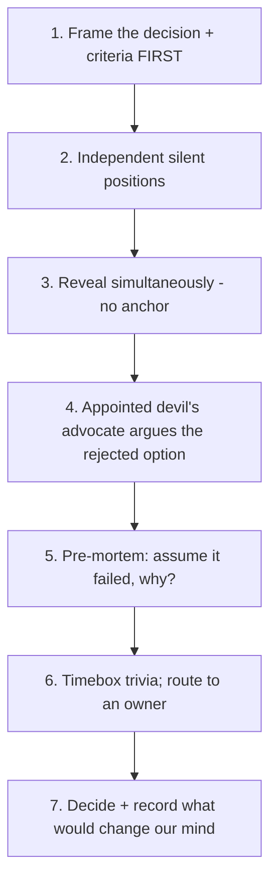

# Cognitive Biases in Code Decisions — Senior

> **What?** At senior level, cognitive biases are something you manage in *other people's* reasoning as much as your own. You facilitate designs, run postmortems, set estimates that teams commit to, and write the docs juniors learn from — every one of those is a place where bias (yours, the group's, the org's) gets encoded into systems and culture.
>
> **How?** You debias by *designing the conversation*: structuring reviews and retros so the bias can't take hold, surfacing the disconfirming view by appointment, separating what was knowable-then from what's obvious-now, and fighting the curse of knowledge in everything you teach and document.

---

## Action card
1. Collect positions independently before discussion.
2. Assign and rotate dissent.
3. Record what was knowable then and what would reverse the choice.

**Decision rule:** design the conversation so the bias cannot win by default.

## 1. The senior shift: from debiasing yourself to debiasing the room

A junior fights their own confirmation bias. A senior walks into a design review where eight people have *collective* confirmation bias, an anchor someone dropped in the first slide, a status-quo pull toward the existing architecture, and a quiet bikeshed forming around the API naming — and has to extract a good decision anyway.

You can't will a group out of bias. You **design the process** so the bias has nowhere to grab:

- The anchor problem → collect positions *independently before* discussion.
- The confirmation problem → *assign* someone to argue the other side.
- The bikeshed problem → *timebox* and *route* triviality away from the group.
- The hindsight problem → run the retro on *what was knowable then*.

This is the core senior competency: you are a **bias-aware facilitator of other people's judgment**.

---

## 2. Hindsight bias and the blameless postmortem

Hindsight bias — the "I-knew-it-all-along" effect (Fischhoff, 1975) — is the most damaging bias in incident review. Once you know the outcome, the path to it looks *inevitable and obvious*, so the engineer who took a reasonable action with the information they had *at the time* looks negligent in retrospect.

This poisons retros two ways:

1. **It assigns blame for what looked sensible at the time.** "How did you not see the disk would fill up?" — but the disk-usage trend wasn't alerting, and the deploy that changed the write rate looked routine.
2. **It produces useless action items.** If the cause was "obvious," the only fix is "be less stupid," which fixes nothing. The real fix lives in the *system* that let a reasonable action cause an incident.

### 2.1 How to run it debiased

The blameless postmortem (Allspaw / Etsy lineage; Google SRE book) is explicitly a hindsight-bias countermeasure. The discipline:

```text
RULE: reconstruct the timeline using ONLY what was knowable AT EACH MOMENT.

  03:14  deploy goes out. Dashboards green. CI passed. (knowable: nothing wrong)
  03:40  latency creeps up. No alert configured for this metric. (knowable: nothing — no signal)
  04:05  first user report. On-call paged. (NOW it becomes knowable)
  04:20  on-call checks the obvious things — nothing. (reasonable given the signals)
  04:50  someone correlates with the 03:14 deploy. (the insight required cross-referencing two systems)

Question is NEVER "why didn't you see it sooner?"
Question IS "why did the system make it hard to see, and how do we change that?"
```

| Hindsight-biased retro | Blameless / debiased retro |
|---|---|
| "It was obvious the cache would stampede." | "Nothing alerted on cache-miss rate; the failure mode was invisible." |
| "Alice should have caught it in review." | "The review checklist had no item for thundering-herd; add one." |
| Action item: "be more careful" | Action item: "add miss-rate alert + jittered TTL; both verifiable" |

A good test: **every action item should be a change to a system, a tool, or a process — never to a person's attitude.** If your action items are "communicate better" and "pay attention," hindsight bias wrote them.

There's a sharp follow-on tension: hindsight bias *also* makes you over-correct toward the last incident — which is **availability bias** feeding **over-engineering**. The shop that just had a security breach gold-plates security for a year while reliability rots. Debias by deciding from the *incident base rate*, not the freshest scar.

---

## 3. The curse of knowledge — why senior devs write bad docs

The **curse of knowledge** (Camerer, Loewenstein & Weber, 1989; popularized in Heath & Heath, *Made to Stick*, 2007) is the inability to un-know what you know. Once a concept is loaded in your head, you genuinely *cannot* simulate not understanding it. The classic demonstration: "tappers" tapping out a famous tune estimated listeners would recognize it ~50% of the time; the real rate was ~2.5%. The tapper hears the whole song; the listener hears random knocks.

This is why senior engineers write the *worst* onboarding docs in the building. You write:

> "Just point the gateway at the mesh sidecar and inherit the base policy."

Every word is correct. To a new hire it's noise — "point how?", "which gateway config?", "what base policy, where?", "what's a sidecar?" You skipped six steps because to you they aren't steps; they're reflexes.

### 3.1 Symptoms across senior work

| Where the curse hits | What it looks like |
|---|---|
| Documentation | Assumes context the reader doesn't have; "obvious" steps omitted |
| Mentoring | Explaining gives the *conclusion* without the *path* you took to it |
| API design | Naming and ergonomics make sense only if you already know the internals |
| Estimation | "It's trivial" — trivial *for you*, who has the whole model loaded |
| Incident comms | Updates use insider jargon during a customer-facing outage |

### 3.2 Debiasing the curse

You cannot introspect your way out — by definition you can't feel what you don't know you know. So **outsource the test**:

- **Test docs on a real novice.** Hand the runbook to someone without the context and watch — silently — where they get stuck. Every stumble is a missing step. (This is usability testing for prose.)
- **The "explain it to the newest person" rule.** Write for the person who joined last month, not your peer.
- **Track questions as documentation bugs.** Every Slack "how do I…" question about your system is a doc defect; fix the doc, not just the asker.
- **Capture the path, not just the answer**, when mentoring: "Here's how I'd *rule out* causes," not "it's the connection pool."

---

## 4. Dunning–Kruger, two-sided

The Dunning–Kruger effect (Kruger & Dunning, 1999) is usually quoted as "incompetent people are overconfident." The full finding has a second, senior-relevant half: **experts tend to *under*-estimate their relative competence** (they assume tasks easy for them are easy for everyone — itself a flavor of the curse of knowledge), and they sometimes over-extend confidence from a domain they know into an adjacent one they don't.

Senior failure mode: a brilliant backend engineer redesigns the frontend build with the same confidence, unaware of how much they don't know about it. The bias isn't on the chart's left hump anymore; it's *confidence leaking across domain boundaries*.

**Tactic:** require a second opinion *from outside the decider's expertise* on cross-domain calls. Make "I'm out of my domain here" a respected, normal sentence — model it yourself, loudly.

---

## 5. Status-quo bias, NIH, and the IKEA effect in architecture

These three biases conspire to keep bad architecture alive:

- **Status-quo bias:** changing the current design feels *riskier* than keeping it, even when the current design is the bigger risk. Inertia masquerades as prudence.
- **Not-invented-here:** the org distrusts external solutions and rebuilds them — a queue, a cache, a feature-flag system — badly.
- **IKEA effect:** the system *we built* feels more valuable than it is, purely because we built it, which makes us defend it past its usefulness.

The combined symptom: "we'll keep our home-grown job scheduler" — three engineers maintaining a worse version of an off-the-shelf tool, defended with reasons that are really attachment.

**Debias tactic — force the symmetric question.** Don't ask "should we replace X?" (status-quo wins). Ask both: *"If we didn't have X today, would we build it again, exactly like this?"* and *"What's the cost of keeping X for another year?"* Make the cost of inaction explicit and on the same page as the cost of change. See [evaluating tradeoffs objectively](../04-evaluating-tradeoffs-objectively/).

---

## 6. Designing a debiased decision conversation

A senior runs meetings as *debiasing instruments*. A template for a high-stakes technical decision:



Two pieces deserve emphasis:

- **Devil's advocate by *rotation*, not volunteer.** If dissent is voluntary, the agreeable people stay quiet (and the loud people aren't representative). *Assign* the role and *rotate* it, so disagreeing is a duty, not a personality trait. This directly counters groupthink and confirmation bias.
- **Record the disconfirmer up front.** "We'll revisit this if p99 exceeds 200ms or the vendor raises prices." Writing the trigger *before* you're attached to the decision is what makes later reversal possible instead of face-losing.

---

## 7. The senior's bias-management table

| Situation you facilitate | Dominant bias | Your structural move |
|---|---|---|
| Postmortem | Hindsight | Blameless, knowable-then timeline, system-level action items only |
| Design review | Anchoring + confirmation | Silent independent positions; rotated devil's advocate |
| Estimation commitment | Planning fallacy | Reference-class number + explicit range; outside view |
| "Should we keep X?" | Status-quo + IKEA + NIH | Symmetric question + explicit cost-of-inaction |
| Onboarding / docs | Curse of knowledge | Novice-tested docs; questions = doc bugs |
| Trusting CI / AI / autoscaler | Automation bias | Verification step on what matters; output = hypothesis |
| "We just had outage Y" | Availability → over-engineering | Decide from incident base rates, not the freshest one |

---

## 8. Where this connects

- [Claims, evidence and reasoning](../01-claims-evidence-and-reasoning/) — facilitating evidence-based decisions is debiasing at the group scale.
- [Logical fallacies in engineering](../02-logical-fallacies-in-engineering/) — many group biases surface as fallacious arguments you have to name in the room.
- [Evaluating tradeoffs objectively](../04-evaluating-tradeoffs-objectively/) — status-quo / IKEA / NIH are the standing enemies of an honest trade-off.
- [Metacognition and learning](../../10-metacognition-and-learning/) — modeling "I'm out of my domain" is metacognition made public.
- [Probabilistic thinking](../../06-probabilistic-thinking/) — base rates vs. the vivid recent incident.
- The org-level version — estimation governance, blameless culture as policy, decision processes as systems — is the [professional level](./professional.md).
- Back to [critical thinking](../) · [engineering thinking overview](../../README.md).

---
## Recall and apply

Try to answer these questions from memory:

1. Why is hindsight bias dangerous in postmortems, and how do you counter it structurally?
2. What's the curse of knowledge and why does it make senior devs write bad docs?
3. Explain the Dunning–Kruger effect — including the part people get wrong.
4. What is automation bias and why is it growing?
