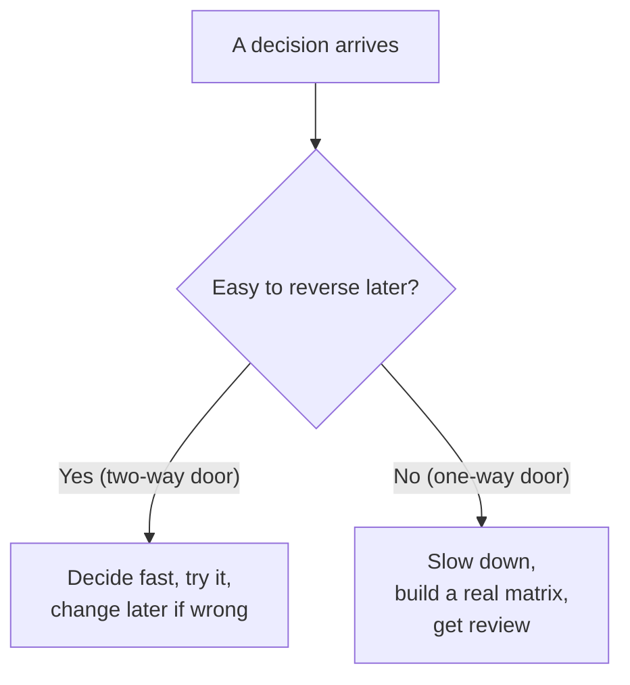

# Evaluating Tradeoffs Objectively — Junior

> **What?** Evaluating tradeoffs objectively means choosing between two or more technical options by comparing them against criteria you wrote down *before* you looked at the options — so you can't quietly bend the comparison toward the option you already liked.
>
> **How?** You name the criteria first, score each option honestly, prefer the option that wins on the criteria that actually matter, and write down *why* you chose it so future-you (and your reviewer) can check the reasoning.

---

A tradeoff is what happens when no option is best at everything. Option A is faster but harder to operate. Option B is simpler but slower. Option C is cheap now but expensive later. "Evaluating tradeoffs" is the skill of turning that messy fog into a defensible answer — and "objectively" is the hard part, because your brain is constantly trying to declare a winner before the evidence is in.

This topic is the synthesis of the whole **Critical Thinking** section. It uses the claims-and-evidence discipline from [01-claims-evidence-and-reasoning](../01-claims-evidence-and-reasoning/), avoids the [logical fallacies](../02-logical-fallacies-in-engineering/), and fights the [cognitive biases](../03-cognitive-biases-in-code-decisions/) that make us rationalize.

## 1. The core problem: you decide first, then justify

Here is what actually happens to most junior engineers:

1. You read about a shiny tool (say, a new database).
2. Some part of you wants to use it.
3. You "evaluate alternatives" — but really you're collecting reasons for the choice you already made.

This is called **motivated reasoning**, and it feels exactly like careful analysis from the inside. You're not lying; you genuinely believe you're being fair. That's what makes it dangerous.

The single most effective defense is almost embarrassingly simple:

> **Write down the criteria *before* you look at the options.**

Once your criteria are fixed in advance, you can't invent a new one ("...and it has a really nice logo") the moment your favorite is losing. The criteria become a contract with your honest self.

## 2. Make the decision criteria explicit, first

Before comparing tools, write a short list of what "good" means *for this specific decision*. Not in general — for this decision.

Say you're picking a way to store user sessions. Reasonable criteria:

| Criterion | Why it matters here |
| --- | --- |
| Read latency | Sessions are read on every request |
| Operational simplicity | Our team is small; nobody wants a new system to babysit |
| Durability | Losing a session logs a user out — annoying, not catastrophic |
| Team familiarity | We already run this in production |
| Cost | We're on a tight budget |

Notice two things. First, you wrote these *without naming a single tool yet*. Second, some criteria already feel more important than others — durability is "annoying, not catastrophic," but read latency hits every request. Hold that thought; it becomes the dominant-axis idea in [middle.md](./middle.md).

## 3. "Compared to what?" — no option lives in a vacuum

The most common junior mistake is evaluating one option in isolation: "Redis is fast and easy, let's use it." Fast *compared to what*? Easy *compared to what*?

Every option must be judged against at least one **baseline** — and the most important baseline is almost always **do nothing / keep what we have**.

```text
Bad framing:   "Should we adopt Kafka?"        (one option, floating in space)
Good framing:  "Kafka  vs  our current cron-based job table  vs  a managed queue"
```

If you can't beat "do nothing," the answer is do nothing. This sounds obvious, but a shocking number of migrations and rewrites happen because nobody ever seriously listed "keep the current system" as a real option with its own column.

## 4. A first weighted decision matrix

Now combine the pieces. List options as columns, criteria as rows, score each cell, and — crucially — **weight** the criteria by how much they matter. Scores here are 1–5 (5 = best).

Decision: where to store sessions. Baseline included.

| Criterion (weight) | Keep: DB table | Redis | Managed cache |
| --- | --- | --- | --- |
| Read latency (×3) | 2 | 5 | 5 |
| Op simplicity (×3) | 5 | 3 | 4 |
| Durability (×1) | 4 | 2 | 3 |
| Team familiarity (×2) | 5 | 2 | 2 |
| Cost (×2) | 5 | 4 | 2 |
| **Weighted total** | **2·3+5·3+4·1+5·2+5·2 = 45** | **5·3+3·3+2·1+2·2+4·2 = 38** | **5·3+4·3+3·1+2·2+2·2 = 38** |

Read that result carefully, because it's the whole point of doing this: **"keep the DB table" wins (45)** — even though Redis and the managed cache are faster — because the weights say operational simplicity, familiarity, and cost matter more *to this team, right now* than raw latency. The matrix didn't pick the trendy answer. It picked the answer the criteria support.

That's objectivity: you let the criteria choose, and you accept the result even when it's boring.

## 5. The matrix's failure mode (so you don't fool yourself with it)

A weighted matrix is not magic. Its big failure mode is **fudging the weights to get the answer you wanted**.

Watch yourself for this tell: you build the matrix, your favorite *loses*, and your very next instinct is "hmm, maybe latency should be ×4 instead of ×3." Maybe it should! But you must decide that **on the merits of the criterion**, not because it flips the result. The honest move is to set weights *before* you compute totals, or to ask: "If this change makes my favorite win, would I still make it if it made my favorite lose?"

A second tell: inventing a brand-new criterion the moment you're losing. If "great documentation" wasn't in your list before, adding it now — exactly when it rescues your pick — is rationalization wearing a lab coat. (This is the [confirmation bias](../03-cognitive-biases-in-code-decisions/) trap.)

## 6. Not every decision deserves the same rigor

A full matrix for *every* choice would be exhausting and is itself a mistake (you'd never ship). The amount of rigor should match the **cost of being wrong** and **how hard the decision is to undo**.



- **Two-way door** (easy to reverse): which logging library, a function's name, a feature flag's default. Just pick one and move; you can change it next week. Agonizing here wastes time.
- **One-way door** (hard or expensive to reverse): your primary database, a public API contract, a data format other teams depend on. These deserve the matrix, a written record, and a second opinion.

This idea — most decisions are two-way doors and should be made fast — comes from Amazon's 2015 shareholder letter and is developed fully in [senior.md](./senior.md).

## 7. Write down why (the seed of an ADR)

When the decision matters, record it in three short lines:

```text
Decision:  Keep sessions in the DB table for now.
Because:   Op simplicity + team familiarity + cost outweigh latency for our scale.
Revisit:   If read latency on /me exceeds 50 ms p99, re-run this with caching back in.
```

That little note is the embryo of an **Architecture Decision Record (ADR)** — the artifact that forces honest tradeoff thinking, covered in [middle.md](./middle.md) and at [code-craft/documentation](../../../code-craft/documentation/05-architecture-decision-records-adrs/). Its real value isn't documentation; it's that writing the *because* line forces you to actually have a reason.

## 8. Score honestly: distinguish "measured" from "guessed"

When you fill a cell, you're making a small claim — and like any claim (see [01-claims-evidence-and-reasoning](../01-claims-evidence-and-reasoning/)) it has evidence behind it, or it doesn't. There are three kinds of cell:

- **Measured** — you ran a benchmark, read the pricing page, counted the lines. "Redis read latency: 5 (we measured sub-ms in a spike)."
- **Estimated** — you have informed judgment but no number. "Op simplicity: 3 (judgment, not measured)."
- **Guessed** — you genuinely don't know and picked a number to fill the gap.

The junior mistake is rendering all three as identical confident integers, so a matrix built half on guesses *looks* as solid as one built on benchmarks. The fix costs nothing: annotate the cell. `5 (measured)` vs `3 (guess)`. Now when the totals are close, you can see whether the result rests on facts or on vibes — and if a *guessed* cell sits on the dominant axis, that's a flashing sign to go measure it before deciding. Honest scoring is just refusing to dress up a guess as a fact.

## 9. Common junior anti-patterns

- **Resume-driven development.** Choosing the option that looks best on your CV, not the one that serves the project. The criteria list defends against this — "looks good on my resume" never survives being written down as a row.
- **Latest-and-greatest.** Treating "newest" as a criterion. Newness is a *risk*, not a benefit.
- **One-option tunnel vision.** Evaluating a single option with no baseline. Always have a "compared to what?"
- **False precision.** Writing "this is 23% better" when you guessed every number. If you guessed, say you guessed.
- **Skipping the boring winner.** When the matrix picks the unexciting option, that's usually the matrix working, not failing.

## 10. Practice

1. Take a recent decision you made on autopilot (a library, a folder structure). Write the criteria you *should* have used, *now*, and check whether your choice still wins.
2. For any "should we adopt X?" question you hear this week, restate it as "X vs Y vs do-nothing" before forming an opinion.
3. Build one tiny weighted matrix (3 options × 4 criteria) and notice the moment you feel tempted to nudge a weight. Don't. Just notice.

---

**Key takeaway:** Decide what "good" means *before* you look at the options, always compare against a baseline including "do nothing," match your rigor to how hard the decision is to undo, and write down the *because*. Objectivity isn't a personality trait — it's a procedure that makes it hard to lie to yourself.

**Next:** [middle.md](./middle.md) — dominant axes, total cost of ownership, and turning the matrix into an honest ADR.

---
## Check your understanding

Try to answer these questions from memory:

1. How do you keep yourself from rationalizing the option you already prefer?
2. What is a weighted decision matrix and what is its main failure mode?
3. What's a one-way door vs a two-way door, and why does it matter?
