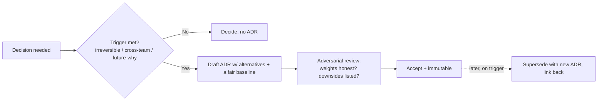

# Evaluating Tradeoffs Objectively — Professional

> **What?** At staff/principal level, evaluating tradeoffs objectively is an *organizational capability*, not a personal skill: you design the decision process other teams use, govern the ADR corpus, calibrate where the org over- and under-deliberates, make a few genuinely irreversible bets under deep uncertainty, and defend those bets to executives who don't share your context.
>
> **How?** You install lightweight, consistent decision frameworks; assign clear decision rights; instrument decision *quality and latency* as first-class metrics; convert one-way doors to two-way at the architecture level; and translate engineering tradeoffs into the currency leadership reasons in — money, risk, and time.

---

[senior.md](./senior.md) covered making the right call at the right speed. The principal job is to make *the whole organization* good at this — so that hundreds of decisions you'll never see are made objectively, at the right tempo, and leave an honest trail. Your leverage is the *process and culture*, not any single matrix.

## Action card
1. Put each decision at the lowest responsible ownership level.
2. Standardize the frame, including alternatives, downside, and revisit trigger.
3. Measure decision latency and review outcomes without hindsight blame.

**Decision rule:** govern the process, not the answer.

## 1. Decision rights: who decides what, at what altitude

Most organizational decision dysfunction is not bad analysis — it's *unclear ownership*. Decisions stall in committee, or get re-litigated, or are made three levels too high. Before improving how decisions are *made*, fix *who makes them*.

| Decision class | Owner | Mechanism | Reversibility |
| --- | --- | --- | --- |
| Local impl choices (library, naming, internal structure) | The team | Just do it; no record needed | Two-way |
| Service-level architecture (datastore, queue, API shape) | Team + a reviewing senior | ADR, reviewed | Mostly one-way |
| Cross-team standards (auth, observability, RPC framework) | Architecture group / staff+ | RFC + ADR + explicit buy-in | One-way, org-wide |
| Org-shaping bets (cloud vendor, monolith→services, platform) | Principal + leadership | Decision doc + exec sign-off | Hard one-way |

The anti-pattern Bezos named — applying heavyweight process to lightweight decisions — is an *org-design* failure at scale. Your job is to push each decision class to the lowest altitude that can own it responsibly, and to make that altitude explicit so nobody escalates a two-way door to a VP.

## 2. ADR governance: the corpus as an asset

A single ADR is a note. A thousand ADRs across an org is either a searchable record of *why the system is the way it is* — or write-only landfill. The difference is governance.

What a principal installs:

- **A canonical template and location.** One ADR format (Nygard-style: Status / Context / Decision / Alternatives / Consequences), in-repo next to code, lightweight enough that people actually write them. See [code-craft/documentation](../../../code-craft/documentation/05-architecture-decision-records-adrs/).
- **A trigger rule.** "Write an ADR when a decision is (a) hard to reverse, *or* (b) crosses a team boundary, *or* (c) future-you will ask 'why on earth did we...'." Not for every choice — over-documenting kills the habit faster than under-documenting.
- **Immutability + supersession.** ADRs are never edited after acceptance; they're *superseded* by a new one that links back. The graph of supersessions is the architecture's intellectual history. "ADR-014 superseded by ADR-088 (we hit the scale trigger we predicted)" is organizational learning made durable.
- **The "Consequences" audit.** In review, the staff move is to reject any ADR whose Consequences section lists only upsides. A decision with no stated downside wasn't evaluated; it was sold. This single gate does more for org-wide objectivity than any matrix template.

## 3. Standardize the *frame*, not the answer

You don't want every team using a different decision ritual, but you also can't mandate the answers. Standardize the *frame* — a thin, shared scaffold:

1. **State the decision and its reversibility** (one/two-way door) — sets the rigor budget.
2. **List options including the do-nothing baseline**, scored fairly.
3. **Name the dominant axis and any knockout gates.**
4. **Weights set before scores; mark measured vs estimated.**
5. **Cost of delay and TCO over a stated horizon.**
6. **Sensitivity check + pre-committed revisit trigger.**

When every team uses the same frame, decisions become *reviewable across teams*, biases become legible (a reviewer can spot fudged weights because the frame exposes them), and you can coach the *process* without dictating outcomes. Consistency of frame is what lets objectivity scale past the people you personally review.

## 4. Instrument decision quality *and* latency

You can't improve what you don't measure, and the org-level failure modes are *paralysis* and *recklessness* — both invisible without instrumentation.

- **Decision latency.** How long from "decision needed" to "decided"? Long latencies on *two-way doors* are pure waste — the org is over-rigoring reversible calls. This is the most common, most expensive, least-noticed org pathology.
- **Revisit rate by door type.** Two-way doors *should* sometimes be revisited — that's the point of cheap reversibility. One-way doors revisited often means the org is *mis-classifying* doors (treating big bets as casual).
- **Decision/outcome separation in retros.** Institutionalize the [senior.md](./senior.md) discipline: in postmortems, judge the *process given information available*, not the outcome. Punishing good-process/bad-outcome decisions teaches people to stop taking defensible risks and to optimize for blame-avoidance — the death of objectivity. (Guards against [hindsight bias](../03-cognitive-biases-in-code-decisions/) at org scale.)

## 5. Making the genuinely irreversible org bet

Some decisions are one-way doors you can't convert: the cloud provider, the core data model the company is built on, a build-vs-buy on something central. Under deep uncertainty, the principal's framework:

1. **Reduce the door count.** Most of what looks like one big irreversible bet decomposes into several smaller, partly-reversible ones. Strangler-fig migrations, anti-corruption layers, and vendor-abstraction ports turn one terrifying door into a sequence of survivable ones. *Most* of the rigor goes into finding this decomposition.
2. **Buy decisive information cheaply.** Fund a time-boxed spike or a paid proof-of-concept whose explicit job is to resolve the dominant axis. Information that de-risks a multi-year bet is the highest-ROI spend available.
3. **Make assumptions falsifiable and dated.** "We bet engineer headcount grows to ~80 by 2028 (60% confident); below 50, this platform investment is net-negative." Now the bet has a tripwire, not just a hope. (See [06-probabilistic-thinking](../../06-probabilistic-thinking/).)
4. **Pre-mortem.** Run the [systems-thinking](../../03-systems-thinking/) exercise: "It's two years out and this failed catastrophically — what happened?" Pre-mortems surface the second-order and feedback-loop failures a matrix misses (the vendor got acquired, hiring dried up, the abstraction leaked).
5. **Accept that you will decide with insufficient information** — and that this is the job. The deliverable is a decision *defensible on its process*, with the failure conditions written down before you walk through the door.

## 6. Defending a decision to executives

Leadership reasons in money, risk, and time — not in latency percentiles. Translating without distorting is a core principal skill.

| Engineering framing | Executive framing |
| --- | --- |
| "Postgres is more operable for us" | "Lower delivery risk and no new hires; we ship the roadmap on schedule" |
| "Distributed SQL scales to 10×" | "Insurance against a scale problem that's 60% likely in 2 yrs, at $X/yr carry cost" |
| "We added a storage abstraction" | "We bought the cheap option now and kept the door open to switch later for ~1 week of work" |
| "We sensitivity-checked the weights" | "The recommendation holds even under pessimistic assumptions" |

Principles when defending:

- **Lead with the recommendation and the one reason**, then the tradeoff. Executives don't want your matrix; they want your judgment, with the matrix available as backing.
- **Name what you're giving up.** Volunteering the downside *builds* credibility; an option with no downsides reads as a sales pitch and gets distrusted. This is the [claims-and-evidence](../01-claims-evidence-and-reasoning/) discipline at the leadership altitude.
- **Defend the process, not the prediction.** "Here is what would change this decision" is more credible than false certainty — and it pre-empts the "you said it would work" attack if the dice come up bad.
- **Price the cost of delay of *deciding*.** When leadership wants more analysis on a two-way door, show the weekly cost of waiting (per [Reinertsen](./senior.md)). Often "decide now, revisit if wrong" is visibly cheaper than the meeting requesting more study.

## 7. Cultural failure modes you own at scale

- **Sophistication theater.** Teams build elaborate matrices to *launder* a decision already made. The fix is process — weights before scores, adversarial review — not more numbers. More numbers make laundering *look* more rigorous.
- **HiPPO override.** The Highest-Paid-Person's-Opinion silently sets the weights. As the HiPPO, your job is to *withhold* your preference until the frame is filled, or you'll never get an honest matrix from your team again.
- **Consensus paralysis.** Requiring everyone to agree turns every decision one-way. Install **"disagree and commit"** and clear decision rights so a settled call stays settled.
- **Reversibility blindness.** An org that treats every decision as permanent grinds to a halt; one that treats every decision as casual breaks production. Your calibration job is to keep both error types in view and coach door-diagnosis relentlessly.

## 8. Practice

1. Map your org's decision rights for one architectural domain. Find a decision class being made at the wrong altitude and propose moving it.
2. Audit ten recent ADRs. How many have a Consequences section that lists a real downside? Report the fraction; it's a direct objectivity metric.
3. Pick a "big irreversible bet" your org is contemplating. Decompose it into smaller, partly-reversible decisions and identify the cheapest spike that would resolve the dominant axis.
4. Take a real engineering tradeoff and write the three-sentence executive version: recommendation, the one reason, what you're giving up.

---

**Key takeaway:** At staff/principal level, objectivity is infrastructure: clear decision rights, a standardized decision frame, governed and immutable ADRs that force downsides into the open, instrumented decision latency and revisit rates, and the discipline to judge decisions by process not outcome. The irreversible bets you make personally are won mostly by *decomposing the door* and buying cheap decisive information — and defended to leadership by translating tradeoffs into money, risk, and time while honestly naming what you gave up.

**Next:** [check your understanding](#check-your-understanding) — tradeoff questions you'll be asked, and [check your understanding](#check-your-understanding) — build-and-defend-a-matrix exercises.

---
## Recall and apply

Try to answer these questions from memory:

1. What is an Architecture Decision Record and why does it help objectivity?
2. A decision you made looks wrong six months later. How do you judge it?
3. How do you avoid analysis paralysis?
4. How would you convert a one-way door into a two-way door?
