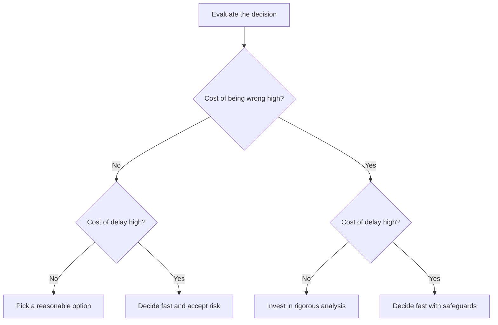

# Evaluating Tradeoffs Objectively — Senior

> **What?** At senior level, evaluating tradeoffs objectively means making the *right call at the right speed under real uncertainty*: weighing the cost of being wrong against the cost of delay, distinguishing genuinely irreversible decisions from those merely framed that way, and building decisions that stay defensible when the inputs are fuzzy.
>
> **How?** You quantify cost of delay where you can, deliberately *under*-rigor the reversible decisions to preserve velocity, *over*-rigor the few one-way doors, design optionality so fewer doors are one-way, and produce decisions whose reasoning survives being challenged by someone who wanted the other answer.

---

[middle.md](./middle.md) gave you a rigorous matrix, TCO, and ADRs. The senior shift is from *scoring options* to *managing the decision itself* — its speed, its risk, and its reversibility — because the most expensive mistakes are rarely picking the wrong option; they're spending six weeks deciding something you could have tried in an afternoon, or rushing the one decision you couldn't take back.

## Action card
1. Price both delay and being wrong.
2. Diagnose reversibility and create optionality where it pays.
3. Pre-commit assumptions, evidence needs, and revisit triggers.

**Decision rule:** spend analysis where irreversible downside outweighs delay.

## 1. The two error costs you're trading between

Every decision sits between two costs that pull in opposite directions:

- **Cost of being wrong** — the damage if you choose the worse option.
- **Cost of delay** — the damage accumulated *while you decide* (lost revenue, blocked teams, opportunity windows closing, decision fatigue).

Objectivity at this level means **pricing both** and acting accordingly.



- **Low wrong / low delay** (bottom-left): trivial. Flip a coin and move; deliberating is pure waste.
- **Low wrong / high delay** (bottom-right): reversible *and* expensive to stall — bias hard toward speed.
- **High wrong / low delay** (top-left): **the decisions that deserve your rigor.** No clock pressure, large downside — slow down, run the full process.
- **High wrong / high delay** (top-right): the genuinely hard ones — buy information fast (a spike, a prototype, an expert) to shrink the "wrong" cost without paying the full delay.

Most engineers instinctively apply rigor in proportion to how *interesting* the decision is. The discipline is to apply it in proportion to **(cost of wrong) × (probability of wrong)**, discounted by reversibility.

## 2. Cost of delay, quantified

Donald Reinertsen (*The Principles of Product Development Flow*, 2009) made the core argument: cost of delay is the most under-quantified number in engineering, and quantifying it changes decisions.

Worked example — a migration is blocked pending a "which message broker?" decision:

```text
Blocked work value:        feature unblocks ~$30k/mo of new revenue
Each week of deliberation:  ~$7k of delayed revenue  (30k / 4.3 weeks)
Realistic decision quality gain from week 3→6 of analysis: near zero
                            (the matrix stopped moving after week 2)

→ Weeks 3–6 of "more analysis" cost ~$21k to buy ~$0 of better decision.
```

The number reframes the meeting. "We need more time to be sure" is a *claim with a price tag*, and once you put the tag on it, the team usually agrees the do-nothing baseline of "decide Friday" beats "decide eventually." Reinertsen's related tool, **Weighted Shortest Job First (WSJF)** — sequence work by *cost of delay ÷ job duration* — is a useful contrast: it's a *prioritization* heuristic for queues, not a *single-decision* tool, so don't misapply it as a tradeoff matrix. They share the insight that delay has a real, computable cost.

## 3. One-way vs two-way doors — and how to convert them

Jeff Bezos's 2015 Amazon shareholder letter draws the distinction precisely:

> Some decisions are consequential and irreversible or nearly so — one-way doors — and these decisions must be made methodically, carefully, slowly, with great deliberation and consultation. ... But most decisions aren't like that — they are changeable, reversible — they're two-way doors. ... As organizations get larger, there seems to be a tendency to use the heavy-weight Type 1 decision-making process on most decisions, including many Type 2 decisions. The end result of this is slowness, unthoughtful risk aversion, failure to experiment, and consequently diminished invention.

Two senior skills follow:

**(a) Diagnose the door honestly.** Teams routinely *mis-label* decisions as one-way to justify endless deliberation, or as two-way to justify recklessness. Test it concretely: "If we choose A and it's wrong, what's the cost to switch to B in six months?" Often the honest answer is "a week of work" — that's a two-way door wearing a one-way costume.

**(b) Convert one-way doors into two-way doors.** This is high-leverage architecture work:

| One-way door | Conversion tactic | Now it's |
| --- | --- | --- |
| Pick *the* database | Put a repository/storage interface in front of it | Two-way-ish: swap implementations |
| Public API shape | Version it; ship `v1` behind a gateway | Reversible: deprecate, don't break |
| Commit to a vendor | Abstract behind your own port; avoid proprietary features | Portable |
| "Rewrite vs refactor" | Strangler-fig incrementally | Reversible at each step |
| Choose a data format | Use a schema with evolution rules (e.g. Avro/protobuf) | Forward/backward compatible |

The abstraction has a cost (indirection, generality you may not need — see [02-logical-fallacies](../02-logical-fallacies-in-engineering/) on premature generalization). So convert doors *selectively*: pay for optionality only where the cost of being wrong is high and your uncertainty is high. Optionality is itself a tradeoff to evaluate, not a free good.

## 4. Making a one-way-door call under uncertainty

When the door really is one-way and you can't make it two-way, you still have to decide with incomplete information. A disciplined approach:

1. **Define "good enough to decide."** Decide *in advance* what evidence would settle it. This stops the goalposts from moving (a [confirmation-bias](../03-cognitive-biases-in-code-decisions/) defense) and prevents endless info-gathering.
2. **Buy the cheapest decisive information first.** A two-day spike that resolves the dominant axis is worth more than two weeks of debate. Order your investigation by *information value per hour*.
3. **State assumptions as falsifiable claims with confidence.** "We assume write volume stays under 100k/s for 18 months (70% confident)." Now the decision's fragility is visible and the trigger to revisit is explicit. (See [06-probabilistic-thinking](../../06-probabilistic-thinking/) for reasoning under uncertainty.)
4. **Pre-commit a kill/revisit criterion.** "If p99 write latency exceeds 40 ms at 30k/s in staging, we abandon this option." A decision with a written failure condition is honest; one without is faith.
5. **Get an adversarial review.** Ask the person most likely to disagree to attack the decision *before* it ships, not after it fails.

## 5. Optionality and the cost of keeping options open

A subtle senior tradeoff: **deferring a decision has value** when information is arriving, but keeping options open also has a carrying cost (you build to a lower-common-denominator, you maintain abstractions, the team holds ambiguity).

The rule: **defer a decision until the last responsible moment** — the point past which delaying *forecloses* a good option or the cost of delay overtakes the value of waiting. Earlier than that, deferral buys information cheaply. Later, you're just procrastinating. Naming "the last responsible moment" out loud turns vague stalling into a scheduled, defensible choice.

## 6. A senior-grade matrix: weights, knockouts, and a stated horizon

Decision: primary datastore for a new service expected to 10× in 2 years. This is a one-way door, so full rigor and a sensitivity check are warranted.

**Gates (pass/fail):** ACID transactions required (eliminates two candidates); on-prem deploy possible (regulatory). Survivors: Postgres, a distributed SQL DB.

**Stated horizon:** 2 years. **Loaded eng-hour:** $120.

| Criterion (weight, justification) | Postgres + read replicas | Distributed SQL |
| --- | --- | --- |
| Operability with our team today (×3 — dominant; we have no distributed-DB experience) | 5 | 2 |
| Scale headroom to 10× (×3 — the reason this is hard) | 3 | 5 |
| TCO over 2 yr incl. ops labor (×2) | 4 | 2 |
| Migration / reversibility cost if wrong (×2) | 4 | 2 |
| Ecosystem & hiring (×1) | 5 | 3 |
| **Weighted total** | **5·3+3·3+4·2+4·2+5·1 = 45** | **2·3+5·3+2·2+2·2+3·1 = 32** |

Postgres wins (45 vs 32). But note the *real* tension: the two dominant axes (operability now vs scale headroom) point in **opposite** directions — that's the actual decision, and the matrix surfaces it instead of hiding it. The senior judgment: operability today is a *certain* cost; the 10× scale is a *probabilistic future* cost. We weight the certain present higher, **and** we convert the door — adopt Postgres behind a storage interface, and pre-commit: "if sustained writes pass 40k/s with replica lag > 2s, re-open this ADR." We bought the present and bought an option on the future. The sensitivity check confirms Postgres survives a ±1 nudge to scale-headroom; if it hadn't, we'd invest in a spike before committing.

## 7. Defending the decision (and surviving hindsight)

A senior decision must withstand two attacks:

- **At decision time:** someone who wanted the other option challenges your weights. Your defense is the *process*: weights set before scoring, baseline scored fairly, sensitivity-checked, assumptions stated. You're not defending the *outcome*; you're defending that the procedure was honest. "Here's what would have changed my mind" is the strongest thing you can say.
- **In hindsight, if it goes wrong:** [hindsight bias](../03-cognitive-biases-in-code-decisions/) makes the failure look obvious in retrospect. The ADR — frozen with the information you *actually had* — is your defense. A good decision can have a bad outcome; you judge decisions on the process and the information available *at the time*, not on the dice roll. Capturing that information is exactly why the ADR exists.

## 8. Avoiding analysis paralysis at the org level

Seniors set the *tempo* for others. Practical moves:

- **Name the door out loud.** "This is a two-way door — let's spend 30 minutes, not 3 days." Saying it gives the team permission to move.
- **Time-box the analysis.** "We decide Thursday with what we have." A decision deadline is a tool, not a failure.
- **Default to action on reversible calls.** Make "try it behind a flag and measure" the cultural default; reserve deliberation for the one-way doors.
- **Disagree and commit.** Once the call is made, the people who preferred another option commit fully. Re-litigating a settled two-way door is its own cost of delay.

## 9. Practice

1. Take a decision your team is currently agonizing over. Diagnose the door honestly, and design one concrete tactic to convert it from one-way to two-way.
2. Quantify the cost of delay for a currently-blocked piece of work. Put a weekly dollar figure on "more analysis."
3. For a real one-way-door decision, write the pre-committed kill/revisit criterion *before* deciding.
4. Take a past decision that turned out badly. Separate "was the *process* sound given what we knew?" from "was the *outcome* good?" Notice how often they diverge.

---

**Key takeaway:** Trade off rigor itself — price the cost of delay against the cost (and probability) of being wrong, then spend deliberation only where it pays. Diagnose doors honestly and convert one-way doors to two-way where the stakes justify it. Make irreversible calls with pre-committed kill criteria and stated assumptions, and defend decisions on the integrity of the process, not the luck of the outcome.

**Next:** [professional.md](./professional.md) — running tradeoff evaluation as an org-level process, ADR governance, and defending decisions to executives.

---
## Recall and apply

Try to answer these questions from memory:

1. SQL vs NoSQL for a new service — how do you evaluate it objectively?
2. Monolith vs microservices — what's the honest tradeoff?
3. How do you handle a criterion that can't be quantified, like "developer experience"?
4. Your weighted matrix says option B, but your gut says A. What do you do?
