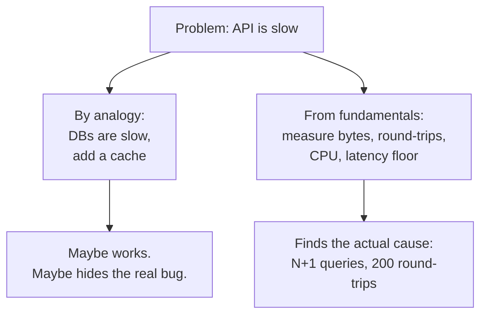

# Reasoning from Fundamentals — Junior

> **What?** *Reasoning from fundamentals* (first-principles thinking) means breaking a problem down to the things that *must* be true — physics, math, the hard requirements — and building your answer up from there, instead of copying what someone else did.
> **How?** When you hit a "we do it this way because that's how everyone does it," stop and ask: *what is actually forcing this?* Replace the borrowed answer with numbers and facts you can check yourself.

---

## 1. Two ways to answer any question

There are only two ways to decide *how* to build something.

**Reasoning by analogy** — "We'll use Kafka because the last team used Kafka." "Cache it, because caching is best practice." "The API is slow because databases are slow." You are pattern-matching to something you've seen before. It's fast, it's usually fine, and it's how 95% of decisions get made.

**Reasoning from fundamentals** — "This endpoint returns 2 KB of JSON. At 1 Gbps that's ~16 microseconds on the wire. The DB query touches one indexed row. So *nothing here should take 400 ms* — let's find what actually does." You ignore what's normal and ask what the problem itself demands.

The term is old. Aristotle called these bedrock truths *archai* — the "first things" from which everything else is derived. Descartes did the same in 1637: doubt everything you can, keep only what survives, rebuild from that. The modern engineering version was made famous by Elon Musk talking about battery packs (more on that below).



---

## 2. What "fundamental" actually means

A **fundamental** is something that is true no matter how you build the system. It doesn't care about your framework, your company, or last year's design.

| Looks fundamental but isn't (inherited assumption) | Actually fundamental |
| --- | --- |
| "REST is the right choice." | A request has to cross the network at most at the speed of light. |
| "We need microservices." | The data has to be stored *somewhere*, and reads/writes cost real bytes. |
| "Sessions must be in Redis." | The user's identity must be verifiable on each request. |
| "We always batch in 100s." | The total work is N items; batching only changes *how* you group it. |

Notice the right column is made of **physics, math, and hard requirements**. The left column is made of **habits and history**. First-principles thinking is mostly the skill of telling these two apart.

A quick test: ask *"says who?"* five times.

> "We need a queue here." → Says who? → "The senior said so." → Says who decided *he* was right? → "It's standard for async work." → Is our work actually async, or did we just inherit that word?

You're not being difficult. You're peeling off borrowed answers until you reach something you can verify.

---

## 3. The numbers a junior should memorize

You can't reason from fundamentals about performance without rough numbers in your head. These come from Jeff Dean's famous "Latency Numbers Every Programmer Should Know" and Hennessy & Patterson's *Computer Architecture*. Approximate, but the *ratios* are what matter.

| Operation | Rough time | In human terms (×1 billion) |
| --- | --- | --- |
| L1 cache reference | ~1 ns | 1 second |
| Main memory (RAM) reference | ~100 ns | 1.5 minutes |
| Read 1 MB sequentially from RAM | ~10 µs | ~3 hours |
| SSD random read | ~100 µs | ~1 day |
| Round trip within a datacenter | ~500 µs | ~6 days |
| Read 1 MB from SSD | ~1 ms | ~11 days |
| Disk (HDD) seek | ~10 ms | ~4 months |
| Packet round trip US → Europe → US | ~150 ms | ~5 years |

Two facts fall straight out of this table:

1. **Network round-trips dominate everything.** One cross-continent round trip (150 ms) is worth *150,000* memory reads. If your page makes 30 sequential API calls, that's 4.5 seconds of pure waiting before any computation.
2. **The speed of light is a hard floor.** Light travels ~300,000 km/s in vacuum, ~200,000 km/s in fiber. New York to London is ~5,500 km, so the *theoretical minimum* round trip is ~55 ms — and reality is ~75 ms. No amount of clever code beats that. If your boss wants <10 ms responses for London users from a US-only server, that's not an engineering problem; it's a *geography* problem, and the only fix is a server in Europe.

---

## 4. A worked example — "the API is slow because the DB is slow"

This is the most common analogy-driven mistake juniors make. Let's reason it out.

A teammate says: *"The `/dashboard` endpoint takes 800 ms. Databases are slow, let's add Redis."*

Reasoning from fundamentals, ask: **what does this endpoint fundamentally have to do?**

- It returns the user's 20 most recent orders → ~20 rows.
- Each row is ~500 bytes → ~10 KB total.
- The DB is one indexed lookup on `user_id`.

Now the floors:

- One indexed row read on a warm DB: **< 1 ms**.
- 10 KB over a 1 Gbps link inside the datacenter: **~80 µs** on the wire, plus one round trip **~0.5 ms**.
- JSON-encoding 10 KB: well under **1 ms**.

So the *fundamental cost* of this endpoint is **single-digit milliseconds**. It is taking 800 ms. The DB is not "slow" — something is doing 100× more work than the problem requires. When you actually trace it, you almost always find:

```text
SELECT * FROM orders WHERE user_id = ?     -- returns 20 rows
-- then, for EACH order:
SELECT * FROM order_items WHERE order_id = ?   -- 20 extra queries!
SELECT * FROM products WHERE id = ?            -- and 20 more!
```

That's the **N+1 query problem**: 1 + 20 + 20 = 41 round trips instead of 1. At ~0.5 ms each that's ~20 ms of pure round-trips — and with a slow connection pool, easily 800 ms. The fix is a `JOIN` or a batched load, not a cache. **Caching would have hidden the bug and added a whole new system to maintain.**

The lesson: when the measured cost is far above the fundamental floor, the gap *is* the bug. Find the gap before you add machinery.

---

## 5. The Musk battery example, in software terms

The story engineers cite most: around 2008, batteries "cost" ~$600/kWh and everyone treated that as fixed — reasoning by analogy from market prices. Musk's team instead asked: *what are batteries made of?* Cobalt, nickel, aluminium, carbon, some polymers. *What do those raw materials cost on the commodity market?* About $80/kWh. The rest was packaging, history, and middlemen — not physics. That gap became the business.

The software version of that question is: **"What does this feature *fundamentally* have to cost in compute, storage, and network?"**

Say a product manager claims a new "activity feed" feature is "too expensive to store." Decompose it:

- 1 million users, each posts ~5 events/day.
- Each event is ~200 bytes (an ID, a type, a timestamp, a target).
- Per day: 5M events × 200 B = **1 GB/day**.
- Keep 90 days hot: **~90 GB**.

90 GB of cold-ish storage costs a few dollars a month. The feature's *fundamental* storage cost is trivial. If someone says it's "too expensive," they're describing a *current implementation* (maybe storing full rendered HTML per event), not the *floor*. Now you can have a real conversation: "The floor is 90 GB; why are we at 9 TB?"

The recurring shape of this move: **separate the fundamental cost from the current cost.** The fundamental cost comes from physics and math — bytes, rows, round-trips. The current cost is whatever your implementation happens to do, plus all the history that piled up. The gap between them is your opportunity. Musk found a 7× gap in batteries; in software you routinely find 10×–100× gaps, because nobody ever computed the floor.

---

## 6. A small recipe you can run today

You don't need a method-of-Descartes ceremony. For any "we should do X" decision, run four quick steps on a sticky note:

1. **Write the goal as a number.** "p95 under 100 ms," not "fast." If you can't put a number on it, you don't yet understand what's being asked.
2. **Write the assumptions as sentences.** "We assume one DB call." "We assume JSON." Forcing them into words makes the invisible ones visible.
3. **Compute the floor.** Bytes × rate, rows × cost, round-trips × RTT. Rough is fine; you want the order of magnitude.
4. **Compare floor to reality.** If reality is close to the floor, the design is basically right — stop. If reality is 10× the floor, that 10× *is* your bug or your missing requirement.

```text
Goal:        /search returns in < 150 ms
Assumption:  one index query + render 30 results
Floor:       index lookup ~2 ms + 30×300 B = 9 KB over LAN ~0.5 ms ≈ a few ms
Reality:     900 ms  ← 200× over floor. Something is very wrong.
Find it:     turns out /search calls an external geocoder per result. 30 calls.
```

The whole skill is steps 2 and 3. Most people skip straight to step 4 ("it's slow, add a cache") and never learn what the problem actually demanded.

---

## 7. Three mistakes juniors make with this

- **Skipping the floor and "optimizing" blind.** Adding a cache before you know the floor often hides a bug instead of fixing it. Always compute the floor first.
- **Treating habits as physics.** "We always use X" is not a law of nature. Ask "says who?" until you hit something you can verify with a number or a spec.
- **Over-applying it.** Re-deriving every tiny choice from scratch is exhausting and slow. First-principles thinking is a *power tool*, not a way of life — see below for when to put it down.

---

## 8. When NOT to use it

First-principles reasoning is *expensive*. It takes time, focus, and willingness to be wrong in public. Use analogy by default and switch to fundamentals only when the stakes justify it:

- **Use analogy** for routine choices (which HTTP library, how to format a log line). Re-deriving these from scratch is a waste of a life.
- **Use fundamentals** when the numbers don't add up, when a decision is expensive to reverse, or when "everyone does it this way" is producing a result that smells wrong.

You don't have to choose forever. The skill is knowing *which mode this particular decision deserves.* A good rule of thumb: if the decision is **easy to undo**, reach for analogy and move on. If it's **hard to undo** (a database schema, a public API, how you store money), slow down and derive.

---

## 9. Practice the reflex

For one week, every time you hear "because that's how we do it" or "because it's best practice," silently ask one question: **"What would make that *not* true?"** You'll be surprised how often the borrowed answer survives — and how often it doesn't.

Next, sharpen the partner skill of pulling apart the assumptions hiding inside a requirement in [questioning assumptions](../02-questioning-assumptions/), and when you're ready to throw the inherited design away entirely, see [rebuilding solutions from scratch](../03-rebuilding-solutions-from-scratch/). The broader family of these mental tools lives in [critical thinking](../../04-critical-thinking/).

---
## Check your understanding

Try to answer these questions from memory:

1. Define first-principles reasoning and contrast it with reasoning by analogy.
2. Most decisions should be made by analogy. So when is first-principles worth its cost?
3. You decompose a design and find an assumption. How do you decide if it's negotiable?
