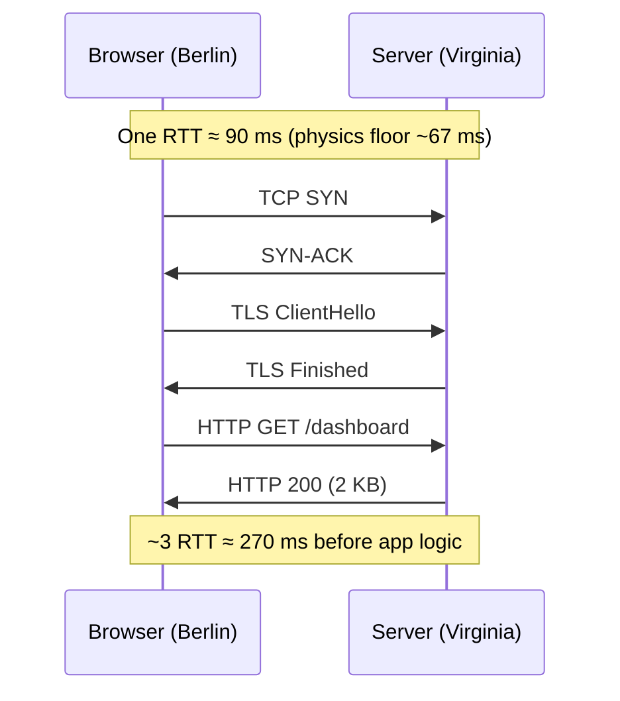

# Reasoning from Fundamentals — Middle

> **What?** A working method for separating *inherited assumptions* from *irreducible truths* — physics, math, and the actual contract — and deriving a design upward from those truths rather than copying a reference architecture.
> **How?** You make the floors explicit (latency, bandwidth, CPU, storage), compare them to what the system actually does, and treat every large gap as either a bug or a hidden requirement you haven't named yet.

---

## 1. The two modes, made precise

Aristotle's *archai* and Descartes' method of doubt are the philosophical roots, but as an engineer you need an operational version. Here it is:

- **Reasoning by analogy** maps a new problem onto a known solution by *surface similarity*. "This is like the order service, so we'll structure it like the order service." The risk: surface similarity hides a difference that the borrowed solution handles badly.
- **Reasoning from fundamentals** maps a problem onto the *constraints that generated it*. "Requests cross a WAN, payloads are ~2 KB, the workload is read-heavy 1000:1." From those, a design is *derived*, not *recalled*.

Analogy answers *"what's a solution that worked before?"* Fundamentals answer *"what is the smallest thing that could possibly satisfy the actual constraints?"*

A clean way to see the difference: analogy reasons *forward* from a known design; first-principles reasons *backward* from the constraints. This is why first-principles reasoning pairs naturally with Charlie Munger's *inversion* — instead of "how do I make this fast," ask "what would *force* this to be slow?" and remove those forces one by one.

---

## 2. The procedure

A repeatable five-step loop. Steps 1–2 are where most of the value is; juniors skip straight to 4.

1. **State the goal as a measurable target.** Not "make it fast" but "p99 < 50 ms for the EU region."
2. **List every assumption baked into the current/proposed design.** Write them as sentences: "we assume one DB call per request," "we assume JSON," "we assume the session lives in Redis." Most will be invisible until you force yourself to spell them out.
3. **For each assumption, classify it.** Is it a *law* (physics/math — cannot be moved), a *requirement* (the business genuinely needs it), or *convention* (we inherited it)? Only the third kind is negotiable, and it's usually the largest bucket.
4. **Compute the floor.** What's the minimum cost given only laws + requirements? Bytes, round-trips, CPU cycles, storage.
5. **Compare floor to reality.** The gap is your work. Either you close it, or you discover a requirement you missed (which justifies the gap).

| Step | Output | Common failure |
| --- | --- | --- |
| 1 Target | A number | "Faster" with no number |
| 2 Assumptions | A list | Leaving them implicit |
| 3 Classify | Law / req / convention | Calling convention a "requirement" |
| 4 Floor | A calculation | Hand-waving instead of arithmetic |
| 5 Compare | The gap | Optimizing before measuring the floor |

---

## 3. Building a latency floor from physics

Let's derive, not recall. A request from a browser in Berlin to your server in Virginia and back.

- **Geographic distance:** Berlin → Ashburn ≈ 6,700 km.
- **Light in fiber:** ~200,000 km/s (⅔ of vacuum *c* because of the refractive index of glass).
- **One-way propagation:** 6,700 / 200,000 = **33.5 ms**. Round trip: **~67 ms** — and that's the *theoretical minimum*, assuming a perfectly straight cable, which doesn't exist. Real RTT is ~90–110 ms.

Now layer the protocol costs, because real connections aren't one round trip:

- **TCP handshake:** 1 RTT.
- **TLS 1.3 handshake:** 1 RTT (TLS 1.2 was 2).
- **The actual HTTP request/response:** 1 RTT.

A *cold* HTTPS request is therefore ~3 RTT ≈ **270 ms minimum** before your server runs a single line of code. This is why connection reuse (keep-alive), TLS session resumption (0-RTT), and edge termination (CDN/PoP near the user) exist — they remove round trips, the only lever physics leaves you.

The takeaway for a mid-level engineer: **a meaningful share of "slowness" is round trips, and round trips are bounded below by geography.** Before optimizing code, count the round trips.

---

## 4. Throughput and CPU floors

Latency is one floor; throughput is another. Suppose you must serve 50,000 requests/sec and each does a 5 KB JSON serialization.

- 50,000 × 5 KB = **250 MB/s** of output. A 10 Gbps NIC = 1.25 GB/s, so the network isn't your wall — yet.
- JSON encoding runs at maybe ~300 MB/s/core in a fast library. 250 MB/s ÷ 300 = **~1 core just for serialization.** Plausible.
- But if each request also does a 200 µs DB round trip *synchronously on the request thread*, then one thread can do only 5,000 req/s. You'd need 10 threads *minimum* just blocked on I/O — and that's the real constraint, not CPU.

The discipline here: **identify which resource the floor is actually made of.** Is the wall bytes (network), cycles (CPU), round trips (latency), or blocked threads (concurrency model)? Each implies a totally different fix. Reasoning by analogy ("add more replicas") might scale the wrong dimension entirely.

---

## 5. The cost-decomposition (Musk battery in software)

The battery insight: distinguish the *commodity floor* (raw materials) from the *current price* (everything historical layered on top). Software equivalent: distinguish the *fundamental resource cost* from the *current implementation cost*.

Worked example — a team claims "real-time analytics is too expensive, we can't afford it."

Decompose what real-time analytics *fundamentally* requires:

| Component | Fundamental amount | Fundamental cost |
| --- | --- | --- |
| Ingest 100k events/s × 200 B | 20 MB/s = 1.7 TB/day | a few cloud $/day for the bytes |
| Aggregate into 1-min buckets | 100k → maybe 10k counters in RAM | a few MB of memory |
| Serve dashboards (100 viewers) | 100 × 5 KB/s | trivial |

The *floor* is small. If the current bill is $40k/month, the gap is in the implementation: maybe every event triggers a full table scan, or you're storing raw events in a row store with 10× write amplification. The first-principles move reframes the conversation from "we can't afford the feature" to **"the feature costs ~$X; we are paying ~$40X; where did the 40× go?"** That's an answerable, fundable question.

---

## 6. Spotting an inherited assumption

Inherited assumptions hide inside words that *feel* technical but are actually historical. Train your ear for them:

| Phrase you'll hear | The hidden assumption | The fundamentals question |
| --- | --- | --- |
| "We need a message queue here." | The work must be async and buffered. | Is it actually async, or just slow? |
| "Store it normalized in Postgres." | Relational + ACID is required. | Does anyone read across these tables together? |
| "We always paginate at 50." | The client can't take more. | What's the byte cost of 50 vs 500? |
| "Each service owns its DB." | Strong service boundaries are needed. | Do these two ever change independently? |

None of these are *wrong* — they're often right. The point is to make the assumption *visible and checkable* rather than load-bearing-but-invisible.

A practical trick: whenever you write "we need X," try replacing it with "X gives us Y, and Y is required because Z." If you can't fill in Z with a law or a real requirement, X is a convention wearing a requirement's clothes. "We need a queue" → "a queue gives us buffering, and buffering is required because... the producer can outrun the consumer?" — now you can *check* whether that's actually true for your load.

---

## 7. A worked floor model end-to-end

Let's run the full procedure on one concrete decision so the steps connect.

**Decision.** "Our notification fan-out is slow. Let's shard the database." (Analogy: big systems shard, we're getting big.)

**Step 1 — Target.** Deliver a notification to all of a user's followers within 2 s for p95. The hot case: a user with 100,000 followers posts.

**Step 2 — Assumptions.** (a) one row written per follower; (b) writes go through the primary; (c) fan-out happens synchronously on the post request.

**Step 3 — Classify.** (a) is a *convention* — we *chose* fan-out-on-write; fan-out-on-read is an alternative. (b) is *soft* — read replicas exist. (c) is *convention* — it could be async.

**Step 4 — Floor.** 100,000 inserts. A batched insert does ~10,000 rows in ~50 ms on a warm primary, so 100,000 rows ≈ **500 ms** of pure insert time — *if batched*. That's under the 2 s target. The floor says the work itself fits.

**Step 5 — Compare.** Production takes 45 s. Tracing shows **100,000 individual `INSERT` statements**, each its own round trip at ~0.4 ms = 40 s. The gap is not database *capacity* (which sharding addresses) — it's **round trips from unbatched writes.** Sharding would split the 40 s across N shards but still do 100,000 round trips; batching collapses it to a handful. The floor pointed at the right lever.

| Resource | Floor | Reality | Gap source |
| --- | --- | --- | --- |
| Insert work | ~500 ms (batched) | 40 s | 100k separate round trips |
| Storage | 100k × 50 B = 5 MB | 5 MB | none |
| Network | trivial | trivial | none |

The analogy ("shard it") scaled the wrong dimension. The floor model found the real one in five minutes.

---

## 8. When analogy is the correct tool

First-principles thinking has a real cost: time, and the risk of confidently re-deriving something the industry already solved better. Reach for analogy when:

- The problem is genuinely common and well-trodden (auth, pagination, retries) — use the established pattern and the battle-tested library; don't reinvent exponential backoff with jitter from scratch.
- The cost of being wrong is low and reversible.
- You lack the data to compute a real floor — then a good analogy beats a fabricated calculation.

Reach for fundamentals when the numbers don't reconcile, the decision is expensive to undo, or the analogy is being used to *end* a discussion rather than inform it. The mature engineer fluidly switches modes; the junior is stuck in one.

### A calibration table

| Decision | Reversible? | Stakes | Mode |
| --- | --- | --- | --- |
| HTTP client library | Yes | Low | Analogy |
| Log format for a script | Yes | Low | Analogy |
| Retry/backoff strategy | Yes | Medium | Adopt proven (analogy) |
| Cache vs. fix N+1 | Yes | Medium | **Fundamentals** (cheap to derive, high payoff) |
| Sharding key | No | High | **Fundamentals** |
| Consistency model | No | High | **Fundamentals** |
| Public API shape | No | High | **Fundamentals** |

The pattern: **fundamentals earns its cost where reversibility is low or the floor is cheap to compute.** Everywhere else, stand on the shoulders of the industry.

The next step is to systematize *which* assumptions to attack — see [questioning assumptions](../02-questioning-assumptions/) — and to place this reasoning inside the larger frame of [systems thinking](../../03-systems-thinking/).

---
## Check your understanding

Try to answer these questions from memory:

1. Explain the Musk battery example and translate it to software.
2. What's the difference between this and Munger's inversion?
3. Estimate the theoretical minimum round-trip latency from New York to London. Show your work.
4. A team says "the API is slow because the database is slow, let's add Redis." Walk me through your response.
