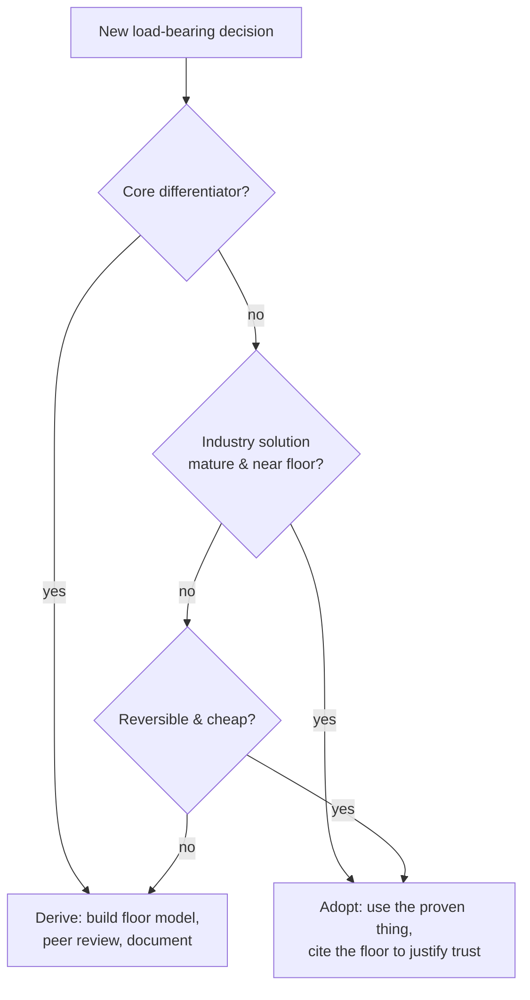
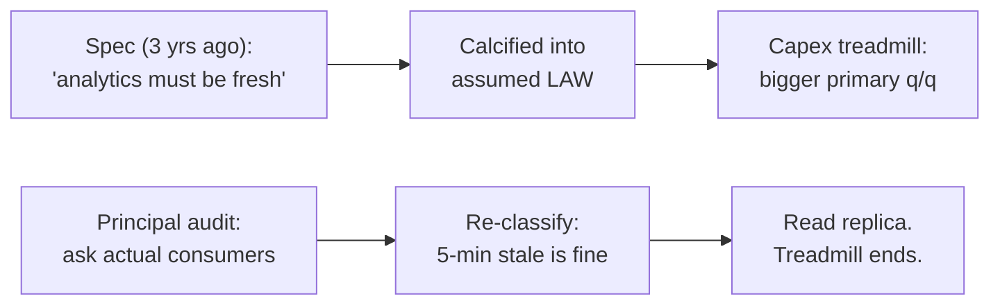

# Reasoning from Fundamentals — Professional

> **What?** At staff/principal scale, first-principles reasoning is an organizational instrument: you install *floor models* as shared artifacts so that hundreds of engineers stop arguing from analogy and start arguing from numbers everyone can check — and you decide, deliberately, where the org should and should not pay the cost of deriving.
> **How?** You build reusable floor models for the company's load-bearing decisions, you teach the four-bin assumption taxonomy until it's reflex, and you defend the line between "re-derive this" and "trust the industry" against both cargo-culting and not-invented-here.

---

## Quick use
1. Make floor models durable, reviewed artifacts for load-bearing systems.
2. Teach the law/requirement/convention taxonomy.
3. Set an explicit boundary between derivation and proven industry practice.

**Decision rule:** derive differentiating, irreversible bets; adopt mature undifferentiated solutions.

## 1. The principal's actual problem

A staff or principal engineer rarely has time to do first-principles analysis on every decision personally — the leverage is in making *the organization* reason this way without you in the room. That means three deliverables:

1. **Floor models as durable artifacts** — checked-in calculations, attached to SLOs and design docs, that anyone can audit and update.
2. **A shared vocabulary** — the law / hard-req / soft-req / convention taxonomy, used consistently in design reviews so disagreements resolve into "which bin is this?" rather than seniority contests.
3. **A governance line** — explicit guidance on what the company derives from scratch versus what it adopts, so neither cargo-culting nor not-invented-here syndrome wins by default.

Everything below serves those three.

---

## 2. Floor models as institutional memory

A floor model that lives in one engineer's head dies when they leave. As a principal you turn it into an artifact with a standard shape:

```text
FLOOR MODEL — Global write path (ledger)
Requirement (hard): writes are exactly-once, globally linearizable.
Law invoked:        consensus across regions ≥ 1 cross-region RTT/decision.
Constants:          inter-region RTT ~140 ms (us-east ↔ eu-west, measured 2026-Q2).
Floor:              max ~7 globally-linearizable writes/sec PER KEY (1/0.140).
Current:            4 writes/sec/key — within 2× of floor. Not an impl problem.
Implication:        scaling needs PARTITIONING the key space, not faster code.
Review cadence:     re-measure RTT yearly; revisit if regions change.
```

The power of this format: it ends an entire *class* of recurring debate. When a team next proposes "let's just optimize the write path," the floor model answers before the meeting: the floor is 7/sec/key, you're at 4, the only lever is partitioning. The org stops re-litigating physics. This is the same reasoning made famous by Hennessy & Patterson — *Amdahl's Law as a planning tool*: the floor tells you the maximum payoff of any optimization before you fund it.

---

## 3. Driving the cost decomposition through the business

The Musk battery decomposition becomes, at principal scale, a tool for *capital allocation* and *vendor strategy*. The recurring question to put in front of leadership: **"What is the commodity floor of this cost line, and what multiple of it are we paying?"**

Worked at org scale — a $4M/year observability bill:

| Layer | Fundamental cost | What we pay | Gap | Verdict |
| --- | --- | --- | --- | --- |
| Raw log bytes stored | entropy of logs after compression: ~10× reducible | full-fidelity retained 90d | ~8× | **Fixable: sample + tier** |
| Metric time series | cardinality × points; mostly fixed | high-cardinality labels exploded series 50× | huge | **Fixable: cardinality budget** |
| Vendor query engine | genuine R&D value | priced into per-GB | ~1× | **Buy: irreducible value** |
| Trace storage | tail-sampleable to ~1% | 100% retained | ~100× | **Fixable: tail sampling** |

The decomposition reframes a budget fight ("cut observability 20%") into an engineering program ("the floor is ~$700k; we are at $4M; here are four named gaps and their owners"). Crucially, it also *defends* the irreducible line — the vendor's query engine is real value, not waste — so the org doesn't cut the wrong thing to hit a number. **First-principles cost analysis is as much about protecting genuine value as cutting fat.**

---

## 4. Where to derive and where to trust — the governance line

The single most damaging principal-level error is getting this line wrong in either direction.

**Not-invented-here** (deriving too much): a team re-implements consensus, a job scheduler, or a congestion-control algorithm because "we understand our needs best." They burn two years rediscovering edge cases Raft and BBR solved a decade ago. First-principles reasoning here is *misapplied* — the floor model should have told them the existing solution is already near-optimal and the work is undifferentiated.

**Cargo-culting** (deriving too little): a team adopts a 200-microservice architecture because a FAANG talk recommended it, for a product with 40 internal users. Pure analogy, zero derivation, and the floor model would have screamed that the coordination cost dwarfs the actual workload.

The governance heuristic to publish:

| Derive from fundamentals when… | Adopt by analogy when… |
| --- | --- |
| It's your **differentiator** (your core product math) | It's **undifferentiated heavy lifting** (auth, queues, consensus) |
| The inherited pattern was built for a **different scale/constraint** | The industry solution is **mature and near its own floor** |
| The decision is **expensive and slow to reverse** | The decision is **cheap and reversible** |
| You can **afford the analysis and the risk of being wrong** | You **lack data** to compute a real floor |



---

## 5. Renegotiating requirements with the floor

The highest-leverage move a principal makes is using a floor model to *change a requirement* the business assumed was fixed. This is where "soft requirement disguised as a law" gets corrected at the level that matters.

Pattern: product asserts "every user's global feed must be strongly consistent." The floor model shows what that *costs*: cross-region consensus on every write, capping throughput at ~7/sec/key and adding ~140 ms tail latency to writes. You take this to product not as "no" but as a **priced menu**:

- Strong global consistency: feasible, caps throughput at X, adds Y latency, costs $Z. (Here's the physics.)
- Causal consistency per region: 100× throughput, 10× lower latency, users may see a 200 ms-stale feed across regions.
- Eventual consistency: cheapest, feed converges within seconds.

Now the business makes an *informed* trade instead of demanding something physics forbids and blaming engineering when it's slow. The floor model has turned a technical constraint into a product decision — which is exactly where it belongs. This is first-principles reasoning operating at the **requirements layer**, which is where the biggest wins live.

---

## 6. Scaling the discipline across the org

Three mechanisms to make hundreds of engineers reason from fundamentals without you:

1. **Design-review ritual.** Every design doc for a load-bearing system must include a one-paragraph floor model: the binding resource, its floor, the current/target, and the gap's explanation. Reviewers are trained to reject "we'll add a cache" that isn't tied to a measured gap.
2. **The "says who?" norm.** Make it culturally safe — expected, even — to ask "what's the floor?" and "which bin is that assumption?" of *anyone*, regardless of level. The taxonomy depersonalizes the challenge: you're questioning the bin, not the person.
3. **Postmortem hook.** When an outage or a 10× cost overrun traces to a never-questioned inherited assumption, name it as such. "We treated a soft requirement as a law for three years" is a more useful learning than "we should have caching."

The risk to manage: **first-principles theater** — teams that produce impressive-looking floor models with fabricated constants to justify a decision they'd already made. Guard against it the way you guard any analysis: demand measured constants, peer review, and the prediction-then-observation loop. A floor model that was never compared against a real measurement is rhetoric, not engineering.

---

## 7. A case study in misclassification at org scale

A useful artifact to circulate internally is a real (anonymized) story of a soft-requirement-as-law error, because it teaches the taxonomy better than any framework.

A company ran every analytics query through a strongly-consistent primary because, three years earlier, someone wrote "analytics must reflect the latest data" in a spec. By the time the data warehouse reached scale, this "requirement" was throttling the OLTP primary, forcing a six-figure vertical-scale-up every two quarters. Treated as a law, it was unfixable; the org kept buying bigger machines.

The principal-level intervention was not technical — it was a **re-classification**. The team interviewed the actual consumers of those analytics: every one of them was fine with data that was up to five minutes stale. "Must reflect the latest data" was never a hard requirement; it was a *convention* that calcified into an assumed law. Moving analytics to a read replica with five-minute lag removed the primary's load entirely and ended the scale-up treadmill. The fix cost a week; the misclassification had cost years of capex.

The lesson to institutionalize: **the most expensive assumptions are the ones nobody remembers choosing.** Periodically audit your load-bearing "requirements" by asking the people who supposedly need them. Half the time, the requirement evaporates on contact with its owner.



---

## 8. Knowing the limits of the instrument

Even at principal level, first-principles reasoning has hard boundaries you must respect:

- **It can't price taste.** Whether an API is *pleasant* to use, whether a codebase is *maintainable* — these resist floor models. Don't pretend a number exists where it doesn't.
- **Organizational constraints are real floors too.** Conway's law, team topology, and on-call capacity bound designs as firmly as bandwidth. A design that beats every physical floor but requires a team you don't have has hit a real wall.
- **The constants drift.** Hardware improves, prices fall, regions move. A floor model is a living document; a stale one is a confident lie. Date your constants and review them.
- **Analogy is still the right default for most decisions.** The org cannot afford to derive everything, and shouldn't. The principal's job is precisely to point the expensive instrument at the few decisions that deserve it.

The companion disciplines — choosing *which* assumptions warrant the spotlight in [questioning assumptions](../02-questioning-assumptions/), the rebuild path in [rebuilding from scratch](../03-rebuilding-solutions-from-scratch/), the whole-system framing of [systems thinking](../../03-systems-thinking/), and the bias-audit of [critical thinking](../../04-critical-thinking/) — are what keep a floor model honest at scale.

---
## Recall and apply

Try to answer these questions from memory:

1. What's "first-principles theater" and how do you catch it?
2. The floor model says 8 ms; production shows 400 ms. Is the model wrong?
3. Give an example where treating a soft requirement as a law cost real money.
4. Can you ever reason from fundamentals about something with no clean numbers, like developer experience?
