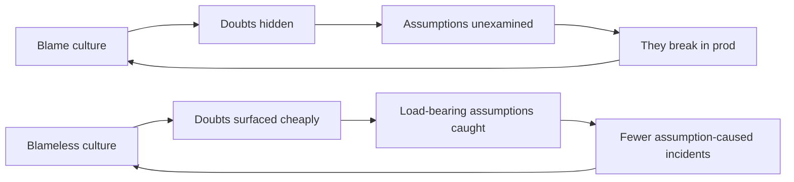

# Questioning Assumptions — Professional

> **What?** At staff/principal scale, questioning assumptions is the practice of making an *organization's* load-bearing beliefs explicit, contestable, and monitored — so the company's largest bets are not resting on unexamined premises, and so the culture rewards surfacing a dangerous assumption rather than punishing the person who voiced it.
> **How?** You install assumption-surfacing into how the org designs (design docs with an "Assumptions" section), how it decides (pre-mortems, one-way/two-way door framing), how it operates (assumption-as-alert, invariant monitors), and how it learns (blameless postmortems that name the buried belief, not the human). You change incentives so doubt is cheap to express.

---

## Quick use
1. Require an assumptions table with owner, confidence, and monitor.
2. Use pre-mortems for large bets and slow down one-way doors.
3. Turn time- and scale-sensitive assumptions into alerts or contracts.

**Decision rule:** make doubt safe to raise and visible in the decision artifact.

## 1. The unit of failure at scale is a shared, unexamined assumption

Individual engineers make small assumptions. Organizations make *enormous* ones, held collectively, written nowhere, and therefore never challenged. These are the assumptions behind the headline outages and the strategic dead-ends:

- "Our growth is linear" — capacity planning built on it; then a viral moment makes it exponential and everything tips over at once.
- "This dependency is always available" — until the region/provider/vendor it lives in goes down and takes you with it.
- "IDs will never collide" / "this counter won't overflow" — until the day a 32-bit sequence wraps in production. (The 2038 problem is this assumption with a known expiry date; most don't come with a date.)
- "Users are in our timezone / speak our language / have an address shaped like ours."
- "The team that owns this will always understand it" — until they reorg and the tribal knowledge evaporates.

A staff engineer's leverage is not in checking more assumptions personally — it doesn't scale. It's in **building mechanisms that make the org surface and monitor its own assumptions automatically.**

---

## 2. Make assumptions a required artifact

Mandate an **Assumptions** section in every design doc and RFC, with a specific shape:

```
## Assumptions
| # | Assumption | Load-bearing? | Confidence | Validation / monitor | Owner |
|---|------------|---------------|------------|----------------------|-------|
| 1 | Peak write rate < 5k/s for 2 yrs | Yes | Medium | Spike done; alert at 4k/s | @ana |
| 2 | Vendor X SLA ≥ 99.9% | Yes | Low | Contract + circuit breaker | @lee |
| 3 | User locale defaults acceptable | No | — | Defer | — |
```

Why this works at org scale:

- It converts private hunches into **reviewable, attributable claims**. A reviewer can challenge row 2's "Low confidence" without challenging the author personally.
- It forces the **load-bearing** judgment to be made on the record, so nobody later says "we never thought about that."
- The **monitor** column is the key innovation: it acknowledges you can't validate everything up front, so you commit to being *alerted* when an assumption flips. This is how you survive assumptions whose validity is a function of time.

The artifact also becomes the postmortem's best friend: when something breaks, you check whether the broken assumption was even *listed*. If it wasn't, your assumption-surfacing process has a gap to fix.

---

## 3. Institutionalize the pre-mortem and door-framing

Two decision rituals move the needle org-wide:

**Pre-mortem as a gate (Gary Klein).** For any project above a cost threshold, run a pre-mortem before kickoff: *"It's a year from now, this failed badly — why?"* Collect, cluster, and feed the top failure causes back as assumptions to validate. Klein's insight — prospective hindsight — measurably increases the number of identified risks because it gives people *permission* to voice doubt by framing it as a post-hoc explanation rather than a present-tense criticism.

**One-way vs. two-way doors (Bezos).** Train the org to classify decisions:

- **Two-way door** (reversible): bias to speed. Don't over-validate assumptions; if wrong, walk back through the door. Over-deliberating here is a tax.
- **One-way door** (irreversible — a public API contract, a data model you can't migrate, a vendor lock-in, a privacy commitment): slow down, validate load-bearing assumptions hard, get more eyes.

The failure mode of immature orgs is treating two-way doors like one-way (analysis paralysis) and one-way doors like two-way (shipping an irreversible bet on an unexamined assumption). A staff engineer's job is to call which door the team is standing in.

---

## 4. Assumptions-as-alerts: monitoring the invariants

The most durable mechanism: turn each load-bearing assumption into a **runtime invariant with an alert.** You cannot predict *when* a stationarity assumption flips, but you can detect it the moment it does.

| Assumption | Invariant monitor |
|---|---|
| "User event count fits in a page" | Alert when `max(event_count) > threshold` |
| "Queue drains within SLA" | Alert on queue depth / oldest-message age |
| "IDs fit in int32" | Alert when `max(id) > 0.7 × INT32_MAX` |
| "Clock is monotonic for durations" | Assert `elapsed >= 0`; log + alert on violation |
| "p99 latency < 200ms" | SLO burn-rate alert |
| "Dependency availability ≥ 99.9%" | Circuit-breaker trip rate as a leading signal |

This reframes capacity and reliability work: an SLO *is* an explicit assumption with an error budget, and an SLO alert *is* an assumption-violation alert. You're not adding new machinery — you're recognizing that good observability is largely "monitoring the things we assumed."

The principle: **for any assumption you can't validate once-and-for-all because it's a function of time or scale, the deliverable is an alert, not a check.**

---

## 4b. The taxonomy of organization-killing assumptions

Individual designs fail on local assumptions. Organizations fail on a handful of *systemic* ones that no single team owns — which is exactly why they go unchallenged. A principal engineer keeps this list in their head and audits the company against it:

**The "linear growth" assumption.** Capacity, cost, and staffing plans built on a trend line that a viral moment, a big customer, or a market shift bends into an exponential. The failure isn't gradual — many resources (connection pools, ID spaces, partition counts, on-call load) have a *cliff*, and they all approach it together.

**The "always available" dependency.** A vendor, a region, a single database, an internal platform team treated as infrastructure that "just works." Its availability is an assumption with no contract, no circuit breaker, and no fallback — until the day it's down and the blast radius is the whole company.

**The "it fits in the representation" assumption.** A counter, an ID, a timestamp, an enum that "will never" exceed its width. The 2038 problem is this assumption with a *known* expiry date; the dangerous ones have unknown ones. At org scale these are pernicious because the representation is baked into stored data, wire formats, and partner integrations — unwinding it is a multi-quarter migration.

**The "our users are like us" assumption.** Same timezone, language, alphabet, address shape, network quality, device. Encoded silently into schemas, validators, and UIs, it caps the addressable market and surfaces as a flood of "edge case" bugs that are actually a wrong model of the user base.

**The "the owner will always understand it" assumption.** Tribal knowledge as load-bearing infrastructure. A reorg, a departure, or two years of drift, and the system that "everyone knew how to operate" becomes a black box nobody dares touch.

The leverage move is the same for all five: **none can be validated once.** They are functions of time, scale, and people. So the deliverable is never a check — it's a *standing mechanism* (an alert, a contract, a runbook, an audit cadence) that surfaces the assumption the moment it starts to flip.

---

## 5. The cost asymmetry at org scale

The senior-level "cost grows by stage" curve compounds at org scale into something more dangerous: a false load-bearing assumption doesn't just cost a rewrite — it **propagates into adjacent teams' designs.** Team A assumes "the events service guarantees ordering"; Teams B, C, and D build on A's behavior (Hyrum's Law across team boundaries). When A's assumption proves false, the blast radius is four teams, not one.

Mitigations a staff engineer owns:

- **Make cross-team assumptions into explicit contracts.** If Team B depends on A's ordering, that dependency must be a documented, versioned, contract-tested promise — not an observed behavior. Otherwise it's an organization-wide implicit assumption waiting to detonate.
- **Run "assumption audits" on the critical path.** Periodically, for the systems that would hurt most, re-derive the load-bearing assumptions and re-validate the ones that drift with scale.
- **Track assumption-caused incidents as a category.** If your postmortems repeatedly name "unexamined assumption X," that's a *process* signal: your design reviews aren't surfacing the right class of assumption.

A concrete worked case of cross-team propagation: an events platform team changed an internal partition strategy that, as a side effect, stopped guaranteeing per-key ordering. They never *promised* ordering — but three consumer teams had observed it and built on it (Hyrum's Law). The change passed every test the platform team had, because the platform team's tests encoded the platform team's assumptions, not the consumers'. The fix wasn't technical; it was structural: ordering became an explicit, versioned contract with consumer-driven contract tests, so the assumption became a promise that *couldn't* silently break. The lesson a staff engineer carries forward: **an implicit cross-team assumption is an outage with a delay timer.** Find them before the delay expires.

---

## 6. Culture: making doubt cheap to express

All the mechanisms fail if the org *punishes* the person who questions an assumption. The most expensive false assumptions survive because challenging them is socially costly — questioning the architecture means questioning the architect; questioning the launch date means being "not a team player."

A principal engineer's hardest and highest-leverage work is making **doubt cheap and surfacing rewarded:**

- **Blameless postmortems** (Allspaw / Etsy lineage). The postmortem names the *assumption*, never the human. "We assumed the failover was tested" — not "Sam didn't test the failover." This is the single biggest lever on whether people surface assumptions before they bite. Blame teaches people to hide doubts; blamelessness teaches them to voice them.
- **Pre-mortems and "red-team" reviews** give doubt a structured, depersonalized channel.
- **Leaders model it.** When the most senior person in the room says "what is this assuming, and how do we know?" about *their own* proposal, it licenses everyone else to do the same. The fastest way to kill assumption-surfacing is for a leader to react to a surfaced doubt with defensiveness; the fastest way to grow it is for a leader to thank the person and change the plan.
- **Reward the catch.** Publicly credit the engineer who surfaced the load-bearing assumption that would have caused the outage. What gets celebrated gets repeated. Be careful what you actually measure: if you only reward *shipping*, you implicitly punish the person who slows a launch to validate a scary assumption — Goodhart's law turns your metric into the very pressure that hides assumptions.



---

## 6b. Diligence on assumptions you inherit, buy, or copy

Organizations import assumptions wholesale, and the imported ones are the least examined:

**Build-vs-buy and vendor selection.** A vendor's SLA, data-residency, scaling limits, and pricing-at-scale are assumptions you're betting the roadmap on. The diligence is surfacing them explicitly *before* signing: "this assumes their 99.9% holds during our peak, that egress cost stays linear, that they don't deprecate the API we depend on." One-way door — validate hard, and design a fallback for the load-bearing ones (abstraction layer, exit plan).

**Acquired or legacy systems.** When you inherit a codebase, you inherit its undocumented assumptions about scale, data shape, and operating environment — and the people who knew them may be gone. Treat the first quarter of ownership as an *assumption-archaeology* project: derive the load-bearing assumptions from the code and data, because the system is silently betting on all of them.

**Architectures copied from talks and blog posts.** A reference architecture from a hyperscaler encodes *their* scale, *their* read/write ratio, *their* team size and operational maturity. Those context assumptions are load-bearing and rarely yours. Copying the diagram imports the bet without the context — the most expensive form of inherited assumption. The principal's job is to name which contextual assumptions the source relied on and ask which actually hold for your org.

---

## 7. Inverting "we can't" at the strategy level

At principal level, "we can't do that" appears as strategy, not just code: "we can't support that market," "we can't offer that SLA," "we can't migrate off the monolith." Each is a stack of organizational assumptions. The technique scales: **inversion plus first-principles decomposition.** Suppose it *were* required — what would have to be true? Which of the blocking "musts" are real constraints (physics, law, money) and which are inherited assumptions ("we've always done it this way," "the old system can't")?

Half of strategic "impossibles" dissolve when you separate the load-bearing constraint from the incidental assumption. The other half are genuinely constrained — and naming *which* assumptions are truly load-bearing is itself the deliverable, because it tells leadership exactly what would have to change for the "impossible" to become possible. This is the organizational form of [rebuilding solutions from scratch](../03-rebuilding-solutions-from-scratch/).

---

## 8. What "good" looks like at this level

- Every significant design doc has an **Assumptions** table with load-bearing/confidence/monitor columns, and reviewers actively challenge it.
- Load-bearing assumptions that drift with time or scale have **alerts**, not one-time checks.
- Cross-team dependencies on behavior are **explicit contracts**, not Hyrum's-Law accidents.
- Pre-mortems gate large projects; one-way doors are recognized and slowed.
- Postmortems name **assumptions, not people**, and the org tracks assumption-caused incidents as a category to drive process improvement.
- Engineers compete to *find* the dangerous assumption, because finding it is rewarded — not hidden, because voicing it is safe.

---

## Where to go next

- The reasoning foundation underneath all of this: [reasoning from fundamentals](../01-reasoning-from-fundamentals/).
- Rebuilding once the false constraints are stripped away: [rebuilding solutions from scratch](../03-rebuilding-solutions-from-scratch/).
- The evidence-evaluation sibling discipline: [critical thinking](../../04-critical-thinking/).
- How this plugs into structured problem-solving: [problem-solving](../../02-problem-solving/).
- Back to the [first-principles-thinking section](../) or the [roadmap root](../../README.md).

---
## Recall and apply

Try to answer these questions from memory:

1. (Curveball) What assumptions does `for (int i = 0; i < list.size(); i++)` make?
2. The 2038 problem — what assumption is it, and why does it matter for code written today?
3. How do you allocate a *finite* validation budget across many assumptions?
4. When is questioning assumptions *not* worth it — can you over-do it?
