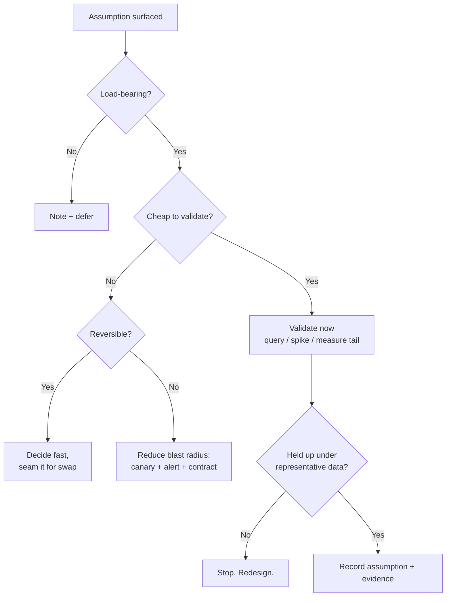
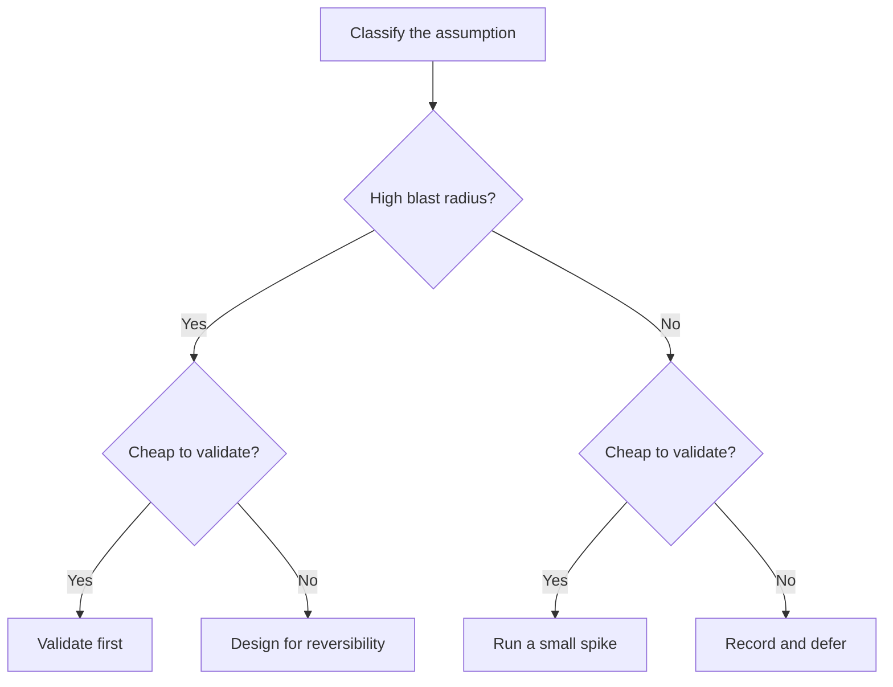

# Questioning Assumptions — Senior

> **What?** The disciplined management of *epistemic risk* in a design: knowing which beliefs your architecture is betting on, quantifying what it costs if each bet is wrong, and deliberately spending validation effort where the product of *probability-wrong × cost-if-wrong* is highest — before the design is hard to change.
> **How?** You run assumption analysis as a first-class design activity, not a vibe. You write down load-bearing assumptions in the design doc, attach a cheap validation to each, design for reversibility where validation is too expensive, and treat "we can't do that" as a claim to be decomposed rather than accepted.

---

## Quick use
1. Rank assumptions by probability of failure times cost of failure.
2. Validate cheap high-risk bets first.
3. For costly tests, reduce blast radius, add monitors, or create reversibility.

**Decision rule:** validate against the tail and representative dirtiness, not the mean.

## 0. The senior shift: from "spotting" to "ranking"

Middle engineers can list assumptions. The senior shift is *triage under finite budget*. You will never validate everything — there isn't time, and most assumptions are harmless. The skill is allocating scarce validation effort by expected damage, and then choosing the *right response* per assumption: validate it, design around it, monitor it, or knowingly accept it. The rest of this page is that allocation discipline.



---

## 1. Assumptions as the real architecture

A senior engineer reviewing a design doesn't first ask "is this code good?" They ask **"what is this design assuming, and what happens to those assumptions over the next three years?"**

Every architecture is a set of bets on reality:

- A monolith bets the team stays small enough to coordinate in one codebase.
- A microservice bets the domain boundaries you drew are the real ones.
- A read-replica bets your read/write ratio stays read-heavy.
- A cache bets the data is stale-tolerant and the working set fits.

The code is the *consequence* of these bets. When a system "rots," it's usually not the code that decayed — it's that a **load-bearing assumption silently became false**: the team grew, the ratio inverted, the working set blew past the cache. Senior work is keeping the bets visible and watching for the day they flip.

---

## 2. The cost asymmetry, quantified

The reason to invest in questioning assumptions is a brutal asymmetry. Let:

- **C_check** = cost to validate the assumption now
- **C_fail** = cost if it's false and you discover it in production
- **p** = probability the assumption is actually false

The expected value of checking is `p × C_fail − C_check`. The numbers in real systems are lopsided:

| Stage assumption is caught | Relative cost to fix |
|---|---|
| Design review | 1× |
| During implementation | ~5× |
| In QA / staging | ~10× |
| In production incident | ~100× |
| In a data-corruption / silent-loss class | effectively unbounded |

This is the classic "cost of a defect grows by stage" curve (Boehm), and it's *sharper* for assumptions than for ordinary bugs — because a false load-bearing assumption isn't a localized defect, it's a wrong premise propagated through everything built on top of it. You don't fix it, you *unwind* it.

So even a 10-minute check is worth it for a load-bearing assumption with a non-trivial `p`. The discipline is identifying *which* assumptions have high `p × C_fail` and refusing to start the expensive work until those are resolved.

---

## 3. A worked risk-ranking

Design: a new "activity feed" that aggregates events per user. Surface the assumptions and rank them:

| # | Assumption | p (wrong) | C_fail | Validation | Decision |
|---|---|---|---|---|---|
| 1 | A user's event count fits in one query/page | High | High (timeouts, OOM) | `SELECT user_id, COUNT(*) ... GROUP BY ... ORDER BY 2 DESC LIMIT 10` | **Check now** |
| 2 | Event IDs fit in int64 | Very low | Catastrophic | Trivial: max id + growth | Quick check, move on |
| 3 | Fan-out-on-write is cheaper than fan-out-on-read | Medium | High (rewrite) | Spike both on prod-shaped data | **Spike now** |
| 4 | Events arrive roughly in order | Medium | Medium | Sample the ingest stream | Check, design for out-of-order anyway |
| 5 | Feed text is English | High | Low | — | Defer (incidental) |

Item 1 is the textbook trap: power-law distributions. The *average* user has 200 events; the celebrity user has 12 million. The design works for the average and dies on the tail. The query against prod (a 5-second probe) reveals the tail and saves you from an architecture that assumes uniformity.



---

## 4. When validation is too expensive: design for reversibility

Some load-bearing assumptions can't be cheaply validated — the only real test is running at scale for months. For those, you don't validate; you **reduce the cost of being wrong**:

- **Make it a config, not a constant.** If "fan-out-on-write" might be wrong, hide it behind an interface so swapping to fan-out-on-read is a code change, not a rewrite.
- **One-way vs. two-way doors (Bezos).** If the assumption is wrong and the decision is reversible (a two-way door), decide fast and cheaply. If it's a one-way door (a schema you can't migrate, an external API contract you can't recall), slow down and validate hard.
- **Strangler-fig the bet.** Roll the assumption out to 1% of traffic. Production *is* the validation, with a 99% smaller blast radius.
- **Instrument the assumption.** Add a metric that fires when the assumption is violated: `alert if any user's event_count > 1_000_000`. You can't predict the day it flips, but you can be told *the moment* it does.

The senior move is recognizing which assumptions belong in "validate" and which belong in "make cheap to be wrong about." Trying to validate the unvalidatable wastes weeks; failing to make an irreversible bet reversible is how you get stuck.

---

## 4b. A taxonomy of the assumptions that actually break systems

Over time you learn that production incidents cluster around a small number of *classes* of false assumption. Knowing the taxonomy lets you scan a design fast:

**Uniformity assumptions.** "The typical request / average user." Real distributions are power-law: the median user has 200 events, the celebrity has 12 million. Anything that works on the mean and not the tail is a latent outage. *Scan trigger:* any "average," "typical," or "most users" in a design doc.

**Stationarity assumptions.** "The table is small," "the rate is 100/s." These are *snapshots*, not properties. They were true when measured and decay with growth. *Scan trigger:* any size/rate stated without a date and a trend.

**Independence assumptions.** "These two services won't fail together," "retries are independent." Correlated failure is the norm: shared DB, shared AZ, shared deploy, retry storms that synchronize. *Scan trigger:* any reliability math that multiplies probabilities.

**Ordering / consistency assumptions.** "Events arrive in order," "the read sees the last write." False under replication lag, out-of-order delivery, clock skew. *Scan trigger:* any logic that sorts by wall-clock time or reads-after-writes across replicas.

**Atomicity assumptions.** "These two updates happen together." False across service boundaries without a transaction or saga. *Scan trigger:* two writes to different stores in one logical operation.

**Trust/identity assumptions.** "The caller is who they say," "this input is internal so it's safe." *Scan trigger:* any boundary where validation was skipped because the source was "trusted."

A senior reads a design and pattern-matches against this list in minutes. Each match is a load-bearing assumption to validate or design around.

---

## 5. "We can't do that" is an assumption, not a fact

The most expensive assumptions are the ones that prevent work from happening. "We can't do that" almost always means **"given a chain of unstated assumptions, that's hard."** Decompose the chain:

> *"We can't run that report in real time — it takes 40 minutes."*

Surface the assumptions inside the "can't":

1. The report *must* be computed from scratch each time. (Why? Could it be incrementally maintained?)
2. It *must* scan all rows. (Why? Is there a pre-aggregate?)
3. It *must* be exact. (Does the business need exact, or is a 1% approximation fine in real time?)
4. It *must* run on the primary DB. (Could it run on a column store / read replica / materialized view?)

Each "must" is an assumption masquerading as a constraint. Often two or three of them are false, and the "impossible" becomes a materialized view that refreshes in seconds. **Inverting the claim** — "suppose we *had* to make it real-time, what would have to be true?" — converts a dead end into a design problem. This is the bridge to [rebuilding solutions from scratch](../03-rebuilding-solutions-from-scratch/): once the false constraints fall away, you rebuild from what's actually required.

---

## 6. Assumptions in requirements: the silent specification

Requirements are dense with assumptions because they're written in natural language by people who share context you don't. "Send the user a notification" assumes the user *has* a device, *is* reachable, *wants* it, and that "the user" is one person and not a shared account.

A senior practice: rewrite each requirement as **explicit invariants** and challenge each one.

| Requirement phrase | Hidden assumption | Challenge |
|---|---|---|
| "the user's balance" | Balance is a single, consistent number at read time | Concurrent transactions? Eventual consistency? |
| "recent orders" | "Recent" has an agreed definition | Define it: last 30 days? last 50 rows? |
| "the file" | There is exactly one, and it exists | Zero? Many? Mid-upload? |
| "in real time" | Sub-second, always | What latency is actually acceptable? p99? |
| "all users" | Bounded, iterable, fits one pass | 14M users — paginate, don't `SELECT *` |

The deliverable of requirements analysis isn't "I understood the ticket." It's **a list of the assumptions the ticket silently makes, with the load-bearing ones resolved with a stakeholder** before code exists.

---

## 7. Hyrum's Law and the assumptions *others* make about you

At senior level you own interfaces, and Hyrum's Law becomes operational. Every observable behavior of your service is something a downstream team has (per the law) come to depend on, whether you promised it or not: response field ordering, error message text, the incidental fact that results came back sorted, timing characteristics, even your latency.

Practical consequences:

- **Before any change, ask "who assumes the old behavior?"** Use logs, contract tests, and canary releases to find out empirically rather than guessing.
- **Make the implicit explicit to kill the assumption.** If iteration order isn't guaranteed, *randomize it deliberately* (Go's map iteration does exactly this) so nobody can accidentally depend on it. You destroy the false assumption by making the behavior visibly non-deterministic.
- **Version and contract-test the interface** so the assumptions become explicit promises you can change deliberately.

---

## 7b. Validating against the tail, not the mean

A senior-level validation failure isn't "they didn't test" — it's "they tested the wrong distribution." The probe must hit the data shape that breaks the assumption:

```sql
-- WRONG validation: confirms the happy path, proves nothing about risk
SELECT AVG(event_count) FROM user_stats;   -- "200, looks fine"

-- RIGHT validation: hunts the tail that actually breaks the design
SELECT
  percentile_cont(0.50) WITHIN GROUP (ORDER BY event_count) AS p50,
  percentile_cont(0.99) WITHIN GROUP (ORDER BY event_count) AS p99,
  percentile_cont(0.999) WITHIN GROUP (ORDER BY event_count) AS p999,
  MAX(event_count) AS worst
FROM user_stats;   -- p50=200, p99=40k, p999=2M, worst=12M
```

The average says "fine." The tail says "you will OOM on a thousand users." Validating a load-bearing assumption means designing the probe to *try to falsify* it — measure the p999 and the max, the largest realistic input, the dirtiest sample — not to confirm the comfortable case. A validation that can only return "looks fine" hasn't validated anything.

Pair this with **representative dirtiness**: real data has nulls, duplicates, dangling references, encoding surprises, and out-of-range values your clean fixtures never contain. "Migration tested" on synthetic rows is a different claim from "migration tested on a prod snapshot."

---

## 8. Recording assumptions so the org can challenge them

A senior doesn't just validate assumptions privately; they make the load-bearing ones a visible part of the design so reviewers can attack them and future maintainers inherit the reasoning. The minimal form, in every design doc:

```
## Load-bearing assumptions
1. Peak write rate stays < 5k/s for 2 years.
   Confidence: medium. Validated by spike (link). Monitor: alert at 4k/s.
2. Event IDs fit in int64.
   Confidence: high. Max id 3.1e8, doubling yearly → safe for decades.
3. Fan-out-on-write is cheaper than fan-out-on-read at our ratio.
   Confidence: medium. Spike on prod-shaped data (link). Reversible behind FeedStrategy interface.
```

Three things make this senior-grade rather than box-ticking: each assumption carries a **confidence** (so reviewers know where to push), a **validation or monitor** (so it's not just asserted), and an explicit note when the design is **reversible** (so an expensive-to-validate bet is made survivable instead). This artifact is also what a postmortem checks first: *was the broken assumption even listed?* If not, your review process has a blind spot to fix.

---

## 9. Failure modes a senior should catch in review

- **Uniformity assumption.** "Average user / typical request" thinking on a power-law distribution. The tail is where it breaks.
- **Stationarity assumption.** "The table is small" is a *snapshot*, not a property. Without a growth monitor, it's a time-bomb.
- **Independence assumption.** "These two services won't fail at the same time." Correlated failures (shared DB, shared deploy, shared AZ) break this constantly.
- **Trusting validation that didn't actually test the assumption.** A spike on 1,000 clean rows doesn't validate "works on 14M dirty rows." Validate on *representative* data, including the nasty tail.
- **Inherited assumptions in copied designs.** Lifting an architecture from a blog post imports its context — its scale, its read/write ratio, its team size. Those are the load-bearing assumptions, and they're rarely yours.

---

## Where to go next

- The reasoning substrate: [reasoning from fundamentals](../01-reasoning-from-fundamentals/).
- Turning a demolished "can't" into a new design: [rebuilding solutions from scratch](../03-rebuilding-solutions-from-scratch/).
- Evaluating the *evidence* behind a claim: [critical thinking](../../04-critical-thinking/).
- The org-scale version of this discipline: [professional](./professional.md).

---
## Recall and apply

Try to answer these questions from memory:

1. What's Hyrum's Law and how does it relate to assumptions?
2. Some assumptions can't be cheaply validated up front. What then?
3. Describe a real bug you've seen that came down to an unexamined assumption.
4. How would you build a culture where assumptions get surfaced, not hidden?
