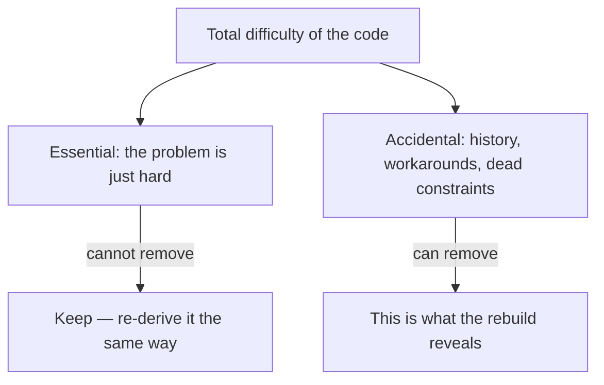
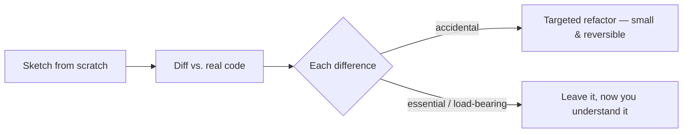

# Rebuilding Solutions from Scratch — Junior

> **What?** *Rebuilding from scratch* is the constructive step of first-principles thinking: after you've broken a problem down to fundamentals and stripped away false assumptions, you re-derive a solution from those fundamentals instead of just copying the one that already exists. Most of the time you do this on paper as a *thought experiment* — you imagine the clean version to see how far the real code has drifted from it.
> **How?** Ask one question of any piece of code you're working in: *"If we built this today, knowing what we now know, would we build it this way?"* Sketch the from-scratch version. Compare it to what's there. The gap between the two is the thing you actually learn.

---

## Quick use
1. Sketch what you would build from current requirements.
2. Diff the sketch against the live code.
3. Make only small, reversible changes after checking why differences exist.

**Decision rule:** redesign freely on paper; do not treat the sketch as permission for a rewrite.

## 1. The three steps, and where this one fits

First-principles thinking has a natural order, and this topic is the third beat:

| Step | Topic | Question it answers |
|------|-------|---------------------|
| 1. Decompose | [Reasoning from fundamentals](../01-reasoning-from-fundamentals/) | What are the irreducible truths of this problem? |
| 2. Strip assumptions | [Questioning assumptions](../02-questioning-assumptions/) | Which "rules" are real, and which did we just inherit? |
| **3. Rebuild** | **this topic** | **Given only the real truths, what would I build?** |

Steps 1 and 2 are *destructive* — they take things apart. Step 3 is *constructive* — it puts a fresh solution together from the parts you trust. Without step 3, the first two are just clever criticism. The rebuild is where the insight turns into a design.

The catch that the whole topic hangs on: **the rebuild as an idea is cheap, but the rebuild as a delivered project is expensive and usually a mistake.** You'll learn to separate those two all the way through. For now, hold this: *you are almost always sketching, not rewriting.*

---

## 2. The "if we built this today" test

Here is a real shape juniors see constantly. A function that reads a config file:

```python
def load_config(path):
    raw = open(path).read()
    lines = raw.split("\n")
    config = {}
    for line in lines:
        if line.startswith("#"):       # comment
            continue
        if "=" not in line:
            continue
        key, val = line.split("=", 1)
        if val == "true":  val = True
        elif val == "false": val = False
        elif val.isdigit(): val = int(val)
        config[key.strip()] = val
    return config
```

It works. It's been in the codebase for three years. Now apply the test: *if we built this today, would we build it this way?*

Re-derive from fundamentals. The fundamental need is: *turn a text file into a typed key/value map.* That is a solved problem. Today you'd write:

```python
import tomllib   # standard library since Python 3.11
def load_config(path):
    with open(path, "rb") as f:
        return tomllib.load(f)
```

The hand-rolled parser exists because in 2019 the team didn't have a built-in format. That's not a *reason it should exist now* — it's a *fossil of when it was written.* The rebuild made the fossil visible. You may or may not replace it (maybe a hundred existing config files use the old `key=value` format), but now you *know* what's essential and what's just history.

---

## 3. Essential vs. accidental complexity

This is the single most important distinction in the topic, and it comes from Fred Brooks's 1986 essay **"No Silver Bullet."** Brooks split the difficulty of any software into two kinds:

- **Essential complexity** — difficulty that is *inherent to the problem itself.* A tax calculator is complicated because tax law is complicated. You cannot wish that away. No tool, no language, no rewrite removes it.
- **Accidental complexity** — difficulty that comes from *how we happened to build it*, not from the problem. Boilerplate, awkward APIs, a workaround for a bug that got fixed years ago, three layers of indirection nobody remembers the reason for.



The whole *point* of the from-scratch rebuild is to **measure the accidental complexity.** When you re-derive the config loader and it shrinks from 14 lines to 3, those 11 lines were accidental. When you re-derive the tax calculator and it's *still* 400 lines of branching, that complexity is essential — the rebuild just confirmed it.

A junior-level reflex worth building: when code feels painful, ask *"is this pain coming from the problem, or from how we built it?"* Only the second kind is worth fighting.

---

## 4. Chesterton's Fence — don't tear it down until you know why it's there

Before you delete that hand-rolled parser, there's a rule older than software. The writer **G.K. Chesterton** gave a parable: you come across a fence across a road with no obvious purpose. The naive reformer says "I see no use for this, let's remove it." The wiser reply: *"If you don't see the use of it, I certainly won't let you clear it away. Go away and think. Then when you can come back and tell me that you do see the use of it, I may allow you to destroy it."*

In code, the fence is the weird line you don't understand:

```python
# strip BOM if present — DO NOT REMOVE
if raw.startswith(""):
    raw = raw[1:]
```

The from-scratch instinct says "I wouldn't write that." Maybe. But that line is almost certainly there because *one specific customer's file broke production at 2am.* The lesson: **a clean rebuild on paper is fine, but every line you'd drop is a question to answer, not a fact to act on.** Re-deriving the solution tells you what *could* go; Chesterton's Fence forces you to find out why each thing is *actually* there before it does.

---

## 5. Rebuild-as-thought vs. rebuild-as-delivery

| | Rebuild as **analysis** (a sketch) | Rebuild as **delivery** (an actual rewrite) |
|---|---|---|
| Cost | An afternoon | Months to years |
| Risk | Zero — it's on paper | High — you can break a working product |
| What it produces | Understanding, a list of targeted fixes | A new system that may be worse |
| How often it's right | Almost always worth doing | Rarely the right call |

You will hear senior engineers warn loudly against rewrites — that's **Joel Spolsky's** famous essay (Section 6 of the senior file goes deep on it). The warning is real and it's about *delivery*. It is **not** an argument against the *thought experiment.* Sketching the clean version costs you an afternoon and teaches you where the bodies are buried. Replacing the working system costs you a year and often produces something worse.

So the junior takeaway is freeing: **you are allowed — encouraged — to redesign anything on paper. You are almost never allowed to rip out the working version because of that sketch.** Fold the insight back in as small, safe changes instead.

---

## 6. Folding the insight back in

The from-scratch sketch isn't the goal; it's a map. Here's how the map turns into safe action:

1. **Sketch the clean version.** "If I built the config loader today, it'd be three lines on `tomllib`."
2. **Diff it against reality.** The custom parser, the BOM-stripping line, the `true`/`false` coercion.
3. **Classify each difference.** Accidental (the manual parsing) vs. essential-or-load-bearing (the BOM fix, the legacy file format).
4. **Make small, reversible changes** for the accidental parts only. Maybe: keep the parser but add tests; maybe: support both formats and migrate files one at a time.



This is the opposite of "throw it all away." You keep the working system running and let the rebuild *guide your edits* rather than *replace your edits*. That technique — improving a live system piece by piece toward the clean design — has a name (the **strangler-fig pattern**) that you'll meet in the middle file.

---

## 7. A worked mini-example

You're handed this method and asked to add a feature:

```javascript
function formatPrice(cents, currency) {
  let s = "" + cents;
  while (s.length < 3) s = "0" + s;
  let whole = s.slice(0, -2);
  let frac = s.slice(-2);
  let sym = currency === "USD" ? "$" : currency === "EUR" ? "€" : "?";
  return sym + whole + "." + frac;
}
```

**Re-derive from fundamentals.** The need: *render an integer amount of money in a locale's format.* That is, again, a solved problem:

```javascript
function formatPrice(cents, currency) {
  return new Intl.NumberFormat(undefined, { style: "currency", currency })
    .format(cents / 100);
}
```

The rebuild reveals: the manual zero-padding, the hand-built currency symbol table (which silently returns `"?"` for any currency not hard-coded), and the assumption that every currency has 2 decimal places (Japanese yen has 0 — the old code is *wrong* for JPY). All of that was **accidental complexity that was also hiding bugs.**

But — Chesterton's Fence — check before swapping: does anything depend on the exact `"?"` fallback string? Are there snapshot tests pinned to the old output? The sketch tells you *where* to look; it doesn't grant you permission to skip looking.

---

## 8. Junior checklist

- [ ] When code feels painful, I ask: *is this essential or accidental complexity?*
- [ ] I can sketch a from-scratch version of a function without permission to rewrite anything.
- [ ] I treat every line I'd "obviously delete" as a Chesterton's Fence — a question to answer first.
- [ ] I know the rebuild-as-sketch is cheap and the rebuild-as-delivery is expensive.
- [ ] I turn my sketch into *small, reversible* changes, not a big-bang rewrite.

---

### Where to go next
- Up a level: [First-Principles Thinking](../)
- Sibling step before this: [Questioning assumptions](../02-questioning-assumptions/)
- When you do change live code, do it the disciplined way: [Refactoring](../../../code-craft/refactoring/)
- Roadmap root: [Engineering Thinking](../../README.md)

---
## Recall and apply

Use these prompts to check your understanding and choose one action to try in your next task.

Try to answer these questions from memory:

1. What does "rebuilding a solution from scratch" mean as a first-principles technique, and how is it different from rewriting?
2. Explain essential vs. accidental complexity. Who coined the terms?
3. What is Chesterton's Fence and how does it apply here?
