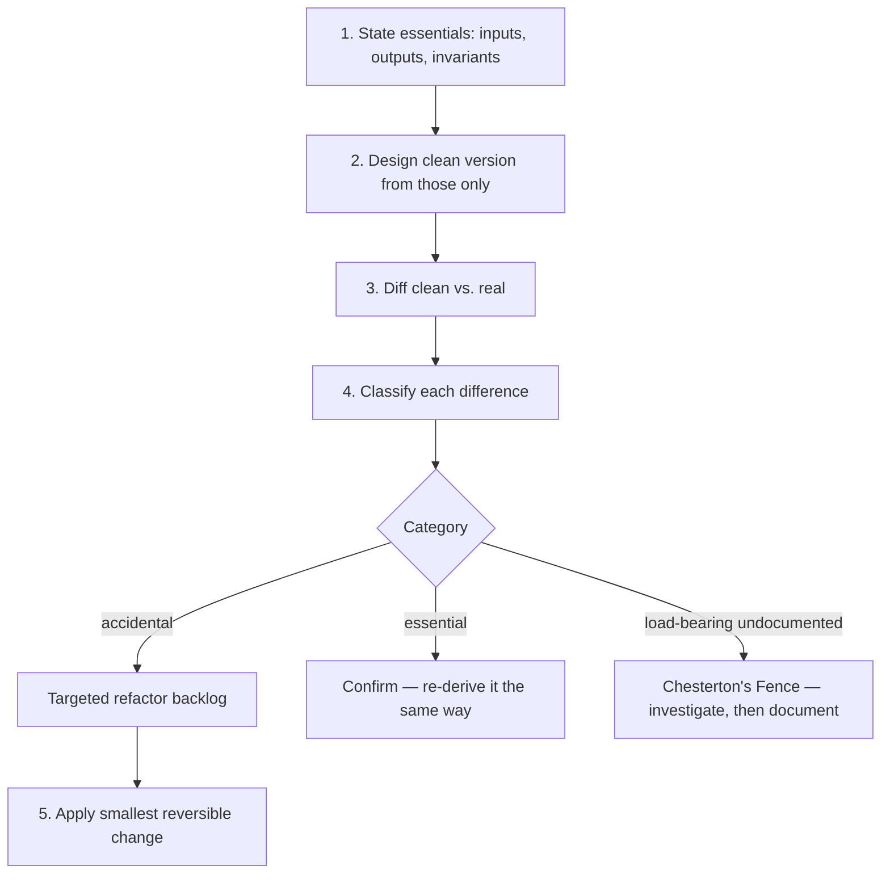
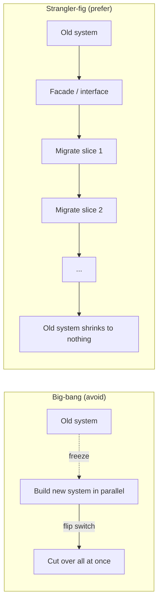

# Rebuilding Solutions from Scratch — Middle

> **What?** Greenfield re-derivation used as an *engineering instrument*: you reconstruct a subsystem from its fundamentals — usually only on paper — to expose the accidental complexity that history has accreted, then fold that insight back into the running system as targeted changes. The rebuild is the analysis; the refactor is the delivery.
> **How?** Pick a subsystem. Write down its essential inputs, outputs, and invariants. Design the clean version that satisfies *only* those. Diff it against the real code. Classify every difference as essential, accidental, or load-bearing-but-undocumented. Then make small, reversible edits toward the clean design — never a big-bang swap.

---

## Quick use
1. State inputs, outputs, invariants, and constraints.
2. Classify every difference: accidental, essential, or undocumented fence.
3. Deliver Bucket-A improvements in reversible slices.

**Decision rule:** the rebuild produces a classified diff; the refactor delivers value.

## 1. From reflex to method

The junior file taught the instinct ("if we built this today…"). At the middle level you make it a repeatable procedure, because doing it by feel produces two failure modes: you either fall in love with your clean sketch and push a reckless rewrite, or you dismiss the whole exercise as daydreaming. The method keeps you between those rails.



The output of the method is **not new code.** It's a *classified diff*: a list that says, for each way the real system differs from the clean ideal, whether that difference is worth keeping, worth removing, or worth understanding first.

---

## 2. State the essentials precisely

The quality of the rebuild is entirely determined by how honestly you state the essentials. Get this wrong and you'll "discover" that everything is accidental — and produce a clean design that quietly drops requirements.

Use a fixed template:

| Field | For a "user session store" subsystem |
|-------|--------------------------------------|
| **Inputs** | login event (user id, device), each subsequent request (session token) |
| **Outputs** | "is this token valid + whose is it"; logout invalidation |
| **Invariants** | a revoked token must be rejected within N seconds; a token must not be forgeable |
| **Hard constraints** | p99 lookup < 5ms; survives a single node loss; GDPR — sessions purgeable by user id |
| **Soft / inherited** | "we store sessions in Postgres" ← is this essential or just how we started? |

The line that does the work is the last one. *Postgres for sessions* is almost always **inherited, not essential** — sessions are ephemeral key/value data with a TTL, which is what Redis is *for*. The from-scratch derivation surfaces that the moment you separate "store sessions" (essential) from "store them in our main relational DB" (accidental, a fossil of "Postgres was the only datastore we had on day one").

---

## 3. Classifying the diff: the three buckets

Every difference between your clean sketch and the real code lands in exactly one bucket. The classification *is* the deliverable.

### Bucket A — Accidental complexity (Brooks)
Difficulty that comes from how it was built, not from the problem. Candidates:
- Boilerplate that a modern library/language feature removes (the hand-rolled config parser from the junior file).
- Workarounds for bugs that have since been fixed upstream.
- Layers of indirection added "for flexibility" that were never used (a `FactoryProviderStrategy` with one implementation).
- Data denormalized to fix a query that no longer runs.

This bucket is your refactoring backlog. **But size it honestly** — Brooks's whole argument in "No Silver Bullet" is that accidental complexity is the *minority* of real difficulty, and that people chronically overestimate how much of their pain it accounts for. If your rebuild claims 90% of the system is accidental, you've mis-stated the essentials.

### Bucket B — Essential complexity
The clean version reproduces it because the problem demands it. Tax brackets, retry-with-idempotency, currency-specific decimal places. **The value here is confirmation**: you now *know* this complexity is load-bearing, so you stop trying to "simplify" it and start trying to *contain* it (isolate it, name it, test it well).

### Bucket C — Load-bearing but undocumented (Chesterton's Fences)
The lines your clean version drops that turn out to matter for reasons not written down anywhere. These are the dangerous ones. Each is a research task, not a delete. Resolve each into either:
- "Confirmed obsolete" → moves to Bucket A.
- "Still needed" → moves to Bucket B **and you add the missing comment/test** so the next person's rebuild doesn't re-litigate it.

---

## 4. A concrete re-derivation

Subsystem: a "retry failed webhook deliveries" worker. Current code is ~600 lines across three files with a cron job that `SELECT`s pending rows every minute.

**Essentials:** deliver each webhook at-least-once; back off on repeated failure; give up after some bound; don't deliver the same event twice in a way the receiver can't dedupe.

**Clean derivation:** this is a *queue with delayed retry and a dead-letter*. That primitive exists. Sketch:

```
on event:        enqueue(payload, attempt=0)
on dequeue(msg): try deliver
                 success -> ack
                 failure -> if attempt < MAX: requeue(delay = base * 2^attempt + jitter)
                            else:               -> dead_letter
```

**Diff against the real code:**

| Real-code element | Bucket | Action |
|-------------------|--------|--------|
| Cron polling every 60s | A — accidental (polling instead of a queue; adds up to 60s latency) | Refactor target |
| `attempt_count` column + manual backoff math | A — partly; the math is reinventable | Could delegate to queue, but cheap to keep |
| Hand-written exponential backoff with jitter | B — essential | Keep; the jitter prevents thundering-herd, that's real |
| `if customer_id == 4471: skip_ssl_verify` | C — Chesterton's Fence | **Investigate.** (Turns out: one enterprise customer's self-signed cert. Still needed → document + move to B) |
| Three files, two of which are dead code paths | A — accidental | Delete after confirming |

Notice: the rebuild did **not** conclude "replace the worker with a queue tomorrow." It produced a ranked list. The biggest win (latency from polling) is now visible and *isolated* — you can introduce a queue behind the existing interface without touching the backoff logic or the customer-4471 fence.

---

## 5. Folding back in: strangler-fig, not big-bang

You have a classified diff. Now the question is *how* to apply it. Two strategies:



The **strangler-fig pattern** (named by Martin Fowler, after the vine that grows around a tree and gradually replaces it) is how a from-scratch design reaches production *without* a rewrite project. You:

1. Put an interface/facade in front of the subsystem so callers don't see internals.
2. Re-route one slice of traffic/behavior to the clean implementation behind that facade.
3. Verify in production, expand the slice, repeat.
4. The old code shrinks until it's gone — or until you stop, having gotten 80% of the value for 20% of the risk.

Every step is reversible. Compare to big-bang: build the clean version entirely in parallel, then flip a switch. Big-bang is where rewrites go to die (the senior file covers *why*, via Spolsky and Brooks's Second-System Effect). At the middle level, the rule is blunt: **the from-scratch design is your destination; the strangler-fig is the only road you're allowed to take to it.**

---

## 6. Where the method goes wrong (middle-level traps)

| Trap | Smell | Correction |
|------|-------|------------|
| **Falling in love with the sketch** | "We should just rewrite this, it'd be so clean" | The sketch is analysis. Re-derivation grants understanding, not authority to rewrite. |
| **Understating essentials** | Your clean version is suspiciously tiny | You dropped a real requirement. Re-list invariants; ask "what breaks if I remove this?" |
| **Treating Fences as accidental** | You're confident a line is dead with no evidence | git-blame it, ask the author, check incident history. No evidence = not dead. |
| **Rebuilding the wrong layer** | You re-derive a leaf function when the accidental complexity is in the architecture | Apply the method at the level where the pain is. (See [Systems thinking](../../03-systems-thinking/).) |
| **Sketch never folds back** | Clever doc, zero code changes, three months later | The deliverable is a *classified diff with a refactor backlog* — schedule the Bucket A items. |

---

## 7. Middle checklist

- [ ] I state essentials (inputs/outputs/invariants/constraints) *before* sketching the clean version.
- [ ] I separate "do X" (essential) from "do X with our current tech/structure" (often accidental).
- [ ] Every diff lands in Accidental, Essential, or Load-bearing-undocumented — none stays unclassified.
- [ ] I resolve each Chesterton's Fence into a documented keep or a confirmed delete.
- [ ] I deliver the insight via strangler-fig, reversible slices — never a big-bang swap.
- [ ] My refactor backlog is honestly sized; I don't claim most of the system is accidental.

---

### Where to go next
- The rewrite-vs-refactor debate in depth: [Senior](./senior.md)
- The destructive steps that precede this: [Reasoning from fundamentals](../01-reasoning-from-fundamentals/) · [Questioning assumptions](../02-questioning-assumptions/)
- Apply it at the architecture level: [Systems thinking](../../03-systems-thinking/)
- The disciplined edit techniques: [Refactoring](../../../code-craft/refactoring/)

---
## Recall and apply

Try to answer these questions from memory:

1. Walk through the "if we built this today" test on a real example.
2. What is the Second-System Effect and why is it relevant to rebuilding?
3. A teammate says "this module is a mess, we should rewrite it from scratch." How do you respond?
