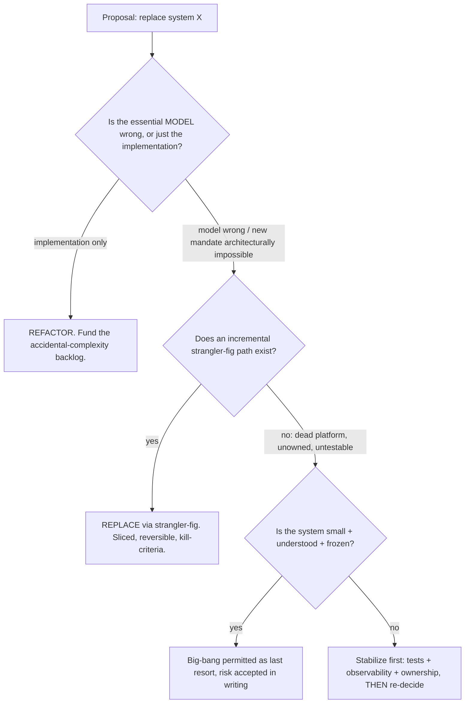
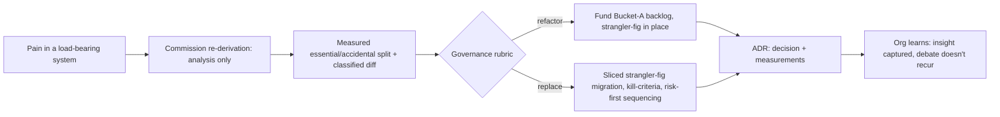

# Rebuilding Solutions from Scratch — Professional

> **What?** At staff/principal scale, re-derivation from first principles is an *organizational decision instrument*: you use it to settle the rewrite-vs-refactor question for systems that many teams depend on, to set policy on when replacement is sanctioned, and to govern multi-quarter migrations so the organization captures the insight without betting the company on a big-bang.
> **How?** You commission and review re-derivations as analysis (never as a license to rewrite), you make the essential/accidental split legible to executives in cost-of-delay and risk terms, you institutionalize Chesterton's Fence and strangler-fig as defaults, and you own the migration risk — sequencing, kill-criteria, and the honest accounting that a "modernization" usually under-delivers.

---

## 1. The decision you actually own

Individual engineers re-derive functions. Staff/principal engineers own the *class of decision*: **"this load-bearing system is painful — do we modernize, replace, or keep refactoring, and on what timeline?"** Getting this wrong is one of the most expensive mistakes an engineering org makes — a sanctioned big-bang rewrite can consume tens of engineer-years and ship a system that is, net, *worse*, while the market and the roadmap move on. The Netscape story (Spolsky) is the canonical example, but every large org has its own.

Your leverage is not in doing the re-derivation yourself; it's in:
- **Setting the default stance**: re-derive freely (analysis is cheap), replace rarely (delivery is expensive), and make engineers prove the replacement case rather than assume it.
- **Translating** essential-vs-accidental complexity into language that survives a budget review.
- **Governing** the migration so it's reversible, sliced, and honestly tracked.

---

## 2. Making the Brooks split legible to the business

Brooks's essential/accidental distinction is the most important idea you have to carry *upward*, because the rewrite pitch always sounds compelling to non-engineers ("the old system is a mess, let's build a clean one"). Your job is to reframe it in terms a CFO recognizes:

| Engineering framing | Business framing |
|---|---|
| Essential complexity = the problem is inherently hard | "This cost is fixed. A rewrite re-pays it from zero and re-introduces its bugs." |
| Accidental complexity = cruft we can remove | "This is the only part a rewrite would actually eliminate — and refactoring eliminates it without the risk." |
| Hard-won bug fixes embedded in old code (Spolsky) | "Years of production incidents are encoded as fixes here. A rewrite discards that test coverage we paid for in outages." |
| Second-System Effect (Brooks) | "The replacement will be padded with features no current customer asked for, which is new risk, not value." |

The number that wins the room: present the re-derivation's measured split. *"This billing engine is 1.8M lines. Our re-derivation shows ~25% is accidental complexity we can refactor away over three quarters at low risk. The other 75% is essential — tax rules, dunning logic, regulatory edge cases — that a rewrite would re-build and re-debug. A from-scratch replacement is a ~four-year, high-risk bet to remove the same 25% a strangler-fig removes incrementally."* That sentence has killed more bad rewrites than any architecture diagram.

---

## 3. A governance rubric for sanctioning replacement

You need a defensible, written bar — otherwise every team with an ugly codebase lobbies for a rewrite, and the loudest voice wins. A rubric that scales:

Two principal-level refinements most orgs miss:

- **"Unmaintainable" is often a people problem, not a code problem.** No tests, no one understands it, every change breaks something — that's a *characterization-tests-and-ownership* gap. The senior response is to *invest in understanding* (characterization tests à la Feathers, observability, a named owning team) *before* deciding, because once the system is understood the rewrite case usually collapses into a refactor case. Many "we must rewrite, it's unmaintainable" claims are really "we never staffed it."
- **The kill-criteria must be written before the migration starts.** Define, up front, the conditions under which you *stop* — divergence rate too high, slice N taking 3× the estimate, the essential complexity turning out larger than modeled. A migration with no kill-criteria is a sunk-cost trap.

---

## 4. Owning the migration risk

When replacement is sanctioned, you own the risk profile of a multi-quarter program. The mechanics from the senior file (strangler-fig, facade, shadow traffic, per-slice rollback) are the *how*; at your level you own the *sequencing, accounting, and stopping*.

**Sequence by risk-adjusted value, not by ease.** The instinct is to migrate the easy slices first to show progress. The principal move is to migrate the slice that *retires the most risk or proves the most uncertainty* early — often the hardest slice — so that if the new model is wrong, you find out in month two, not month twenty. (Spolsky's Netscape failed in part because the value didn't land until the very end.)

**Account honestly.** A migration's true cost includes:

| Cost line | Frequently forgotten |
|---|---|
| Building the new slices | (everyone counts this) |
| Running *two* systems in parallel for the whole migration | operational + cognitive load, often years |
| The facade/anti-corruption layer | itself a real system to build and maintain |
| Re-discovering undocumented fences via divergence | the long tail that blows estimates |
| Opportunity cost: features *not* shipped during the migration | the line that actually decides whether it was worth it |

**Define done — and define stop.** A strangler-fig that's "70% migrated and stalled" is the worst of both worlds: two systems, forever. Either drive it to completion (old system deleted) or make an explicit decision to stop and stabilize the hybrid. "Drifting" is not a state you allow.

---

## 5. The Second-System Effect at org scale

Brooks's Second-System Effect doesn't just bloat a function — at org scale it bloats *programs*. The sanctioned rewrite becomes the place every team parks its wishlist: "while we're rebuilding billing, we should also add the multi-currency thing, the new pricing model, the analytics hooks…" Each is individually reasonable; collectively they convert a focused replacement into an open-ended platform project that never ships.

Principal-level controls:
- **Scope the replacement to functional parity plus the *one* mandate that justified it.** Everything else is a fast-follow on the new system, *after* cutover.
- **Make "parity first" a hard gate.** New capabilities are forbidden until the strangler-fig has fully replaced the old behavior. This is unpopular and correct.
- **Name the bloat when you see it.** "That's a second-system feature; it's not why we sanctioned this. Backlog it for post-migration." Saying this out loud, repeatedly, is a core part of the job.

---

## 6. Institutionalizing the practice

You make re-derivation a capability of the organization, not a heroic act of individuals:

- **Re-derivation as a review ritual.** Before any large investment in an existing system, require a written from-scratch derivation + classified diff. It's cheap (days) and routinely changes the decision. Treat it like a design doc.
- **Chesterton's Fence as policy.** No removal of load-bearing behavior without documented investigation (blame, incidents, owner, watch period). Make undocumented fences a defect to be paid down — every investigated fence ships with the comment/test/ADR that was missing.
- **Strangler-fig as the default migration architecture**, big-bang requiring explicit, written, leadership-level risk acceptance.
- **An ADR trail for "we chose not to rewrite."** This is the artifact that stops the same expensive debate from recurring every reorg. Capture the measured complexity split and the rubric outcome so the decision is inspectable, not folkloric.

---

## 7. Failure modes you are paid to prevent

| Failure | What it looks like | Your countermeasure |
|---|---|---|
| **Sanctioned big-bang** | "Two years to rebuild platform Y, then we cut over" | Force the strangler-fig question; demand the slices; if none exist, it's not a plan |
| **Rewrite as morale project** | Team wants greenfield to escape a painful codebase | Acknowledge the pain; fix it with ownership + refactor backlog, not a rewrite |
| **Modernization theater** | New stack, same essential complexity, net-negative value | Demand the measured complexity split; "new framework" ≠ "less essential complexity" |
| **Stalled strangler-fig** | 60% migrated for 18 months, two systems forever | Kill-criteria + a forcing function to finish-or-stop |
| **Fence demolition outage** | Replacement breaks a case the old system handled silently | Mandatory shadow-compare + fence investigation before cutover |
| **Second-system scope creep** | "While we're at it…" turns parity into a platform | Parity-first gate; backlog new capability to post-cutover |

---

## 8. Professional checklist

- [ ] I treat re-derivation as a cheap, frequently-commissioned analysis — and replacement as a rare, high-bar delivery.
- [ ] I can translate the essential/accidental split into cost-of-delay and risk terms an executive will act on.
- [ ] I enforce a written rubric: model-wrong/architecturally-impossible justifies replace; otherwise refactor.
- [ ] I require kill-criteria *before* any migration starts and sequence slices to retire risk first.
- [ ] I gate replacements on functional parity and block Second-System scope creep.
- [ ] I institutionalize Chesterton's Fence, strangler-fig, and "why-we-didn't-rewrite" ADRs as org defaults.
- [ ] I diagnose "unmaintainable" as a possible ownership/test gap before accepting it as a rewrite mandate.

---

### Where to go next
- The mechanics one level down — [Senior](./senior.md)
- Defend the decisions under pressure — [check your understanding](#check-your-understanding)
- Reason about whole-org systems — [Systems thinking](../../03-systems-thinking/)
- Where modernization lands as code — [Refactoring](../../../code-craft/refactoring/)
- The upstream first-principles steps — [Reasoning from fundamentals](../01-reasoning-from-fundamentals/) · [Questioning assumptions](../02-questioning-assumptions/)

---
## Check your understanding

Try to answer these questions from memory:

1. If you re-derive a system and decide *not* to rewrite it, was the exercise wasted?
2. You're staff/principal. A team proposes a two-year rewrite of a core billing system. What do you ask for?
3. How do you sequence slices in a strangler-fig migration, and why not easiest-first?
4. How do you tell genuine "essential model is wrong" from "we just don't like the code"?
