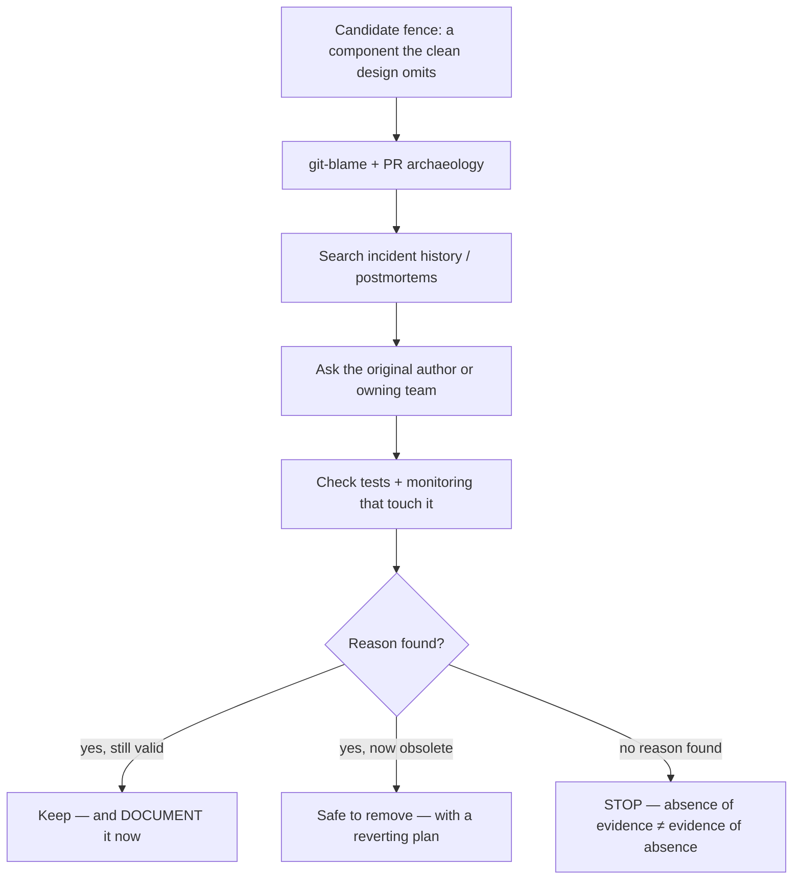
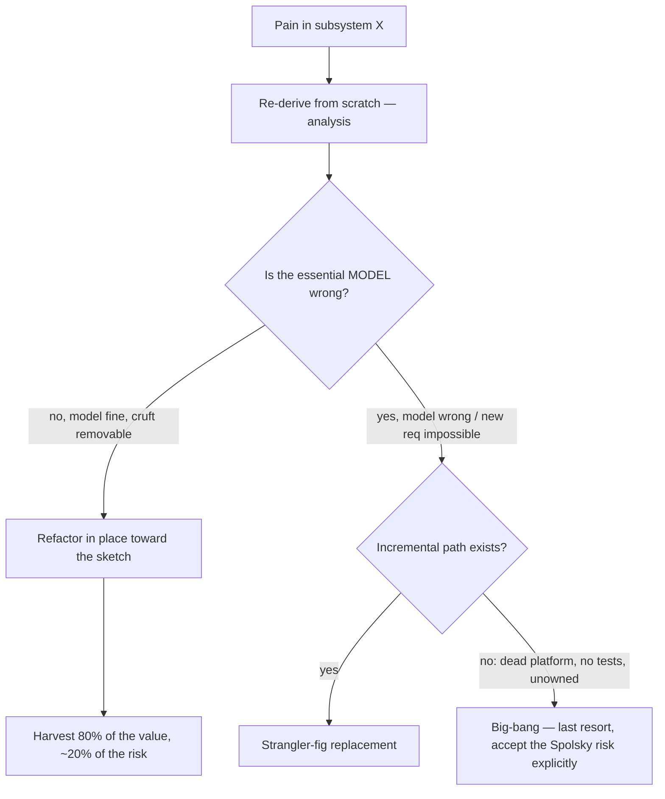

# Rebuilding Solutions from Scratch — Senior

> **What?** The disciplined practice of re-deriving a system from first principles to understand it, then making an evidence-based decision about whether to *refactor in place* or *replace* — knowing that the from-scratch derivation is cheap and almost always worth doing, while the from-scratch *delivery* is expensive and usually wrong.
> **How?** You run the re-derivation as a structured analysis, you quantify essential vs. accidental complexity with real numbers, you stress-test the "let's rewrite" impulse against Spolsky's warning and Brooks's Second-System Effect, and when replacement genuinely wins you reach for it through a strangler-fig migration with explicit reversibility — never a big-bang.

---

## 1. The two rebuilds, kept strictly apart

The single discipline that separates senior judgment from junior enthusiasm is refusing to let these two collapse into one:

| | **Rebuild as analysis** | **Rebuild as delivery** |
|---|---|---|
| Artifact | A design sketch + classified diff | A shipped replacement system |
| Cost | Days | Quarters to years |
| Downside if wrong | You wasted a few days | You bet the roadmap and may lose |
| Reversible? | Trivially | Painfully or not at all |
| Default stance | **Do it often** | **Resist it hard** |

Almost every benefit attributed to "rewriting" — clarity, simplicity, removal of cruft — is actually a benefit of the *analysis*. You can capture nearly all of it without the delivery, by folding the insight back as targeted refactors. The senior move is to **harvest the analysis and reject the delivery** unless replacement clears a high bar (Section 5).

---

## 2. Quantifying essential vs. accidental complexity

Brooks's split in **"No Silver Bullet" (1986)** is qualitative; at senior level you make it quantitative, because "this code is too complex" loses every argument and "this code is 70% accidental complexity, here's the measurement" wins them.

Practical proxies for accidental complexity in a subsystem:

- **Lines that the clean re-derivation removes**, as a fraction of total. (Config loader: 11/14 = 79% accidental.)
- **Cyclomatic complexity that survives re-derivation** vs. total. The branches your clean version *also* needs are essential; the rest are accidental.
- **Coupling the rebuild eliminates** — count the modules that currently reach into this one's internals and wouldn't need to in the clean design.
- **Workaround age** — git-blame each workaround; cross-reference against the bug/incident that caused it. Workarounds whose root cause is fixed = pure accidental.

Worked example — an order-pricing module, 2,100 lines:

| Measure | Total | Survives re-derivation (essential) | Accidental |
|---|---|---|---|
| Lines | 2,100 | 1,400 | 700 (33%) |
| Branches (cyclomatic) | 180 | 150 (tax/discount/currency rules — irreducible) | 30 |
| External modules reaching in | 9 | 3 | 6 |

The number that matters: **33% accidental, and the *essential* core is genuinely 1,400 lines** because pricing rules are inherently complex. This is the Brooks insight made concrete — most of the difficulty is essential. A rewrite would re-pay the cost of those 1,400 essential lines (and re-introduce their subtle bugs) to delete 700 accidental ones. **A targeted refactor pays only for the 700.** The arithmetic kills the rewrite argument on its own.

---

## 3. Chesterton's Fence at system scale

At the senior level, fences aren't single lines — they're whole components, columns, services, and "weird" architectural choices. Tearing one down without understanding it is how rewrites cause outages that the original system never had.

A structured fence-clearing protocol before any removal:

The fence that bites hardest is the one with no remaining institutional memory. Chesterton's rule is exactly calibrated for it: *if no one can tell you why it's there, you are the least qualified person to remove it.* In practice the senior behavior is to wrap the fence in a feature flag, ship the change behind it, and watch production for a full business cycle (including month-end, the holiday peak, the batch job that runs quarterly) before deleting.

---

## 4. The Second-System Effect

Brooks's *other* warning (from *The Mythical Man-Month*, 1975) is aimed precisely at the engineer who just finished a satisfying from-scratch derivation. The **Second-System Effect**: the second system a designer builds is the most dangerous, because they finally get to add all the elegant features they had to leave out of the first — and they over-engineer it into bloat.

The from-scratch rebuild *is* a second system. Watch for the tells:

- The clean design grows a plugin architecture, a generic rule engine, a config DSL — none of which the *current* requirements need.
- "While we're rewriting, we should also support…" appears in the proposal.
- The new design solves problems the old one never had, at the cost of problems the old one had solved.

The corrective: constrain the rebuild to satisfy *exactly the current requirements and invariants* — the essentials list, nothing more. The second-system bloat is itself a new form of accidental complexity, born in the rebuild. A senior reviewer's sharpest question on any "let's rebuild" proposal is: *"which of these new capabilities does a current requirement demand?"* The honest answer is usually "none."

---

## 5. The rewrite-vs-refactor decision

This is the senior judgment call, and **Joel Spolsky's "Things You Should Never Do, Part I" (2000)** is the canonical warning. His case study: Netscape rewrote their browser from scratch for version 6, threw away the working (if ugly) Navigator 4 codebase, and shipped *nothing* for nearly three years while Internet Explorer took the market. His core claim:

> *Old code has been used. It has been tested. Lots of bugs have been found, and they've been fixed. […] Each of these bugs took weeks to find. […] When you throw away code and start from scratch, you are throwing away all that knowledge.*

That's the Brooks point restated: the ugly old code is *mostly essential complexity plus hard-won bug fixes*, and the rewrite throws away the bug fixes and re-derives the essential complexity from scratch — re-introducing the bugs.

So when does replacement actually win? A decision rubric:

| Refactor in place when… | Replace when… |
|---|---|
| The accidental complexity is *removable* without changing the data model | The *essential model itself* is wrong (e.g., built single-tenant, the business is now multi-tenant) |
| The system still meets its core requirements | A hard new requirement is *architecturally impossible* in the current design |
| You can strangler-fig incrementally | The platform is dead/unsupported (EOL runtime, vendor gone) with no incremental path |
| Tests + observability let you change safely | The system is genuinely unmaintainable: no tests, no one understands it, change is reliably destructive |
| Domain knowledge lives in the code | The domain has changed so much the code encodes the *wrong* domain |

Even when the right column wins, the *answer is still rarely a big-bang rewrite* — it's a strangler-fig replacement (next section). The cell where big-bang is justified is vanishingly small: tiny system, fully understood, comprehensive tests, frozen requirements.

---

## 6. Migrating: strangler-fig as the default delivery vehicle

When replacement wins, **Martin Fowler's strangler-fig** keeps you out of the Netscape trap. The essence: never have a moment where the old system is gone and the new one is unproven. Mechanics for a senior leading it:

1. **Erect the facade.** Insert an interface in front of the subsystem so callers are decoupled from the implementation. This is itself a valuable refactor even if you stop here.
2. **Asset capture by slice.** Pick the smallest independently-valuable slice (one endpoint, one entity, one customer segment). Route it to the new implementation behind the facade.
3. **Run both, compare.** Dark-launch / shadow traffic: send production reads to *both* old and new, compare outputs, alert on divergence. Every divergence is either a bug in the new code or an undocumented fence in the old — both are gold.
4. **Cut over the slice, keep the rollback.** Flip the flag for that slice; the old path stays warm and reversible for a full business cycle.
5. **Repeat until the old system is dead code**, then delete it.

The property that makes this safe: **at every step the blast radius is one slice, and every step is reversible.** Contrast the big-bang's blast radius (everything) and reversibility (none). This is why, for a system of any consequence, "we'll rewrite it" should almost always be heard as "we'll strangler-fig it" — and if someone can't describe the slices, they don't yet have a migration plan, they have a hope.

---

## 7. Capturing the insight even when you don't migrate at all

The most common — and most undervalued — outcome of a senior re-derivation is: *we change almost nothing structurally, but we now understand the system, and we ship five small high-leverage fixes.* Make the harvest explicit:

- **Documented fences.** Every Chesterton's Fence you investigated becomes a comment, an ADR, or a test that pins the behavior so the next rebuild doesn't re-litigate it. (See [Refactoring](../../../code-craft/refactoring/) and `documentation` for the mechanics.)
- **A named accidental-complexity backlog.** The Bucket-A items, ranked by leverage (latency, on-call pain, change-cost), scheduled like any other work.
- **An architectural decision record** capturing *why you did not rewrite* — so the impulse doesn't resurface every two quarters.
- **Tests around the essential core**, now that you know which complexity is load-bearing.

The from-scratch derivation paid for itself the moment it told you which 33% was accidental and which fence guarded customer 4471. The clean rewrite was never the point.

---

## 8. Senior checklist

- [ ] I keep rebuild-as-analysis and rebuild-as-delivery strictly separate, and default to *do the first, resist the second.*
- [ ] I quantify accidental vs. essential complexity with real numbers, expecting essential to dominate (Brooks).
- [ ] I clear every architectural Chesterton's Fence with blame + incidents + owner + a watch period before removal.
- [ ] I check my clean design for Second-System bloat: every new capability traces to a current requirement.
- [ ] I apply the rewrite-vs-refactor rubric and can state, citing Spolsky, why a rewrite throws away hard-won bug fixes.
- [ ] When replacement wins, I deliver via strangler-fig with shadow comparison and per-slice reversibility — not big-bang.
- [ ] I harvest the analysis (documented fences, ranked backlog, an ADR) even when no migration happens.

---

### Where to go next
- Org-scale: leading a re-derivation and owning the migration risk — [Professional](./professional.md)
- The full debate as interview material — [check your understanding](#check-your-understanding)
- Upstream steps — [Reasoning from fundamentals](../01-reasoning-from-fundamentals/) · [Questioning assumptions](../02-questioning-assumptions/)
- Where the analysis lands as code — [Refactoring](../../../code-craft/refactoring/)
- Reasoning about the whole — [Systems thinking](../../03-systems-thinking/)

---
## Check your understanding

Try to answer these questions from memory:

1. Summarize Joel Spolsky's "Things You Should Never Do" and say whether you agree.
2. Give a concrete rubric: refactor in place vs. replace.
3. What is the strangler-fig pattern and why is it the default for replacement?
