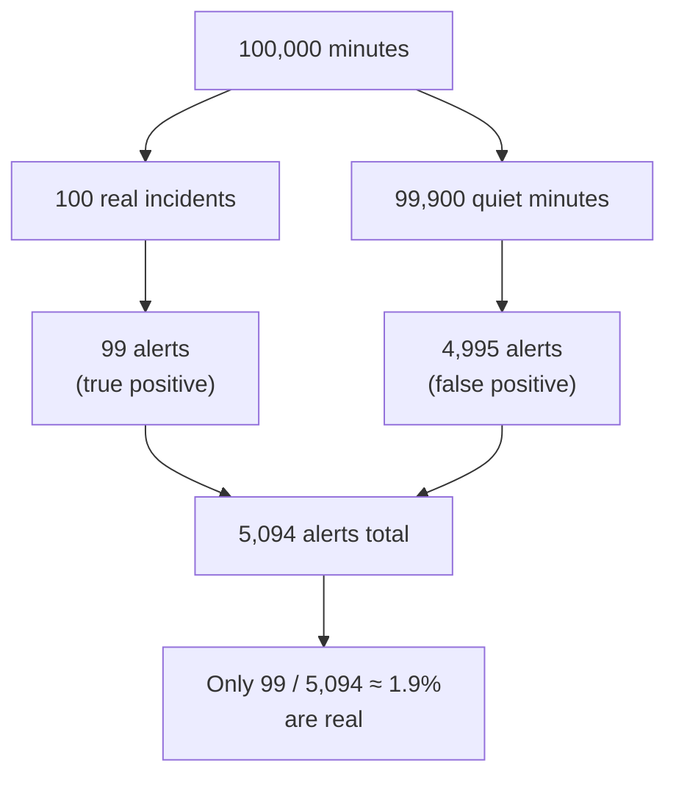

# Reasoning Under Uncertainty — Middle

> **What?** Reasoning under uncertainty is the disciplined practice of holding *quantified* beliefs, setting honest **priors**, and updating them with evidence using **Bayes' theorem** — so that incomplete information leads to good decisions instead of confident guesses.
>
> **How?** You name a prior probability, identify how diagnostic each piece of evidence is, run the Bayesian update (often via the base rate), and act on the resulting posterior — while staying alert to the base-rate-neglect trap that makes alerts, scanners, and detectors look more trustworthy than they are.

---

## Quick use
1. Start with a relevant prior.
2. Update it with evidence that changes likelihoods.
3. Choose an action that matches confidence and reversibility.

**Decision rule:** a precise number without a relevant reference class is false confidence.

## 1. From vibes to numbers

[The junior level](junior.md) established the mindset: hold a probability, not a yes/no. The middle level adds the **mechanics** — specifically, the one tool every engineer should be able to run on a napkin: **Bayes' theorem**.

You need three ingredients to reason quantitatively about an uncertain claim:

| Ingredient | Question it answers | Name |
|------------|--------------------|------|
| **Prior** | Before any evidence, how likely is this? | `P(H)` |
| **Likelihood** | If it's true, how likely is *this evidence*? And if it's false? | `P(E\|H)`, `P(E\|¬H)` |
| **Posterior** | After the evidence, how likely is it now? | `P(H\|E)` |

The arithmetic that connects them is Bayes' theorem.

---

## 2. Bayes' theorem, stated for engineers

The formula:

```text
                P(E | H) · P(H)
P(H | E)  =  ─────────────────────────────────────
             P(E | H)·P(H)  +  P(E | ¬H)·P(¬H)
```

In plain words:

> **Posterior = (how well the hypothesis predicts the evidence) × (prior) ÷ (how likely the evidence was overall, true or not).**

The denominator is just "the total probability of seeing this evidence at all" — summed over the hypothesis being true and being false. It's what *normalizes* the result back into a real 0–1 probability.

You rarely need the formula in its raw form. The **odds form** is far easier to do in your head:

```text
posterior odds  =  prior odds  ×  likelihood ratio

                              P(E | H)
where  likelihood ratio  =  ────────────
                              P(E | ¬H)
```

A likelihood ratio of 10 means "this evidence is 10× more likely when the hypothesis is true than when it's false" — multiply your odds by 10. A ratio of 1 means the evidence is useless. This odds form is the trick that makes Bayesian updating practical at a whiteboard.

---

## 3. The monitoring-alert worked example (do this one by hand)

This is the single most important calculation in this topic. **A monitoring alert fires. What's the probability there's actually an incident?**

Setup — numbers from your own observability data:

- **Base rate:** In any given minute, the chance there's a real incident is small. Say **0.1%** (`P(incident) = 0.001`). Incidents are rare; that's the point of running a healthy service.
- **Detection (true positive rate / recall):** When there *is* a real incident, the alert fires **99%** of the time. `P(alert | incident) = 0.99`.
- **False positive rate:** When there is *no* incident, the alert *still* fires **5%** of the time (noisy threshold, deploy blips, GC pauses). `P(alert | no incident) = 0.05`.

The alert just fired. Engineers' gut answer: *"It's 99% accurate, so ~99% chance it's real."* **That gut answer is wrong**, and the gap between it and the truth is the whole lesson.

Run Bayes with natural frequencies — imagine **100,000 minutes**:

```text
Real incidents:        0.001 × 100,000          =     100 minutes
  → alerts fired:      0.99  × 100              =      99   (true positives)

No incident:           0.999 × 100,000          =  99,900 minutes
  → alerts fired:      0.05  × 99,900           =   4,995   (false positives)

Total alerts:          99 + 4,995               =   5,094
```

So:

```text
P(incident | alert)  =  99 / 5,094  ≈  0.0194  ≈  1.9%
```

**When this "99% accurate" alert fires, there's only a ~1.9% chance a real incident is happening.** Ninety-eight times out of a hundred, it's a false alarm.



This is not a contrived number — it's *why on-call engineers learn to ignore pages*, why alert fatigue is real, and why a high true-positive rate is worthless if the base rate is tiny and the false-positive rate isn't crushed. The fix is almost always **lower the false positive rate** (tighter thresholds, multi-signal alerts, longer evaluation windows) — because at a 0.1% base rate, even a 5% false-positive rate buries the signal.

---

## 4. The base-rate-neglect trap

What just happened has a name: the **base-rate fallacy**, documented by Tversky and Kahneman in their work on judgment under uncertainty. The trap: when given a vivid, specific signal (a 99%-accurate alert), people **anchor on the test's accuracy and ignore how rare the thing being detected actually is.**

It's the famous "rare disease" structure, and it shows up *everywhere* in engineering:

| Domain | "Test" | Rare thing | The trap |
|--------|--------|-----------|----------|
| **Monitoring** | Alert | Real incident | "It fired, must be real" |
| **Fraud detection** | Fraud-score flag | Fraudulent transaction | Flag 1% of legit users → flood of false positives |
| **Security scanner** | Vuln/IDS alert | Actual exploit | Analysts drown in noise, miss the real one |
| **Spam/abuse filter** | "Spam" verdict | Actual spam | Ham misclassified at scale |
| **Flaky-test detector** | "Likely flaky" label | Genuinely broken test | Auto-quarantine hides real regressions |

> **The rule:** A detector's usefulness depends as much on the **base rate** of what it detects as on its own accuracy. When the base rate is low, you need an *extremely* low false-positive rate or the detector is mostly crying wolf.

This connects directly to [base rates and expected value](../02-base-rates-and-expected-value/), which generalizes the idea, and to the [cognitive biases topic](../../04-critical-thinking/03-cognitive-biases-in-code-decisions/), which catalogs why our intuition fails here.

---

## 5. Setting priors: data vs gut

Bayes is only as good as your prior. Where does the prior come from?

| Source | When to use it | Risk |
|--------|---------------|------|
| **Measured frequency** | You have historical data (incidents/month, % of deploys that fail, flaky-test rate) | Stale data; past ≠ future |
| **Reference class** | No data on *this* exact thing, but you have data on similar things ("migrations like this fail ~20% of the time") | Picking the wrong reference class |
| **Expert gut** | No data at all; seasoned judgment | Overconfidence, recency bias |

The professional move is a **hierarchy**: prefer measured base rates → fall back to a reference class → use gut only as a last resort, and *flag it as such*. A prior you pulled from a dashboard is worth more than one you pulled from a feeling, and you should be honest about which one you used.

> **Anti-pattern:** the "uniform prior" reflex — assuming 50/50 because you "don't know." 50/50 is itself a strong claim (maximum uncertainty). If incidents happen 0.1% of the time, your prior is 0.1%, not 50%. Defaulting to 50/50 is how base-rate neglect sneaks in.

---

## 6. Confidence is a spectrum, not a switch

Junior thinking has two states: `true` and `false`. Middle thinking has a dial.

```text
0% ───── 25% ───── 50% ───── 75% ───── 100%
"no"   "doubt it"  "coin    "likely"   "yes"
                    flip"
```

Most real engineering claims live in the murky middle, and the value of saying "I'm 65% confident" instead of "yes" is that it tells the listener **how much to trust you and how much to hedge.** A 95% claim and a 55% claim both round to "yes," but they should trigger completely different amounts of testing, monitoring, and rollback preparation.

---

## 7. Don't let point estimates hide variance

A junior reports: *"The endpoint takes 80ms."* That single number is a **point estimate**, and it's quietly lying — it hides the *distribution*.

```text
Mean latency:      80 ms
But the spread:
  p50  =  40 ms
  p95  =  180 ms
  p99  =  900 ms   ← this is what your angry users feel
```

The mean of 80ms tells you almost nothing about the experience at the tail. Reporting a single number where a distribution lives is one of the most common ways engineers fool themselves and others. **Whenever you give one number, ask: what's the spread, and which part of it matters?** (The senior level goes deep on this.)

---

## 8. Acting on the posterior

Once you have a posterior probability, you still have to *decide*. Two checks:

1. **Is the probability high enough to act?** (Threshold depends on the cost of acting vs. not.)
2. **What's the cost if I'm wrong in each direction?** (False positive vs. false negative are rarely equal.)

For the alert example: a 1.9% chance of a real incident is *low*, but if the incident would be catastrophic (data loss), even 1.9% may justify a quick human glance. If the "incident" is a cosmetic blip, 1.9% justifies ignoring it. **The probability informs the decision; the cost structure finishes it.** That weighing is [expected value](../02-base-rates-and-expected-value/), and the failure side of it is [risk and failure probabilities](../03-risk-and-failure-probabilities/).

---

## 9. Middle-level checklist

- Can you write Bayes in odds form and update on a likelihood ratio in your head? Practice on [check your understanding](#check-your-understanding).
- Before trusting any detector/alert/flag, do you ask "what's the base rate?"
- Do you state priors *and their source* (measured / reference class / gut)?
- Do you report distributions, not bare means, for anything performance-related?
- Do you express confidence on a spectrum and let evidence move it?

| Go deeper | Topic |
|-----------|-------|
| Calibration training, risk vs uncertainty vs ignorance, deep-uncertainty decisions | [senior.md](senior.md) |
| Org-level risk communication, probabilistic SLOs | [professional.md](professional.md) |
| Interview drills (incl. the rare-disease classic) | [check your understanding](#check-your-understanding) |
| Estimating under uncertainty | [estimation under uncertainty](../04-estimation-under-uncertainty/) |

---
## Recall and apply

Try to answer these questions from memory:

1. Your monitoring alert is "99% accurate" and just fired. Is there an incident?
2. What is the base-rate fallacy and where does it bite engineers?
3. What's a prior, and how should you set one?
4. What is calibration, and how would you improve yours?
