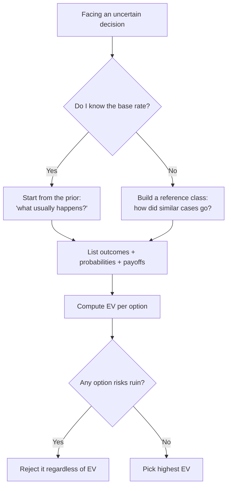

# Base Rates and Expected Value — Junior

> **What?** A *base rate* is how often something happens in general, before you look at the specific case in front of you. *Expected value* (EV) is the average outcome of a decision, weighing each possible result by how likely it is. Together they let you reason with numbers instead of vibes.
>
> **How?** Before debugging, ask "what usually causes this?" and start there. Before betting time or money on an uncertain choice, multiply each outcome's payoff by its probability, add them up, and compare options on that number — not on the most dramatic story you can imagine.

---

## Quick use
1. Start with how often the event occurs in comparable cases.
2. Adjust only when case-specific evidence warrants it.
3. Compare uncertain options with probability times payoff.

**Decision rule:** a vivid story does not outweigh the base rate by itself.

## 1. The base rate: start from "how often, in general?"

A **base rate** is the background frequency of an event in a population, *before* you condition on anything specific about today's case.

Suppose your service just went down. You could form a theory from scratch — "maybe the kernel scheduler has a bug." Or you could ask: *across all the outages this team has ever had, what caused them?* If 70% were a bad config or deploy, 20% were a dependency failing, and only a handful were exotic kernel bugs, then your **prior** before investigating anything should be "it's probably the last change."

That prior is the base rate. It is the anchor you start from and then adjust as evidence comes in.

### Three base rates every engineer should memorize

| Claim | Base rate (rough, team-dependent) | What it means for you |
|---|---|---|
| "Most outages are config or deploy changes." | ~70% of incidents follow a recent change | When something breaks, look at the last deploy first |
| "Most bugs are in the code that just changed." | The new diff is far more suspect than old, stable code | `git diff` and `git bisect` before reading 10-year-old modules |
| "Most novel product ideas fail." | A large majority don't reach their goal | Be skeptical of "this one is obviously different" |

None of these is a law. They are **priors**: where to point your attention first when you have nothing else to go on.

---

## 2. Base-rate neglect: the trap

Humans are bad at this. We judge by **how well the case fits a story** (representativeness) instead of **how common the case actually is** (frequency). This is the *base-rate fallacy*, documented by Daniel Kahneman and Amos Tversky in the 1970s.

### A worked example

A monitoring test flags "possible memory corruption." The test is good: when corruption is real, it fires 99% of the time. When there is *no* corruption, it false-alarms only 5% of the time. The test just fired. Is it corruption?

The story screams yes — 99% accurate! But you forgot the base rate. Real memory corruption happens in maybe **1 of every 1,000 builds**. Run 1,000 builds:

| | Test fires | Test silent | Total |
|---|---|---|---|
| Real corruption (1) | ~1 | ~0 | 1 |
| No corruption (999) | ~50 | ~949 | 999 |
| **Total** | **~51** | ~949 | 1,000 |

Of the ~51 alarms, only **1** is real. So a firing test means real corruption about **1 / 51 ≈ 2%** of the time. The story said 99%; the base rate says 2%. The base rate wins.

> The lesson: a "99% accurate" test on a rare event is mostly false alarms. Always ask *how rare is the thing in the first place?*

---

## 3. Reference-class forecasting: estimate by analogy, not imagination

When you estimate "this task will take 3 days," you usually do it by **imagining the steps** — the inside view. That's where the **planning fallacy** lives: we picture the smooth path and ignore the ways real work goes sideways. (More on this bias in [cognitive biases in code decisions](../../04-critical-thinking/03-cognitive-biases-in-code-decisions/).)

The fix is the **outside view**, also called **reference-class forecasting** (Bent Flyvbjerg; Kahneman):

1. Find a **reference class** of similar past tasks — "migrations I've done," "features the size of this one."
2. Look at how long *those* actually took.
3. Use that distribution as your estimate, then adjust slightly for what's genuinely special about today.

### Example

You're asked: "How long to add OAuth login?"

- **Inside view:** "Read the docs, wire the SDK, add a button — two days."
- **Outside view:** "The last four third-party integrations we did took 6, 9, 5, and 11 days." Median ≈ 7–8 days.

The outside view is almost always more honest, because your reference class already includes the surprises you can't picture yet. We go deeper on this in [estimation under uncertainty](../04-estimation-under-uncertainty/).

---

## 4. Expected value: a number for "which choice is better?"

**Expected value** turns "it depends" into arithmetic:

```
EV = Σ ( probability of outcome × payoff of outcome )
```

You list every outcome, multiply its probability by its payoff (positive for gains, negative for costs), and sum. The option with the higher EV is, *on average over many repetitions*, the better bet.

### A simple bet

A retry on a flaky API:

- 80% chance the retry succeeds → you save a failed request worth 10 units of value.
- 20% chance it still fails → you wasted 1 unit of compute and added latency.

```
EV(retry) = 0.80 × (+10) + 0.20 × (−1)
          = 8.0 − 0.2
          = +7.8
```

EV is positive, so retrying is worth it here. Notice the calculation made the decision concrete: it's not "retries feel safer," it's "+7.8 vs 0."

---

## 5. Using EV to pick *which bug to fix first*

You have three bugs and time for one this sprint. Don't fix the loudest — fix the one with the highest **expected cost if left alone**:

```
Expected cost = P(it happens) × cost when it happens
```

| Bug | P(occurs per week) | Cost if it occurs | Expected weekly cost |
|---|---|---|---|
| A: rare crash on huge upload | 0.02 | 500 | **10** |
| B: checkout button misaligned | 0.90 | 8 | **7.2** |
| C: nightly job sometimes double-runs | 0.30 | 120 | **36** |

Bug C has the highest expected cost (**36**), even though A is scarier per-event and B is more visible. EV says: fix **C** first. This is the everyday version of priority math you'll see throughout your career.

### Refining it: divide by effort

If C takes 5 days to fix and B takes 1 hour, raw expected cost isn't the whole story — you also care about **return on the time spent**:

```
value-per-effort = expected cost averted / effort to fix
```

| Bug | Expected weekly cost | Effort | Value per effort |
|---|---|---|---|
| B | 7.2 | 0.5h | **14.4** |
| C | 36 | 40h | 0.9 |

By raw expected cost, C wins; by *bang-for-buck*, B is a cheap win you might knock out first while C gets scheduled properly. Both numbers are useful — the point is that you reach for arithmetic instead of arguing by gut feel.

---

## 6. EV is *average* outcome — not *guaranteed* outcome

EV is the long-run average. On any single try, you get an actual outcome, not the average. The +7.8 retry might still fail this once. EV is the right guide **when you'll face the decision many times** (every request, every sprint, every deploy), because the averages add up.

There is one giant exception you must learn early: **don't take a bet that can wipe you out, even if its EV looks positive.** A choice with a 1% chance of "you're bankrupt / the data is gone forever / the company dies" is off the table no matter how good the other 99% looks — because if it hits, there is no "next time" to average over. Seniors call this **avoiding ruin**, and it's the single most important caveat to EV. You'll see it formalized in [senior](senior.md) and [professional](professional.md).

---

## 7. Putting it together



### Checklist for a junior engineer

- **Before debugging:** "What's the base rate? What usually causes this?" Start there.
- **Before estimating:** "How long did similar tasks *actually* take?" Use that, not your imagination.
- **Before a risky choice:** write the EV table — probability × payoff for each outcome.
- **Before a big irreversible bet:** ask "could this ruin us?" If yes, EV doesn't save it.
- **When a test alarms on a rare event:** remember most alarms are false; check the base rate.

---

## References & further reading

- Tversky, A. & Kahneman, D. — *Judgment under Uncertainty: Heuristics and Biases* (1974): base-rate neglect and representativeness.
- Kahneman, D. — *Thinking, Fast and Slow* (2011): the inside vs outside view, the planning fallacy.
- Flyvbjerg, B. — reference-class forecasting in real projects.
- Siblings: [reasoning under uncertainty](../01-reasoning-under-uncertainty/), [risk and failure probabilities](../03-risk-and-failure-probabilities/), [estimation under uncertainty](../04-estimation-under-uncertainty/).
- Section root: [probabilistic thinking](../) · Roadmap area: [engineering thinking](../../README.md).

---
## Recall and apply

Use these prompts to check your understanding and choose one action to try in your next task.

Try to answer these questions from memory:

1. What is a base rate, and why does it matter for debugging?
2. Explain base-rate neglect with an example.
3. What's the difference between the inside view and the outside view?
