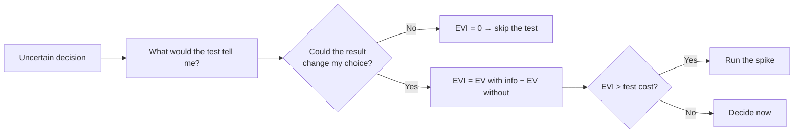

# Base Rates and Expected Value — Middle

> **What?** Base rates are the *prior* you should hold before evidence; expected value is the decision rule that combines probabilities and payoffs into one comparable number. At this level you treat them as a connected workflow: set a prior from a reference class, update it with evidence, and act on EV — while knowing exactly when EV is the *wrong* tool.
>
> **How?** You build reference classes from your own incident and project history, compute EV tables for real engineering tradeoffs (retry vs fail-fast, build vs buy, spike-or-not), and you flag the decisions where variance, fat tails, or ruin mean "highest EV" is not the answer.

---

## 1. Base rates as priors you actually maintain

A junior knows base rates exist. A mid-level engineer **keeps a few that are calibrated to their own system**, because generic base rates ("70% of outages are deploys") are only a starting point.

Where to get yours:

- **Incident reviews / postmortems** → "What fraction of our SEV-2s were caused by a config or deploy change?" Tally the last 20.
- **Bug trackers** → "What share of P1 bugs were introduced in the last two weeks of commits?"
- **Project history** → "What multiple of our first estimate did integrations actually take?"

These numbers are your **priors**. When something breaks, you don't start from zero; you start from the prior and let evidence move it. That updating is Bayesian reasoning, covered in [reasoning under uncertainty](../01-reasoning-under-uncertainty/) — base rates are simply the *prior term* in Bayes' rule.

### Why representativeness keeps fooling teams

Tversky and Kahneman's finding: people substitute *resemblance* for *probability*. An incident that "looks like" a gnarly distributed-systems race gets investigated as one, even when 70% of incidents are a one-line config typo. The cure is procedural: **make "check the last change" the first step of every runbook**, so the base rate is enforced by process, not by whoever's calmest at 3am.

---

## 2. Reference-class forecasting as a habit, not a slogan

The planning fallacy is robust: estimates built by imagining the steps (the **inside view**) are systematically optimistic. Flyvbjerg's work on large projects and Kahneman's "outside view" both prescribe the same fix.

### The procedure

1. **Define the reference class.** Be specific enough to be relevant, broad enough to have ≥5 members. "Backend features touching auth," not "all tickets."
2. **Pull the actuals.** What did those tasks *really* take, start to merged-and-stable?
3. **Take the distribution, not the best case.** Use the median, and quote a range (e.g. p50 and p80).
4. **Adjust last, and little.** Only after anchoring on the reference class do you adjust for genuine novelty — and the adjustment should be small, because "this one is different" is exactly the optimism the outside view corrects.

### Worked example

Estimating a database migration:

| Past migration | Estimated | Actual | Ratio |
|---|---|---|---|
| Add column + backfill | 2d | 3d | 1.5× |
| Split table | 5d | 11d | 2.2× |
| Change PK type | 3d | 8d | 2.7× |
| Move to new engine | 10d | 16d | 1.6× |

Median actual ratio ≈ **1.9×**. So when someone says "this migration is about 4 days," your outside-view estimate is **~4 × 1.9 ≈ 7–8 days**, and you'd quote "p50 ≈ 8d, p80 ≈ 11d." More on turning this into ranges: [estimation under uncertainty](../04-estimation-under-uncertainty/).

---

## 3. Expected value, properly tabulated

EV = Σ(probability × payoff). The discipline is in **enumerating outcomes honestly** and **pricing payoffs in one currency** (engineer-hours, dollars, error-budget minutes — pick one).

### Decision: retry vs fail-fast on a flaky dependency

Each call to a downstream service. Costs in "user-cost units" (latency + failure weighted).

| Strategy | Outcome | P | Payoff | P × Payoff |
|---|---|---|---|---|
| **Fail-fast** | immediate error | 1.00 | −10 | −10.0 |
| **Retry once** | retry succeeds | 0.80 | −2 (added latency) | −1.6 |
| | retry also fails | 0.20 | −13 (latency + error) | −2.6 |
| | **EV(retry)** | | | **−4.2** |

EV(retry) = −4.2 beats EV(fail-fast) = −10, so retry once. But push further: what if the dependency is *down* (not flaky)? Then P(retry succeeds) collapses toward 0 and retries just add load — the classic retry-storm. EV analysis tells you *retries are good when failures are independent and transient, bad when correlated.* That nuance is why mature systems gate retries behind circuit breakers.

### Decision: build vs buy

A feature you could build in-house or buy as a SaaS. Horizon: 2 years. Currency: dollars.

| Option | Outcome | P | 2-yr cost (incl. opportunity) | P × cost |
|---|---|---|---|---|
| **Buy** | vendor works fine | 0.85 | 120k | 102k |
| | vendor forces a migration | 0.15 | 260k | 39k |
| | **EV(buy)** | | | **141k** |
| **Build** | smooth | 0.50 | 180k | 90k |
| | overruns (our base rate: 1.9×) | 0.50 | 340k | 170k |
| | **EV(build)** | | | **260k** |

EV says **buy** (141k < 260k). Notice the build row used your *reference-class overrun ratio* to set the bad-case cost — base rates feeding the EV table. This is the everyday fusion of the two tools.

---

## 4. Expected value of imperfect information: is the spike worth it?

You can spend time to *reduce uncertainty* before committing. Is it worth it? Compute the **expected value of information (EVI)**:

```
EVI  =  EV(decision with the info)  −  EV(best decision without it)
Run the test only if   EVI  >  cost of running it.
```

### Worked example

You must choose architecture A or B. Without more info:

- A: EV = +50 (but 40% chance it's secretly unsuitable → −30)
- B: EV = +20 (safe)

Right now you'd pick A (50 > 20). A two-day **spike** would tell you whether A is suitable:

- If the spike says "A is fine" (60%): you confidently take A → +50.
- If it says "A is unsuitable" (40%): you take B instead and dodge the −30 → +20.

```
EV(with spike)    = 0.60 × 50 + 0.40 × 20 = 30 + 8 = 38
EV(without spike) = pick A blindly = 0.60×50 + 0.40×(−30) = 30 − 12 = 18
EVI = 38 − 18 = +20
```

If the spike costs less than **20** units, run it. The spike's value comes entirely from the bad-case it lets you *avoid*. A spike that can't change your decision has **zero** EVI — never run a test whose result won't move you.



---

## 5. When EV is the wrong tool

EV is the average over many repetitions. It quietly assumes (a) you survive every outcome to *reach* the average, and (b) outcomes aren't dominated by rare extremes. Break either assumption and naive EV misleads.

### 5.1 Ruin / non-ergodicity

A bet with a small chance of an **unrecoverable** loss must be judged by survival, not EV. If a deploy strategy is +EV but carries a 1% chance per deploy of *irreversible data loss*, then over 70 deploys your chance of getting wiped is `1 − 0.99⁷⁰ ≈ 50%`. The +EV is a mirage because you don't get to keep playing after ruin. This is **non-ergodicity** (Ole Peters; Nassim Taleb): the time-average for an individual ≠ the ensemble-average across many. Engineering version: *the average outage is fine; the one that deletes prod is not survivable, so don't average it in — eliminate it.*

### 5.2 Fat tails

When the bad outcome can be arbitrarily large (a cascading failure, a security breach, an unbounded retry storm), the mean is dominated by rare events and is unstable. EV computed from a handful of observations underestimates the tail. Here you switch to **tail thinking** — bound the worst case, cap blast radius — covered in [risk and failure probabilities](../03-risk-and-failure-probabilities/).

### 5.3 Risk aversion

Even with no ruin, you may rationally prefer lower variance. A guaranteed +40 is often better for a team than a coin-flip averaging +50, because predictability has value (planning, morale, SLAs). EV is **risk-neutral**; real decisions weigh variance too. Quantitatively this is the gap between *expected value* and *expected utility* — the St. Petersburg paradox (Bernoulli, 1738) is the classic demonstration that people value money's *utility*, not its raw EV.

---

## 6. A mid-level decision checklist

| Step | Question |
|---|---|
| Prior | What's our *measured* base rate for this kind of event? |
| Reference class | What did the 5+ most similar past tasks actually take/cost? |
| Enumerate | What are all outcomes, with P and payoff in one currency? |
| EV | Which option has the best EV? |
| Information | Is there a cheap test with EVI > its cost? |
| Ruin check | Does any option carry a small chance of an irreversible catastrophe? If yes → reject it. |
| Variance | Do we have a reason to prefer the lower-variance option even at slightly lower EV? |

---

## References & further reading

- Tversky & Kahneman — *Judgment under Uncertainty* (1974); Kahneman — *Thinking, Fast and Slow* (2011).
- Flyvbjerg, B. — reference-class forecasting; the "outside view."
- Bernoulli, D. — *Exposition of a New Theory on the Measurement of Risk* (1738): St. Petersburg paradox, utility vs EV.
- Peters, O. — "The ergodicity problem in economics" (2019); Taleb, N. N. — *The Black Swan*, *Skin in the Game*.
- Related: [reasoning under uncertainty](../01-reasoning-under-uncertainty/) · [risk and failure probabilities](../03-risk-and-failure-probabilities/) · [estimation under uncertainty](../04-estimation-under-uncertainty/) · [evaluating tradeoffs objectively](../../04-critical-thinking/04-evaluating-tradeoffs-objectively/) · section root: [probabilistic thinking](../) · [engineering thinking](../../README.md).

---
## Check your understanding

Try to answer these questions from memory:

1. Write the expected value formula and compute one.
2. You have three bugs and time for one. How do you choose with EV?
3. Why isn't the maximum-EV option always the right choice?
4. Explain non-ergodicity / the ruin problem in one paragraph.
